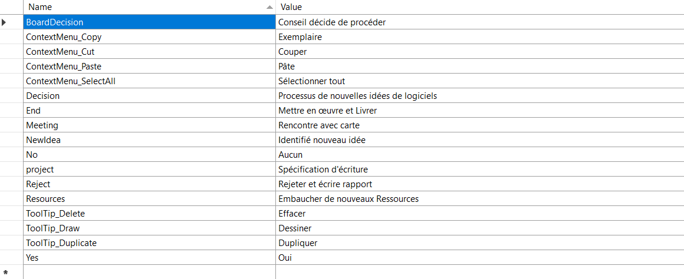
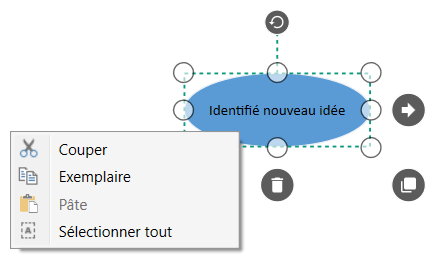

# Localization

Localization is the process of configuring the application to a specific language. `SfDiagram` provides support to localize all the static text used for annotation and context menu contents.

You can refer [Localization](https://help.syncfusion.com/wpf/localization) to add [resource file](https://msdn.microsoft.com/library/aa992030.aspx) in the application.

## Localize the Annotations using ResourceManager

SfDiagram has support to localize the Annotations of Nodes/Connector.The following code illustrates how to provide localization support for Annotation.



<!--Style for Node-->
   



public MainWindow()
{    
    System.Resources.ResourceManager manager;
    //Get CultureInfo 
    System.Threading.Thread.CurrentThread.CurrentUICulture = new System.Globalization.CultureInfo("fr");//French

    //Initialize Assembly
    Assembly assembly = Application.Current.GetType().Assembly;
    manager = new System.Resources.ResourceManager("Localization.Resources.Syncfusion.SfDiagram.WPF", assembly);
    InitializeComponent();

    //Creating Diagram
    SfDiagram diagram = new SfDiagram();

    //Adding diagram to the main grid of the mainwindow.
    RootGrid.Children.Add(diagram);

    
    diagram.Nodes =new ObservableCollection<NodeViewModel>();

    NodeViewModel node = new NodeViewModel();
    node.UnitWidth = 150;
    node.UnitHeight = 60;
    node.OffsetX = 345;
    node.OffsetY = 140;
    node.Annotations = new ObservableCollection<IAnnotation>()
    {
        new AnnotationEditorViewModel()
        {
            //localizing annotation using ResourceManager
            Content = manager.GetString("NewIdea"),
        }
    };
    node.Shape = new EllipseGeometry() { RadiusX = 100, RadiusY = 100 };
    node.ShapeStyle = this.Resources["Nodestyle"] as Style;
    (diagram.Nodes as ObservableCollection<NodeViewModel>).Add(node);

}   



N> You have to define the textual descriptions of the context menu items for your custom cultures.

You can get the sample from [here](http://www.syncfusion.com/downloads/support/directtrac/general/ze/Syncfusion.SfDiagram.WPF781862701.zip).

