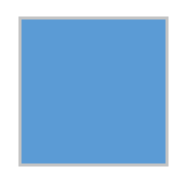
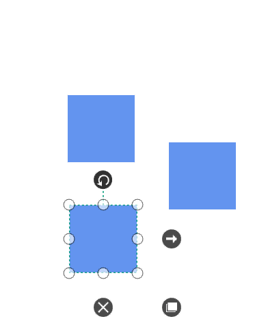

# Node in WPF Diagram (SfDiagram)

The nodes are graphical objects used to visually represent the geometrical information, process flow, internal business procedure, or any other kind of data, and it represents the functions of a complete system in regards of how it interacts with external entities.

## Create node

A node can be created and added to the Diagram, either programmatically or interactively. Nodes are stacked on the Diagram area from bottom to top in the order they are added.

### Add Node through Nodes collection 

To create a node, you have to define the node object and add that to nodes collection of the Diagram.




<!--Resource Dictionary which contains predefined shapes for Node-->
<ResourceDictionary.MergedDictionaries>
  <ResourceDictionary Source="/Syncfusion.SfDiagram.Wpf;component/Resources/BasicShapes.xaml"/>
</ResourceDictionary.MergedDictionaries>

<!--Shape style for Node-->

<!--Initialize the Sfdiagram-->
<syncfusion:SfDiagram x:Name="diagram">
  <syncfusion:SfDiagram.Nodes>
    <!--Initialize the NodeCollection-->
    <syncfusion:NodeCollection>
      <!--Initialize the Node-->
      <syncfusion:NodeViewModel ID="Begin" OffsetX="300" OffsetY="60" 
                                Shape="{StaticResource Ellipse}" 
                                ShapeStyle="{StaticResource ShapeStyle}" 
                                UnitHeight="40" UnitWidth="120"/>
      </syncfusion:NodeCollection>
  </syncfusion:SfDiagram.Nodes>
</syncfusion:SfDiagram>




//Initialize the SfDiagram
SfDiagram diagram = new SfDiagram();
//Initialize NodeCollection to SfDiagram
diagram.Nodes = new NodeCollection();
//Initialize ConnectorCollection to SfDiagram
diagram.Connectors = new ConnectorCollection();

//Creating the NodeViewModel
NodeViewModel Begin = new NodeViewModel()
{
  ID = "Begin",
  UnitWidth = 120,
  UnitHeight = 40,
  OffsetX = 300,
  OffsetY = 60,
  //Specify shape to the Node from built-in Shape Dictionary
  Shape = App.Current.Resources["Ellipse"],
  //Apply style to Shape
  ShapeStyle = App.Current.Resources["ShapeStyle"] as Style,
};

//Add Node to Nodes property of the Diagram
(diagram.Nodes as NodeCollection).Add(Begin);


 

Now, node will be as follows.

[View sample in GitHub](https://github.com/SyncfusionExamples/WPF-Diagram-Examples/tree/master/Samples/Node/Sample-for-NodeCreation)

### Add node from stencil

Nodes can be predefined and added to the stencil and can be dropped into the Diagram when needed. For more information about adding Nodes from Stencil, refer to the [Stencil](/wpf/sfdiagram/stencil "Stencil").

### Create node through data source

Nodes can be generated automatically with the information provided through data source. For more information about data source, refer to the [Data Source](/wpf/sfdiagram/datasource "DataSource").

### Draw nodes

Nodes can be drawn interactively by clicking and dragging the Diagram surface by using the **Drawing Tool**. For more information about drawing nodes, refer to the [Draw Nodes](https://help.syncfusion.com/wpf/diagram/tools#shapes).

## Visualize a node

You can use text, image, controls, panels, or any UIElement or template to visualize a node as follows:
   1)Content template
   2)Content 
   3)Geometry
   4)Custom shapes
   5)Built-in resource

### Using content template
Node is a ContentControl, so you can use data template to display the content of the node using the ContentTemplate property. Refer to the following code example to define node's shape through ContentTemplate.




<DataTemplate x:Key="NodeTemplate">
  <Border BorderThickness="2" BorderBrush="Black">
      <TextBlock Text="NodeTemplate" Width="100" Height="100" Background="White"/>
  </Border>
</DataTemplate>

<!--Initialize the Node-->
<syncfusion:NodeViewModel UnitHeight="100" UnitWidth="100" 
                          OffsetX="100" OffsetY="100" 
                          ContentTemplate="{StaticResource NodeTemplate}"/>  





//Define the Node
NodeViewModel node = new NodeViewModel()
{
  //sets the size
  UnitHeight = 100,
  UnitWidth = 100,
  //sets the position
  OffsetX = 100,
  OffsetY = 100,    
  ContentTemplate = App.Current.Resources["NodeTemplate"] as DataTemplate
};
//Adding Node to Collection
(diagram.Nodes as NodeCollection).Add(node);




### Using content

Node is a ContentControl, so you can set text, image, or any UIElement as node content using the Content property. Refer to the following code example to define image as content of the node.



<!--Initialize the Node-->
<syncfusion:NodeViewModel UnitHeight="100" UnitWidth="100"
                          OffsetX="100" OffsetY="100">
  <!--Assigning user image as Node's Content-->
  <syncfusion:NodeViewModel.Content>         
    <Image Source="/Image/user_image.png" Height="100" Width="100"/> 
  </syncfusion:NodeViewModel.Content>
</syncfusion:NodeViewModel>





Image img = new Image();
BitmapImage bmp = new BitmapImage();
bmp.BeginInit();
bmp.UriSource = new Uri("Image/user_image.png", UriKind.Relative);
bmp.EndInit();
img.Stretch = Stretch.Fill;
img.Source = bmp;
img.Height = 100;
img.Width = 100;  

//Define the Node
NodeViewModel node = new NodeViewModel()
{
    //sets the size
    UnitHeight = 100,
    UnitWidth = 100,
    //sets the position
    OffsetX = 100,
    OffsetY = 100,
    //set image as content
    Content = img   
};
//Adding Node to Collection
(diagram.Nodes as NodeCollection).Add(node);




### Using geometry

The Shape property of the node class allows to visualize any geometry path as node's content. Refer to the following code example to define geometry for node's shape.




    </Setter.Value>
  </Setter>
</Style>

<!--Initialize the Node-->
<syncfusion:NodeViewModel UnitWidth="100" UnitHeight="100" 
                          OffsetX="100" OffsetY="100">
  <syncfusion:NodeViewModel.Shape>
    <RectangleGeometry Rect="100,100,100,100"/>
  </syncfusion:NodeViewModel.Shape>
</syncfusion:NodeViewModel>
   




//Define the Node
NodeViewModel node = new NodeViewModel()
{
    //sets the size
    UnitHeight = 100,
    UnitWidth = 100,
    //sets the position
    OffsetX = 100,
    OffsetY = 100,
    Shape = new RectangleGeometry() { Rect = new Rect(100, 100, 100, 100) }
};
//Adding Node to Collection
(diagram.Nodes as NodeCollection).Add(node);




### Custom shapes

#### How to add custom shape using path data

Refer to the following code example to define custom path as node's shape.
 



<!--Namespace to define String in XAML-->
xmlns:sys="clr-namespace:System;assembly=mscorlib"

<sys:String x:Key="Rectangle">
  M242,1078L231,1078L231,1067L242,1067z
</sys:String>

<!--Initialize the Sfdiagram-->
<syncfusion:SfDiagram x:Name="diagram">
  <syncfusion:SfDiagram.Nodes>
    <!--Initialize the NodeCollection-->
    <syncfusion:NodeCollection>
      <!--Initialize the Node-->
      <syncfusion:NodeViewModel UnitWidth="100" UnitHeight="100" 
                                OffsetX="100" OffsetY="100" 
                                Shape="{StaticResource Rectangle}" 
                                ShapeStyle="{StaticResource ShapeStyle}"/>
    </syncfusion:NodeCollection>
  </syncfusion:SfDiagram.Nodes>
</syncfusion:SfDiagram>  





//Define the Node
NodeViewModel node = new NodeViewModel()
{
    //sets the size
    UnitHeight = 100,
    UnitWidth = 100,
    //sets the position
    OffsetX = 100,
    OffsetY = 100,
    Shape= App.Current.Resources["Rectangle"] as Style,
    //Apply style to Shape
    ShapeStyle = App.Current.Resources["ShapeStyle"] as Style,
};
//Adding Node to Collection
(diagram.Nodes as NodeCollection).Add(node);




#### How to add custom shape using data template

Refer to the following code example to define data template for node's custom shape,
 



<DataTemplate x:Key="Square">
  <Path Stretch="Fill" Data="M242,1078L231,1078L231,1067L242,1067z" Fill="#FF5B9BD5" Stroke="#FFC4C4C4" StrokeThickness="2"/>
</DataTemplate>

<!--Initialize the Sfdiagram-->
<syncfusion:SfDiagram x:Name="diagram">
  <syncfusion:SfDiagram.Nodes>
    <!--Initialize the NodeCollection-->
    <syncfusion:NodeCollection>
      <!--Initialize the Node-->
      <syncfusion:NodeViewModel UnitWidth="100" UnitHeight="100" OffsetX="100" OffsetY="100" ContentTemplate="{StaticResource Square}" />
    </syncfusion:NodeCollection>
  </syncfusion:SfDiagram.Nodes>
</syncfusion:SfDiagram>  





//Define the Node
NodeViewModel node = new NodeViewModel()
{
    //sets the size
    UnitHeight = 100,
    UnitWidth = 100,
    //sets the position
    OffsetX = 100,
    OffsetY = 100,
    ContentTemplate = this.Resources["Square"] as DataTemplate,
};
//Adding Node to Collection
(diagram.Nodes as NodeCollection).Add(node);




#### How to add image as node shape

Refer to the following code example to add image as node shape,
 



<DataTemplate x:Key="User">
  <Image Stretch="Uniform" HorizontalAlignment="Center" Source="Images\User.png"/>
</DataTemplate>

<!--Initialize the Sfdiagram-->
<syncfusion:SfDiagram x:Name="diagram">
  <syncfusion:SfDiagram.Nodes>
    <!--Initialize the NodeCollection-->
    <syncfusion:NodeCollection>
      <!--Initialize the Node-->
      <syncfusion:NodeViewModel UnitWidth="100" UnitHeight="100" OffsetX="100" OffsetY="100" ContentTemplate="{StaticResource User}" />
    </syncfusion:NodeCollection>
  </syncfusion:SfDiagram.Nodes>
</syncfusion:SfDiagram>  





//Define the Node
NodeViewModel node = new NodeViewModel()
{
    //sets the size
    UnitHeight = 100,
    UnitWidth = 100,
    //sets the position
    OffsetX = 100,
    OffsetY = 100,
    ContentTemplate = this.Resources["User"] as DataTemplate,
};
//Adding Node to Collection
(diagram.Nodes as NodeCollection).Add(node);




#### How to add framework element as node content

Refer to the following code example to add framework elements as node content,
 



<DataTemplate x:Key="UserProfile">
  <Border  BorderThickness="1" Background ="#2E95D8" 
                    BorderBrush="LightGray">
    <Grid>
      <Grid.ColumnDefinitions>
        <ColumnDefinition Width="60" />
        <ColumnDefinition Width="100" />
      </Grid.ColumnDefinitions>
      <Grid Grid.Column="0">
        <Border Grid.Column="0" VerticalAlignment="Stretch"
                            Background="Transparent"
                            BorderBrush="#FF5DC3B1"
                            Padding="5">
          <Image Stretch="Uniform" HorizontalAlignment="Center" Source="Images\User.png"/>
        </Border>
      </Grid>
      <Grid Grid.Column="1">
        <Grid.RowDefinitions>
          <RowDefinition Height="25" />
          <RowDefinition Height="25" />
        </Grid.RowDefinitions>
        <TextBlock x:Name="Name" Grid.Row="0"
                               HorizontalAlignment="Left"
                               VerticalAlignment="Center"
                               FontFamily="Segoe UI"
                               FontSize="12"
                               FontWeight="Bold"
                               Foreground="White"
                               Text="Daniel Tonini"
                               TextAlignment="Left" />
        <TextBlock x:Name="Designation" Grid.Row="1"
                               HorizontalAlignment="Left"
                               VerticalAlignment="Top"
                               FontFamily="Segoe UI"
                               FontSize="11"
                               FontWeight="SemiBold"
                               Foreground="White"
                               Text="Project Lead"
                               TextAlignment="Left" />
      </Grid>
    </Grid>
  </Border>
</DataTemplate>

<!--Initialize the Sfdiagram-->
<syncfusion:SfDiagram x:Name="diagram">
  <syncfusion:SfDiagram.Nodes>
    <!--Initialize the NodeCollection-->
    <syncfusion:NodeCollection>
      <!--Initialize the Node-->
      <syncfusion:NodeViewModel UnitWidth="150" UnitHeight="50" OffsetX="100" OffsetY="100" ContentTemplate="{StaticResource UserProfile}" />
    </syncfusion:NodeCollection>
  </syncfusion:SfDiagram.Nodes>
</syncfusion:SfDiagram>  





//Define the Node
NodeViewModel node = new NodeViewModel()
{
    //sets the size
    UnitHeight = 50,
    UnitWidth = 150,
    //sets the position
    OffsetX = 100,
    OffsetY = 100,
    ContentTemplate = this.Resources["UserProfile"] as DataTemplate,
};
//Adding Node to Collection
(diagram.Nodes as NodeCollection).Add(node);




### Built-in resource

Some basic built-in shapes are provided as ResourceDictionary. For more information, refer to the [Shapes](https://help.syncfusion.com/wpf/diagram/shapes). 

[View Sample in GitHub](https://github.com/SyncfusionExamples/WPF-Diagram-Examples/tree/master/Samples/Node/Node-with-CustomShapes)

## Position

Position of a node is controlled by using its `OffsetX` and `OffsetY` properties. By default, these Offset properties represent the distance between origin of the diagram’s page and node’s center point. You may expect this Offset values to represent the distance between page origin and node’s top left corner instead of center. The `Pivot` property helps solve this problem. Default value of node’s pivot point is (0.5, 0.5), that means center of node.

The following table explains how pivot relates Offset values with node boundaries:

| Pivot | Offset |
|---|---|
| (0,5, 0.5) |  OffsetX and OffsetY values are considered as the node’s center point. |
| (0,0) | OffsetX and OffsetY values are considered as the top left corner of node. |
| (1,1) | OffsetX and OffsetY values are considered as the bottom right corner of the node. |




<!--Initialize the Node with Pivot-->
<syncfusion:NodeViewModel UnitHeight="65" UnitWidth="100" 
                          OffsetX="100" OffsetY="100" Pivot="0,0" 
                          Shape="{StaticResource Rectangle}"/>
        




//Define the Node
NodeViewModel node = new NodeViewModel()
{
    //sets the size
    UnitHeight = 65,
    UnitWidth = 100,
    //sets the position
    OffsetX = 100,
    OffsetY = 100,
    //sets the Pivot point
    Pivot=new Point(0,0),
    Shape = new RectangleGeometry() { Rect = new Rect(0, 0, 10, 10) },
};
//Adding Node to Collection
(diagram.Nodes as NodeCollection).Add(node);




## Flip

Diagram provides support to flip the node.`Flip` is performed to give the mirrored node of the original element.
The flip types are:
* Flip
 `Flip` that involves both vertical and horizontal changes of the element. 
* VerticalFlip
 `VerticalFlip` that involves changes in the vertical direction of the element.
* HorizontalFlip
 `HorizontalFlip` that involves changes in the horizontal direction of the element.




<!--Initialize Vertical Flip to the Node-->
<syncfusion:NodeViewModel Flip="VerticalFlip" 
                          UnitHeight="100" UnitWidth="100" 
                          OffsetX="200" OffsetY="100" 
                          Shape="{StaticResource Triangle}" 
                          ShapeStyle="{StaticResource ShapeStyle}"/>
        




//Define the Node
 NodeViewModel node = new NodeViewModel()
  {
    UnitHeight = 100,
    UnitWidth = 100,        
    OffsetX=200,
    OffsetY=100,
    //Initialize Vertical Flip to the Node
    Flip = Flip.VerticalFlip,
    Shape = App.Current.Resources["Triangle"],
    ShapeStyle = App.Current.Resources["ShapeStyle"] as Style,
  };
            
//Adding Node to Collection
(diagram.Nodes as NodeCollection).Add(node);




## Padding

Padding is used to leave space between the connector’s end point and the object to where it is connected. The `ConnectorPadding` property of node defines the space to be left between the node bounds and its edges.




<syncfusion:SfDiagram.Nodes>
  <syncfusion:NodeCollection>
    <!--Initialize connector padding to the Node-->
    <syncfusion:NodeViewModel ID="node1" ConnectorPadding="5" 
                              UnitHeight="65" UnitWidth="100" 
                              OffsetX="200" OffsetY="200" 
                              Shape="{StaticResource Rectangle}" 
                              ShapeStyle="{StaticResource ShapeStyle}"/>
    <syncfusion:NodeViewModel ID="node2" UnitHeight="65" UnitWidth="100" 
                              OffsetX="400" OffsetY="200" 
                              Shape="{StaticResource Rectangle}" 
                              ShapeStyle="{StaticResource ShapeStyle}"/>
  </syncfusion:NodeCollection>
</syncfusion:SfDiagram.Nodes>
<syncfusion:SfDiagram.Connectors>
  <syncfusion:ConnectorCollection>
    <!--Establish connection between the nodes-->
    <syncfusion:ConnectorViewModel SourceNodeID="node1" TargetNodeID="node2"/>
  </syncfusion:ConnectorCollection>
</syncfusion:SfDiagram.Connectors>





//Define NodeProperty
NodeViewModel node1 = AddNode(200,200,65,100);
//Space between Connector and Node
node1.ConnectorPadding = 5;
//Adding Node to Collection
(diagram.Nodes as NodeCollection).Add(node1);
NodeViewModel node2 = AddNode(400,200,65,100);
(diagram.Nodes as NodeCollection).Add(node2);
//Define ConnectorCollection
diagram.Connectors = new ConnectorCollection();
ConnectorViewModel conn1 = new ConnectorViewModel()
{
    SourceNode = node1,
    TargetNode=node2
};
//Adding Connector to Collection
(diagram.Connectors as ConnectorCollection).Add(conn1);

//Method for Creating Node
public NodeViewModel AddNode(double offsetX, double offsetY,double height,double width)
{
    NodeViewModel node = new NodeViewModel();
    node.OffsetX = offsetX;
    node.OffsetY = offsetY;
    node.UnitHeight = height;
    node.UnitWidth = width;
    node.Shape = new RectangleGeometry { Rect = new Rect(0, 0, 10, 10) } ;
    return node;
}




## Appearance

You can customize the appearance of a node by changing its `ShapeStyle`. The following code explains how to customize the appearance of the `Shape`.









Style style = new Style(typeof(Path));
style.Setters.Add(new Setter(Path.FillProperty, Brushes.SteelBlue));
style.Setters.Add(new Setter(Path.StrokeProperty, Brushes.WhiteSmoke));
style.Setters.Add(new Setter(Path.StrokeThicknessProperty, 2d));
style.Setters.Add(new Setter(Path.StrokeDashArrayProperty, new DoubleCollection() { 5 }));
style.Setters.Add(new Setter(Path.StretchProperty, Stretch.Fill));
return style;





 
[View Sample in GitHub](https://github.com/SyncfusionExamples/WPF-Diagram-Examples/tree/master/Samples/Node/Node-with-properties)

## Interaction

Diagram provides support to drag, resize, or rotate the node interactively. 

### Select

Node can be selected by clicking (tap) it.

* The `IsSelected` Property is used to select or unselect the node at runtime.

* `ItemSelectingEvent` and `ItemSelectedEvent` for selecting an element, will notify you the item and its original source. To explore about arguments, refer to the [DiagramPreviewEventArgs](https://help.syncfusion.com/cr/wpf/Syncfusion.UI.Xaml.Diagram.DiagramPreviewEventArgs.html) and [ItemSelectedEventArgs](https://help.syncfusion.com/cr/wpf/Syncfusion.UI.Xaml.Diagram.ItemSelectedEventArgs.html).

* `ItemUnselectingEvent` and `ItemUnselectedEvent` for unselecting an element, will notify you the item and its original source. To explore about arguments, refer to the [DiagramPreviewEventArgs](https://help.syncfusion.com/cr/wpf/Syncfusion.UI.Xaml.Diagram.DiagramPreviewEventArgs.html) and [DiagramEventArgs](https://help.syncfusion.com/cr/wpf/Syncfusion.UI.Xaml.Diagram.DiagramEventArgs.html).

To explore about selection and selection related events, refer to the [Selection](https://help.syncfusion.com/wpf/diagram/interaction/selection).

### Drag  

* Selected object can be dragged by clicking and dragging it. When multiple elements are selected, dragging any one of the selected elements move every selected element.

* Instead of dragging original object, preview of the node alone can be dragged. For preview dragging, refer to the [PreviewSettings](https://help.syncfusion.com/wpf/diagram/interaction/dragging/previewsettings/preview-settings). 

* While dragging, the objects are snapped towards the nearest objects to make better alignments. For better alignments, refer to the [Snapping](https://help.syncfusion.com/wpf/diagram/snapping "Snapping").

* The `NodeChangedEvent` will notify the `OffsetX` and `OffsetY` changes with their old and new values. Along with that, this event will give information about interaction state. To explore about aruguments, refer to the [NodeChangedEventArgs](https://help.syncfusion.com/cr/wpf/Syncfusion.UI.Xaml.Diagram.NodeChangedEventArgs.html) .

### Resize

* Selector is surrounded by eight thumbs. When dragging these thumbs, selected items can be resized smaller or larger.
* When one corner of the selector is dragged, opposite corner is in a static position.
* Enable [AspectRatio](https://help.syncfusion.com/cr/wpf/Syncfusion.UI.Xaml.Diagram.NodeConstraints.html) NodeConstraints to maintain the aspect ratio of the node when its being resized. 
* While resizing, the objects are snapped towards the nearest objects to make better alignments. For better alignments, refer to the [Snapping](https://help.syncfusion.com/wpf/sfdiagram/snapping "Snapping").

* The `NodeChangedEvent` will notify the `UnitHeight` and `UnitWidth` changes with their old and new values. Along with that, this event will give information about  interaction state. To explore about arguments, refer to the [NodeChangedEventArgs](https://help.syncfusion.com/cr/wpf/Syncfusion.UI.Xaml.Diagram.NodeChangedEventArgs.html) .

### Rotate

* A rotate handler is placed above the selector. Clicking and dragging the handler in a circular direction lead to rotate the node.
* The node is rotated with reference to the static pivot point.
* Pivot thumb (thumb at the middle of the Node) appears when rotating the node to represent the static point. For more information about pivot, refer to [Position](https://help.syncfusion.com/wpf/diagram/node#position)

* The `NodeChangedEvent` will notify the `RotateAngle` changes with their old and new values. Along with that, this event will give information about iteraction state. To explore about arguments, refer to the [NodeChangedEventArgs](https://help.syncfusion.com/cr/wpf/Syncfusion.UI.Xaml.Diagram.NodeChangedEventArgs.html) .

## Events

* The `ItemTappedEvent` is invoked on clicking the node. To explore about arguments, refer to the [ItemTappedEventargs](https://help.syncfusion.com/cr/wpf/Syncfusion.UI.Xaml.Diagram.ItemTappedEventargs.html).
* The `ItemDoubleTappedEvent` is invoked on double-clicking the node. To explore about arguments, refer to the [ItemDoubleTappedEventargs](https://help.syncfusion.com/cr/wpf/Syncfusion.UI.Xaml.Diagram.ItemDoubleTappedEventargs.html).
* The `MouseDown` and `MouseUp` are invoked as similar to framework element that is raised together with either MouseLeftButtonUp or MouseRightButtonUp. To explore about arguments, refer to the [MouseDownEventArgs](https://help.syncfusion.com/cr/wpf/Syncfusion.UI.Xaml.Diagram.MouseDownEventArgs.html) and
[MouseUpEventArgs](https://help.syncfusion.com/cr/wpf/Syncfusion.UI.Xaml.Diagram.MouseUpEventArgs.html).  

## Constraints

The `Constraints` property of node allows you to enable or disable certain features. For more information about node constraints, refer to the [Node Constraints](https://help.syncfusion.com/wpf/diagram/constraints#node-constraints).

## See Also
 
* [How to add Annotations to the Node?](https://help.syncfusion.com/wpf/diagram/annotation)
* [How to add Port to the Node?](https://help.syncfusion.com/wpf/diagram/port/port#node-port)
* [How to add Nodes to the stencil?](https://help.syncfusion.com/wpf/diagram/stencil#using-the-diagram-elements)
* [How to apply built-in theme for node and connector?](https://www.syncfusion.com/kb/11409/how-to-apply-built-in-theme-for-node-and-connector-in-wpf-diagramsfdiagram)
* [How to customize the connection indicator style of node and port?](https://www.syncfusion.com/kb/11400/how-to-customize-the-connection-indicator-style-of-node-and-port-in-wpf-diagramsfdiagram)
* [How to host different UI elements as node content?](https://www.syncfusion.com/kb/9456/how-to-host-different-ui-elements-as-node-content-in-the-wpf-diagramsfdiagram)
* [How to restrict the child node dragging whereas allow group dragging?](https://www.syncfusion.com/kb/11462/how-to-restrict-the-child-node-dragging-whereas-allow-group-dragging-in-wpf)
* [How to restrict the node dragging within boundaries?](https://www.syncfusion.com/kb/6690/how-to-restrict-the-node-dragging-within-boundaries-in-the-wpf-diagramsfdiagram)
* [How to show assistants to the parent node of the organization layout?](https://www.syncfusion.com/kb/10183/how-to-show-assistants-to-the-parent-node-of-the-organization-layout-in-wpf)
* [Howto create port at runtime though SetTool?](https://www.syncfusion.com/kb/11446/how-to-create-port-at-runtime-through-set-tool-in-wpf-diagram-sfdiagram)
* [How to customize the context menu?](https://www.syncfusion.com/kb/10467/how-to-customize-the-contextmenu-in-wpf-sfdiagram)
* [How to drag node from one diagram to another diagram?](https://www.syncfusion.com/kb/6981/how-to-enable-drag-the-node-from-one-diagram-to-another-diagram-in-wpf-sfdiagram)
