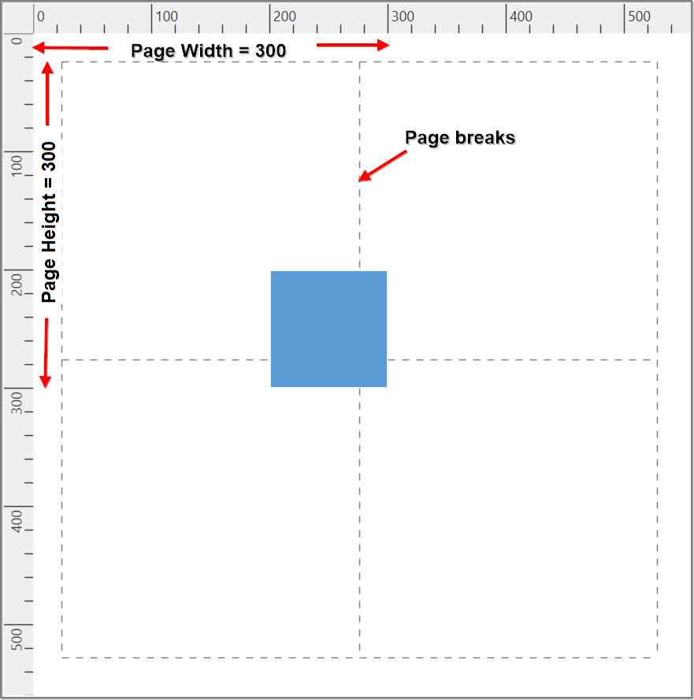
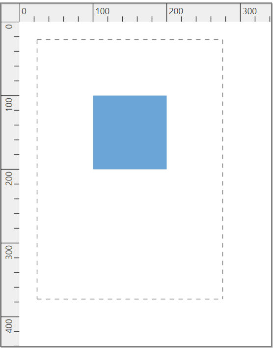
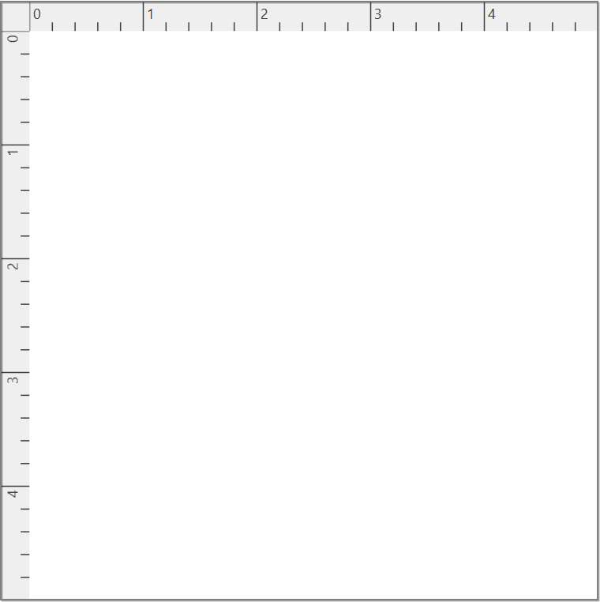

# Page Settings

By default, DiagramPage size is decided based on the diagramming elements position. To customize the size and appearance of the DiagramPage, please use [PageSettings](https://help.syncfusion.com/cr/cref_files/wpf/Syncfusion.SfDiagram.WPF~Syncfusion.UI.Xaml.Diagram.PageSettings.html "PageSettings") property of SfDiagram. 

Diagram allows you to split and print the single page into multiple pages based on width and height. This feature can be achieved by using `PageSettings` class and its properties.

* `PageWidth`: Specifies the width of a single page. Default value is double.NaN
* `PageHeight`: Specifies the height of a single page.Default value is double.NaN
* `MultiplePage`: Allows to split the single page into multiple pages. Default value is False.
* `ShowPageBreaks`: Shows or hides the separation line between two pages. Default value is False.




<!--Initialize SfDiagram-->
<syncfusion:SfDiagram x:Name="diagram">
  <!--Initialize the page settings and its properties-->
  <syncfusion:SfDiagram.PageSettings>
    <syncfusion:PageSettings PageWidth="500" PageHeight="500" MultiplePage="True" ShowPageBreaks="True" />
  </syncfusion:SfDiagram.PageSettings>
</syncfusion:SfDiagram>




//Initialize SfDiagram
SfDiagram diagram = new SfDiagram();
//Initialize the page settings and its properties
diagram.PageSettings = new PageSettings()
{
    PageHeight = 300,
    PageWidth = 300,
    MultiplePage = true,
    ShowPageBreaks = true,
};
            



## How to change the orientation of the pages

Diagram allows you to change the basic orientation of the pages by using `PageOrientation` property of `PageSettings` class. Default orientation is Portrait.




<!--Initialize SfDiagram-->
<syncfusion:SfDiagram x:Name="diagram">
  <!--Initialize the page settings and page orientation property-->
  <syncfusion:SfDiagram.PageSettings>
    <syncfusion:PageSettings PageOrientation="Portrait" PageWidth="300" PageHeight="400" ShowPageBreaks="True" />
  </syncfusion:SfDiagram.PageSettings>
</syncfusion:SfDiagram>



//Initialize SfDiagram
SfDiagram diagram = new SfDiagram();
//Initialize the page settings and and page orientation property
diagram.PageSettings = new PageSettings()
{
  PageOrientation = PageOrientation.Portrait,
  PageWidth = 300,
  PageHeight = 400,
  ShowPageBreaks = true,
};



| Page Orientation | Output |
|---|---|
| Landscape |  |
| Portrait |  |

## How to change the page appearance

The appearance of the pages can be customized by using following properties of `PageSettings` class,

* `PageBorderThickness`: Defines the thickness of the  border around the entire page. Default value is null
* `PageBackground`: Defines the background colors of the page.
* `PageBorderBrush`: Defines the color of the page border



<!--Initialize SfDiagram-->
<syncfusion:SfDiagram x:Name="diagram">
  <!--Initialize the page settings and its properties-->
  <syncfusion:SfDiagram.PageSettings>
    <syncfusion:PageSettings PageBorderThickness="5" PageBackground="LightGreen" PageBorderBrush="Black" PageWidth="500" PageHeight="500" MultiplePage="True" ShowPageBreaks="True" />
  </syncfusion:SfDiagram.PageSettings>
</syncfusion:SfDiagram>


//Initialize SfDiagram
SfDiagram diagram = new SfDiagram();
//Initialize the page settings and its properties
diagram.PageSettings = new PageSettings()
{
  PageBorderThickness = new Thickness(5),
  PageBackground = new SolidColorBrush(Colors.LightGreen),
  PageBorderBrush = new SolidColorBrush(Colors.Black),
  PageWidth = 300,
  PageHeight = 300,
  MultiplePage = true,
  ShowPageBreaks = true,
};
            



## How to change the margin around the pages

The area between the main content of a page and the page edges can be changed by using `PrintMargin` property. Default value is 24.



<!--Initialize SfDiagram-->
<syncfusion:SfDiagram x:Name="diagram">
  <!--Initialize the page settings and print margin property-->
  <syncfusion:SfDiagram.PageSettings>
    <syncfusion:PageSettings PrintMargin="40" PageWidth="300" PageHeight="300" ShowPageBreaks="True" />
  </syncfusion:SfDiagram.PageSettings>
</syncfusion:SfDiagram>


//Initialize SfDiagram
SfDiagram diagram = new SfDiagram();
//Initialize the page settings and print margin property
diagram.PageSettings = new PageSettings()
{
  PrintMargin = new Thickness(40),
  PageWidth = 300,
  PageHeight = 300,
  ShowPageBreaks = true,
};
            



## How to change the Unit of the page

The measurement Units of the page can be changed by using `Unit` property of `PageSettings` class. Default unit value is Pixels.



<!--Initialize SfDiagram-->
<syncfusion:SfDiagram x:Name="diagram">
  <!--Initialize the page settings and unit property-->
  <syncfusion:SfDiagram.PageSettings>
    <syncfusion:PageSettings>
      <syncfusion:PageSettings.Unit>
        <syncfusion:LengthUnit Unit="Inches"/>
      </syncfusion:PageSettings.Unit>
    </syncfusion:PageSettings>
  </syncfusion:SfDiagram.PageSettings>
</syncfusion:SfDiagram>


//Initialize SfDiagram
SfDiagram diagram = new SfDiagram();
//Initialize the page settings and unit property
diagram.PageSettings = new PageSettings()
{
  Unit = new LengthUnit() { Unit = LengthUnits.Inches },
};
            



| Unit values | Output |
|---|---|
| Centimeters |  |
| Inches |  |

## Origin customization of Page

By default, Origin of the diagram page will be at (0,0). A virtual method `AdjustPageOrigin` of PageSettings class is used to customize the origin of the page based on page size (`PageWidth` and `PageHeight`) and diagram elements position. 

Pages can be printed where the elements placed rather than printing the entire diagram page.

`AdjustPageOrigin` method is having `Info` property in its argument. And it is having following properties and methods,

| Properties/Methods | Description | Output |
|---|---|---|
| RowCount | To know the number of pages available in row-wise manner. |  |
| ColumnCount | To know the number of pages available in column-wise manner.|  |
| PageOrigin | To know the origin of the page |   |
| Truncate | To customize the origin based on the page size |  |
| Trim | To customize the origin based on the pixel. Page origin will be position of the most top left element |  |




//Initialize SfDiagram
SfDiagram diagram = new SfDiagram();
//create instance for PageCustomClass using PageSettings
diagram.PageSettings = new CustomPageSettings();

//Create a custom class which is derived form page setting class
public class CustomPageSettings : PageSettings
{
  public override void AdjustPageOrigin()
  {
    //Specifies the row count
    double rowCount = Info.RowCount;
    //Specifies the column count
    double columnCount = Info.ColumnCount;
    //Specifies the page origin
    Point pageOrigin = Info.PageOrigin;

    Info.Truncate();
  }
}
    



N> This customization will play role in reducing the number of pages in printing.



[How to add or remove grid lines for diagram page](/wpf/sfdiagram/gridlines)

[How to define scroll setting for diagram page](/wpf/sfdiagram/scroll-settings)

[How to add rulers for diagram page](/wpf/sfdiagram/rulers)

[How to print the diagram pages](/wpf/sfdiagram/printing)

[How to export the diagram page](/wpf/sfdiagram/exporting)

[How to interact with diagram page ](/wpf/sfdiagram/interaction)

