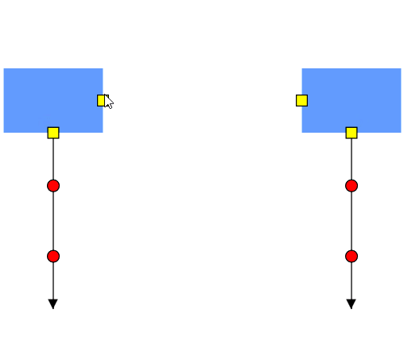

# Port to Port Connection

The connector’s `SourcePort` or `SourcePortID` and `TargetPort` or `TargetPortID` properties allows you to create connections between two specific points of same or different nodes and connectors.

### Connection between ports (NodePort, ConnectorPort) programmatically
You can create static connection between the ports by specifying the SourcePortID and TargetPortID for the connector. Refer to [connections-with-ports](https://help.syncfusion.com/wpf/diagram/connector/defineconnector#connections-with-ports) for code example.

### Connection between ports interactively
You can create connection between the ports interactively by performing click and drag action on the port.




<!--Initialize the Node-->
   <Syncfusion:NodeViewModel UnitHeight="65" UnitWidth="100" OffsetX="100" OffsetY="50" Shape="{StaticResource Rectangle}" ID="node1">
    <Syncfusion:NodeViewModel.Ports>
     <Syncfusion:PortCollection>
      <Syncfusion:NodePortViewModel NodeOffsetX="0.5" NodeOffsetY="1">
      </Syncfusion:NodePortViewModel>
       <Syncfusion:NodePortViewModel NodeOffsetX="1" NodeOffsetY="0.5">
      </Syncfusion:NodePortViewModel>
     </Syncfusion:PortCollection>
    </Syncfusion:NodeViewModel.Ports>
   </Syncfusion:NodeViewModel>
   <Syncfusion:NodeViewModel UnitHeight="65" UnitWidth="100" OffsetX="300" OffsetY="50" Shape="{StaticResource Rectangle}" ID="node2">
    <Syncfusion:NodeViewModel.Ports>
     <Syncfusion:PortCollection>
      <Syncfusion:NodePortViewModel NodeOffsetX="0.5" NodeOffsetY="1">
      </Syncfusion:NodePortViewModel>
      <Syncfusion:NodePortViewModel NodeOffsetX="0" NodeOffsetY="0.5">
      </Syncfusion:NodePortViewModel>
     </Syncfusion:PortCollection>
    </Syncfusion:NodeViewModel.Ports>
   </Syncfusion:NodeViewModel>
  </Syncfusion:NodeCollection>
 </Syncfusion:SfDiagram.Nodes>
 
 <!--Initialize the Connector-->
   <Syncfusion:ConnectorViewModel ID="connector1" SourceNodeID="node1" TargetPoint="100,260">
    <!--Initialize the Port-->
     <Syncfusion:ConnectorViewModel.Ports>
      <Syncfusion:PortCollection>
       <Syncfusion:ConnectorPortViewModel ID="connectorport1" Length="0.3">
       </Syncfusion:ConnectorPortViewModel>
       <Syncfusion:ConnectorPortViewModel ID="connectorport2" Length="0.7">
       </Syncfusion:ConnectorPortViewModel>
      </Syncfusion:PortCollection>
     </Syncfusion:ConnectorViewModel.Ports>
    </Syncfusion:ConnectorViewModel>
   <Syncfusion:ConnectorViewModel ID="connector2" SourceNodeID="node2" TargetPoint="400,260" >
   <!--Initialize the Port-->
    <Syncfusion:ConnectorViewModel.Ports>
     <Syncfusion:PortCollection>
      <Syncfusion:ConnectorPortViewModel ID="connectorport3" Length="0.3">
      </Syncfusion:ConnectorPortViewModel>
      <Syncfusion:ConnectorPortViewModel ID="connectorport4" Length="0.7">
      </Syncfusion:ConnectorPortViewModel>
     </Syncfusion:PortCollection>
    </Syncfusion:ConnectorViewModel.Ports>
   </Syncfusion:ConnectorViewModel>





 
            NodeViewModel node1 = AddNode(100, 50, 65, 100,0.5,1,1,0.5);                       
            //Adding Node to Collection
            (Diagram.Nodes as NodeCollection).Add(node1);

            NodeViewModel node2 = AddNode(400, 50, 65, 100,0.5,1,0,0.5);            
            (Diagram.Nodes as NodeCollection).Add(node2);

            ConnectorViewModel con1 = AddConnector(node1, new Point(100, 260), 0.3, 0.7, "connectorport1", "connectorport2");
            //Adding connector to collection
            (Diagram.Connectors as ConnectorCollection).Add(con1);
            ConnectorViewModel con2 = AddConnector(node2, new Point(400, 260), 0.3, 0.7, "connectorport3", "connectorport4");
            (Diagram.Connectors as ConnectorCollection).Add(con2);
    
 //Method for Creating Node
        public NodeViewModel AddNode(double offX, double offY, double height, double width, double nodex, double nodey, double nodex1,double nodey1)
        {
            NodeViewModel node = new NodeViewModel();
            node.OffsetX = offX;
            node.OffsetY = offY;
            node.UnitHeight = height;
            node.UnitWidth = width;
            node.Shape = new RectangleGeometry { Rect = new Rect(0, 0, 10, 10) };
            node.Ports = new PortCollection()
            {
            new NodePortViewModel()
              {                 
                 NodeOffsetX=nodex,
                 NodeOffsetY=nodey,
              },
            new NodePortViewModel()
              {                 
                 NodeOffsetX=nodex1,
                 NodeOffsetY=nodey1,
              }
            };
            return node;
        }
   //Method for creating Connector
   public ConnectorViewModel AddConnector(object sourceNode,Point targetPoint,double length,double length1 ,string id, string id2)
     {
       ConnectorViewModel con = new ConnectorViewModel();
       con.SourceNode = sourceNode;
       con.TargetPoint = targetPoint;
       con.Ports = new PortCollection()
         {
            new ConnectorPortViewModel()
              {  
                 ID=id,            
                 Length=length,
              },
            new ConnectorPortViewModel()
              {
                 ID=id2,
                 Length=length1,
              }
         };
       return con;
     }




### Connection for DockPort

Unlike `NodePort` and `ConnectorPort`, DockPort uses connector port to create connection. But you can create connection interactively like `NodePort` and `ConnectorPort`. 

### Connection between DockPort programmatically




//Initialize HitPadding to sfdiagram
diagram.HitPadding = 20;

//Define the ConnectorPort
ConnectorPortViewModel cp1 = new ConnectorPortViewModel()
  {
    Length = 0.5,
  };
ConnectorPortViewModel cp2 = new ConnectorPortViewModel()
  {
    Length = 0.5,
  };
//Define the DockPort
DockPortViewModel dock1 = new DockPortViewModel()
 {
   SourcePoint = new Point(1, 1),
   TargetPoint = new Point(1, 0),
   //Adding ConnectorPort to DockPort
   Ports = new PortCollection(){cp1} 
 };
DockPortViewModel dock2 = new DockPortViewModel()
 {
   SourcePoint = new Point(0, 0),
   TargetPoint = new Point(0, 1),
   Ports = new PortCollection(){cp2}  
 };

NodeViewModel node1 = AddNode(100, 100, "Rectangle", 65, 100,dock1);
(diagram.Nodes as NodeCollection).Add(node1);

NodeViewModel node2 = AddNode(300, 100, "Rectangle", 65, 100,dock2);
(diagram.Nodes as NodeCollection).Add(node2);

ConnectorViewModel connector1 = new ConnectorViewModel()
{
  //Adding DockPort's Connector Port as Source and Target Port
  SourcePort=cp1,
  TargetPort=cp2
};
//Adding Connector to Collection
(diagram.Connectors as ConnectorCollection).Add(connector1);         

//Method for creating node
public NodeViewModel AddNode(double offsetX, double offsetY, string shape, double height, double width,DockPortViewModel dpv)
 {
    NodeViewModel node = new NodeViewModel();
    node.OffsetX = offsetX;
    node.OffsetY = offsetY;
    node.UnitHeight = height;
    node.UnitWidth = width;
    node.Shape = App.Current.Resources[shape];
    (node.Ports as PortCollection).Add(dpv);
    return node;
 }




For more information, refer to [Draw Connectors](https://help.syncfusion.com/wpf/sfdiagram/tools#connectors).