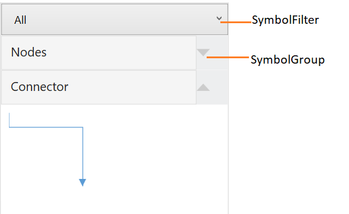
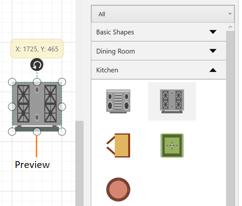
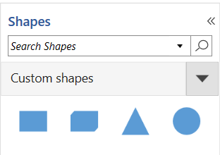

# Stencil in the WPF Diagram (SfDiagram)

The [Stencil](https://help.syncfusion.com/cr/wpf/Syncfusion.SfDiagram.WPF~Syncfusion.UI.Xaml.Diagram.Stencil_namespace.html) is a gallery of reusable symbols and diagram elements that can be dragged and dropped onto the diagram surface at any number of times.




<!--Namespace for stencil-->
xmlns:stencil="clr-namespace:Syncfusion.UI.Xaml.Diagram.Stencil;assembly=Syncfusion.SfDiagram.WPF"

<!--Define the Stencil-->
<stencil:Stencil x:Name="stencil" ExpandMode="All" BorderBrush="Black" BorderThickness="0,0,2,0" />





//Define Stencil
Stencil stencil = new Stencil()
{
    ExpandMode = ExpandMode.All,
    BorderThickness = new Thickness(0,0,1,0),
    BorderBrush = new SolidColorBrush(Colors.Black)
};




## How to add Symbol into the Stencil

The [Symbol](https://help.syncfusion.com/cr/wpf/Syncfusion.SfDiagram.WPF~Syncfusion.UI.Xaml.Diagram.Stencil.Symbol.html) is used to visualize the elements in Stencil that can be created using the following ways:
 
 * Using the Diagram Elements 
 * SymbolViewModel
 
 The Stencil's [SymbolSource](https://help.syncfusion.com/cr/wpf/Syncfusion.SfDiagram.WPF~Syncfusion.UI.Xaml.Diagram.Stencil.Stencil~SymbolSource.html) property is used to define the data source as a collection of objects (symbol,node,connector....) that needs to be populated as Symbols.
 
### Using the Diagram Elements

Diagram elements such as [Node](https://help.syncfusion.com/cr/wpf/Syncfusion.SfDiagram.WPF~Syncfusion.UI.Xaml.Diagram.NodeViewModel.html), [Connector](https://help.syncfusion.com/cr/wpf/Syncfusion.SfDiagram.WPF~Syncfusion.UI.Xaml.Diagram.ConnectorViewModel.html), and [Group](https://help.syncfusion.com/cr/wpf/Syncfusion.SfDiagram.WPF~Syncfusion.UI.Xaml.Diagram.GroupViewModel.html) can be used to visualize the Symbol.
 
 


<!--Initialize the SymbolSource-->
<stencil:Stencil.SymbolSource>
    <!--Define the SymbolCollection-->
    <local:SymbolCollection>
        <syncfusion:NodeViewModel x:Name="node" UnitHeight="70" UnitWidth="100" OffsetX="100" OffsetY="100" Shape="{StaticResource Rectangle}">
        </syncfusion:NodeViewModel>
        <syncfusion:ConnectorViewModel SourcePoint="100,100" TargetPoint="200,200"/>
        <!--Define the DiagramElement- Group-->
        <syncfusion:GroupViewModel>
            <!--Creates the Groupable Nodes-->
            <syncfusion:GroupViewModel.Nodes>
                <syncfusion:NodeCollection>
                    <syncfusion:NodeViewModel UnitHeight="70" ID="srcnode" OffsetX="0" OffsetY="300" 
                                              UnitWidth="100"
                                              Shape="{StaticResource Rectangle}">
                    </syncfusion:NodeViewModel>
                    <syncfusion:NodeViewModel UnitHeight="70" 
                                              ID="tarnode"
                                              OffsetX="100"
                                              OffsetY="500"
                                              UnitWidth="100"
                                              Shape="{StaticResource Rectangle}">
                    </syncfusion:NodeViewModel>
                </syncfusion:NodeCollection>
            </syncfusion:GroupViewModel.Nodes>
            <!--Creates the Groupable Connectors-->
            <syncfusion:GroupViewModel.Connectors>
                <syncfusion:ConnectorCollection>
                    <syncfusion:ConnectorViewModel SourceNodeID="srcnode" TargetNodeID="tarnode"/>
                </syncfusion:ConnectorCollection>
            </syncfusion:GroupViewModel.Connectors>
        </syncfusion:GroupViewModel>
    </local:SymbolCollection>
</stencil:Stencil.SymbolSource>





//Define the SymbolSource with SymbolCollection
stencil.SymbolSource = new SymbolCollection();

//Initialize the Diagram Element
NodeViewModel node = new NodeViewModel()
{
    UnitHeight = 70,
    UnitWidth = 100,
    OffsetX = 100, OffsetY = 100,
    Shape = App.Current.MainWindow.Resources["Rectangle"],
}; 

ConnectorViewModel cvm = new ConnectorViewModel()
{
    SourcePoint = new Point(100, 100),
    TargetPoint = new Point(200, 200),
};

GroupViewModel grp = new GroupViewModel()
            {
                Nodes = new NodeCollection()
                {
                    new NodeViewModel()
                    {
                        ID="srcnode",
                        UnitHeight=70,
                        UnitWidth=100,
                        OffsetX=0,
                        OffsetY=300,
                        Shape=App.Current.Resources["Rectangle"]
                    },
                    new NodeViewModel()
                    {
                        ID="tarnode",
                        UnitHeight=70,
                        UnitWidth=100,
                        OffsetX=100,
                        OffsetY=500,
                        Shape=App.Current.Resources["Rectangle"]
                    }
                },
                Connectors = new ConnectorCollection()
                {
                    new ConnectorViewModel()
                    {
                        SourceNodeID="srcnode", 
                        TargetNodeID="tarnode"
                    }
                }
            };
//Adding the element to Collection
(stencil.SymbolSource as SymbolCollection).Add(node);
(stencil.SymbolSource as SymbolCollection).Add(cvm);
(stencil.SymbolSource as SymbolCollection).Add(grp);

//Adding the ISymbol to SymbolCollection
public class SymbolCollection : ObservableCollection<Object>
{
}





 

[View Sample in GitHub](https://github.com/SyncfusionExamples/WPF-Diagram-Examples/tree/master/Samples/Stencil/Stencil-with-node-connector-group)

### Using the SymbolViewModel

The [SymbolViewModel](https://help.syncfusion.com/cr/cref_files/wpf/Syncfusion.SfDiagram.WPF~Syncfusion.UI.Xaml.Diagram.Stencil.SymbolViewModel.html) have [Symbol](https://help.syncfusion.com/cr/cref_files/wpf/Syncfusion.SfDiagram.WPF~Syncfusion.UI.Xaml.Diagram.Stencil.SymbolViewModel~Symbol.html) and [SymbolTemplate](https://help.syncfusion.com/cr/cref_files/wpf/Syncfusion.SfDiagram.WPF~Syncfusion.UI.Xaml.Diagram.Stencil.SymbolViewModel~SymbolTemplate.html) properties to visualize the `Symbol` on the stencil.





<DataTemplate x:Key="Diamond">
    <StackPanel>
        <Path Stretch="Fill"
              Data="M 397.784,287.875L 369.5,316.159L 341.216,287.875L 369.5,259.591L 397.784,287.875 Z"
              Fill="White"
              Stroke="Black"
              StrokeThickness="1" />
        <TextBlock HorizontalAlignment="Center"
                   VerticalAlignment="Center"
                   Text="Diamond" />
    </StackPanel>
</DataTemplate>
 <DataTemplate x:Key="symboltemplate">
            <StackPanel>
                <Image Source="/Image/user_image.png"
                       Width="100"
                       Height="80" />
                <TextBlock HorizontalAlignment="Center"
                           VerticalAlignment="Center"
                           Text="User" />
            </StackPanel>
</DataTemplate>

<stencil:Stencil.SymbolSource>
    <!--Define the SymbolCollection-->
    <local:SymbolCollection>
        <Syncfusion:SymbolViewModel Symbol="User" SymbolTemplate="{StaticResource symboltemplate}"/>
         <Syncfusion:SymbolViewModel Symbol="Diamond" SymbolTemplate="{StaticResource Diamond}"/>
    </local:SymbolCollection>
</stencil:Stencil.SymbolSource>
 

 


//Define the SymbolSource with SymbolCollection
stencil.SymbolSource = new SymbolCollection();
 
//Initialize the SymbolItem
SymbolViewModel imagenode = new SymbolViewModel()
{    
    Symbol = "User",
    SymbolTemplate = this.Resources["symboltemplate"] as DataTemplate
};

SymbolViewModel symbol = new SymbolViewModel()
{    
    Symbol = "Diamond",
    SymbolTemplate = this.Resources["Diamond"] as DataTemplate
};

//Adding the element to Collection
(stencil.SymbolSource as SymbolCollection).Add(imagenode);
(stencil.SymbolSource as SymbolCollection).Add(symbol);

//Adding the ISymbol to SymbolCollection
public class SymbolCollection : ObservableCollection<Object>
{
}





 

[View Sample in GitHub](https://github.com/SyncfusionExamples/WPF-Diagram-Examples/tree/master/Samples/Stencil/Stencil-with-symbols)

### How to customize the Symbol appearance

You can customize the appearance of a `Symbol` by changing its Style (Background,BorderThickness,BorderBrush,and Padding). The following code explains how to customize the appearance of the symbol.

The width and height properties of symbol enables you to define the size of the symbols.





 <!--Style for Symbol-->
        


 


 

### How to add tooltip to the Symbol 





 <!--Style for Symbol-->
        


 


 

## Symbol Groups

The [SymbolGroupProvider](https://help.syncfusion.com/cr/cref_files/wpf/Syncfusion.SfDiagram.WPF~Syncfusion.UI.Xaml.Diagram.Stencil.SymbolGroupProvider.html) groups the set of symbols into [SymbolGroup](https://help.syncfusion.com/cr/cref_files/wpf/Syncfusion.SfDiagram.WPF~Syncfusion.UI.Xaml.Diagram.Stencil.SymbolGroups.html) based on the [MappingName](https://help.syncfusion.com/cr/cref_files/wpf/Syncfusion.SfDiagram.WPF~Syncfusion.UI.Xaml.Diagram.Stencil.SymbolGroupProvider~MappingName.html) property.




<stencil:Stencil Grid.Column="0" BorderThickness="1" BorderBrush="#dfdfdf" x:Name="stencil">
    <!--Initialize the SymbolSource-->
    <stencil:Stencil.SymbolSource>
    <!--Define the SymbolCollection-->
    <local:SymbolCollection>
        <syncfusion:NodeViewModel x:Name="node" UnitHeight="70" UnitWidth="100" OffsetX="100" OffsetY="100" Shape="{StaticResource Rectangle}" Key="Node">
        </syncfusion:NodeViewModel>
        <syncfusion:ConnectorViewModel SourcePoint="100,100" TargetPoint="200,200" Key="Connector"/>
        <!--Define the DiagramElement- Group-->
        <syncfusion:GroupViewModel Key="Group">
            <!--Creates the Groupable Nodes-->
            <syncfusion:GroupViewModel.Nodes>
                <syncfusion:NodeCollection>
                    <syncfusion:NodeViewModel UnitHeight="70" ID="srcnode" OffsetX="0" OffsetY="300" 
                                              UnitWidth="100"
                                              Shape="{StaticResource Rectangle}">
                    </syncfusion:NodeViewModel>
                    <syncfusion:NodeViewModel UnitHeight="70" 
                                              ID="tarnode"
                                              OffsetX="100"
                                              OffsetY="500"
                                              UnitWidth="100"
                                              Shape="{StaticResource Rectangle}">
                    </syncfusion:NodeViewModel>
                </syncfusion:NodeCollection>
            </syncfusion:GroupViewModel.Nodes>
            <!--Creates the Groupable Connectors-->
            <syncfusion:GroupViewModel.Connectors>
                <syncfusion:ConnectorCollection>
                    <syncfusion:ConnectorViewModel SourceNodeID="srcnode" TargetNodeID="tarnode"/>
                </syncfusion:ConnectorCollection>
            </syncfusion:GroupViewModel.Connectors>
        </syncfusion:GroupViewModel>
    </local:SymbolCollection>
</stencil:Stencil.SymbolSource>
    <!--Initialize the SymbolGroup-->
    <stencil:Stencil.SymbolGroups>
        <stencil:SymbolGroups>
            <!--Map Symbols Using MappingName-->
            <stencil:SymbolGroupProvider MappingName="Key">
            </stencil:SymbolGroupProvider>
        </stencil:SymbolGroups>
    </stencil:Stencil.SymbolGroups>
</stencil:Stencil>




//Define Stencil
Stencil stencil = new Stencil()
{
    ExpandMode =ExpandMode.All,
    BorderThickness =new Thickness(0,0,1,0),
    BorderBrush =new SolidColorBrush(Colors.Black)
};
//Define the SymbolSource with SymbolCollection
stencil.SymbolSource = new SymbolCollection();
NodeViewModel node = new NodeViewModel()
{
    UnitHeight = 100,
    UnitWidth = 100,
    OffsetX = 100, OffsetY = 100,
    Shape = App.Current.MainWindow.Resources["Rectangle"],
    Key = "Node"
};

ConnectorViewModel cvm = new ConnectorViewModel()
{
    SourcePoint = new Point(100, 100),
    TargetPoint = new Point(200, 200),
    Key="Connector"
};

GroupViewModel grp = new GroupViewModel()
            {
                Key="Group",
                Nodes = new NodeCollection()
                {
                    new NodeViewModel()
                    {
                        ID="srcnode",
                        UnitHeight=70,
                        UnitWidth=100,
                        OffsetX=0,
                        OffsetY=300,
                        Shape=App.Current.Resources["Rectangle"]
                    },
                    new NodeViewModel()
                    {
                        ID="tarnode",
                        UnitHeight=70,
                        UnitWidth=100,
                        OffsetX=100,
                        OffsetY=500,
                        Shape=App.Current.Resources["Rectangle"]
                    }
                },
                Connectors = new ConnectorCollection()
                {
                    new ConnectorViewModel()
                    {
                        SourceNodeID="srcnode", 
                        TargetNodeID="tarnode"
                    }
                }
            };

//Add the element to the symbol collection
(stencil.SymbolSource as SymbolCollection).Add(node);
(stencil.SymbolSource as SymbolCollection).Add(cvm);
(stencil.SymbolSource as SymbolCollection).Add(grp);

//Define the SymbolGroups
stencil.SymbolGroups = new SymbolGroups()
{
    new SymbolGroupProvider()
    {
        MappingName = "Key"
    }
};


 

 

### How to customize the appearance of SymbolGroup header

You can customize the appearance of a `SymbolGroup` by changing its Style. The following code explains how to customize the appearance of the symbol group.





 <!--Style for Symbol Group-->
        


 


## Symbol Filters

The [SymbolFilterProvider](https://help.syncfusion.com/cr/cref_files/wpf/Syncfusion.SfDiagram.WPF~Syncfusion.UI.Xaml.Diagram.Stencil.SymbolFilterProvider.html) is used to filter or hide the symbols by using the delegates. The [SymbolFilters](https://help.syncfusion.com/cr/wpf/Syncfusion.SfDiagram.WPF~Syncfusion.UI.Xaml.Diagram.Stencil.Stencil~SymbolFilters.html) are the collection of SymbolFilterProvider.




// Define filtering of Symbols
private bool Filter(SymbolFilterProvider sender, object symbol)
{
    if (symbol is NodeViewModel)
    {
        if (sender.Content.ToString() == (symbol as NodeViewModel).Key.ToString())
            return true;
    }
}




[View Sample in GitHub](https://github.com/SyncfusionExamples/WPF-Diagram-Examples/tree/master/Samples/Stencil/SymbolFilters-sample)

### SelectedFilter

There can be multiple SymbolFilters but only one filter can be selected at a time. These SymbolFilters are visually represented in a combo box. When the selected item is changed in the combo box, SelectedFilter is updated accordingly.

## ExpandMode

The [ExpandMode](https://help.syncfusion.com/cr/wpf/Syncfusion.SfDiagram.WPF~Syncfusion.UI.Xaml.Diagram.ExpandMode.html) property of stencil allows us to decide the number of symbol group expanded in stencil.

|ExpandMode|Description|
|----------|-----------|
|All       |    Enables or disables all the symbol group can be expand |
|One       |    Enables or disables only one symbol group can be expand |
|OneOrMore |    Enables or disables one or more symbol group can be expand |
|ZeroOrMore|    Enables or disables none or more symbol group can be expand |
|ZeroOrOne |    Enables or disables none or one symbol group can be expand |

## Preview for Drag and Drop

When you drag an item from Stencil to Diagram, a preview of the dragged item will be displayed. Preview of the item can be enabled or disabled by using the [StencilConstraints](https://help.syncfusion.com/cr/wpf/Syncfusion.SfDiagram.WPF~Syncfusion.UI.Xaml.Diagram.StencilConstraints.html) `ShowPreview`.



//Enables the drag and drop preview.
stencil.Constraints = stencil.Constraints | StencilConstraints.ShowPreview;

//Disables the drag and drop preview.
stencil.Constraints = stencil.Constraints & ~StencilConstraints.ShowPreview;



Here, stencil is an instance of Stencil.

#### Customization of Preview for Drag and Drop

You can customize the preview content by overriding the [PrepareDragDropPreview](https://help.syncfusion.com/cr/wpf/Syncfusion.SfDiagram.WPF~Syncfusion.UI.Xaml.Diagram.Stencil.Stencil~PrepareDragDropPreview.html) method of the Stencil. You can define your own customized preview to the [SymbolPreview](https://help.syncfusion.com/cr/wpf/Syncfusion.SfDiagram.WPF~Syncfusion.UI.Xaml.Diagram.Stencil.Stencil~SymbolPreview.html) property of the stencil.



public class CustomStencil : Stencil
{
    //Virtual method to customize the preview of dragging the symbol from Stencil.
    protected override void PrepareDragDropPreview()
    {
        this.SymbolPreview = new ContentPresenter()
        {
            Content = new Rectangle()
            {
                Width = 50,
                Height = 50,
                Fill = new SolidColorBrush(Colors.SteelBlue)
            }
        };
    }
}




## Symbol categories

There are plenty of shapes available in the diagram resource dictionary. It takes more time and allows repeated code snippets to add all symbols to stencil. To avoid this, shapes are split and categorized as a list of symbols in the [StencilCategory](https://help.syncfusion.com/cr/wpf/Syncfusion.SfDiagram.WPF~Syncfusion.UI.Xaml.Diagram.Stencil.StencilCategory_members.html "StencilCategory") class. You can add more than one category using the [Categories](https://help.syncfusion.com/cr/wpf/Syncfusion.SfDiagram.WPF~Syncfusion.UI.Xaml.Diagram.Stencil.Stencil~Categories.html) property of the stencil class.

`Categories` can be mentioned by using the following properties of `StencilCategory` class,

* Keys – Specifies the static resource key name value of the category collection.
* Title – Specifies the title that should be displayed as a header of the category collection.

The following are the built-in categories being available in the diagram resource dictionary,

* BasicShapes
* FlowShapes
* ArrowShapes
* DataFlowShapes
* UMLActivity
* UMLUseCase
* UMLRelationship
* ElectricalShapes
* SwimlaneShapes



<!--Initialize the stencil-->
<Stencil:Stencil x:Name="stencil">
    <!--Initialize the stencil categories-->
    <Stencil:Stencil.Categories>
        <Stencil:StencilCategoryCollection>
            <!--Specify the basic shapes category with title and resource key-->
            <Stencil:StencilCategory Title="Basic Shapes" Keys="{StaticResource BasicShapes}"/>
        </Stencil:StencilCategoryCollection>
    </Stencil:Stencil.Categories>
</Stencil:Stencil>



### How to add custom shapes categories into the stencil

The custom symbol collections can be added to the stencil by defining the custom symbol's resource collection.




<!--custom path data-->
<sys:String x:Key="CustomPath">
    F1M1.66,0.25C0.882,0.25,0.25,0.881,0.25,1.66L0.25,24.622C0.25,25.401,0.882,26.032,1.66,26.032L4.48,26.032C5.259,26.032,5.89,25.401,5.89,24.622L5.89,1.66C5.89,0.881,5.259,0.25,4.48,0.25z
</sys:String>

<!--custom shapes collection-->
<x:Array Type="sys:String" x:Key="customShapeCollection">
    <sys:String>Rectangle</sys:String>
    <sys:String>Cube</sys:String>
    <sys:String>Triangle</sys:String>
    <sys:String>Ellipse</sys:String>
    <sys:String>CustomPath</sys:String>
</x:Array>

<!--Initialize the stencil-->
<Stencil:Stencil x:Name="stencil">
    <!--Initialize the stencil categories-->
    <Stencil:Stencil.Categories>
        <Stencil:StencilCategoryCollection>
            <!--Specify the custom shapes category with title and resource key-->
            <Stencil:StencilCategory Title="Custom shapes" Keys="{StaticResource customShapeCollection}"/>
        </Stencil:StencilCategoryCollection>
    </Stencil:Stencil.Categories>
</Stencil:Stencil>



N> Custom symbol collections should be added in the App.xaml file.

### How to customize the default appearance of the symbols in the built-in categories

Built-in symbol categories symbol sizes are equivalent to Visio symbol size. Each symbol available in the category collection can be customized by the [PrepareSymbolViewModel](https://help.syncfusion.com/cr/wpf/Syncfusion.SfDiagram.WPF~Syncfusion.UI.Xaml.Diagram.Stencil.Stencil~PrepareSymbolViewModel.html) virtual method of the stencil class. Symbols can be modified by using the following properties of  `PrepareSymbolViewModel` method,

* `Item`: To modify the symbol and its properties.
* `SymbolName`: To know the name of the symbol.
* `CategoryName`: To know the name of the category.

Also, you can decide whether a symbol can be added to stencil symbol collection or not. It can be achieved by using the `Cancel` property of [CanAddSymbol](https://help.syncfusion.com/cr/wpf/Syncfusion.SfDiagram.WPF~Syncfusion.UI.Xaml.Diagram.Stencil.Stencil~CanAddSymbol.html) virtual method of stencil class. 



/// 

/// Custom class for stencil view model.
/// 

public class StencilViewModel : Stencil
{
    /// 

    /// Overridden method to change the symbol.
    /// 

    /// <param name="Item">Item value of the shape</param>
    /// <param name="SymbolName">Name of the symbol</param>
    /// <param name="CategoryName">Name of the category</param>
    /// <returns>Return the item of the shape</returns>
    protected override object PrepareSymbolViewModel(object Item, string SymbolName, string CategoryName)
    {
        if (SymbolName == "Rectangle")
        {
            (Item as INode).UnitWidth = 80;
            (Item as INode).UnitHeight = 40;
            return Item;
        }
        else
            return base.PrepareSymbolViewModel(Item, SymbolName, CategoryName);
    }

    /// 

    /// Overidden method to decide whether a symbol can be added or not
    /// 

    /// <param name="symbolName">Name of the symbol</param>
    /// <param name="categoryName">Name of the category</param>
    /// <returns>Return the boolean</returns>
    protected override bool CanAddSymbol(string symbolName, string categoryName)
    {
        if (symbolName == "Triangle")
        {
            return false;            
        }

        return base.CanAddSymbol(symbolName, categoryName);
    }
}




[View Sample in GitHub](https://github.com/SyncfusionExamples/WPF-Diagram-Examples/tree/master/Samples/Stencil/StencilCategory)

## Events

* The `Expanded Event` and `Collapsed Event` are notified to provide interactions in the SymbolGroup. To explore about arguments refer to the [SymbolGroupExpandCollapseEventArgs](https://help.syncfusion.com/cr/cref_files/wpf/Syncfusion.SfDiagram.WPF~Syncfusion.UI.Xaml.Diagram.Stencil.SymbolGroupExpandCollapseEventArgs.html)

* The `DragEnter Event` notifies when an element enter into the diagram from stencil.
* The `DragLeave Event` notifies when an element leaves from the diagram.
* The `DragOver Event` notifies when an element drag over another diagram element.
* The `ItemDropEvent Event` notifies when an element is dropped on the diagram.. 

To explore about arguments refer to the [ItemDropEventArgs](https://help.syncfusion.com/cr/cref_files/wpf/Syncfusion.SfDiagram.WPF~Syncfusion.UI.Xaml.Diagram.ItemDropEventArgs.html)

## How to restrict node dropped on Diagram

The diagram provides support to cancel the drag and drop operation from the stencil to the diagram in two ways.
* Using the `Cancel` argument of `ItemDropEventArgs`. For example, if you need to restrict drop for a particular node or based on some condition, then this argument will allow you to achieve the same. To explore about arguments refer to the [ItemDropEventArgs](https://help.syncfusion.com/cr/cref_files/wpf/Syncfusion.SfDiagram.WPF~Syncfusion.UI.Xaml.Diagram.ItemDropEventArgs.html)
 
* When the ESC key is pressed.

## Symbol dragging outside diagram bounds

By default, the cursor appears as block cursor when dragging the symbol (from stencil) outside diagram bounds. The SfDiagram provides supports to drag the elements within the given limitations. For details, please refer to the [Dragging based on DragLimit](https://help.syncfusion.com/wpf/diagram/interaction/drag#dragging-based-on-draglimit)

## Preserving node template when drag and drop

The SfDiagram using the serialization and deserialization approach for drag and drop the element from stencil and it did not serialize the framework properties like the Content and ContentTemplate properties. So, you need to retain templates as resource and reassign once it loaded back in diagram. This can be achieved by using the ItemAdded event to restore the Content and ContentTemplate property values.




private void MainWindow_ItemAdded(object sender, ItemAddedEventArgs args) 
{ 
    if(args.Item is CustomNode) 
    { 
        CustomNode node = args.Item as CustomNode; 
        node.Content = node.CustomContent; 
        node.ContentTemplate = App.Current.MainWindow.Resources[node.CustomContentTemplate] asDataTemplate; 
    } 
} 




[View Sample in GitHub](https://github.com/SyncfusionExamples/WPF-Diagram-Examples/tree/master/Samples/Stencil/Stencil%20Drag%20Drop%20Template)

## Constraints

The `Constraints` property of stencil allows you to enable or disable certain features. For more information about stencil constraints, refer to the [StencilConstraints](https://help.syncfusion.com/cr/cref_files/wpf/Syncfusion.SfDiagram.WPF~Syncfusion.UI.Xaml.Diagram.StencilConstraints.html).

## See Also

* [How to drag and drop elements from treeview ?](https://www.syncfusion.com/kb/10574/how-to-drag-and-drop-elements-from-treeview-in-wpf-diagramsfdiagram)
* [How to refresh the stencil when adding new symbol in symbol source ?](https://www.syncfusion.com/kb/9928/how-to-refresh-the-stencil-when-adding-new-symbol-in-symbol-source)
* [How to host different UI elements as node content ?](https://www.syncfusion.com/kb/9456/how-to-host-different-ui-elements-as-node-content)
* [How to notify stencil has been loaded ?](https://www.syncfusion.com/kb/6256/how-to-notify-stencil-has-been-loaded)
* [How to expand all SymbolGroups ?](https://www.syncfusion.com/kb/5878/how-to-expand-all-symbolgroups)
* [How to get the base Node interface while dropping a Symbol from Stencil to SfDiagram ?](https://www.syncfusion.com/kb/5880/how-to-get-the-base-node-interface-while-dropping-a-symbol-from-the-stencil-to-the)
* [How to use different User Controls into Stencil?](https://www.syncfusion.com/kb/11459/how-to-use-different-user-controls-into-stencil-in-the-wpf-diagramsfdiagram)
