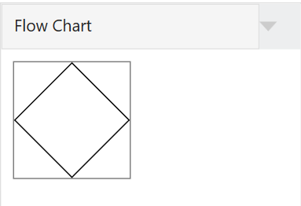
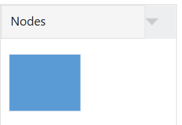
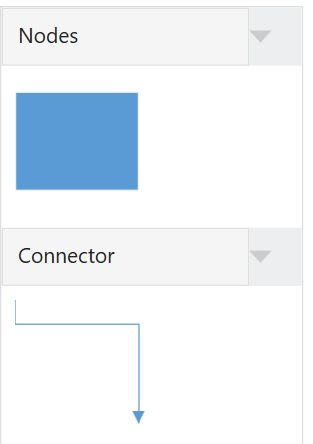

# Stencil creation and customization 

Stencil has a collection of Symbols and it is used to clone the desired symbol by dragging it from the Stencil and dropping it into the SfDiagram.

Namespace for Stencil,



xmlns:stencil="using:Syncfusion.UI.Xaml.Diagram.Stencil"



## Symbol

Symbol is used to visualize the elements in Stencil using following ways:
 
 * ISymbol
 * Using DiagramElements

### Using ISymbol

[ISymbol](https://help.syncfusion.com/cr/wpf/Syncfusion.SfDiagram.WPF~Syncfusion.UI.Xaml.Diagram.Stencil.ISymbol.html) have [Symbol](https://help.syncfusion.com/cr/cref_files/wpf/Syncfusion.SfDiagram.WPF~Syncfusion.UI.Xaml.Diagram.Stencil.ISymbol~Symbol.html) and [SymbolTemplate](https://help.syncfusion.com/cr/wpf/Syncfusion.SfDiagram.WPF~Syncfusion.UI.Xaml.Diagram.Stencil.ISymbol~SymbolTemplate.html) to visualize the Symbol.



public class SymbolItem : ISymbol
{
    //Symbol-Any Object
    public object Symbol { get; set; }

    //Custom property for Mapping.
    public object GroupName { get; set; }

    //Data template to visualize the object.
    public DataTemplate SymbolTemplate { get; set; }

    //For cloning the symbol from the given object and data template.
    public ISymbol Clone()
    {
        return new SymbolItem()
        {
            Symbol = this.Symbol,
            SymbolTemplate = this.SymbolTemplate
        };
    }
    public object Key { get; set; }
}






<DataTemplate x:Key="Diamond">
  <Path Stretch="Fill" Data="M 397.784,287.875L 369.5,316.159L 341.216,287.875L 369.5,259.591L 397.784,287.875 Z" Fill="White"
Stroke="Black" StrokeThickness="1" />
</DataTemplate>

<local:SymbolItem GroupName="Flow Chart" Symbol="Diamond" 
                  SymbolTemplate="{StaticResource Diamond}"/>
 


 
//Initialize the SymbolItem
SymbolItem symbol = new SymbolItem()
{
    Key = "Flow Chart",
    Symbol = "Diamond",
    SymbolTemplate = this.Resources["Diamond"] as DataTemplate
};



 
#### Define SymbolSource

[SymbolSource](https://help.syncfusion.com/cr/wpf/Syncfusion.SfDiagram.WPF~Syncfusion.UI.Xaml.Diagram.Stencil.Stencil~SymbolSource.html) is the property of Stencil which is Collection of objects (i.e,Symbol,Node,Connector etc..). Based on the SymbolSource, the Stencil will populate the Symbols.



//Adding ISymbol to SymbolCollection
public class SymbolCollection : ObservableCollection<ISymbol>
{
}






<Window.Resources>
    <DataTemplate x:Key="Diamond">
        <Path Stretch="Fill" Data="M 397.784,287.875L 369.5,316.159L 341.216,287.875L 369.5,259.591L 397.784,287.875 Z" Fill="White"
Stroke="Black" StrokeThickness="1" />
    </DataTemplate>
</Window.Resources>
<Grid >
    <!--Define the Stencil Element-->
    <stencil:Stencil x:Name="stencil" BorderBrush="#dfdfdf" BorderThickness="1" >
        <!--Initialize the SymbolSource-->
        <stencil:Stencil.SymbolSource>
            <!--Define the SymbolCollection-->
            <local:SymbolCollection>
                <!--Symbol with SymbolTemplate-->
                <local:SymbolItem GroupName="Flow Chart" Symbol="Diamond"  
                                  SymbolTemplate="{StaticResource Diamond}"/>
            </local:SymbolCollection>
        </stencil:Stencil.SymbolSource>
        <!--Define the SymbolGroups-->
        <stencil:Stencil.SymbolGroups>
            <stencil:SymbolGroups>
                <stencil:SymbolGroupProvider MappingName="GroupName">
                </stencil:SymbolGroupProvider>
            </stencil:SymbolGroups>
        </stencil:Stencil.SymbolGroups>
    </stencil:Stencil>
</Grid>




//Define the SymbolCollection
stencil.SymbolSource = new SymbolCollection();
//Initialize the SymbolItem
SymbolItem symbol = new SymbolItem()
{
    Key = "Flow Chart",
    Symbol = "Diamond",
    SymbolTemplate = this.Resources["Diamond"] as DataTemplate
};
//Adding Symbol to Collection
(stencil.SymbolSource as SymbolCollection).Add(symbol);




### Using DiagramElements

DiagramElements such as Node, Connector and Group can be used to visualize the Symbol.
 
 

<Grid>
    <!--Define the Stencil-->
    <stencil:Stencil Grid.Column="0" BorderThickness="1" 
                     BorderBrush="#dfdfdf" x:Name="stencil">
        <!--Initialize the SymbolSource-->
        <stencil:Stencil.SymbolSource>
            <!--Initialize the SymbolCollection-->
            <local:SymbolCollection>
                <!--Define the DiagramElement-Node-->
                <syncfusion:NodeViewModel x:Name="node" 
                                          UnitHeight="100" UnitWidth="100" 
                                          OffsetX="100" OffsetY="100" 
                                          Shape="{StaticResource Rectangle}" 
                                          Key="Nodes"/>
            </local:SymbolCollection>
        </stencil:Stencil.SymbolSource>
        <!--Initialize the SymbolGroup-->
        <stencil:Stencil.SymbolGroups>
            <stencil:SymbolGroups>
                <!--Map Symbols Using MappingName-->
                <stencil:SymbolGroupProvider MappingName="Key"/>
            </stencil:SymbolGroups>
        </stencil:Stencil.SymbolGroups>
    </stencil:Stencil>
</Grid>




## Symbol Groups

The [SymbolGroupProvider](https://help.syncfusion.com/cr/wpf/Syncfusion.SfDiagram.WPF~Syncfusion.UI.Xaml.Diagram.Stencil.SymbolGroupProvider.html) groups the symbols into [SymbolGroup](https://help.syncfusion.com/cr/wpf/Syncfusion.SfDiagram.WPF~Syncfusion.UI.Xaml.Diagram.Stencil.SymbolGroup.html) based on the [MappingName](https://help.syncfusion.com/cr/wpf/Syncfusion.SfDiagram.WPF~Syncfusion.UI.Xaml.Diagram.Stencil.SymbolGroupProvider~MappingName.html) property.




<stencil:Stencil x:Name="stencil" ExpandMode="All" 
                 SymbolSource="{StaticResource Collection}">
    <!--Initialize the SymbolGroup-->
    <stencil:Stencil.SymbolGroups>
        <stencil:SymbolGroups>
            <!--Map Symbols Using MappingName-->
            <stencil:SymbolGroupProvider MappingName="Key">
            </stencil:SymbolGroupProvider>
        </stencil:SymbolGroups>
    </stencil:Stencil.SymbolGroups>
</stencil:Stencil>




## Symbol Filters

[SymbolFilterProvider](https://help.syncfusion.com/cr/wpf/Syncfusion.SfDiagram.WPF~Syncfusion.UI.Xaml.Diagram.Stencil.SymbolFilterProvider.html) is used to filter or hide the symbols by using delegates. [SymbolFilters](https://help.syncfusion.com/cr/wpf/Syncfusion.SfDiagram.WPF~Syncfusion.UI.Xaml.Diagram.Stencil.SymbolFilters.html) are the collection of SymbolFilterProvider.



//Define filtering of Symbols
private bool Filter(SymbolFilterProvider sender, object symbol)
{
    if (symbol is NodeViewModel)
    {
        if (sender.Content.ToString() == (symbol as NodeViewModel).Key.ToString())
            return true;
    }
}




for Sample, refer to [SymbolFilter](http://www.syncfusion.com/downloads/support/directtrac/198906/ze/SymbolFilter-1471608955 "SymbolFilter").

### SelectedFilter

There can be multiple `SymbolFilters`, but only one filter can be selected at a time. These SymbolFilters are visually represented in a combo box. When the selected item is changed in the combo box, SelectedFilter is updated accordingly.

## Preview for Drag and Drop

When you drag an item from Stencil to Diagram, a preview of the dragged item will be displayed.



//Enables the drag and drop preview.
stencil.Constraints = stencil.Constraints | StencilConstraints.ShowPreview;

//Disables the drag and drop preview.
stencil.Constraints = stencil.Constraints & ~StencilConstraints.ShowPreview;



Here, Stencil is an instance of Stencil.

#### Preview of the dragging Symbol

#### Customization of Preview for Drag and Drop

You can customize the preview content by overriding the [PrepareDragDropPreview](https://help.syncfusion.com/cr/wpf/Syncfusion.SfDiagram.WPF~Syncfusion.UI.Xaml.Diagram.Stencil.Stencil~PrepareDragDropPreview.html) method of the Stencil feature. The following code example illustrates how to customize preview content.



public class CustomStencil : Stencil
{
    //Virtual method to customize the preview of dragging the symbol from Stencil.
    protected override void PrepareDragDropPreview()
    {
        this.SymbolPreview = new ContentPresenter()
        {
            Content = new Rectangle()
            {
                Width = 50,
                Height = 50,
                Fill = new SolidColorBrush(Colors.SteelBlue)
            }
        };
    }
}




## Symbol categories

There are plenty of shapes available in the diagram resource dictionary. It takes more time and allows repeated code snippets to add all symbols to stencil. To avoid this, shapes are split and categorized as a list of symbols in the [StencilCategory](https://help.syncfusion.com/cr/wpf/Syncfusion.SfDiagram.WPF~Syncfusion.UI.Xaml.Diagram.Stencil.StencilCategory_members.html "StencilCategory") class. You can add more than one category using the [Categories](https://help.syncfusion.com/cr/wpf/Syncfusion.SfDiagram.WPF~Syncfusion.UI.Xaml.Diagram.Stencil.Stencil~Categories.html) property of the stencil class.

`Categories` can be mentioned by using the following properties of `StencilCategory` class,

* Keys – Specifies the static resource key name value of the category collection.
* Title – Specifies the title that should be displayed as a header of the category collection.

The following are the built-in categories being available in the diagram resource dictionary,

* BasicShapes
* FlowShapes
* ArrowShapes
* DataFlowShapes
* UMLActivity
* UMLUseCase
* UMLRelationship
* ElectricalShapes



<!--Initialize the stencil-->
<Stencil:Stencil x:Name="stencil">
    <!--Initialize the stencil categories-->
    <Stencil:Stencil.Categories>
        <Stencil:StencilCategoryCollection>
            <!--Specify the basic shapes category with title and resource key-->
            <Stencil:StencilCategory Title="Basic Shapes" Keys="{StaticResource BasicShapes}"/>
        </Stencil:StencilCategoryCollection>
    </Stencil:Stencil.Categories>
</Stencil:Stencil>



### How to add custom shapes categories into the stencil

The custom symbol collections can be added to the stencil by defining the custom symbol's resource collection.




<!--custom path data-->
<sys:String x:Key="CustomPath">
    F1M1.66,0.25C0.882,0.25,0.25,0.881,0.25,1.66L0.25,24.622C0.25,25.401,0.882,26.032,1.66,26.032L4.48,26.032C5.259,26.032,5.89,25.401,5.89,24.622L5.89,1.66C5.89,0.881,5.259,0.25,4.48,0.25z
</sys:String>

<!--custom shapes collection-->
<x:Array Type="sys:String" x:Key="customShapeCollection">
    <sys:String>Rectangle</sys:String>
    <sys:String>Cube</sys:String>
    <sys:String>Triangle</sys:String>
    <sys:String>Ellipse</sys:String>
    <sys:String>CustomPath</sys:String>
</x:Array>

<!--Initialize the stencil-->
<Stencil:Stencil x:Name="stencil">
    <!--Initialize the stencil categories-->
    <Stencil:Stencil.Categories>
        <Stencil:StencilCategoryCollection>
            <!--Specify the custom shapes category with title and resource key-->
            <Stencil:StencilCategory Title="Custom shapes" Keys="{StaticResource customShapeCollection}"/>
        </Stencil:StencilCategoryCollection>
    </Stencil:Stencil.Categories>
</Stencil:Stencil>



N> Custom symbol collections should be added in the App.xaml file.

### How to customize the default appearance of the symbols in the built-in categories

Built-in symbol categories symbol sizes are equivalent to Visio symbol size. Each symbol available in the category collection can be customized by the [PrepareSymbolViewModel](https://help.syncfusion.com/cr/wpf/Syncfusion.SfDiagram.WPF~Syncfusion.UI.Xaml.Diagram.Stencil.Stencil~PrepareSymbolViewModel.html) virtual method of the stencil class. Symbols can be modified by using the following properties of  `PrepareSymbolViewModel` method,

* `Item`: To modify the symbol and its properties.
* `SymbolName`: To know the name of the symbol.
* `CategoryName`: To know the name of the category.

Also, you can decide whether a symbol can be added to stencil symbol collection or not. It can be achieved by using the `Cancel` property of [CanAddSymbol](https://help.syncfusion.com/cr/wpf/Syncfusion.SfDiagram.WPF~Syncfusion.UI.Xaml.Diagram.Stencil.Stencil~CanAddSymbol.html) virtual method of stencil class. 



/// 

/// Custom class for stencil view model.
/// 

public class StencilViewModel : Stencil
{
    /// 

    /// Overridden method to change the symbol.
    /// 

    /// <param name="Item">Item value of the shape</param>
    /// <param name="SymbolName">Name of the symbol</param>
    /// <param name="CategoryName">Name of the category</param>
    /// <returns>Return the item of the shape</returns>
    protected override object PrepareSymbolViewModel(object Item, string SymbolName, string CategoryName)
    {
        if (SymbolName == "Rectangle")
        {
            (Item as INode).UnitWidth = 80;
            (Item as INode).UnitHeight = 40;
            return Item;
        }
        else
            return base.PrepareSymbolViewModel(Item, SymbolName, CategoryName);
    }

    /// 

    /// Overidden method to decide whether a symbol can be added or not
    /// 

    /// <param name="symbolName">Name of the symbol</param>
    /// <param name="categoryName">Name of the category</param>
    /// <returns>Return the boolean</returns>
    protected override bool CanAddSymbol(string symbolName, string categoryName)
    {
        if (symbolName == "Triangle")
        {
            return false;            
        }

        return base.CanAddSymbol(symbolName, categoryName);
    }
}




[View Sample in GitHub](https://github.com/SyncfusionExamples/WPF-Diagram-Examples/tree/master/Samples/Stencil/StencilCategory)

## Events

`Expanded Event` and `Collapsed Event` are notified to provide interactions in SymbolGroup. To explore about arguments refer to [SymbolGroupExpandCollapseEventArgs](https://help.syncfusion.com/cr/cref_files/wpf/Syncfusion.SfDiagram.WPF~Syncfusion.UI.Xaml.Diagram.Stencil.SymbolGroupExpandCollapseEventArgs.html "SymbolGroupExpandCollapseEventArgs")

`DragEnter Event`, `DragLeave Event`, `DragOver Event` and  `ItemDropEvent Event` are notified to provide interactions in diagram. To explore about arguments refer to [ItemDropEventArgs](https://help.syncfusion.com/cr/cref_files/wpf/Syncfusion.SfDiagram.WPF~Syncfusion.UI.Xaml.Diagram.ItemDropEventArgs.html "ItemDropEventArgs")

#### ExpandMode
please refer to, [ExpandMode](https://help.syncfusion.com/cr/cref_files/wpf/Syncfusion.SfDiagram.WPF~Syncfusion.UI.Xaml.Diagram.Stencil.Stencil_members.html "ExpandMode").