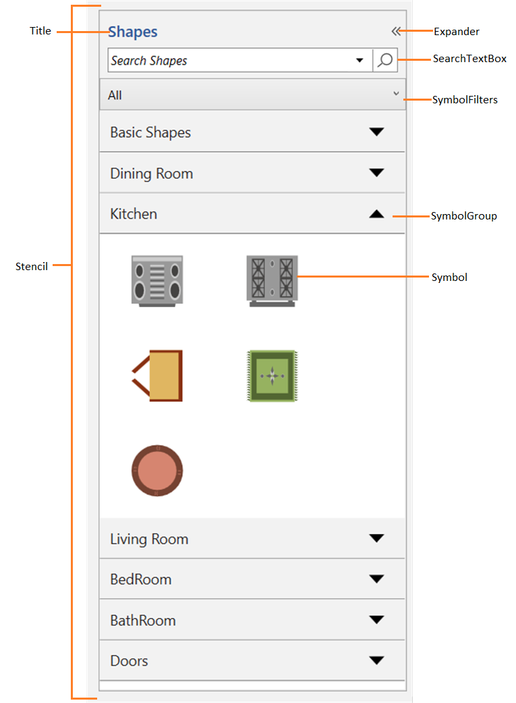

# Stencil in WPF Diagram (SfDiagram)

The [Stencil](https://help.syncfusion.com/cr/wpf/Syncfusion.UI.Xaml.Diagram.Stencil.html) is a gallery of reusable symbols and diagram elements that can be dragged and dropped on the diagram surface many times.




<!--Namespace for stencil-->
xmlns:stencil="clr-namespace:Syncfusion.UI.Xaml.Diagram.Stencil;assembly=Syncfusion.SfDiagram.WPF"

<!--Define a Stencil-->
<stencil:Stencil x:Name="stencil" ExpandMode="All" BorderBrush="Black" BorderThickness="0,0,1,0" />





//Define a Stencil.
Stencil stencil = new Stencil()
{
    ExpandMode = ExpandMode.All,
    BorderThickness = new Thickness(0,0,1,0),
    BorderBrush = new SolidColorBrush(Colors.Black)
};




## Add symbols in a Stencil 

The [Symbol](https://help.syncfusion.com/cr/wpf/Syncfusion.UI.Xaml.Diagram.Stencil.Symbol.html) is used to visualize the elements in a Stencil that can be created using the following ways:
 
 * Using the diagram elements. 
 * Using the SymbolViewModel.
 
 The Stencil's [SymbolSource](https://help.syncfusion.com/cr/wpf/Syncfusion.UI.Xaml.Diagram.Stencil.Stencil.html#Syncfusion_UI_Xaml_Diagram_Stencil_Stencil_SymbolSource) property is used to define the data source as a collection of objects (symbol, node, connector, and more) that needs to be populated as symbols.
 
## Using the Diagram Elements

The diagram elements such as [NodeViewModel](https://help.syncfusion.com/cr/wpf/Syncfusion.UI.Xaml.Diagram.NodeViewModel.html), [ConnectorViewModel](https://help.syncfusion.com/cr/wpf/Syncfusion.UI.Xaml.Diagram.ConnectorViewModel.html), and [GroupViewModel](https://help.syncfusion.com/cr/wpf/Syncfusion.UI.Xaml.Diagram.GroupViewModel.html) can be used to visualize the symbol.
 
 


<!--Initialize the SymbolSource-->
<stencil:Stencil.SymbolSource>
    <!--Define the SymbolCollection-->
    <local:SymbolCollection>
        <syncfusion:NodeViewModel x:Name="node" UnitHeight="70" UnitWidth="100" OffsetX="100" OffsetY="100" Shape="{StaticResource Rectangle}">
        </syncfusion:NodeViewModel>
        <syncfusion:ConnectorViewModel SourcePoint="100,100" TargetPoint="200,200"/>
        <!--Define the DiagramElement- Group-->
        <syncfusion:GroupViewModel>
            <!--Creates the Groupable Nodes-->
            <syncfusion:GroupViewModel.Nodes>
                <syncfusion:NodeCollection>
                    <syncfusion:NodeViewModel UnitHeight="70" ID="srcnode" OffsetX="0" OffsetY="300" 
                                              UnitWidth="100"
                                              Shape="{StaticResource Rectangle}">
                    </syncfusion:NodeViewModel>
                    <syncfusion:NodeViewModel UnitHeight="70" 
                                              ID="tarnode"
                                              OffsetX="100"
                                              OffsetY="500"
                                              UnitWidth="100"
                                              Shape="{StaticResource Rectangle}">
                    </syncfusion:NodeViewModel>
                </syncfusion:NodeCollection>
            </syncfusion:GroupViewModel.Nodes>
            <!--Creates the Groupable Connectors-->
            <syncfusion:GroupViewModel.Connectors>
                <syncfusion:ConnectorCollection>
                    <syncfusion:ConnectorViewModel SourceNodeID="srcnode" TargetNodeID="tarnode"/>
                </syncfusion:ConnectorCollection>
            </syncfusion:GroupViewModel.Connectors>
        </syncfusion:GroupViewModel>
    </local:SymbolCollection>
</stencil:Stencil.SymbolSource>





//Define the SymbolSource with SymbolCollection.
stencil.SymbolSource = new SymbolCollection();

//Initialize the diagram element.
NodeViewModel node = new NodeViewModel()
{
    UnitHeight = 70,
    UnitWidth = 100,
    OffsetX = 100, OffsetY = 100,
    Shape = App.Current.MainWindow.Resources["Rectangle"],
}; 

ConnectorViewModel cvm = new ConnectorViewModel()
{
    SourcePoint = new Point(100, 100),
    TargetPoint = new Point(200, 200),
};

GroupViewModel grp = new GroupViewModel()
{
    Nodes = new NodeCollection()
    {
       new NodeViewModel()
       {
         ID="srcnode",
         UnitHeight=70,
         UnitWidth=100,
         OffsetX=0,
         OffsetY=300,
         Shape=App.Current.Resources["Rectangle"]
        },
       new NodeViewModel()
       {
        ID="tarnode",
        UnitHeight=70,
        UnitWidth=100,
        OffsetX=100,
        OffsetY=500,
        Shape=App.Current.Resources["Rectangle"]
        }
    },
    Connectors = new ConnectorCollection()
    {
      new ConnectorViewModel()
      {
        SourceNodeID="srcnode", 
        TargetNodeID="tarnode"
      }
    }
};
//Adding an element to the collection.
(stencil.SymbolSource as SymbolCollection).Add(node);
(stencil.SymbolSource as SymbolCollection).Add(cvm);
(stencil.SymbolSource as SymbolCollection).Add(grp);

//Adding the ISymbol to the SymbolCollection.
public class SymbolCollection : ObservableCollection<Object>
{
}





 

[View Sample in GitHub](https://github.com/SyncfusionExamples/WPF-Diagram-Examples/tree/master/Samples/Stencil/Stencil-with-node-connector-group)

## Using the SymbolViewModel

The [SymbolViewModel](https://help.syncfusion.com/cr/wpf/Syncfusion.UI.Xaml.Diagram.Stencil.SymbolViewModel.html) has [Symbol](https://help.syncfusion.com/cr/wpf/Syncfusion.UI.Xaml.Diagram.Stencil.SymbolViewModel.html#Syncfusion_UI_Xaml_Diagram_Stencil_SymbolViewModel_Symbol) and [SymbolTemplate](https://help.syncfusion.com/cr/wpf/Syncfusion.UI.Xaml.Diagram.Stencil.SymbolViewModel.html#Syncfusion_UI_Xaml_Diagram_Stencil_SymbolViewModel_SymbolTemplate) properties to visualize the `Symbol` in the stencil.





<DataTemplate x:Key="Diamond">
    <StackPanel>
        <Path Stretch="Fill"
              Data="M 397.784,287.875L 369.5,316.159L 341.216,287.875L 369.5,259.591L 397.784,287.875 Z"
              Fill="White"
              Stroke="Black"
              StrokeThickness="1" />
        <TextBlock HorizontalAlignment="Center" VerticalAlignment="Center" Text="Diamond" />
    </StackPanel>
</DataTemplate>
<DataTemplate x:Key="symboltemplate">
    <StackPanel>
       <Image Source="/Image/user_image.png" Width="100" Height="80" />
       <TextBlock HorizontalAlignment="Center" VerticalAlignment="Center" Text="User" />
    </StackPanel>
</DataTemplate>

<stencil:Stencil.SymbolSource>
    <!--Define the SymbolCollection-->
    <local:SymbolCollection>
        <Syncfusion:SymbolViewModel Symbol="User" SymbolTemplate="{StaticResource symboltemplate}"/>
         <Syncfusion:SymbolViewModel Symbol="Diamond" SymbolTemplate="{StaticResource Diamond}"/>
    </local:SymbolCollection>
</stencil:Stencil.SymbolSource>
 

 


//Define the SymbolSource with the SymbolCollection.
stencil.SymbolSource = new SymbolCollection();
 
//Initialize the SymbolItem.
SymbolViewModel imagenode = new SymbolViewModel()
{    
    Symbol = "User",
    SymbolTemplate = this.Resources["symboltemplate"] as DataTemplate
};

SymbolViewModel symbol = new SymbolViewModel()
{    
    Symbol = "Diamond",
    SymbolTemplate = this.Resources["Diamond"] as DataTemplate
};

//Adding the element to the collection.
(stencil.SymbolSource as SymbolCollection).Add(imagenode);
(stencil.SymbolSource as SymbolCollection).Add(symbol);

//Adding the ISymbol to the SymbolCollection.
public class SymbolCollection : ObservableCollection<Object>
{
}




 

## Constraints

The `Constraints` property of stencil allows you to enable or disable certain features. For more information about stencil constraints, refer to the [StencilConstraints](https://help.syncfusion.com/cr/wpf/Syncfusion.UI.Xaml.Diagram.StencilConstraints.html).

[View Sample in GitHub](https://github.com/SyncfusionExamples/WPF-Diagram-Examples/tree/master/Samples/Stencil/Stencil-with-symbols)

## See Also

* [How to drag and drop elements from a treeview ?](https://www.syncfusion.com/kb/10574/how-to-drag-and-drop-elements-from-treeview-in-wpf-diagramsfdiagram)
* [How to refresh the stencil when adding a new symbol in the symbol source ?](https://www.syncfusion.com/kb/9928/how-to-refresh-the-stencil-when-adding-new-symbol-in-symbol-source)
* [How to host different UI elements as a node content ?](https://www.syncfusion.com/kb/9456/how-to-host-different-ui-elements-as-node-content)
* [How to notify stencil has been loaded ?](https://www.syncfusion.com/kb/6256/how-to-notify-stencil-has-been-loaded)
* [How to get the base node interface while dropping a Symbol from Stencil to SfDiagram ?](https://www.syncfusion.com/kb/5880/how-to-get-the-base-node-interface-while-dropping-a-symbol-from-the-stencil-to-the)
* [How to use different User Controls into Stencil?](https://www.syncfusion.com/kb/11459/how-to-use-different-user-controls-into-stencil-in-the-wpf-diagramsfdiagram)
