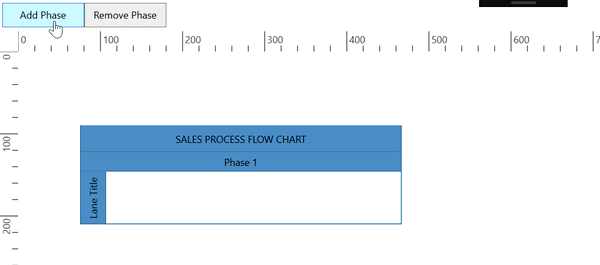

# Phase in WPF Diagram(SfDiagram)

 [Phase](https://help.syncfusion.com/cr/cref_files/wpf/Syncfusion.SfDiagram.WPF~Syncfusion.UI.Xaml.Diagram.PhaseViewModel.html) are the subprocess which will split each lanes as horizontally or vertically based on the swimlane orientation. The multiple number of phase can be added to swimlane.

## Create an empty Phase

We can create the phase and add into [Phases](https://help.syncfusion.com/cr/cref_files/wpf/Syncfusion.SfDiagram.WPF~Syncfusion.UI.Xaml.Diagram.SwimlaneViewModel~Phases.html) collection of the Swimlane.

>Note: For Horizontal Swimlane, we must set the UnitWidth of the Phase. For Vertical Swimlane, we must set UnitHeight of the Phase.

The following code example illustrates how to add phase at swimlane.




   <syncfusion:SfDiagram x:Name="diagram" >
                <syncfusion:SfDiagram.Swimlanes>
                     <!--Initialize the SwimlaneCollection--> 
                    <syncfusion:SwimlaneCollection>
                        <!--Initialize the Swimlane-->
                        <syncfusion:SwimlaneViewModel OffsetX="300" OffsetY="150"  
                UnitHeight="120" UnitWidth="450">
                            <!--Create a header for Swimlane-->
                            <syncfusion:SwimlaneViewModel.Header>
                                <syncfusion:SwimlaneHeader UnitHeight="32" >
                                    <syncfusion:SwimlaneHeader.Annotation>
                                        <syncfusion:AnnotationEditorViewModel Content="Swimlane"></syncfusion:AnnotationEditorViewModel>
                                    </syncfusion:SwimlaneHeader.Annotation>
                                </syncfusion:SwimlaneHeader>
                            </syncfusion:SwimlaneViewModel.Header>
                           <syncfusion:SwimlaneViewModel.Phases>
                                <syncfusion:PhaseCollection>
                             <!--Initialize the Phase-->
                             <syncfusion:PhaseViewModel UnitWidth="450">
                                <syncfusion:PhaseViewModel.Header>
                                <!--Create a header for Phase-->
                            <syncfusion:SwimlaneHeader UnitHeight="30" >
                                 <syncfusion:SwimlaneHeader.Annotation>
                                  <syncfusion:AnnotationEditorViewModel Content="Phase"></syncfusion:AnnotationEditorViewModel>
                                </syncfusion:SwimlaneHeader.Annotation>
                                 </syncfusion:SwimlaneHeader>
                                  </syncfusion:PhaseViewModel.Header>
                                  </syncfusion:PhaseViewModel>
                                </syncfusion:PhaseCollection>
                            </syncfusion:SwimlaneViewModel.Phases>
                        </syncfusion:SwimlaneViewModel>
                    </syncfusion:SwimlaneCollection>
                </syncfusion:SfDiagram.Swimlanes>
            </syncfusion:SfDiagram>


  //Initialize the SfDiagram
  SfDiagram diagram = new SfDiagram();
 //Initialize SwimlaneCollection to SfDiagram
  diagram.Swimlanes = new SwimlaneCollection();

 //Creating the SwimlaneViewModel
 SwimlaneViewModel swimlane = new SwimlaneViewModel()
 {
   UnitWidth = 450,
   UnitHeight = 120,
   OffsetX = 300,
   OffsetY = 150,
   Orientation = Orientation.Horizontal,
 };
   //Creating Header for SwimlaneViewModel
   swimlane.Header = new SwimlaneHeader()
   {
     UnitHeight = 32,
     Annotation = new AnnotationEditorViewModel()
     {
      Content = "Swimlane"
     },
   };

  swimlane.Phases = new PhaseCollection()
  {
       new PhaseViewModel()
       {
        UnitWidth=450,
        Header=new SwimlaneHeader()
        {
         UnitHeight=30,
         Annotation=new AnnotationEditorViewModel(){Content="Phase"},
        }
       }
  };

//Add Swimlane to Swimlanes property of the Diagram
(diagram.Swimlanes as SwimlaneCollection).Add(swimlane);




.

## Dynamically add phase to Lane

 You can add the a phase at runtime by using the `Add` and `Remove` method of the [`SfDiagram.Phases`](https://help.syncfusion.com/cr/cref_files/wpf/Syncfusion.SfDiagram.WPF~Syncfusion.UI.Xaml.Diagram.SwimlaneViewModel~Phases.html) Collection. The following code example illustrates how to add and remove phase at run time.



 <Button Name="AddButton" Width="100"  Height="30" IsEnabled="True" Content="Add Phase" ToolTip="Add Phase" Command="{Binding AddCommand}" Cursor="Hand"></Button>
<Button Name="RemoveButton" Width="100"  Height="30" IsEnabled="True" Content="Remove Phase" ToolTip="Remove Phase" Command="{Binding RemoveCommand}" Cursor="Hand">
</Button>
 <syncfusion:SfDiagram x:Name="diagram" Nodes="{Binding Nodes}" 
    Swimlanes="{Binding Swimlanes}"                            Connectors="{Binding Connectors}"                         SelectedItems="{Binding SelectedItems}"                              SnapSettings="{Binding SnapSettings}"                              HorizontalRuler="{Binding HorizontalRuler}"                              VerticalRuler="{Binding VerticalRuler}"/>



public class DiagramVM : DiagramViewModel
{
#region Fields

private ICommand _AddCommand;
private ICommand _RemoveCommand;
#endregion
public DiagramVM()
{
SnapSettings = new SnapSettings()
{
 SnapConstraints = SnapConstraints.None,
};

SelectedItems = new SelectorViewModel();

HorizontalRuler = new Ruler() { Orientation = Orientation.Horizontal };
VerticalRuler = new Ruler() { Orientation = Orientation.Vertical };

//Add Command
 AddCommand = new Command(OnAdd);
//Remove Command
 RemoveCommand = new Command(OnRemove);
}
private void InitializeDiagram()
{
 //Initialize SwimlaneCollection to SfDiagram
  this.Swimlanes = new SwimlaneCollection();

 //Creating the SwimlaneViewModel
 SwimlaneViewModel swimlane = new SwimlaneViewModel()
 {
   UnitWidth = 450,
   UnitHeight = 120,
   OffsetX = 300,
   OffsetY = 150,
   Orientation = Orientation.Horizontal,
 };
   //Creating Header for SwimlaneViewModel
   swimlane.Header = new SwimlaneHeader()
   {
     UnitHeight = 32,
     Annotation = new AnnotationEditorViewModel()
     {
      Content = "Swimlane"
     },
   };

 swimlane.Phases = new PhaseCollection()
 {
   new PhaseViewModel()
    {
     UnitWidth=450,
     Header=new SwimlaneHeader()
     {
      UnitHeight=24,
      Annotation=new AnnotationEditorViewModel(){Content="Phase"},
     }
    }
  };

//Add Swimlane to Swimlanes property of the Diagram
(this.Swimlanes as SwimlaneCollection).Add(swimlane);
}
#region Commands

public ICommand AddCommand
{
  get { return _AddCommand; }
  set { _AddCommand = value; }
}

public ICommand RemoveCommand
{
 get { return _RemoveCommand; }
 set { _RemoveCommand = value; }
}

#endregion
#region Helper Methods
//Add Lane into Lanes collection
 private void OnAdd(object obj)
 {
  var swimlane = (this.Swimlanes as SwimlaneCollection).FirstOrDefault() as SwimlaneViewModel;
   if (swimlane != null)
    {
     (swimlane.Phases as PhaseCollection).Add(new PhaseViewModel() { UnitWidth = 100 });
    }
 }
 //Remove Lane from Lanes collection
 private void OnRemove(object obj)
 {
  var swimlane = (this.Swimlanes as SwimlaneCollection).FirstOrDefault() as SwimlaneViewModel;
  if (swimlane != null && (swimlane.Phases as PhaseCollection).Count>1)
  {
   (swimlane.Phases as PhaseCollection).Remove((swimlane.Phases as PhaseCollection).LastOrDefault());
  }
 }
 #endregion
}



.

[View sample in GitHub](https://github.com/SyncfusionExamples/WPF-Diagram-Examples/tree/master/Samples/Swimlane/Swimlane_Add_Remove_Phase)

## Phase header editing

Diagram provides the support to edit phase headers at runtime. We achieve the header editing by double click event. Double clicking the header label will enables the editing of that.

The following image illustrates how to edit the phase header.

## Header Selection and Resize

 * We can select the individual phase header by click on Header twice. For first click, the respective phase can select. 

 * We can support to resize the individual phase header. While resizing the phase, it has maintain 20px distances from Lane children.

 * The `NodeChangedEvent` will notify the `UnitHeight` and `UnitWidth` changes with their old and new values. Along with that, this event will give information about  interaction state. To explore about arguments, refer to the [NodeChangedEventArgs](https://help.syncfusion.com/cr/cref_files/wpf/Syncfusion.SfDiagram.WPF~Syncfusion.UI.Xaml.Diagram.NodeChangedEventArgs.html) 

 The following image illustrates how to select and resize the phase header.

.

## Phase interaction

### Select

Phase can be selected by clicking (tap) the header of the phase.

* The `IsSelected` Property is used to select or unselect the phase at runtime.

### Resizing

* The phase can be resized by using its selector.
* You must select the phase header to enable the phase selection.
* Once the phase can be resized, the lane size will be updated automatically.
* Phase can be resized by resizing the right and bottom direction for horizontal, and the top and bottom direction for vertical swimlane.