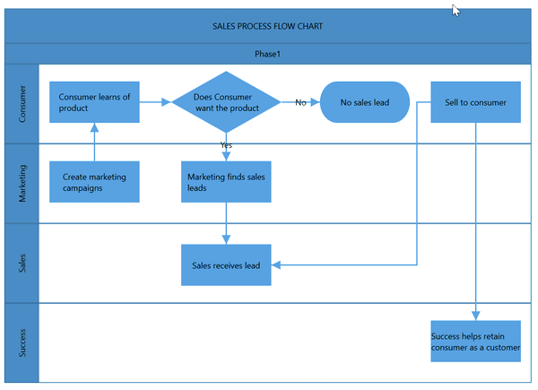
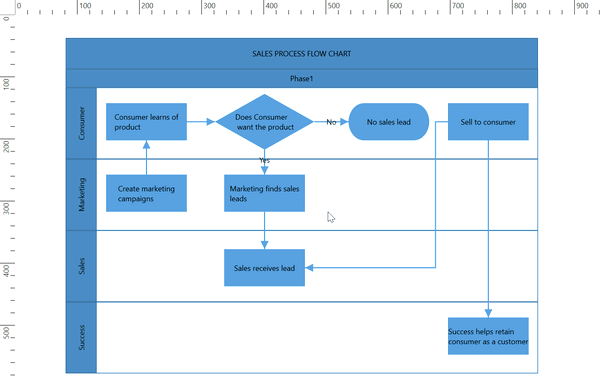

# Swimlane in WPF Diagram(SfDiagram)

[Swimlane](https://help.syncfusion.com/cr/cref_files/wpf/Syncfusion.SfDiagram.WPF~Syncfusion.UI.Xaml.Diagram.Swimlane.html) is a type of diagram nodes,which is typically used to visualize the relationship between a business process and the department responsible for it by focusing on the logical relationships between activities.

## Create a swimlane
A swimlane can be created and added to the Diagram, either programmatically or interactively. 

### Add Swimlane through Swimlanes collection 

To create a swimlane, you have to define the swimlane object and add that to [Swimlanes](https://help.syncfusion.com/cr/cref_files/wpf/Syncfusion.SfDiagram.WPF~Syncfusion.UI.Xaml.Diagram.SfDiagram~Swimlanes.html) collection of the Diagram.

>Note: by default, if we create a swimlane, one lane and phase will be added.



<!-- Initialize the Sfdiagram -->
 <syncfusion:SfDiagram x:Name="diagram">
    <syncfusion:SfDiagram.Swimlanes>
        <!-- Initialize the SwimlaneCollection -->
         <syncfusion:SwimlaneCollection>
          <!--Initialize the Swimlane-->
            <syncfusion:SwimlaneViewModel OffsetX="300" OffsetY="150"  
                UnitHeight="120" UnitWidth="450"/>           
         </syncfusion:SwimlaneCollection>
    </syncfusion:SfDiagram.Swimlanes>
</syncfusion:SfDiagram>



//Initialize the SfDiagram
SfDiagram diagram = new SfDiagram();
//Initialize SwimlaneCollection to SfDiagram
diagram.Swimlanes = new SwimlaneCollection();

//Creating the SwimlaneViewModel
SwimlaneViewModel swimlane = new SwimlaneViewModel()
{
  UnitWidth = 450,
  UnitHeight = 120,
  OffsetX = 300,
  OffsetY = 150,
};

//Add Swimlane to Swimlanes property of the Diagram
(diagram.Swimlanes as SwimlaneCollection).Add(swimlane);


 

Now, swimlane will be as follows.

[View sample in GitHub](https://github.com/SyncfusionExamples/WPF-Diagram-Examples/tree/master/Samples/Swimlane/SwimlaneCreation)

### SwimlaneHeaders

SwimlaneHeader was the primary element for swimlanes. The [`Header`](https://help.syncfusion.com/cr/cref_files/wpf/Syncfusion.SfDiagram.WPF~Syncfusion.UI.Xaml.Diagram.SwimlaneViewModel~Header.html) property of swimlane allows you to define its textual description and to customize its appearance.

>Note: By using this header,the swimlane interaction will be performed,like selection, dragging,etc.

The following code example illustrates how to define a swimlane header.



 <!-- Initialize the Sfdiagram -->
<syncfusion:SfDiagram x:Name="diagram">
            <syncfusion:SfDiagram.Swimlanes>
                <!-- Initialize the SwimlaneCollection -->
                <syncfusion:SwimlaneCollection>
                    <!--Initialize the Swimlane-->
                    <syncfusion:SwimlaneViewModel OffsetX="300" OffsetY="150"  
                UnitHeight="120" UnitWidth="450">
                  <!--Initialize the Swimlane Header-->
                        <syncfusion:SwimlaneViewModel.Header>
                            <syncfusion:SwimlaneHeader UnitHeight="32" >
                                <syncfusion:SwimlaneHeader.Annotation>
                                    <syncfusion:AnnotationEditorViewModel Content="Swimlane"></syncfusion:AnnotationEditorViewModel>
                                </syncfusion:SwimlaneHeader.Annotation>
                            </syncfusion:SwimlaneHeader>
                        </syncfusion:SwimlaneViewModel.Header>
                    </syncfusion:SwimlaneViewModel>
                </syncfusion:SwimlaneCollection>
            </syncfusion:SfDiagram.Swimlanes>
</syncfusion:SfDiagram>


  //Initialize the SfDiagram
  SfDiagram diagram = new SfDiagram();
 //Initialize SwimlaneCollection to SfDiagram
 diagram.Swimlanes = new SwimlaneCollection();

 //Creating the SwimlaneViewModel
 SwimlaneViewModel swimlane = new SwimlaneViewModel()
 {
  UnitWidth = 450,
  UnitHeight = 120,
  OffsetX = 300,
  OffsetY = 150,
 };
 //Creating Header for SwimlaneViewModel
 swimlane.Header = new SwimlaneHeader()
 {
    UnitHeight = 32,
    Annotation = new AnnotationEditorViewModel()
    {
        Content = "Swimlane"
    }
 };

//Add Swimlane to Swimlanes property of the Diagram
(diagram.Swimlanes as SwimlaneCollection).Add(swimlane);


 

[View sample in GitHub](https://github.com/SyncfusionExamples/WPF-Diagram-Examples/tree/master/Samples/Swimlane/Swimlane_Header)

### Customization of headers

The height and width of swimlane header can be customized with [`UnitWidth`](https://help.syncfusion.com/cr/cref_files/wpf/Syncfusion.SfDiagram.WPF~Syncfusion.UI.Xaml.Diagram.SwimlaneChildViewModel~UnitWidth.html) and [`UnitHeight`](https://help.syncfusion.com/cr/cref_files/wpf/Syncfusion.SfDiagram.WPF~Syncfusion.UI.Xaml.Diagram.SwimlaneChildViewModel~UnitHeight.html) properties of swimlane header. Set fill color of header by using the [`ShapeStyle`](https://help.syncfusion.com/cr/cref_files/wpf/Syncfusion.SfDiagram.WPF~Syncfusion.UI.Xaml.Diagram.SwimlaneChildViewModel~ShapeStyle.html) property. 

The following code example illustrates how to customize the swimlane header.




 <!-- Initialize the Sfdiagram -->
 <syncfusion:SfDiagram x:Name="diagram">
            <syncfusion:SfDiagram.Swimlanes>
                <!-- Initialize the SwimlaneCollection -->
                <syncfusion:SwimlaneCollection>
                    <!--Initialize the Swimlane-->
                    <syncfusion:SwimlaneViewModel OffsetX="300" OffsetY="150" Orientation="Horizontal" 
                UnitHeight="120" UnitWidth="450">
                        <syncfusion:SwimlaneViewModel.Header>
                         <!--Initialize the Swimlane Header-->
                            <syncfusion:SwimlaneHeader UnitHeight="32" ShapeStyle="{StaticResource SwimlaneHeaderStyle}">
                                <syncfusion:SwimlaneHeader.Annotation>
                                    <syncfusion:AnnotationEditorViewModel Content="Swimlane"></syncfusion:AnnotationEditorViewModel>
                                </syncfusion:SwimlaneHeader.Annotation>
                            </syncfusion:SwimlaneHeader>
                        </syncfusion:SwimlaneViewModel.Header>
                    </syncfusion:SwimlaneViewModel>
                </syncfusion:SwimlaneCollection>
            </syncfusion:SfDiagram.Swimlanes>
        </syncfusion:SfDiagram>


  //Initialize the SfDiagram
  SfDiagram diagram = new SfDiagram();
 //Initialize SwimlaneCollection to SfDiagram
 diagram.Swimlanes = new SwimlaneCollection();

 //Creating the SwimlaneViewModel
 SwimlaneViewModel swimlane = new SwimlaneViewModel()
 {
  UnitWidth = 450,
  UnitHeight = 120,
  OffsetX = 300,
  OffsetY = 150,
  Orientation=Orientation.Horizontal,
 };
 //Creating Header for SwimlaneViewModel
 swimlane.Header = new SwimlaneHeader()
 {
    UnitHeight = 32,
    Annotation = new AnnotationEditorViewModel()
    {
        Content = "Swimlane"
    },
    ShapeStyle=this.Resources["SwimlaneHeaderStyle"] as Style,
 };

//Add Swimlane to Swimlanes property of the Diagram
(diagram.Swimlanes as SwimlaneCollection).Add(swimlane);


 

### Header editing

Diagram provides the support to edit swimlane headers at runtime. We achieve the header editing by double click on it. Double clicking the header label will enables the editing mode.
The following image illustrates how to edit the swimlane header.

.

## Orientation

The orientation of swimlane can be customized with the [`Orientation`](https://help.syncfusion.com/cr/cref_files/wpf/Syncfusion.SfDiagram.WPF~Syncfusion.UI.Xaml.Diagram.SwimlaneViewModel~Orientation.html) property of the header.

>Note: By default the swimlane orientation has Horizontal.

## Interaction

### Select

Swimlane can be selected by clicking (tap) the header of the swimlane.

* The `IsSelected` Property is used to select or unselect the swimlane at runtime.

* `ItemSelectingEvent` and `ItemSelectedEvent` for selecting an element, will notify you the item and its original source. To explore about arguments, refer to the [DiagramPreviewEventArgs](https://help.syncfusion.com/cr/cref_files/wpf/Syncfusion.SfDiagram.WPF~Syncfusion.UI.Xaml.Diagram.DiagramPreviewEventArgs.html) and [ItemSelectedEventArgs](https://help.syncfusion.com/cr/cref_files/wpf/Syncfusion.SfDiagram.WPF~Syncfusion.UI.Xaml.Diagram.ItemSelectedEventArgs.html).

* `ItemUnselectingEvent` and `ItemUnselectedEvent` for unselecting an element, will notify you the item and its original source. To explore about arguments, refer to the [DiagramPreviewEventArgs](https://help.syncfusion.com/cr/cref_files/wpf/Syncfusion.SfDiagram.WPF~Syncfusion.UI.Xaml.Diagram.DiagramPreviewEventArgs.html) and [DiagramEventArgs](https://help.syncfusion.com/cr/cref_files/wpf/Syncfusion.SfDiagram.WPF~Syncfusion.UI.Xaml.Diagram.DiagramEventArgs.html).

### Drag  

* Selected object can be dragged by clicking and dragging the header of the swimlane. 

* Instead of dragging original object, preview of the node alone can be dragged. For preview dragging, refer to the [PreviewSettings](https://help.syncfusion.com/wpf/sfdiagram/preview-settings). 

* The `NodeChangedEvent` will notify the `OffsetX` and `OffsetY` changes with their old and new values. Along with that, this event will give information about interaction state. To explore about aruguments, refer to the [NodeChangedEventArgs](https://help.syncfusion.com/cr/cref_files/wpf/Syncfusion.SfDiagram.WPF~Syncfusion.UI.Xaml.Diagram.NodeChangedEventArgs.html) .

Please find the swimlane sample as below.

[View Swimlane sample in GitHub](https://github.com/SyncfusionExamples/WPF-Diagram-Examples/tree/master/Samples/Swimlane/Swimlane-Sample)