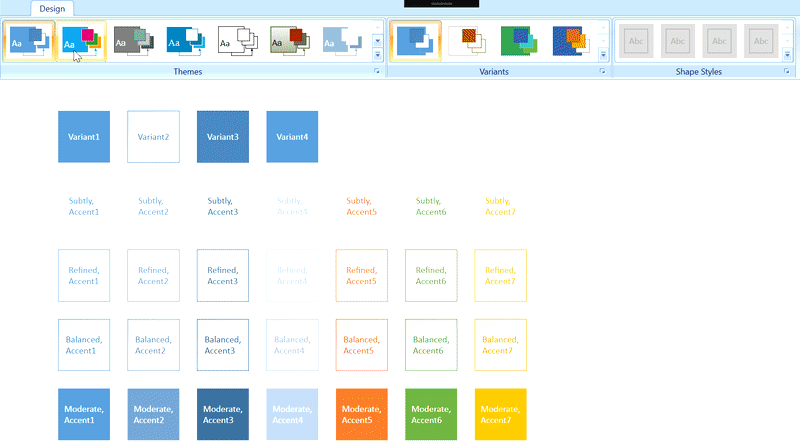

# Themes with WPF Diagram (SfDiagram)

Diagram themes are predefined sets of diagram item styles that can be applied easily to the diagram elements. In Diagram nearly 20 Built-In themes are available. DiagramTheme has NodeStyles, ConnectorStyles and Theme properties, which is used to create custom Diagram theme. To know more about DiagramTheme properties, refer to the [DiagramTheme](https://help.syncfusion.com/cr/wpf/Syncfusion.SfDiagram.WPF~Syncfusion.UI.Xaml.Diagram.Theming.DiagramTheme_members.html).

### Built-In Themes

Built-In themes are predefined themes inherited from DiagramTheme. Each Built-In themes have 4 Variants. Based on the selected theme and variants, the style of the Node and Connector will be changed. By default, first variant style of the specified Built-In theme will be applied to the diagram elements. To Know more about Built-In themes , refer to [Built-In](https://help.syncfusion.com/cr/wpf/Syncfusion.SfDiagram.WPF~Syncfusion.UI.Xaml.Diagram.Theming.DiagramTheme.html).

To change the DiagramTheme,




<!--Resource Dictionary which contains predefined shapes for Node-->
<ResourceDictionary.MergedDictionaries>
    <ResourceDictionary Source="/Syncfusion.SfDiagram.Wpf;component/Resources/BasicShapes.xaml"/>
</ResourceDictionary.MergedDictionaries>

<!--Initialize the Sfdiagram-->
<syncfusion:SfDiagram x:Name="diagram">
    <syncfusion:SfDiagram.Theme>
        <syncfusion:OfficeTheme></sfdiagram:OfficeTheme>
    </syncfusion:SfDiagram.Theme>
</syncfusion:SfDiagram>




//Instance of SfDiagram
SfDiagram diagram = new SfDiagram();
DiagramTheme theme = new OfficeTheme();
diagram.Theme = theme;
			



### Variant Styles and ShapeStyles

Variant styles are set of styles that are applied to the Diagram elements. Each Variant style contains 46 Shape styles. We can change the style of each Node in the diagram using its ThemeStyleId property. Based on the values of theme and variant style, the style will be applied to the node.

To change the Variant and Style, 




<!--Initialize the Sfdiagram-->
<syncfusion:SfDiagram x:Name="diagram">
    <syncfusion:SfDiagram.Theme>
        <syncfusion:OfficeTheme></sfdiagram:OfficeTheme>
    </syncfusion:SfDiagram.Theme>
    <syncfusion:SfDiagram.Nodes>
        <!--Initialize the NodeCollection-->
        <syncfusion:NodeCollection>
            <!--Initialize the Node-->
            <syncfusion:NodeViewModel OffsetX="100" OffsetY="100" UnitWidth="75" UnitHeight = "75" Shape="{StaticResource Ellipse}" ThemeStyleId="Variant1">
            </sfdiagram:NodeViewModel>     
        </syncfusion:NodeCollection>
    </syncfusion:SfDiagram.Nodes>
</syncfusion:SfDiagram>




diagram.Theme = new OfficeTheme();
NodeViewModel node = new NodeViewModel()
{
    OffsetX = 100,
    OffsetY = 100,
    UnitWidth = 75,
    UnitHeight = 75,
    Shape = App.Current.Resources["Rectangle"],
    //adding theme style ID as variant1.
    ThemeStyleId = StyleId.Variant1,
};

node.Annotations = new ObservableCollection<IAnnotation>()
{
    new TextAnnotationViewModel()
    {
        Text = node.ThemeStyleId.ToString(),
        TextWrapping = TextWrapping.Wrap,
    }
};

(diagram.Nodes as ObservableCollection<NodeViewModel>).Add(node);
			



[View Sample in GitHub](https://github.com/SyncfusionExamples/WPF-Diagram-Examples/tree/master/Samples/Theme/ThemeStyle).
