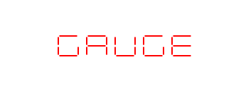

# Digital Characters in Digital Gauge (SfDigitalGauge)

The digital characters in the digital gauge can be viewed in different types of segments. These digital characters are set to the digital gauge through the [`Value`](https://help.syncfusion.com/cr/wpf/Syncfusion.SfGauge.WPF~Syncfusion.UI.Xaml.Gauges.SfDigitalGauge~Value.html) property of type string.




    <syncfusion:SfDigitalGauge Value="GAUGE" />    





    SfDigitalGauge digitalgauge = new SfDigitalGauge();
    digitalgauge.Value = "GAUGE";
    this.Grid.Children.Add(digitalgauge);




## 7-Segments

The digital characters which are set as the value property of the digital gauge are displayed by default 7-segments. Rather than using the alphabets, these are mainly used to display numbers. The type of segments can be set by the [`CharacterType`](https://help.syncfusion.com/cr/wpf/Syncfusion.SfGauge.WPF~Syncfusion.UI.Xaml.Gauges.SfDigitalGauge~CharacterType.html) property.




    <syncfusion:SfDigitalGauge Value="12345"  CharacterType="SegmentSeven" />





    SfDigitalGauge digitalgauge = new SfDigitalGauge();
    digitalgauge.Value = "12345";
    digitalgauge.CharacterType = CharacterType.SegmentSeven;
    this.Grid.Children.Add(digitalgauge);




## 14-Segments

The digital characters which are set as the value property of the digital gauge are displayed by 14 segments. These type of characters are used to display both alphabets and numbers. 




    <syncfusion:SfDigitalGauge Value="SYNCFUSION" CharacterType="SegmentFourteen" />





    SfDigitalGauge digitalgauge = new SfDigitalGauge();
    digitalgauge.Value = "SYNCFUSION";
    digitalgauge.CharacterType = CharacterType.SegmentFourteen;
    this.Grid.Children.Add(digitalgauge);




## 16-Segments

The digital characters which are set as the value property of the digital gauge are displayed by 16 segments. These type of characters are also used to display both alphabets and numbers. 




    <syncfusion:SfDigitalGauge Value="SYNCFUSION" CharacterType="SegmentSixteen" />





    SfDigitalGauge digitalgauge = new SfDigitalGauge();
    digitalgauge.Value = "SYNCFUSION";
    digitalgauge.CharacterType = CharacterType.SegmentSixteen;
    this.Grid.Children.Add(digitalgauge);




## 8*8 Dot Matrix Segments

The digital characters which are set as the value property of the digital gauge are displayed by eight cross eight dot matrix segments. These type of characters are used to display special characters along with the alphabets and numbers. 




    <syncfusion:SfDigitalGauge Value="SYNCFUSION" CharacterType="EightCrossEightDotMatrix" />





    SfDigitalGauge digitalgauge = new SfDigitalGauge();
    digitalgauge.Value = "SYNCFUSION";
    digitalgauge.CharacterType = CharacterType.EightCrossEightDotMatrix;
    this.Grid.Children.Add(digitalgauge);




