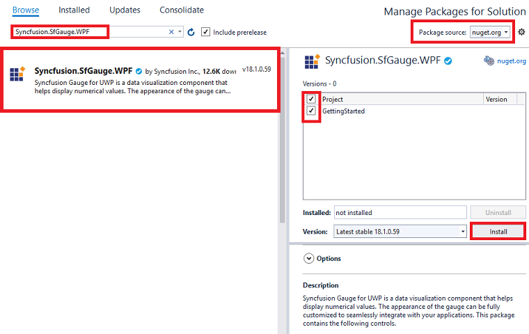

# Getting Started with WPF Digital Gauge (SfDigitalGauge)

This section explains you the steps required to configure the **SfDigitalGauge** and also explains the steps to add basic elements of **SfDigitalGauge** through various API’s available within it.

## Adding gauge references

You can add gauge reference using one of the following methods:

**Method 1: Adding gauge reference from nuget.org**

Syncfusion WPF components are available in [`nuget.org`](https://www.nuget.org/). To add gauge to your project, open the NuGet package manager in Visual Studio, search for [Syncfusion.SfGauge.WPF](https://www.nuget.org/packages/Syncfusion.SfGauge.WPF), and then install it.

**Method 2: Adding gauge reference from toolbox**

You can drag the digital gauge control from the  toolbox and drop it to the designer. It will add the required assembly references automatically, and add the namespace to the page.  

**Method 3: Adding gauge assemblies manually from the installed location**

If you prefer to manually reference the assemblies instead referencing from NuGet, add the following assemblies in respective projects.

Location: {Installed location}/{version}/WPF/Assemblies

You can refer to [this](https://help.syncfusion.com/wpf/control-dependencies#sfgauge) link to know about the assemblies required for adding gauge to your project.

## Initialize gauge

You can initialize the [`SfDigitalGauge`](https://help.syncfusion.com/cr/wpf/Syncfusion.UI.Xaml.Gauges.SfDigitalGauge.html) control with a required optimal name using the included namespace.





	xmlns:gauge ="clr-namespace:Syncfusion.UI.Xaml.Gauges;assembly=Syncfusion.SfGauge.Wpf"





	using Syncfusion.UI.Xaml.Gauges;





initialize digital gauge control.





	<syncfusion:SfDigitalGauge/>
 




	SfDigitalGauge digitalgauge = new SfDigitalGauge();
	this.Content = digitalgauge;





Run the above code and now the default **SfDigitalGauge** can be displayed as follows. UI component of the digital gauge can be customized by adding segments and passing Values which will be explained in the next section.

## Displaying Values 

The [`SfDigitalGauge`](https://help.syncfusion.com/cr/wpf/Syncfusion.UI.Xaml.Gauges.SfDigitalGauge.html) control provides options to display special characters or values using the [`Value`](https://help.syncfusion.com/cr/wpf/Syncfusion.UI.Xaml.Gauges.SfDigitalGauge.html#Syncfusion_UI_Xaml_Gauges_SfDigitalGauge_Value) property.




<syncfusion:SfDigitalGauge Value="1 2 3 4" />    





SfDigitalGauge digitalgauge = new SfDigitalGauge();
digitalgauge.Value = "1 2 3 4";
this.Content = digitalgauge;




## Setting character type

By using the [`CharacterType`](https://help.syncfusion.com/cr/wpf/Syncfusion.UI.Xaml.Gauges.SfDigitalGauge.html#Syncfusion_UI_Xaml_Gauges_SfDigitalGauge_CharacterType) property, you can set the segments for digital gauge. The digital characters can be drawn in the following four different segments:

•	EightCrossEightDotMatrix

•	SegmentFourteen

•	SegmentSeven

•	SegmentSixteen




<gauge:SfDigitalGauge Value="1 2 3 4" CharacterType="EightCrossEightDotMatrix"/>





SfDigitalGauge digitalgauge = new SfDigitalGauge();
digitalgauge.CharacterType = CharacterType.EightCrossEightDotMatrix;
this.Content = digitalgauge;




## Configuring properties

The [`CharacterHeight`](https://help.syncfusion.com/cr/wpf/Syncfusion.UI.Xaml.Gauges.SfDigitalGauge.html#Syncfusion_UI_Xaml_Gauges_SfDigitalGauge_CharacterHeight), [`CharacterWidth`](https://help.syncfusion.com/cr/wpf/Syncfusion.UI.Xaml.Gauges.SfDigitalGauge.html#Syncfusion_UI_Xaml_Gauges_SfDigitalGauge_CharacterWidth), and [`CharacterStroke`](https://help.syncfusion.com/cr/wpf/Syncfusion.UI.Xaml.Gauges.SfDigitalGauge.html#Syncfusion_UI_Xaml_Gauges_SfDigitalGauge_CharacterStroke) properties are used to display characters, which can be customized as shown in the following code snippets





<gauge:SfDigitalGauge CharacterHeight="60" CharacterWidth="25" 
                      CharacterStroke="#146CED"/>





SfDigitalGauge digitalgauge = new SfDigitalGauge();
digitalgauge.CharacterHeight = 60;
digitalgauge.CharacterWidth = 25;
digitalgauge.CharacterStroke = (SolidColorBrush)new BrushConverter().ConvertFrom("#146CED");
this.Content = digitalgauge;





The following code example is the complete code of the previous configurations.





<gauge:SfDigitalGauge Value="11:59:50 PM"
                      Height="100"
                      Width="375"
                      DimmedBrush="#F2F2F2"
                      CharacterHeight="60"
                      CharacterWidth="25"
                      HorizontalAlignment="Center"
                      VerticalAlignment="Center"
                      CharacterType="EightCrossEightDotMatrix"
                      CharacterStroke="#146CED" />





SfDigitalGauge digitalgauge = new SfDigitalGauge();
digitalgauge.Height = 100;
digitalgauge.Width = 375;
digitalgauge.Value = "11:59:50 PM";
digitalgauge.CharacterHeight = 60;
digitalgauge.CharacterWidth = 25;
digitalgauge.HorizontalAlignment = HorizontalAlignment.Center;
digitalgauge.VerticalAlignment = VerticalAlignment.Center;
digitalgauge.CharacterType = CharacterType.EightCrossEightDotMatrix;
digitalgauge.CharacterStroke = (SolidColorBrush)new BrushConverter().ConvertFrom("#146CED");
digitalgauge.DimmedBrush = (SolidColorBrush)new BrushConverter().ConvertFrom("#F2F2F2");
this.Content = digitalgauge;





The following screenshot illustrates the result of the previous codes.

You can find the complete getting started sample from this [`link`](https://github.com/SyncfusionExamples/WPF-UG-getting-started-samples/tree/master/GettingStartedDigitalGauge).\

## See also

[How to apply themes for SfDigitalGauge](https://www.syncfusion.com/kb/2535/how-to-apply-themes-for-sfdigitalgauge)