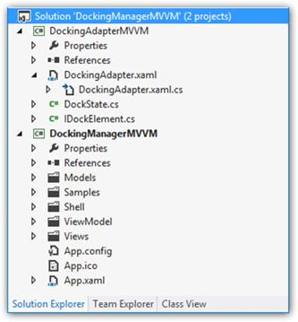
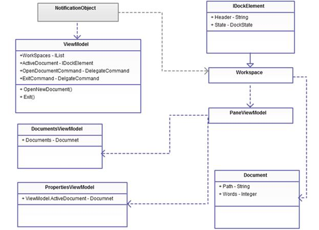
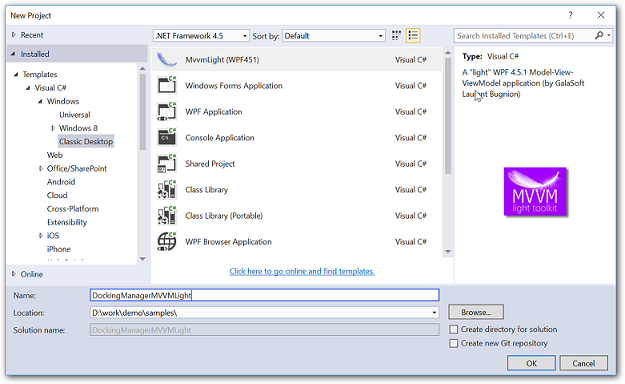
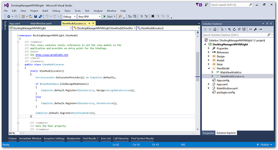
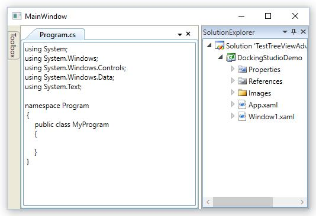
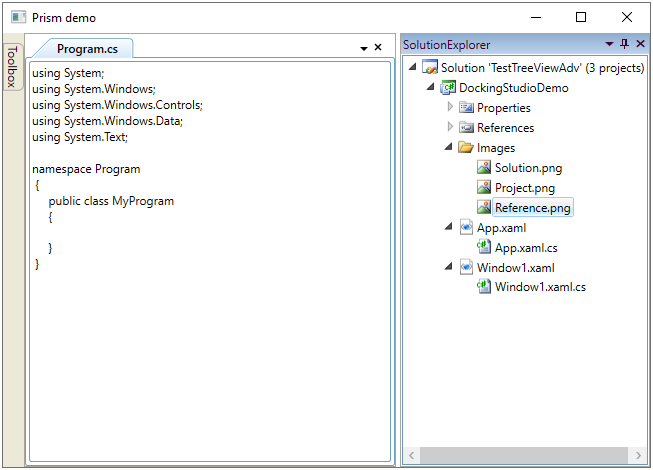

# Patterns and Practices

## MVVM 

This section explains how to adapt the Syncfusion docking manager to an MVVM application. Since the WPF DockingManager is not an Items Control, it is not possible to have a traditional [ItemsSource](https://docs.microsoft.com/en-us/dotnet/api/system.windows.controls.itemscontrol.itemssource?view=netframework-4.7.2) binding to a collection of objects in the view model. However this can be achieved by creating a wrapper or adapter for the DockingManager.

Here a simple text-reader application is used to demonstrate this approach.

1. **DocumentsView** - The pane that lists all the available documents and tooltip display the path of the document.
2. **PropertiesView** - The pane that shows the properties of a document. Our PropertyGrid control is used here.
3. **DocumentView** - The pane that uses the WPF flow-document reader to display the content of a file.
4. **CommandView** - The view has two commands: `Open` Document and `Exit`. Executing an Open Document action opens the Open File Dialog. The document that opened, added to the existing documents list. Other commands like Close Document and New Document can also be implemented the same way.
5. The project structure looks like this:

### Docking Adapter
The adapter is simply a user control that contains DockingManager as its content. The adapter has two properties — ItemsSource and ActiveDocument. Binding a collection of objects to the [ItemsSource](https://docs.microsoft.com/en-us/dotnet/api/system.windows.controls.itemscontrol.itemssource?view=netframework-4.7.2) property triggers a collection change where the adapter creates a corresponding Framework element, example: ContentControl in the DockingManager, setting the underlying data context of the control to the business model.





<mvvm:dockingadapter itemssource="{Binding Workspaces}" activedocument="{Binding ActiveDocument,Mode=TwoWay}">

</mvvm:dockingadapter>





The text-reader application maintains a collection of workspaces. A workspace can be a normal dock pane or a document pane. The adapter also maintains an interface called `IDockElement` that maintains basic attributes needed for every dock element.

The text-reader application is just for the sample and contains very basic operations.

This article and sample intend to showcase the MVVM support for the docking manager.

The adapter user control also determines the state of the element, whether it should be added to the DockingManager as a dock element or document tab.

The adapter can be further customized to add elements as floating or auto-hidden.

The DockingManager provides an [ActiveWindowChanged](https://help.syncfusion.com/cr/wpf/Syncfusion.Tools.Wpf~Syncfusion.Windows.Tools.Controls.DockingManager~ActiveWindowChanged_EV.html) event. Using this, the [ActiveDocument](https://help.syncfusion.com/cr/wpf/Syncfusion.Tools.Wpf~Syncfusion.Windows.Tools.Controls.DocumentContainer~ActiveDocument.html) property in the adapter needs to be updated every time focus changes to other panes.

### Application structure

The view model has a collection of workspaces that is data-bound to the [ItemsSource]([ItemsSource](https://docs.microsoft.com/en-us/dotnet/api/system.windows.controls.itemscontrol.itemssource?view=netframework-4.7.2)) property of the docking adapter. The adapter transforms the particular view model or business object into a corresponding dock element in the DockingManager.

Every dock element in the application is a workspace. There are three kinds of workspaces: the All Documents view, the Properties view, and the Document view. The docking adapter hooks up the “active window changed” event of the docking manager; the view model receives the message whenever the active document is changed.

#### Data Template

Since WPF has an implicit template approach, it is easy to apply visuals to the view models. In this application, the data templates are defined in App.xaml with only the DataType attribute mentioned and not key-specified. The WPF template engine can traverse the tree and find the appropriate model type and apply the templates.





<application.resources>
    <datatemplate datatype="{x:Type local:Document}">
        <grid>
            <local:documentview>
            </local:documentview>
        </grid>
    </datatemplate>
    <datatemplate datatype="{x:Type local:DocumentsViewModel}">
        <grid>
            <local:documentsview>
            </local:documentsview>
        </grid>
    </datatemplate>
    <datatemplate datatype="{x:Type local:PropertiesViewModel}">
        <grid>
            <local:propertiesview>
            </local:propertiesview>
        </grid>
    </datatemplate>
</application.resources>





Following this approach, the docking adapter can also be treated as a normal item control and can be used in any MVVM application.

N> [Download sample from GitHub](https://github.com/SyncfusionExamples/working-with-wpf-docking-manager-and-mvvm)

## MVVMLight

This section explains how to create MVVMLight sample with DockingManager. Since DockingManager is not an Items Control, it is not possible to have a traditional ItemsSource binding to a collection of objects in the view model. It can be achieved using DockingAdapter from the above MVVM sample creation section.

The following steps explains how to create sample project with MVVMLight templates.

1.Download MVVMLight toolkit and install it to avail the predefined MVVMLight templates for all platforms MMVMLight extension can be install from Tools and Extension.

2.Create a new WPF project and select MVVMLight WPF template.

3.Template for MVVMLight sample will be created with required assemblies, Simple IOC container and ViewModelLocator

4.Attach DockingAdapter project to the DockingManagerMVVMLight project from MVVM sample. Create necessary ViewModels and Views with perfect naming conventions. Once the ItemsSource has been set to DockingAdapter children will be populate.

DockingManager MVVMLight sample has been created following the above steps.

N> [Download sample from GitHub](https://github.com/SyncfusionExamples/working-with-wpf-docking-manager-and-mvvm-light)

## Practice with PRISM

The following steps helps to create sample project in the PRISM 5.0.

1.Create a New WPF project and add the following references to the solution project.

* Microsoft.Practices.Composite.dll
* Microsoft.Practices.Composite.Presentation.dll
* Microsoft.Practices.Composite.UnityExtensions.dll
* Microsoft.Practices.ServiceLocation.dll
* Microsoft.Practices.Unity.dll

2.Rename MainWindow to Shell in the Project.

3.Add new class called Bootstrapper.cs to initialize the prism application.

Here MainWindow is treated as shell, so returning the MainWindow in the CreateShell method.





public class BootStrapper : UnityBootstrapper
{
    protected override System.Windows.DependencyObject CreateShell()
    {
        return new MainWindow();
    }
    protected override void InitializeModules()
    {
        base.InitializeModules();
        App.Current.MainWindow = (Window)this.Shell;
        App.Current.MainWindow.Show();
    }
}





Public Class BootStrapper
	Inherits UnityBootstrapper
    Protected Overrides Function CreateShell() As System.Windows.DependencyObject
        Return New MainWindow()
    End Function
    Protected Overrides Sub InitializeModules()
        MyBase.InitializeModules()
        App.Current.MainWindow = CType(Me.Shell, Window)
        App.Current.MainWindow.Show()
    End Sub
End Class 





4.Override OnStartup method in the App.xaml.cs to execute Bootstrapper when the application starts





public partial class App : Application
{
    protected override void OnStartup(StartupEventArgs e)
    {
        base.OnStartup(e);
        Bootstrapper bootstrapper = new Bootstrapper();
        bootstrapper.Run();
    }
}





Partial Public Class App
	Inherits Application
        Protected Overrides Sub OnStartup(ByVal e As StartupEventArgs)
        MyBase.OnStartup(e)
            Dim bootstrapper As New Bootstrapper()
            bootstrapper.Run()
        End Sub
End Class 





5.Next, create regions in the shell. To do this, first add the following namespace in the shell Window.



xmlns:prsm="http://www.codeplex.com/prism"



In the following code example, a region called “MainRegion” has been created to load DockingManager Module views.





<Window x:Class="DockingManagerPrism.App.MainWindow "
        xmlns="http://schemas.microsoft.com/winfx/2006/xaml/presentation"
        xmlns:x="http://schemas.microsoft.com/winfx/2006/xaml"
        xmlns:syncfusion="http://schemas.syncfusion.com/wpf"
        xmlns:prsm="http://www.codeplex.com/prism"
        Title="MainWindow" Height="350" Width="525">
    <Grid>
        <syncfusion:DockingManager prsm:RegionManager.RegionName="MainRegion"  DockFill="True">
        </syncfusion:DockingManager>
    </Grid>
</Window>





6.Add Module to the project.

Right-click the Solution project, point to “Add” and then click “NewProject”. Then a new window called AddNewProject opens. Select “ClassLibrary” from Visual C#, then rename the project with desired name and click OK. Now a New Module is created in the Solution Project.

Now add following assemblies to the Module project:

* PresentationCore.dll
* PresentationFramework.dll
* WindowsBase.dll

Also add the following Prism assemblies:

* Microsoft.Practices.Composite.dll
* Microsoft.Practices.Composite.Presentation.dll
* Microsoft.Practices.Composite.UnityExtensions.dll
* Microsoft.Practices.ServiceLocation.dll
* Microsoft.Practices.Unity.dll

7.In the Shell project, add the reference to the type of DockingManager module by registering with ModuleCatalog instance in the ConfigureModuleCatalog method.





protected override void ConfigureModuleCatalog()
{
    base.ConfigureModuleCatalog();
    ModuleCatalog moduleCatalog = (ModuleCatalog)this.ModuleCatalog;
    moduleCatalog.AddModule(typeof(DockingModule));
}





Protected Overrides Sub ConfigureModuleCatalog()
    MyBase.ConfigureModuleCatalog()
    Dim moduleCatalog As ModuleCatalog = CType(Me.ModuleCatalog, ModuleCatalog)
    moduleCatalog.AddModule(GetType(DockingModule))
End Sub 





8.Adding Views to the Module, shown here is BottomLeftModule, similarly the view for the module can be added according to number of modules.





<UserControl x:Class="DockingManagerPrism.Modules.BottomLeftModule"
            xmlns="http://schemas.microsoft.com/winfx/2006/xaml/presentation"
            xmlns:x="http://schemas.microsoft.com/winfx/2006/xaml"
            xmlns:mc="http://schemas.openxmlformats.org/markup-compatibility/2006"
            xmlns:d="http://schemas.microsoft.com/expression/blend/2008" mc:Ignorable="d"
            xmlns:syncfusion="http://schemas.syncfusion.com/wpf"
            syncfusion:DockingManager.Header="BottomLeftModule" syncfusion:DockingManager.State="Dock"
            syncfusion:DockingManager.SideInDockedMode="Left" d:DesignHeight="300" d:DesignWidth="300">
    <Grid>
    </Grid>
</UserControl>





9.Add a region to the shell.

After creating View for the Module, register the view as Module using the following code example.





public class DockingModule : IModule
{
    private readonly IRegionManager regionManager;
    public DockingModule(IRegionManager regionManager)
    {
        this.regionManager = regionManager;
    }
    public void Initialize()
    {
        regionManager.RegisterViewWithRegion("MainRegion", typeof(BottomLeftModule));
        regionManager.RegisterViewWithRegion("MainRegion", typeof(BottomRightModule));
        regionManager.RegisterViewWithRegion("MainRegion", typeof(TopModule));
    }
}





Public Class DockingModule
	Implements IModule
    Private ReadOnly regionManager As IRegionManager
    Public Sub New(ByVal regionManager As IRegionManager)
        Me.regionManager = regionManager
    End Sub
    Public Sub Initialize()
        regionManager.RegisterViewWithRegion("MainRegion", GetType(BottomLeftModule))
        regionManager.RegisterViewWithRegion("MainRegion", GetType(BottomRightModule))
        regionManager.RegisterViewWithRegion("MainRegion", GetType(TopModule))
    End Sub
End Class 





Then when run the project, it is added as three of the Module in the Shell. The number of modules can be add based on the complexity of the project.

## Configuring DockingManager with Prism 6.1

`Prism` is a practice of building loosely coupled applications in WPF. It is intended to provide flexibility for testing and maintaining applications that are maintained in long term.

### PRISM 6.1

Essential WPF controls are flexible with all the `Prism` versions. This section explains about creating a simple application using `DockingManager` in `PRISM 6.1` pattern. 

### Setting up WPF application

1.Create a WPF application and rename the file MainWindow.xaml as Shell.xaml and MainWindow.xaml.cs as Shell.xaml.cs.
  
2.Rename the class name MainWindow as Shell in all the occurrences. 
 
3.Add reference to the following assemblies

* Prism
* Prism.WPF
* Prism.Unity.WPF
* Microsoft.Practices.ServiceLocation
* Microsoft.Practices.Unity
* Microsoft.Practices.Unity.Configuration
* Microsoft.Practices.Unity.RegistrationByConvention

4.In the Shell.xaml file, add the namespace definition for Prism Library as given below:





<Window x:Class="DockingManagerPrism.App.MainWindow "
        xmlns="http://schemas.microsoft.com/winfx/2006/xaml/presentation"
        xmlns:x="http://schemas.microsoft.com/winfx/2006/xaml"
        xmlns:syncfusion="http://schemas.syncfusion.com/wpf"
        xmlns:prism="http://prismlibrary.com/"
        Title="MainWindow" Height="350" Width="525">
</Window>





5.Create an instance of the control in Shell.xaml file and set the attached property RegionManager.RegionName for it. Here we have used `DockingManager` control.





<syncfusion:DockingManager prism:RegionManager.RegionName="MainRegion" UseDocumentContainer="True" DockFill="True" DockFillDocumentMode="Normal"/>





When we create an instance for Shell, it will resolve the value of the RegionManager.RegionName attached property and create a region for connecting it with the DockingManager. 

### Setting up the Bootstrapper

1.Create and add a class file for the Bootstrapper to the project.
 
2.Add the following using statements to the class that are referred by Bootstrapper.





using System.Windows;
using Microsoft.Practices.Unity;
using Prism.Unity;
using Prism.Modularity;





3.Create a class Bootstrapper and inherit it from UnityBootstrapper.

4.Override the methods CreateShell, InitializeShell and ConfigureModuleCatalog as given below.





public class Bootstrapper: UnityBootstrapper 
{
    protected override DependencyObject CreateShell()
    {
        return Container.Resolve<Shell>();
    }
    protected override void InitializeShell()
    {
        Application.Current.MainWindow.Show();
    }
    protected override void ConfigureModuleCatalog()
    {
        ModuleCatalog catalog = (ModuleCatalog)ModuleCatalog;
        // Need to add the module catalogs here
    }
}





5.Remove the StartUpUri in App.xaml file and override the OnStartUp method in App.xaml.cs file. In that instantiate the Bootstrapper and run it as given below:





protected override void OnStartup(StartupEventArgs e)
{
    base.OnStartup(e);
    Bootstrapper bootstrapper = new Bootstrapper();
    bootstrapper.Run();
}





### Adding modules to the project

1.Create as many ClassLibrary projects for the modules. Here three class libraries are created for three modules.

2.Design views for all the modules in their projects as required. We have created UserControl as views and configured the attached properties of `DockingManager` for it. 





<UserControl x:Class="Program.ProgramView"
             xmlns="http://schemas.microsoft.com/winfx/2006/xaml/presentation"
             xmlns:x="http://schemas.microsoft.com/winfx/2006/xaml"
             xmlns:mc="http://schemas.openxmlformats.org/markup-compatibility/2006" 
             xmlns:d="http://schemas.microsoft.com/expression/blend/2008" 
             mc:Ignorable="d"  xmlns:syncfusion="http://schemas.syncfusion.com/wpf"
             syncfusion:DockingManager.Header="Program.cs"
             syncfusion:DockingManager.State="Document"
             d:DesignHeight="300" d:DesignWidth="200">
    <Grid>
        <StackPanel Orientation="Vertical">
            <TextBlock Text="using System;"/>
            <TextBlock Text="using System.Windows;"/>
            <TextBlock Text="using System.Windows.Controls;"/>
            <TextBlock Text="using System.Windows.Data;"/>
            <TextBlock Text="using System.Text;"/>
            <TextBlock Text=""/>
            <TextBlock Text="namespace Program"/>
            <TextBlock Text="{"/>
            <TextBlock Text="public class MyProgram"/>
            <TextBlock Text=" {"/>
            <TextBlock Text=""/>
            <TextBlock Text=" }"/>
            <TextBlock Text="}"/>
        </StackPanel>
    </Grid>
</UserControl>





3.Create a class implementing IModule interface for all the modules in their project. Using Initialize method register the view to the region using region name(“MainRegion”).





public class ProgramModule : IModule
{
    private readonly IRegionManager regionManager;
    public ProgramModule(IRegionManager regionManager)
    {
        this.regionManager = regionManager;
    }
    public void Initialize()
    {
        regionManager.RegisterViewWithRegion("MainRegion", typeof(ProgamView));
    }
}





4.Add all the modules as reference projects in main application. Add all modules to module catalog in Bootstrapper.cs as given below





protected override void ConfigureModuleCatalog()
{
    ModuleCatalog catalog = (ModuleCatalog)ModuleCatalog;
    catalog.AddModule(typeof(SolutionExplorer.SolutionExplorerModule));
    catalog.AddModule(typeof(Toolbox.ToolboxModule));
    catalog.AddModule(typeof(Program.ProgramModule));
}





### Create RegionAdapter for DockingManager

So far implementations will work as expected for an ItemsControl. Since `DockingManager` is not an ItemsControl, we need a region adapter to notify that regions should be mapped into Children property. 

Create a ClassLibrary project for defining the region adapter and the class should inherit from RegionAdapterBase class. In that override the methods, Adapt and CreateRegion. In Adapt method, add the regions to DockingManager.Children whenever the regions collection is changed as shown below:





public class DockingManagerRegionAdapter : RegionAdapterBase<DockingManager>
{
    public DockingManagerRegionAdapter(IRegionBehaviorFactory regionBehaviorFactory) : base(regionBehaviorFactory)
    {
    }
    protected override void Adapt(IRegion region, DockingManager regionTarget)
    {
        region.Views.CollectionChanged += delegate
        {
            foreach (var child in region.Views.Cast<UserControl>())
            {
                if (!regionTarget.Children.Contains(child))
                {
                    regionTarget.BeginInit();
                    regionTarget.Children.Add(child);
                    regionTarget.EndInit();
                }
            }
        };
    }
    protected override IRegion CreateRegion()
    {
        return new AllActiveRegion();
    }
}





### Configure the region adapter mappings

Add reference to RegionAdapter project from the main application. Region adapter mapping have to be performed in Bootstrapper class. Override the method ConfigureRegionAdapterMappings and set the mapping as given below:





protected override Prism.Regions.RegionAdapterMappings ConfigureRegionAdapterMappings()
{
    RegionAdapterMappings regionAdapterMappings = base.ConfigureRegionAdapterMappings();
    if (regionAdapterMappings != null)
    {
        regionAdapterMappings.RegisterMapping(typeof(DockingManager), Container.Resolve<DockingManagerRegionAdapter.DockingManagerRegionAdapter>());
    }
    return regionAdapterMappings;
}





The final output of application is given below:

N> [Download sample from GitHub](https://github.com/SyncfusionExamples/working-with-wpf-docking-manager-and-prism/tree/master/PRISM-6.1)

## Configuring DockingManager with Prism 7.1

This section explains about creating a simple application using `DockingManager` in `PRISM 7.1` pattern. 

### Setting up WPF application

**Step 1:** Create a WPF application and rename the file `MainWindow.xaml` as `Shell.xaml` and `MainWindow.xaml.cs` as `Shell.xaml.cs`.
  
**Step 2:** Rename the class name MainWindow as Shell in all the occurrences. 
 
**Step 3:** Add the following required assembly references to the project:

   * Prism
   * Prism.WPF
   * Prism.Unity.WPF
   * Microsoft.Practices.ServiceLocation
   * Microsoft.Practices.Unity
   * Microsoft.Practices.Unity.Configuration
   * Microsoft.Practices.Unity.RegistrationByConvention

**Step 4:** In the Shell.xaml file, add the namespace definition for Prism Library as given below:





<Window x:Class="DockingManagerPrism.App.MainWindow "
        xmlns="http://schemas.microsoft.com/winfx/2006/xaml/presentation"
        xmlns:x="http://schemas.microsoft.com/winfx/2006/xaml"
        xmlns:syncfusion="http://schemas.syncfusion.com/wpf"
        xmlns:prism="http://prismlibrary.com/"
        Title="MainWindow" Height="350" Width="525">
</Window>





**Step 5:** Create an instance of the control in Shell.xaml file and set the attached property `RegionManager.RegionName` for it. Here we have used `DockingManager` control.





<syncfusion:DockingManager prism:RegionManager.RegionName="MainRegion" UseDocumentContainer="True" DockFill="True" DockFillDocumentMode="Normal"/>





When we create an instance for Shell, it will resolve the value of the RegionManager.RegionName attached property and create a region for connecting it with the DockingManager. 

**Step 6:** Add the following required assembly references in App.xaml.cs file.





using Prism.Ioc;
using Prism.Modularity;
using Prism.Regions;
using Prism.Unity;
using System.Windows;





**Step 7:** Inherit the App class from `PrismApplication` in App.xaml.cs file.





/// 

/// Interaction logic for App.xaml
/// 

public partial class App : PrismApplication
{
}





**Step 8:** Override the methods `CreateShell`, `RegisterTypes` and `CreateModuleCatalog` as given below.





public partial class App : PrismApplication
{
    protected override Window CreateShell()
    {
        return Container.Resolve<Shell>();
    }

    protected override void RegisterTypes(IContainerRegistry containerRegistry)
    {

    }
    
    protected override IModuleCatalog CreateModuleCatalog()
    {
        ModuleCatalog catalog = new ModuleCatalog();
        // Need to add the module catalogs here
        return catalog;
    }
}





### Adding modules to the project

**Step 1:** Create as ClassLibrary projects for the modules. Here three class libraries are created for three modules.

**Step 2:** Design views for all the modules in their projects as required. We have created UserControl as views and configured the attached properties of `DockingManager` for it. 





<UserControl x:Class="Program.ProgramView"
             xmlns="http://schemas.microsoft.com/winfx/2006/xaml/presentation"
             xmlns:x="http://schemas.microsoft.com/winfx/2006/xaml"
             xmlns:mc="http://schemas.openxmlformats.org/markup-compatibility/2006" 
             xmlns:d="http://schemas.microsoft.com/expression/blend/2008" 
             mc:Ignorable="d"  xmlns:syncfusion="http://schemas.syncfusion.com/wpf"
             syncfusion:DockingManager.Header="Program.cs"
             syncfusion:DockingManager.State="Document"
             d:DesignHeight="300" d:DesignWidth="200">
    <Grid>
        <StackPanel Orientation="Vertical">
            <TextBlock Text="using System;"/>
            <TextBlock Text="using System.Windows;"/>
            <TextBlock Text="using System.Windows.Controls;"/>
            <TextBlock Text="using System.Windows.Data;"/>
            <TextBlock Text="using System.Text;"/>
            <TextBlock Text=""/>
            <TextBlock Text="namespace Program"/>
            <TextBlock Text="{"/>
            <TextBlock Text="public class MyProgram"/>
            <TextBlock Text=" {"/>
            <TextBlock Text=""/>
            <TextBlock Text=" }"/>
            <TextBlock Text="}"/>
        </StackPanel>
    </Grid>
</UserControl>





**Step 3:** Create a class implementing IModule interface for all the modules in your project. Using `OnInitialized` method register the view to the region using region name (`MainRegion`).





public class ProgramModule : IModule
{
    public void OnInitialized(IContainerProvider containerProvider)
    {
        var regionManager = containerProvider.Resolve<IRegionManager>();
        regionManager.RegisterViewWithRegion("MainRegion", typeof(ProgramView));
    }

    public void RegisterTypes(IContainerRegistry containerRegistry)
    {
            
    }
}





**Step 4:** Add all the modules as reference projects in main application. Add all modules to module catalog and also register it in App.xaml.cs as given below:





protected override void RegisterTypes(IContainerRegistry containerRegistry)
{
    containerRegistry.RegisterForNavigation<Toolbox.ToolboxModule>();
    containerRegistry.RegisterForNavigation<Program.ProgramModule>();
     containerRegistry.RegisterForNavigation<SolutionExplorer.SolutionExplorerModule>();
}

protected override IModuleCatalog CreateModuleCatalog()
{
    ModuleCatalog catalog = new ModuleCatalog();
    catalog.AddModule(typeof(Toolbox.ToolboxModule));
    catalog.AddModule(typeof(Program.ProgramModule));
    catalog.AddModule(typeof(SolutionExplorer.SolutionExplorerModule));
    return catalog;
}





### Create RegionAdapter for DockingManager

So, far implementations will work as expected for an ItemsControl. Since `DockingManager` is not an ItemsControl, we need a region adapter to notify that regions should be mapped into Children property. 

**Step 1:** Create a ClassLibrary project for defining the region adapter and the class should inherit from `RegionAdapterBase` class. In that override the methods, `Adapt` and `CreateRegion`. There are three types of region class to create a region based on the `ContentControlRegionAdapter`, `ItemsControlRegionAdapter` and `SelectorRegionAdapter` as follows: 

* SingleActiveRegion - The Region that allows a maximum of one active view at a time.
* AllActiveRegion - The Region that keeps all the views in it as active and de-activation of views are not allowed.
* Region - The Region that allows multiple active views and and de-activation of views are allowed.

In Adapt method, add the regions to DockingManager.Children whenever the regions collection is changed as shown below:





public class DockingManagerRegionAdapter : RegionAdapterBase<DockingManager>
{
    public DockingManagerRegionAdapter(IRegionBehaviorFactory regionBehaviorFactory)
            : base(regionBehaviorFactory)
    {

    }

    protected override void Adapt(IRegion region, DockingManager regionTarget)
    {
        region.Views.CollectionChanged += (s, e) =>
        {
            if (e.Action == NotifyCollectionChangedAction.Add)
            {
                foreach (FrameworkElement element in e.NewItems)
                {
                    if (!regionTarget.Children.Contains(element))
                    {
                        regionTarget.BeginInit();
                        regionTarget.Children.Add(element);
                        regionTarget.EndInit();
                    }
                }
            }
        };
    }
       
    protected override IRegion CreateRegion()
    {
        return new SingleActiveRegion();
    }
}





**Step 2:** Also, we can activate and deactivate views by creating a behavior class and the class should inherit from `RegionBehavior`, `IHostAwareRegionBehavior` classes. In below code example, shown how to activate and deactivate the document views using `ActiveDocumentChanged` event of `DocumentContainer`.





public class DocumentRegionActiveAwareBehavior : RegionBehavior, IHostAwareRegionBehavior
{
    public const string BehaviorKey = "DocumentRegionActiveAwareBehavior";
    DependencyObject _hostControl;
    public DependencyObject HostControl
    {
        get { return _hostControl; }
        set { _hostControl = value as DockingManager; }
    }

    protected override void OnAttach()
    {
        ((HostControl as DockingManager).DocContainer as DocumentContainer).AddTabDocumentAtLast = true;
        ((HostControl as DockingManager).DocContainer as DocumentContainer).ActiveDocumentChanged += DocumentRegionActiveAwareBehavior_ActiveDocumentChanged;
    }

    private void DocumentRegionActiveAwareBehavior_ActiveDocumentChanged(DependencyObject d, DependencyPropertyChangedEventArgs e)
    {
        if (e.OldValue != null)
        {
            var item = e.OldValue;

            //are we dealing with a ContentPane directly
            if (Region.Views.Contains(item) && Region.ActiveViews.Contains(item))
            {
                Region.Deactivate(item);
            }
            else
            {
                //now check to see if we have any views that were injected
                var contentControl = item as ContentControl;
                if (contentControl != null)
                {
                    var injectedView = contentControl.Content;
                    if (Region.Views.Contains(injectedView) && Region.ActiveViews.Contains(injectedView))
                        Region.Deactivate(injectedView);
                }
            }
        }

        if (e.NewValue != null)
        {
            var item = e.NewValue;

            //are we dealing with a ContentPane directly
            if (Region.Views.Contains(item) && !this.Region.ActiveViews.Contains(item))
            {
                Region.Activate(item);
            }
            else
            {
                //now check to see if we have any views that were injected
                var contentControl = item as ContentControl;
                if (contentControl != null)
                {
                    var injectedView = contentControl.Content;
                    if (Region.Views.Contains(injectedView) && !this.Region.ActiveViews.Contains(injectedView))
                        Region.Activate(injectedView);
                }
            }
        }
    }
}





**Step 3:** Override the method `AttachBehaviors` in `DockingManagerRegionAdapter` class and add the created behavior to the region as like below code snippet:





protected override void AttachBehaviors(IRegion region, DockingManager regionTarget)
{
    base.AttachBehaviors(region, regionTarget);
    if (!region.Behaviors.ContainsKey(DocumentRegionActiveAwareBehavior.BehaviorKey))
        region.Behaviors.Add(DocumentRegionActiveAwareBehavior.BehaviorKey, new DocumentRegionActiveAwareBehavior { HostControl = regionTarget });
}





### Configure the region adapter mappings

Add reference to RegionAdapter project from the main application. Region adapter mapping have to be performed in `App` class. Override the method `ConfigureRegionAdapterMappings` and set the mapping as given below:





protected override void ConfigureRegionAdapterMappings(RegionAdapterMappings regionAdapterMappings)
{
    base.ConfigureRegionAdapterMappings(regionAdapterMappings);
    regionAdapterMappings.RegisterMapping(typeof(DockingManager), Container.Resolve<DockingManagerRegionAdapter.DockingManagerRegionAdapter>());
}





The final output of application is given below:

N> [Download sample from GitHub](https://github.com/SyncfusionExamples/working-with-wpf-docking-manager-and-prism/tree/master/PRISM-7.1)