# Advanced Features

## Setting Visual Styles for Document Container

Visual styles are available for the dockable windows, which give the windows a rich and professional look and feel. The visual style for the DockingManager is set using the VisualStyle property. The following are some of the visual styles that can be applied to the Docking Manager.

_Property table_

<table>
<tr>
<th>
Property</th><th>
Description</th></tr>
<tr>
<td>
VisualStyle</td><td>
Sets the visual style for the DockingManager. The options provided are as follows.
<ul>
<li>BlendOffice2003 </li>
<li>Office2007Blue</li>
<li>Office2007Black</li>
<li>Office2007Silver</li>
<li>ShinyBlue</li>
<li>ShinyRed</li>
<li>SyncOrange</li>
<li>VS2010</li>
<li>Transparent</li>
</ul>
</td></tr>
</table>

The following is the code snippet to apply visual styles to the DockingManager.



//To Set Blend skin for Docking Manager.

SkinStorage.SetVisualStyle(this.DockingManager, Blend);

//To Set the Office2007Blue skin.

SkinStorage.SetVisualStyle(this.DockingManager, Office2007Blue);

//To Set the Office2007 Silver Skin.

SkinStorage.SetVisualStyle(this.DockingManager, Office2007Silver);



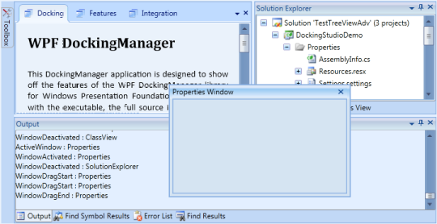

DockingManager with "Office2007Blue" Visual Style
{:.caption}

DockingManager with "Office2007Black" Visual Style
{:.caption}

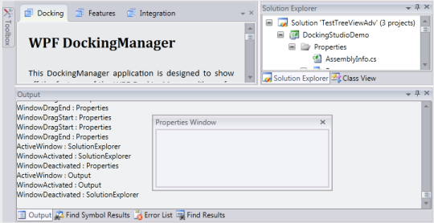

DockingManager with "Office2007Silver" Visual Style
{:.caption}

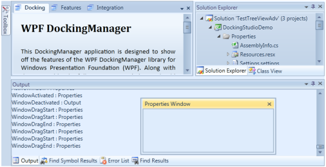

DockingManager with "Office2010Blue" Visual Style
{:.caption}

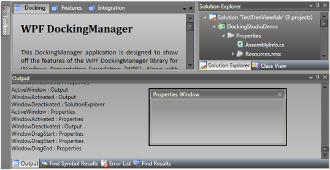

DockingManager with "Office2010Black" Visual Style
{:.caption}

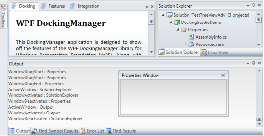

DockingManager with "Office2010Silver" Visual Style
{:.caption}

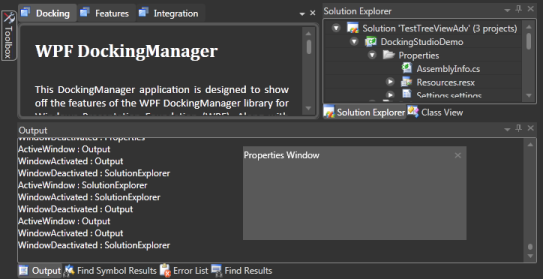

DockingManager with "Blend” Visual Style
{:.caption}

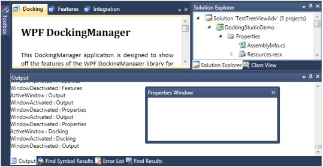

DockingManager with “VS2010” Visual Style
{:.caption}

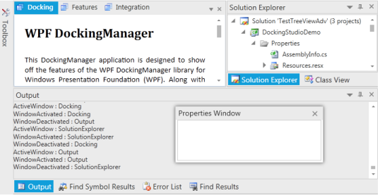

DockingManager with “Metro” Visual Style
{:.caption}

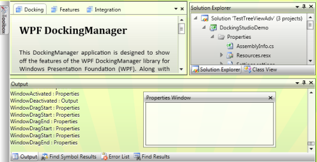

DockingManager with “Transparent” Visual Style
{:.caption}

## Hosting a Client Control

Our DockingManager control is completely integrated with MDI / TDI children elements. There are some situations wherein you need to disintegrate the MDI / TDI children from the DockingManager control. In such a case, you need to make use of the UseDocumentContainer property. This property gets or sets the Boolean value indicating whether to use the Document Container or not within the DockingManager. 

When this property is set to False, the MDI / TDI children will be disintegrated from the DockingManager control.

To create the document window in DockingManager, you need to set the state of the Docking Manager children element to document.State. This will create the TDI / MDI elements of the children.

By default, this property is set to true. Once the MDI / TDI children are not required, you need to set the UseDocumentContainer property to False.





<!--Declaring Docking Manager-->        

<syncfusion:DockingManager UseDocumentContainer="False">            

<!--Children for the Docking Manager-->            

<StackPanel syncfusion:DockingManager.Header="Element one" syncfusion:DockingManager.State="Dock"  syncfusion:DockingManager.SideInDockedMode="Left"/>        

</syncfusion:DockingManager>





//Creating the instance of the DockingManager.

DockingManager = new DockingManager();

// Disintegrating the MDI / TDI children from the DockingManager.

DockingManager.UseDocumentContainer = false;



 

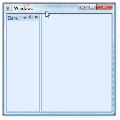

UseDocumentContainer = "False"
{:.caption}

In the above image, the Document Container is removed from the DockingManager control. When you remove the TDI / MDI children from the DockingManager, there will not be any client area for the other control. Now, to set the client area, you need to use a UI element called Client Control. You need to implement all your required client area data inside the Client Control. This will display in the client area of the DockingManager.

The below code snippet creates a client control for the DockingManager.



<!--Declaring Docking Manager-->

<syncfusion:DockingManager UseDocumentContainer="False">

	<syncfusion:DockingManager.ClientControl>

		<StackPanel Background="PeachPuff">

			<TextBlock Text="I am Client Area"/>

		</StackPanel>

	</syncfusion:DockingManager.ClientControl>

	<!--Children for the Docking Manager-->

	<StackPanel syncfusion:DockingManager.State="Dock" syncfusion:DockingManager.SideInDockedMode="Left"/>

	<StackPanel  syncfusion:DockingManager.State="Dock" syncfusion:DockingManager.SideInDockedMode="Top"/>

	<StackPanel syncfusion:DockingManager.State="Dock" syncfusion:DockingManager.SideInDockedMode="Right"/>

	<StackPanel syncfusion:DockingManager.State="Dock" syncfusion:DockingManager.SideInDockedMode="Bottom"/>

</syncfusion:DockingManager>



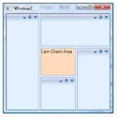

Client Control Created for the Docking Manager
{:.caption}

### Triggering Actions while closing the TDI / MDI items

In the DockingManager with MDI / TDI children, there will be every necessity to trigger some actions when you close the tabs. The following events are certainly very handy when you close the tabs.

* CloseButtonClick – This event is handled when you click the close button on the element in the Document state.





<!--Declaring Docking Manager with the close button click event-->   
     
<syncfusion:DockingManager  CloseButtonClick="DockingManager_CloseButtonClick">  
          
	<!--Adding Child for the Docking Manager-->  
	
		<StackPanel syncfusion:DockingManager.State="Document" syncfusion:DockingManager.SideInDockedMode="Left"/>        

		</syncfusion:DockingManager>
		




//Creating the instance of the DockingManager.

DockingManager = new DockingManager();

//Creating the event for the Close Button Click.

DockingManager.CloseButtonClick += new CloseButtonEventHandler(DockingManager_CloseButtonClick);



 

* CloseOtherTabs – Handled when you click on the CloseOtherTabs of the TDI window using the Tab Item Context Menu.

* CloseAllTabs - Handled when you click on the CloseAllTabs of the TDI window using the Tab Item Context Menu.





 <!--Declaring Docking Manager with Close AllTabs and CloseOtherTabs-->        
 
 <syncfusion:DockingManager CloseAllTabs="DockingManager_CloseAllTabs" CloseOtherTabs="DockingManager_CloseOtherTabs">            
	
	<!--Children for the Docking Manager-->            
	
	<StackPanel syncfusion:DockingManager.State="Document" syncfusion:DockingManager.SideInDockedMode="Left"/>
 
 </syncfusion:DockingManager>
 




//Creating the instance of the Docking Manager.

DockingManager = new DockingManager();

//Creating the event for the Close All Tabs.

DockingManager.CloseAllTabs += new OnCloseTabsEventHandler(DockingManager_CloseAllTabs);

//Creating the event for the Close Other Tabs.

DockingManager.CloseOtherTabs += new OnCloseTabsEventHandler(DockingManager_CloseOtherTabs);



 

## Using DockFill

The DockFill property is implemented to toggle the full screen mode. When dock windows are only present with no tabbed documents, there will be no free spaces left on the hosted form. After you change the dock state of any of the docked controls, the neighboring control will take up the newly freed space of the elements. When the dock windows and tabbed documents are present, all the dock windows will be auto-hidden and the tabbed documents alone will be visible. 

But now enabling this support will enhance the DockFill behavior to make the docked and tabbed documents visible when DockFill is set to True and the rest of the scenarios will work as per DockFill behavior.

### Use Case Scenarios

Using this feature, users can decide whether the docked windows should be automatically hidden as per default behavior or visible when DockFill is enabled and tabbed documents are present.

### Tables for Properties, Methods, and Events

#### Properties

<table>
<tr>
<th>
Property </th><th>
Description </th><th>
Type </th><th>
Data Type </th></tr>
<tr>
<td>
DockFillDocumentMode</td><td>
Useful for choosing the DockFillDocumentMode when DockFill is set to True.DockFillDocument Modes :
<ul>
<li>DockFillDocumentMode.Fill (default).</li>
<li>DockFillDocumentMode.Normal.</li>
</ul>
</td><td>
Dependency </td><td>
DockFillDocumentMode</td></tr>
</table>

### Sample Link

SystemDrive\Users\<user_name>\AppData\Local\Syncfusion\EssentialStudio\<Version_number>\ WPF\Tools.WPF\Samples\3.5\WindowsSamples\Docking Manager\Docking Demo

### Adding DockFillDocumentMode to an Application 

Users can decide whether the docked windows should be auto-hidden as per default behavior or be visible when DockFill is enabled and tabbed documents are present using the DockFillDocumentMode property. To make the docked and tabbed documents visible when DockFill is True, set this property to DockFillDocumentMode.Normal. To make the docked windows auto-hide while tabbed documents are visible when DockFill is True, set this property to DockFillDocumentMode.Fill. By default the value of the DockFillDocumentMode property is set to DockFillDocumentMode.Fill.

The following code snippet shows how to set values for the DockFillDocumentMode property: 





<syncfusion:DockingManager x:Name="dockingManager"DockFillDocumentMode="Normal" UseDocumentContainer="true" >

<!-- Product Showcase Window -->

<ListBox BorderThickness="0" Name="Parent1" syncfusion:DockingManager.State="Document"syncfusion:DockingManager.DesiredHeightInDockedMode="100"syncfusion:DockingManager.Header="Product Showcase" >

</ListBox>

<!-- Docking Manager Window-->

<ListBox BorderThickness="0" syncfusion:DockingManager.SideInDockedMode="Bottom" syncfusion:DockingManager.Header="Docking Manager" >

</ListBox>

</syncfusion:DockingManager >





this.dockingManager.DockFillDocumentMode =DockFillDocumentMode.Normal;



 

DockFillDocumentMode = “Normal” (when DockFill is set to True)
{:.caption}

## DataBinding Support in DockingManager

You can bind the custom object to the DataContext property of the DockingManager control, and their corresponding elements to the children of the DockingManager control. When a DataContext is set to a window or to a DockingManager, it gets inherited to all its logical children. The OnInitialized method is used to get the DataContext. As you use DataContext in the template with DataTriggers, you should set that property to active host tab or null.



<Window x:Class="WpfApplication17.Window1"

    xmlns="http://schemas.microsoft.com/winfx/2006/xaml/presentation"

    xmlns:x="http://schemas.microsoft.com/winfx/2006/xaml"

    Title="Window1"  xmlns:local="clr-namespace:WpfApplication17"

    xmlns:syncfusion="http://schemas.syncfusion.com/wpf">

            <Window.Resources>

                <!--Custom object which is defined in the code behind can be accessed through the key logic in XAML-->

                <local:Person x:Key="person" />

            </Window.Resources>

            <!--Setting the Data Context for the Docking Manager-->

            <syncfusion:DockingManager x:Name="DockingManager"   DataContext="{StaticResource person}" >

                <Border syncfusion:DockingManager.State="Dock" syncfusion:DockingManager.SideInDockedMode="Left">

                    <!--Setting the object to the dock window elements-->

                    <StackPanel Background="{Binding BackgroundBrush}">

                        <TextBlock Text="{Binding Name}" />

                        <TextBlock Text="{Binding Age}" />

                    </StackPanel>

                </Border>

            </syncfusion:DockingManager>

</Window>



### Custom object in the Code Behind



/// 

/// Interaction logic for the class person

/// 

public class Person

{

	/// 

	/// Initializes a new instance of the <see cref="Person"/> class.

	/// 

	public Person()

	{

		this.Name = "Tres";

		this.Age = 45;

		this.BackgroundBrush = Brushes.Red;

	}

	/// 

	/// Gets or sets the name.

	/// 

	/// <value>The name.</value>

	public string Name

	{

		get;

		set;

	}

	/// 

	/// Gets or sets the age.

	/// 

	/// <value>The age.</value>

	public int Age

	{

		get;

		set;

	}

	/// 

	/// Gets or sets the background brush.

	/// 

	/// <value>The background brush.</value>

	public Brush BackgroundBrush

	{

		get;

		set;

	}

}



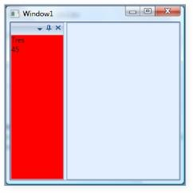

DataBinding Demo
{:.caption}                                           

## State Persistence in DockingManager

The DockingManager enables you to save the dock states of its elements and load it whenever required. It provides different methods to save the states of the elements. The following are the types of storing states for docking elements:

* XML with Binary Format 
* XML with SOAP Format 
* Binary with Binary Format 
* Binary with SOAP Format 
* Registry and 
* Isolated Storage 

### XML with Binary Format

The DockingManager enables you to save or load the states of the elements on an XML file in binary format. To save the state in XML using binary format, use the following code.



//Save state in XML using Binary Format.

BinaryFormatter formatter1 = new BinaryFormatter();

DocManager1.SaveDockState(formatter1, StorageFormat.Xml, @"C:\docking_xml.xml");

//Load state saved in XML using Binary Format.

BinaryFormatter formatter1 = new BinaryFormatter();

DocManager1.LoadDockState(formatter1, StorageFormat.Xml, @"c:\docking_xml.xml");



### XML with SOAP Format

You can save or load the states of the docking elements using an XML file in a SOAP format. To save the state in XML file using SOAP format, use the following code.



//Save state in XML using SOAP Format.

SoapFormatter formatter1 = new SoapFormatter();

DocManager1.SaveDockState(formatter1, StorageFormat.Xml, @"C:\docking_xml_soap.xml");

//Load state saved in XML using SOAP Format.

BinaryFormatter formatter1 = new BinaryFormatter();

DocManager1.LoadDockState(formatter1, StorageFormat.Xml, @"c:\docking_xml_soap.xml");


### Binary with Binary format

DockingManager also supports saving and loading the states of its elements in a binary file with binary format. To save or load using binary file with binary format, use the following code.



//Save state in Binary file using Binary Format.

BinaryFormatter formatter1 = new BinaryFormatter();

DocManager1.SaveDockState(formatter1, StorageFormat.Binary, @"c:\docking_bin.bin");

//Load state saved in Binary file using Binary Format.

BinaryFormatter formatter1 = new BinaryFormatter();

DocManager1.LoadDockState(formatter1, StorageFormat.Xml, @"c:\docking_bin.bin");


### Binary with SOAP Format

You can save or load the states of the docking elements from a binary file in SOAP format. To save or load the states of the elements from or to the binary file with SOAP format, use the following code. 



///Save state in Binary file using SOAP Format

SOAPFormatter formatter1 = new SOAPFormatter();

DocManager1.SaveDockState(formatter1, StorageFormat.Binary, @"c:\docking_bin.bin");

//Load state saved in Binary file using SOAP Format

SOAPFormatter formatter1 = new SOAPFormatter();

DocManager1.LoadDockState(formatter1, StorageFormat.Xml, @"c:\docking_bin.bin");



### Registry

You can save or load the States of the DockingManager elements from the registry. To save or load the states to or from the system registry respectively, use the following code.



//Save state in System Registry.

BinaryFormatter formatter1 = new BinaryFormatter();

DocManager1.SaveDockState(formatter1);

//Load state from System Registry.

BinaryFormatter formatter1 = new BinaryFormatter();

DocManager1.LoadDockState(formatter1);



### IsolatedStorage

You can save or load the states of the docking elements from the isolated storage. To save or load the states from the isolated storage, use the following code.



//Save state in Isolated Storage.

DocManager1.SaveDockState();

//Load state from Isolated Storage.

DocManager1.LoadDockState();



Refer Also

How to Clearing StatePersistance Entries

## Hosting Windows Form control in DockingManager

Hosting a Windows Form Host in DockingManager is an easy process for which you need to set UseIntropCompaitableMode=true in order to use Winform controls with in DockingManager. The following codes show how to use webbrowser control with in DockingManager.





<syncfusion:DockingManager DockFill="True" UseInteropCompatibilityMode="True">    
  
	<WebBrowser Name="web1"/>
	
</syncfusion:DockingManager>





//Navigating the webbrowser control defined in xaml to the given url.

web1.Navigate(new Uri("http://syncfusion.com"));



 

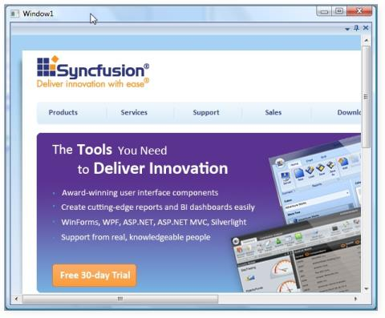

WebBrowser as child of DockingManager
{:.caption}

## Linked Manager Support

Linked Manager Support is an important feature that helps to drag and drop windows from one docking manager to any other docking manager.

Use Case Scenario

* This Drag and Drop support will enhance the Linked Manager functionality between Docking Managers.
* It permits the user to have better usability of any windows residing in any Docking Manager.

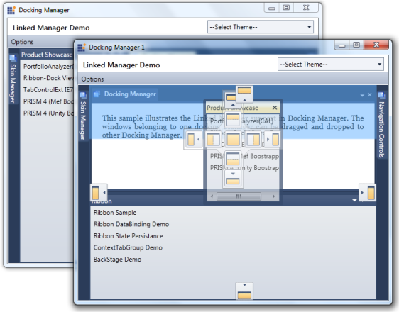

Linked Manager Support
{:.caption}

### Getting started

#### Samples Link

To view samples:

1. Click Start-->All Programs-->Syncfusion-->Essential Studio <version number> -->Dashboard. (Refer section 2.2)
2. In the Dashboard window, click Run Locally Installed Samples for WPF under User Interface Edition panel. 

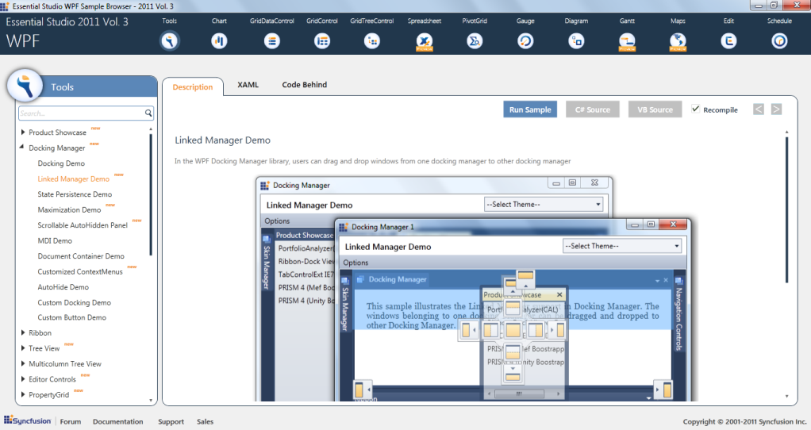

Sample Browser
{:.caption}

The WPF Sample Browser window is displayed.

### Properties, Methods and Events tables

#### Methods

<table>
<tr>
<th>
Method </th><th>
Description </th><th>
Parameters </th><th>
Type </th><th>
Return Type </th><th>
Reference links </th></tr>
<tr>
<td>
AddToTargetManagersList </td><td>
 Adds the DockingManager to the Target Providers List, belonging to the current manager. The parameter is, dockingmgr - docking manager to be added to the target list.</td><td>
 (DockingManager dockingmanager)</td><td>
NA</td><td>
void </td><td>
http://help.syncfusion.com/windowsforms/tools</td></tr>
<tr>
<td>
RemoveFromTargetManagersList</td><td>
Removes the DockingManager from the Target Providers List, belonging to the current manager. The parameter is,{{'_dockingmgr_'| markdownify }} - docking manager to be removed from the target list.</td><td>
(DockingManager dockingmanager)</td><td>
NA</td><td>
void </td><td>
http://help.syncfusion.com/windowsforms/tools</td></tr>
</table>

### Events

<table>
<tr>
<th>
Event </th><th>
Description </th><th>
Arguments </th><th>
Type </th><th>
Reference links </th></tr>
<tr>
<td>
TransferredToManager </td><td>
The TransferredToManager event occurs after a dockable control that previously belonged to some other Docking Manager has been transferred to the docking layout hosted by the current Docking Manager.</td><td>
DockingManager PreviousManager, FrameworkElement TargetElement, DockingManager TargetManager</td><td>
TransferManagerEventArgs</td><td>
http://help.syncfusion.com/windowsforms/tools</td></tr>
<tr>
<td>
TransferringFromManager </td><td>
The TransferringFromManager event occurs when a dockable control hosted by a Docking Manager is about to be transferred to the docking layout hosted by some other Docking Manager.</td><td>
DockingManager PreviousManager, FrameworkElement TargetElement, DockingManager TargetManager</td><td>
TransferManagerEventArgs</td><td>
http://help.syncfusion.com/windowsforms/tools</td></tr>
</table>

### Features of Linked Manager Support

### Adding DockingManager to TargetManagers List

To add DockingManager to TargetManagers List





//Control from one docking Manager to be transferred to another docking //manager

//dockingManager1 and dockingManager2 is the instance of DockingManager

this.dockingManager1.AddToTargetManagersList(dockingManager2);





'Control from one docking Manager to be transferred to another docking 'manager

'dockingManager1 and dockingManager2 is the instance of DockingManager

Me.dockingManager1.AddToTargetManagersList(dockingManager2)



 

### Removing DockingManager from TargetManagers List

To remove DockingManager from TargetManagers List





//Control from one docking Manager to be transferred to another docking //manager

//dockingManager1 and dockingManager2 is the instance of DockingManager

this.dockingManager1.RemoveFromTargetManagersList(dockingManager2);





'Control from one docking Manager to be transferred to another docking 'manager

'dockingManager1 and dockingManager2 is the instance of DockingManager

Me.dockingManager1.RemoveFromTargetManagersList(dockingManager2)



 

## Minimize/Maximize Support for Docked Windows

This feature helps to Maximize/Minimize Docked Windows for better usage of each window. This support is enabled only when the parent container of a specific element contains more than one host.

### Use Case Scenario

* It helps a particular docked window to provide a maximized view 
* It can minimize a docked window and can be restored when needed

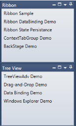

Minimise/Maximize Support
{:.caption}

#### Samples Link

To view samples:

1. Click Start-->All Programs-->Syncfusion-->Essential Studio <version number> -->Dashboard. (Refer section 2.2)
2. In the Dashboard window, click Run Locally Installed Samples for WPF under User Interface Edition panel. 

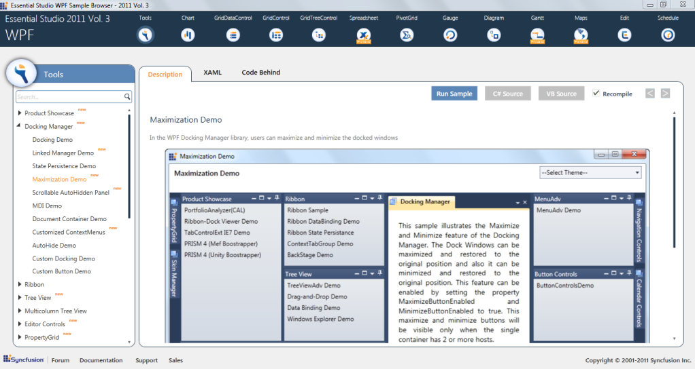

Sample Browser
{:.caption}

The WPF Sample Browser window is displayed.

### Properties, Methods and Events Tables

#### Properties

<table>
<tr>
<th>
Property </th><th>
Description </th><th>
Type </th><th>
Data Type </th></tr>
<tr>
<td>
MaximizeButtonEnabled</td><td>
This property will be used to enable or disable the maximization support in Docking Manager.</td><td>
Dependency </td><td>
bool</td></tr>
<tr>
<td>
MinimizeButtonEnabled</td><td>
This property will be used to enable or disable the minimization support in Docking Manager.</td><td>
Dependency</td><td>
bool</td></tr>
<tr>
<td>
CanMaximize</td><td>
This attached property will be used to enable or disable the maximization support for specific element</td><td>
Dependency Attached</td><td>
bool</td></tr>
<tr>
<td>
CanMinimize</td><td>
This attached property will be used to enable or disable the minimization support for specific element</td><td>
Dependency Attached</td><td>
bool</td></tr>
<tr>
<td>
MaximizeButtonTemplate</td><td>
This property will be used to customize the maximize button.</td><td>
Dependency</td><td>
ControlTemplate</td></tr>
<tr>
<td>
MinimizeButtonTemplate</td><td>
This property will be used to customize the minimize button.</td><td>
Dependency</td><td>
ControlTemplate</td></tr>
<tr>
<td>
DockWindowState</td><td>
This property will be used to represent the state of the maximized or minimized window.</td><td>
</td><td>
</td></tr>
</table>

### Features of Minimize/Maximize Support for Docked Windows

### Minimize /Maximize Property for Docked Windows:

When the docked window is maximized the DockWindowState property will be set as Maximised. The maximized DockWindow can be restored by clicking on the restore button.

When the docked window is minimized it will go to AutoHidden state and the DockWindowState property will be set as Minimized. The minimized docked window can be restored by clicking on minimized item header.





<syncfusion:DockingManager x:Name="dockingManager"  MaximizeButtonEnabled="True" MinimizeButtonEnabled="True">                

	<!--Ribbon Window--> 
				   
	<ListBox Name="ListBox3" syncfusion:DockingManager.CanClose="False" syncfusion:DockingManager.CanFloat="False"  syncfusion:DockingManager.DesiredWidthInDockedMode="200"  syncfusion:DocumentContainer.MDIBounds="30,30,300,300" syncfusion:DockingManager.DesiredHeightInFloatingMode="200"  syncfusion:DockingManager.Header="Ribbon" >
	 
		<ListBoxItem Margin="2,2,2,2">Ribbon Sample</ListBoxItem>  
		
		<ListBoxItem Margin="2,2,2,2">Ribbon DataBinding Demo</ListBoxItem> 
		
		<ListBoxItem Margin="2,2,2,2">Ribbon State Persistance</ListBoxItem> 
		
		<ListBoxItem Margin="2,2,2,2">ContextTabGroup Demo</ListBoxItem>  
		
		<ListBoxItem Margin="2,2,2,2">BackStage Demo</ListBoxItem>  
	
	</ListBox>
	
</syncfusion:DockingManager >





//enables the maximize and minimize feature

dockingManager.MaximizeButtonEnabled = true;

dockingManager.MinimizeButtonEnabled = true;



 

### CanMaximise/CanMinimize Support

If the default value is true, then maximize support is enabled. If the property value is false the maximize button will not be visible. If the property value is true the button will be visible.

### Full Screen Maximize for Docked Window

Support is available to add full-screen maximization for docked windows.

Using this feature, users can decide whether the docked windows should be maximized to full screen or normal size as per default behavior.

### Tables for Properties, Methods, and Events

#### Properties

<table>
<tr>
<th>
Property </th><th>
Description </th><th>
Type </th><th>
Data Type </th></tr>
<tr>
<td>
MaximizeMode</td><td>
Chooses the mode in which the docked window should be maximized.If the MaximizeMode is set to FullScreen, it will maximize the docked window respective to Docking Manager size.If the MaximizeMode is set to Default, it will maximize the docked window respective to its parent DockedElementsContainer size.</td><td>
Dependency </td><td>
MaximizeMode</td></tr>
</table>

#### Sample Link

SystemDrive\Users\<user_name>\AppData\Local\Syncfusion\EssentialStudio\<Version_number>\ WPF\Tools.WPF\Samples\3.5\WindowsSamples\Docking Manager\Maximization Demo

### Adding MaximizeMode to an Application 

The user can decide whether the docked windows should be maximized to full screen or normal size as per default behavior using the MaximizeMode property. To make the docked window maximize respective to the Docking Manager size, set this property to MaximizeMode.FullScreen. To make the docked window maximize respective to its parent DockedElementsContainer size, set this property to MaximizeMode.Default. By default the value of the MaximizeMode property is set to MaximizeMode.Default.

The following code snippet shows how to set values for the MaximizeMode property: 





<syncfusion:DockingManager x:Name="dockingManager"MaximizeButtonEnabled="true" MaximizeMode="FullScreen" >
	
	<!-- Product Showcase Window -->
	
	
	<ListBox BorderThickness="0" Name="Parent1" syncfusion:DockingManager.DesiredHeightInDockedMode="100"syncfusion:DockingManager.Header="Product Showcase" >
	
	</ListBox>
		
	<!-- Docking Manager Window-->
	
	<ListBox BorderThickness="0" syncfusion:DockingManager.SideInDockedMode="Bottom" syncfusion:DockingManager.Header="Docking Manager" >
	
	</ListBox>
	
</syncfusion:DockingManager >





this.dockingManager.MaximizeMode = MaximizeMode.FullScreen;



 

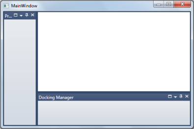

MaximizeMode = “FullScreen” (when MaximizedState is Normal)
{:.caption}

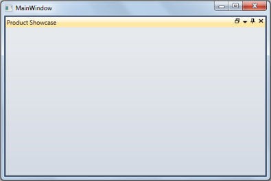

MaximizeMode = “FullScreen” (when MaximizedState is Maximized)
{:.caption}

## Excel like Scrollable View for AutoHidden Panel

This feature allows you to scroll and view the AutoHidden items without resizing the header of the tabs.

### Use Case Scenario

This feature helps the user to have a clear view of the AutoHidden items header without having to search or mouse over on each tab when the panel is resized to a smaller size.

{:.caption}

Excel-like Scrollable View
{:.caption}

#### Samples Link

To view samples:

1. Click Start-->All Programs-->Syncfusion-->Essential Studio <version number> -->Dashboard. (Refer section 2.2)
2. In the Dashboard window, click Run Locally Installed Samples for WPF under User Interface Edition panel. 

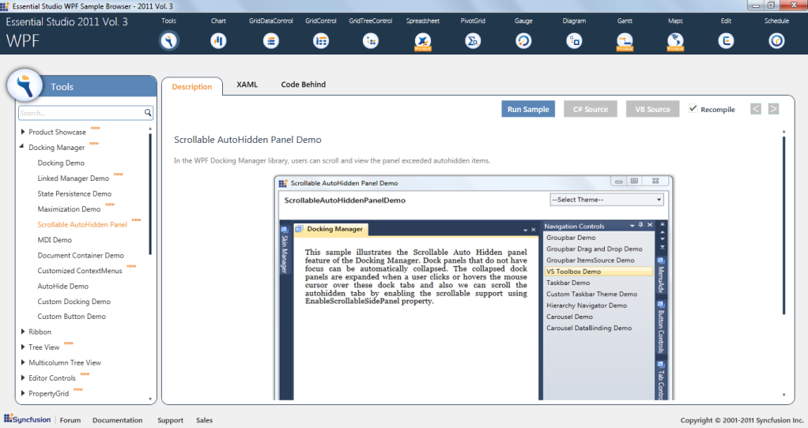

Sample Browser
{:.caption}

The WPF Sample Browser window is displayed.

#### Properties

<table>
<tr>
<th>
Property </th><th>
Description </th><th>
Type </th><th>
Data Type </th></tr>
<tr>
<td>
EnableScrollableSidePanel</td><td>
This property will be used to enable or disable the scroll support for AutoHidden items.</td><td>
Dependency</td><td>
bool</td></tr>
<tr>
<td>
ScrollButtonMode</td><td>
Gets or sets the behavior of the Scroll button whether to display it always or make it appears dimmed when the scroll bar reaches beginning or ending point.</td><td>
Dependency</td><td>
Enum, Normal, Extended</td></tr>
<tr>
<td>
ScrollButtonsBarStyle</td><td>
Gets or sets style for customizing the scrolling panel.</td><td>
Dependency</td><td>
Style</td></tr>
</table>

### Features of Excel like Scrollable View

### To enable scroll support for AutoHidden items

The Scroll support helps to provide a clear view of the AutoHidden items without having to mouse over and search the items.





<syncfusion:DockingManager x:Name="dockingManager" EnableScrollableSidePanel="True">    
            
	<!-- Product Showcase Window -->    
				
	<ListBox BorderThickness="0" syncfusion:DockingManager.SideInDockedMode="Bottom"   syncfusion:DockingManager.State="AutoHidden"   syncfusion:DockingManager.Header="Product Showcase" >                    

		<ListBoxItem Margin="2,2,2,2">PortfolioAnalyzer(CAL)</ListBoxItem>  
						  
		<ListBoxItem Margin="2,2,2,2">Ribbon-Dock Viewer Demo</ListBoxItem> 
						   
		<ListBoxItem Margin="2,2,2,2">TabControlExt IE7 Demo</ListBoxItem> 
						   
		<ListBoxItem Margin="2,2,2,2">PRISM 4 (Mef Boostrapper)</ListBoxItem>  
						  
		<ListBoxItem Margin="2,2,2,2">PRISM 4 (Unity Boostrapper)</ListBoxItem>  
				  
	</ListBox> 
				   
	<!-- Docking Manager Window-->  
				  
	<ListBox BorderThickness="0"  syncfusion:DockingManager.SideInDockedMode="Bottom"   syncfusion:DockingManager.State="AutoHidden"  syncfusion:DockingManager.Header="Docking Manager" >                    

		<ListBoxItem Margin="2,2,2,2">Docking Demo</ListBoxItem>   
						 
		<ListBoxItem Margin="2,2,2,2">MDI Demo</ListBoxItem>   
						 
		<ListBoxItem Margin="2,2,2,2">AutoHide Demo</ListBoxItem>  
						  
		<ListBoxItem Margin="2,2,2,2">State Persistance Demo</ListBoxItem> 
						   
		<ListBoxItem Margin="2,2,2,2">Custom Docking Demo</ListBoxItem>
							
		<ListBoxItem Margin="2,2,2,2">Custom Button Demo</ListBoxItem> 
						   
		<ListBoxItem Margin="2,2,2,2">Mac-Style Demo</ListBoxItem> 
						   
		<ListBoxItem Margin="2,2,2,2">Document Container Demo</ListBoxItem>    
						
		<ListBoxItem Margin="2,2,2,2">VS2010 Demo</ListBoxItem>   
				 
	</ListBox> 

</syncfusion:DockingManager >





//enables the scrollable autohidden feature

dockingManager.EnableScrollableSidePanel = true; 



 

### Customization of Scroll Buttons

In the DockingManager control, the scrolling panel can be set in a side panel and its style can be customized using the ScrollButtonBarStyle property. You can use the ScrollButtonMode property to change the behavior of the scroll button. Setting the ScrollButtonMode property as Normal will enable the scrolling panel and show the scroll button only when scrolling. Setting this property as Extended will make the scroll button appears dimmed when the scroll bar reaches the beginning or ending point.

The following code example explains how to set the scroll button in normal mode.





  <syncfusion:DockingManager x:Name="dockingManager"     EnableScrollableSidePanel="True"    UseDocumentContainer="True"     ScrollButtonMode="Normal"    ScrollButtonsBarStyle="{StaticResource CustomScrollPanelStyle}"/>





dockingManager.ScrollButtonsBarStyle = App.Current.Resources["CustomScrollPanelStyle"] as Style;  

dockingManager.ScrollButtonMode = ScrollingButtonMode.Normal;  

dockingManager.UseDocumentContainer = true; 

dockingManager.EnableScrollableSidePanel = true;
  


 

## Support for Resizing Only the Element around the Splitter

When a container is resized with use of a splitter, all children elements that reside inside the container get resized proportionally according to their desired sizes. By enabling this support we can resize only the elements that share common splitters, not all the elements inside the container.

### Use Case Scenarios

Using this feature, users can restrict resize for all the elements inside the container where the container contains two or more child elements.

#### Properties

<table>
<tr>
<th>
Property </th><th>
Description </th><th>
Type </th><th>
Data Type </th></tr>
<tr>
<td>
ContainerSplitterResize</td><td>
Used to enable the needed resize mode. The resize modes are:AllChildren—The default mode which will resize all elements in the container proportionally.EdgeChildren—Enables the resize of only the elements that share the common splitters.</td><td>
Dependency</td><td>
SplitterResizeMode</td></tr>
</table>

#### Sample Link

SystemDrive\Users\<user_name>\AppData\Local\Syncfusion\EssentialStudio\<Version_number>\ WPF\Tools.WPF\Samples\3.5\WindowsSamples\Docking Manager\Docking Demo

### Adding ContainerSplitterResize mode to an Application 

The user can resize only the elements that share common splitters using the ContainerSplitterResize property. To resize only the elements that share common splitters, set this property to SplitterResizeMode.EdgeChildren. To resize all the elements inside the container, set this property to SplitterResizeMode.AllChildren. By default the ContainerSplitterResize property is set to SplitterResizeMode.AllChildren.

The following code snippet shows how to set values for the ContainerSplitterResize property: 





<syncfusion:DockingManager x:Name="dockingManager"ContainerSplitterResize="EdgeChildren">

	<!-- Product Showcase Window -->

	<ListBox BorderThickness="0" Name="Parent1" syncfusion:DockingManager.Header="Product Showcase" >

	</ListBox>

	<!-- Docking Manager Window-->

	<ListBox BorderThickness="0" syncfusion:DockingManager.TargetNameInDockedMode="Parent1"syncfusion:DockingManager.SideInDockedMode="Bottom" syncfusion:DockingManager.Header="Docking Manager" >

	</ListBox>

	<!-- Ribbon Window-->

	<ListBox BorderThickness="0" Name="Parent2"syncfusion:DockingManager.TargetNameInDockedMode="Parent1"syncfusion:DockingManager.SideInDockedMode="Right" syncfusion:DockingManager.Header="Ribbon" >

	</ListBox>

	<!-- TreeView Window--><ListBox BorderThickness="0" syncfusion:DockingManager.TargetNameInDockedMode="Parent2"syncfusion:DockingManager.SideInDockedMode="Bottom" syncfusion:DockingManager.Header="TreeView" >

	</ListBox>

</syncfusion:DockingManager >





this.dockingManager.ContainerSplitterResize=SplitterResizeMode.EdgeChildren;



 

## Support to add Absolute DockFillMode

Support for adding absolute sizing for initial load of child elements residing inside the Docking Manager.

### Use Case Scenarios

Using this feature, users can decide whether the child elements should load initially as absolute size or default proportional size.

#### Properties

<table>
<tr>
<th>
Property </th><th>
Description </th><th>
Type </th><th>
Data Type </th></tr>
<tr>
<td>
DockFillMode</td><td>
Chooses the DockFill mode.DockFill Modes:DockFillModes.Default.DockFillModes.Absolute.</td><td>
Dependency attached</td><td>
DockFillModes</td></tr>
</table>

### Adding DockFillMode to an Application 

Users can decide whether child elements should load initially with an absolute size or a default proportional size using the DockFillMode property. To load the elements with an absolute size initially, set this attached property to DockFillModes.Absolute. To load the elements with default proportional sizing relative to the DockingManager size, set this attached property to DockFillModes.Default. By default the value of the DockFillMode property’s values is set to DockFillModes.Default.

The following code snippet shows how to set values for the DockFillMode property: 





<syncfusion:DockingManager x:Name="dockingManager">

	<!-- Product Showcase Window -->

	<ListBox BorderThickness="0" Name="Parent1" syncfusion:DockingManager.DockFillMode="Absolute"syncfusion:DockingManager.DesiredHeightInDockedMode="100"syncfusion:DockingManager.Header="Product Showcase" >

	</ListBox>

	<!-- Docking Manager Window-->

	<ListBox BorderThickness="0" syncfusion:DockingManager.SideInDockedMode="Bottom" syncfusion:DockingManager.Header="Docking Manager" >

	</ListBox>

</syncfusion:DockingManager >





DockingManager.SetDockFillMode(Parent1, DockFillModes.Absolute);



 
