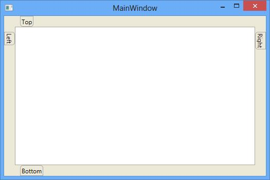
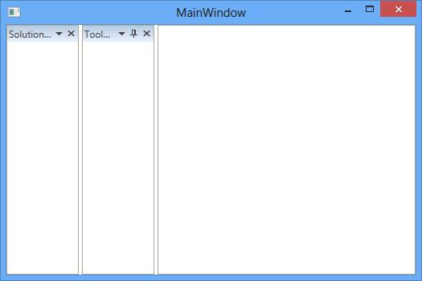

## Auto Hide Window

AutoHide window is one of the states in the DockingManager. To enable Autohidden for DockingManager's children, set its **State** value **as** **AutoHidden**. 

### Configuring window in Different Side

AutoHidden window can be placed in four different sides such as Top, Bottom, Left, and Right. To place the four autohidden children in four different sides, set **SideInDockedMode** property according to its corresponding values in the DockingManager.


<ContentControl x:Name="AutoHideWindow1"

syncfusion:DockingManager.Header="Top”                                                    syncfusion:DockingManager.State="AutoHidden”                                                  syncfusion:DockingManager.SideInDockedMode="Top”></ContentControl>

<ContentControl x:Name="AutoHideWindow2" syncfusion:DockingManager.Header="Left"                                                   syncfusion:DockingManager.State="AutoHidden”                                                   syncfusion:DockingManager.SideInDockedMode="Left"></ContentControl>

<ContentControl x:Name="AutoHideWindow3" syncfusion:DockingManager.Header=" Right "                                         syncfusion:DockingManager.State="AutoHidden"

syncfusion:DockingManager.SideInDockedMode="Right"></ContentControl>

<ContentControl x:Name="AutoHideWindow4" syncfusion:DockingManager.Header=" Bottom"

syncfusion:DockingManager.State="AutoHidden"

syncfusion:DockingManager.SideInDockedMode="Bottom"></ContentControl>



The AutoHidewindow can be placed according to the TargetName through the property **TargetNameInDockedMode** property of the DockingManager.  When you enable autohide in dockingwindow , it is autohidden in the place according to its Parent position. For instance, when the parent is in left side, by default, the autohide window is placed in the left side, irrespective of its SideInDockedMode value.



<syncfusion:DockingManager >

<ContentControl x:Name="AutoHideWindow1" syncfusion:DockingManager.Header="SolutionExplorer" 

></ContentControl>

<ContentControl x:Name="AutoHideWindow2" syncfusion:DockingManager.Header="Server Explorer"

syncfusion:DockingManager.SideInDockedMode="Bottom"                       

syncfusion:DockingManager.TargetNameInDockedMode="AutoHideWindow1"></ContentControl>

<ContentControl x:Name="AutoHideWindow3" syncfusion:DockingManager.Header="ToolBox" 

syncfusion:DockingManager.SideInDockedMode="Right"

syncfusion:DockingManager.TargetNameInDockedMode="AutoHideWindow1"></ContentControl>

<ContentControl  x:Name="AutoHideWindow4" syncfusion:DockingManager.Header="Output"      

syncfusion:DockingManager.SideInDockedMode="Bottom"

syncfusion:DockingManager.TargetNameInDockedMode="AutoHideWindow1"></ContentControl>

<ContentControl  x:Name="AutoHideWindow5" syncfusion:DockingManager.Header="Properties"         

syncfusion:DockingManager.SideInDockedMode="Tabbed"

syncfusion:DockingManager.TargetNameInDockedMode="AutoHideWindow1"></ContentControl>

</syncfusion:DockingManager>



###  Side panel Customization

The side panel and side panel header can be customized by applying its background, borderbrush and  borderthickness  through  **SidePanelBackground , SidePanelBorderBrush ,SidePanelBorderThickness, SideItemBackground and SideItemBorderBrush** properties of the DockingManager.



<syncfusion:DockingManager x:Name="DockingManager" SidePanelBackground="Brown" SidePanelBorderBrush="Yellow" SidePanelBorderThickness="2,2,2,2" SideItemsBackground="Green" SideItemsBorderBrush="BlueViolet"  >

<ContentControl syncfusion:DockingManager.Header="SolutionExplorer"

syncfusion:DockingManager.State="AutoHidden"

></ContentControl>

<ContentControl syncfusion:DockingManager.Header="ToolBox"         

></ContentControl>

</syncfusion:DockingManager>



#### SideTabItem Customization

The SideTabItem can be customized using the attached properties **SideTabItemForeground** and **SideTabItemBackground**  of DockingManager.



<syncfusion:DockingManager x:Name="DockingManager"  >

<ContentControl syncfusion:DockingManager.Header="SolutionExplorer"

syncfusion:DockingManager.State="AutoHidden"

syncfusion:DockingManager.SideTabItemForeground="Blue"

syncfusion:DockingManager.SideTabItemBackground="Pink"

></ContentControl>

</syncfusion:DockingManager>



### Excel-like Scrollable panel

The **EnableScrollableSidePanel** feature is used to provide scroll support when Auto Hidden tab items overflow onto the side panel.  By default, its value is **False**,to enable this feature you can set its value to **True**.



<syncfusion:DockingManager x:Name="dockingManager" EnableScrollableSidePanel="True">
        <ContentControl 

                     syncfusion:DockingManager.SideInDockedMode="Bottom"
                     syncfusion:DockingManager.State="AutoHidden"
                     syncfusion:DockingManager.Header="SolutionExplorer" />

        <ContentControl                          
                         syncfusion:DockingManager.SideInDockedMode="Bottom"
                         syncfusion:DockingManager.State="AutoHidden"
                         syncfusion:DockingManager.Header="ToolBox"/>
        <ContentControl 

                        syncfusion:DockingManager.SideInDockedMode="Bottom"
                        syncfusion:DockingManager.State="AutoHidden"
                       syncfusion:DockingManager.Header="Output" />

        <ContentControl
                                   
          syncfusion:DockingManager.SideInDockedMode="Bottom"
          syncfusion:DockingManager.State="AutoHidden"
          syncfusion:DockingManager.Header="Class view" />

        <ContentControl

           syncfusion:DockingManager.SideInDockedMode="Bottom"
           syncfusion:DockingManager.State="AutoHidden"
           syncfusion:DockingManager.Header="Server Explorer" />

        <ContentControl
                                   
         syncfusion:DockingManager.SideInDockedMode="Bottom"
         syncfusion:DockingManager.State="AutoHidden"
         syncfusion:DockingManager.Header="Team Explorer" />

        <ContentControl

           syncfusion:DockingManager.SideInDockedMode="Bottom"
           syncfusion:DockingManager.State="AutoHidden"
           syncfusion:DockingManager.Header="ErrorList" />

      </syncfusion:DockingManager >



### Changing pinning behavior        

Auto Hidden Tabbed window provides two different pinning behaviors, **AutoHideActive** and **AutoHideGroup** modes.

**AutoHideActive** – Used to Auto Hide current active element of tabbed dock window.


<syncfusion:DockingManager x:Name="DockingManager" AutoHideTabsMode="AutoHideActive">

<ContentControl syncfusion:DockingManager.Header="SolutionExplorer"

></ContentControl>

<ContentControl syncfusion:DockingManager.Header="ToolBox"         

></ContentControl>

<ContentControl syncfusion:DockingManager.Header="Output"         

></ContentControl>

</syncfusion:DockingManager>



**AutoHideGroup** – Used to auto-hide the entire tabbed dock window as a group.


<syncfusion:DockingManager x:Name="DockingManager" AutoHideTabsMode="AutoHideGroup">

<ContentControl syncfusion:DockingManager.Header="SolutionExplorer"

></ContentControl>

<ContentControl syncfusion:DockingManager.Header="ToolBox"         

></ContentControl>

<ContentControl syncfusion:DockingManager.Header="Output"         

></ContentControl>

</syncfusion:DockingManager>



### Configuring Auto Hide Animation

The Animation speed while Auto Hiding a window can be configured by setting required time delay to **AnimationDelay** property.



<ContentControl syncfusion:DockingManager.Header="item1"                                       syncfusion:DockingManager.State="AutoHidden" syncfusion:DockingManager.AnimationDelay="100"/>



#### Making different animation for AutoHideWindow

DockingManager supports three different built–in animations while auto-hiding the windows such as **Fade, scale, and  slide** that can be set through the property **AutoHideAnimationMode**.

* **Fade** – AutoHidewindow fades while autohiding



<syncfusion:DockingManager AutoHideAnimationMode="Fade">

<ContentControl x:Name="AutoHideWindow" syncfusion:DockingManager.Header="SolutionExplorer"                                                                                                    syncfusion:DockingManager.State="AutoHidden” ></ContentControl>

</syncfusion:DockingManager>



* **Scale** –AutoHidewindow  scale while autohiding



<syncfusion:DockingManager AutoHideAnimationMode="Scale">

<ContentControl x:Name="AutoHideWindow" syncfusion:DockingManager.Header="SolutionExplorer"                                                                                                    syncfusion:DockingManager.State="AutoHidden">

</ContentControl>

</syncfusion:DockingManager>



* **Slide** – AutoHidewindow slides while autohiding.



<syncfusion:DockingManager AutoHideAnimationMode="Slide">

<ContentControl x:Name="AutoHideWindow" syncfusion:DockingManager.Header="SolutionExplorer"                                                                                                   syncfusion:DockingManager.State="AutoHidden"

></ContentControl>

</syncfusion:DockingManager>



### Enabling and disabling the Autohide functionality

The Pin button that performs Auto Hide functionality, can be visible by default. It can be invisible to disable the AutoHide functionality through **AutoHideVisibility** property. 



<syncfusion:DockingManager  AutoHideVisibility="False">

<ContentControl x:Name="AutoHideWindow" syncfusion:DockingManager.Header="SolutionExplorer"                                                   

></ContentControl>             

</syncfusion:DockingManager>



To enable or disable the Autohide functionality for a specific child in the DockingManager, an attached property **CanAutoHide** is used. By default its value is **true**, to disable this functionality you can set its value to **false**.



<ContentControl x:Name="AutoHideWindow1" syncfusion:DockingManager.Header="SolutionExplorer"                                                                                                   syncfusion:DockingManager.CanAutoHide="False"

></ContentControl>

<ContentControl x:Name="AutoHideWinodw2" syncfusion:DockingManager.Header="ToolBox"                                                   syncfusion:DockingManager.CanAutoHide="True"></ContentControl>



### AutoHide Animation enabled on Mouse Click

On mouse over the AutoHidden tab, the autohide animation starts. To disable this functionality, set the property **IsAnimationEnabledOnMouseOver** as **False** that allows you to click the autohide tab to start autohide animation. By default, its values is **True**.



<syncfusion:DockingManager IsAnimationEnabledOnMouseOver="False">

<ContentControl x:Name="AutoHideWindow1" syncfusion:DockingManager.Header="SolutionExplorer"

syncfusion:DockingManager.State="AutoHidden"

></ContentControl>

</syncfusion:DockingManager>



### Pinning / UnPinning All Window

To autohide all docked windows in the DockingManager, call **AutoHideAllDockWindow** method of the Docking Manager.



DockingManager. AutoHideAllDockWindow();



To unpin all autohide windows in the DockingManager, call **UnPinAllAutoHide** method of the Docking Manager.



[C#]

DockingManager.UnPinAllAutoHide();



