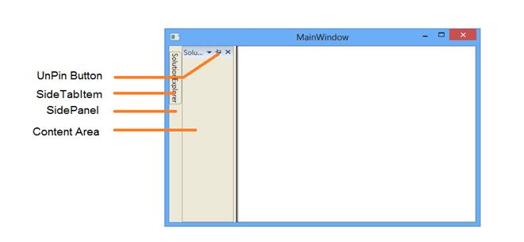
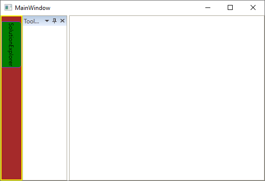

# Auto Hide Window

AutoHide window is one of the state in the DockingManager. To enable Auto hidden for DockingManager's children, set its `State` value as `AutoHidden`.

## Configuring window in Different Side

AutoHidden window can be placed in four different sides such as Top, Bottom, Left and Right. To place the four auto hidden children in four different sides, set [SideInDockedMode](https://help.syncfusion.com/cr/wpf/Syncfusion.Tools.Wpf~Syncfusion.Windows.Tools.Controls.DockItem~SideInDockedMode.html) property according to its corresponding values in the DockingManager.



<ContentControl syncfusion:DockingManager.Header="Top” x:Name="AutoHideWindow1"
                syncfusion:DockingManager.State="AutoHidden” syncfusion:DockingManager.SideInDockedMode="Top” />

<ContentControl syncfusion:DockingManager.Header="Left" x:Name="AutoHideWindow2"
                syncfusion:DockingManager.State="AutoHidden” syncfusion:DockingManager.SideInDockedMode="Left" />

<ContentControl syncfusion:DockingManager.Header="Right" x:Name="AutoHideWindow3"
                syncfusion:DockingManager.State="AutoHidden" syncfusion:DockingManager.SideInDockedMode="Right" />

<ContentControl syncfusion:DockingManager.Header="Bottom" x:Name="AutoHideWindow4"
                syncfusion:DockingManager.State="AutoHidden" syncfusion:DockingManager.SideInDockedMode="Bottom" />





//To place the auto hidden children in four different sides

DockingManager.SetSideInDockedMode(AutoHideWindow1, DockSide.Top);

DockingManager.SetSideInDockedMode(AutoHideWindow2, DockSide.Left);

DockingManager.SetSideInDockedMode(AutoHideWindow3, DockSide.Right);

DockingManager.SetSideInDockedMode(AutoHideWindow4, DockSide.Bottom);





The AutoHideWindow can be placed on a required target window through the [TargetNameInDockedMode](https://help.syncfusion.com/cr/wpf/Syncfusion.Tools.Wpf~Syncfusion.Windows.Tools.Controls.DockItem~TargetNameInDockedMode.html) property of the DockingManager. DockingWindow will auto hidden in place according to its Parent position, if any target exist. For example: Here "Output" docked at bottom of "SolutionExplorer" which docked at left side. While auto hiding Output window, it will auto hide at left due to it's TargetWindow side.





<syncfusion:DockingManager>

<ContentControl syncfusion:DockingManager.Header="SolutionExplorer" x:Name="SolutionExplorer"/>

<ContentControl x:Name="ServerExplorer" syncfusion:DockingManager.Header="Server Explorer"
                syncfusion:DockingManager.SideInDockedMode="Bottom"
                syncfusion:DockingManager.TargetNameInDockedMode="SolutionExplorer" />

<ContentControl x:Name="ToolBox" syncfusion:DockingManager.Header="ToolBox"
                syncfusion:DockingManager.SideInDockedMode="Right"
                syncfusion:DockingManager.TargetNameInDockedMode="SolutionExplorer" />

<ContentControl x:Name="Output" syncfusion:DockingManager.Header="Output"
                syncfusion:DockingManager.SideInDockedMode="Bottom"
                syncfusion:DockingManager.TargetNameInDockedMode="SolutionExplorer" />

<ContentControl x:Name="Properties" syncfusion:DockingManager.Header="Properties"
                syncfusion:DockingManager.SideInDockedMode="Tabbed"
                syncfusion:DockingManager.TargetNameInDockedMode="SolutionExplorer" />

</syncfusion:DockingManager>





DockingManager.SetSideInDockedMode(ServerExplorer, DockSide.Bottom);

DockingManager.SetTargetNameInDockedMode(ServerExplorer, "SolutionExplorer");

DockingManager.SetSideInDockedMode(ToolBox, DockSide.Right);

DockingManager.SetTargetNameInDockedMode(ToolBox, "SolutionExplorer");

DockingManager.SetSideInDockedMode(Output, DockSide.Bottom);

DockingManager.SetTargetNameInDockedMode(Output, "SolutionExplorer");

DockingManager.SetSideInDockedMode(Properties, DockSide.Tabbed);

DockingManager.SetTargetNameInDockedMode(Properties, "SolutionExplorer");





## Side panel Customization

The side panel and side panel header can be customized by applying its Background, BorderBrush, BorderThickness and SidePanelSize through [SidePanelBackground](https://help.syncfusion.com/cr/wpf/Syncfusion.Tools.Wpf~Syncfusion.Windows.Tools.Controls.DockingManager~SidePanelBackground.html), [SidePanelBorderBrush](https://help.syncfusion.com/cr/wpf/Syncfusion.Tools.Wpf~Syncfusion.Windows.Tools.Controls.DockingManager~SidePanelBorderBrush.html), [SidePanelBorderThickness](https://help.syncfusion.com/cr/wpf/Syncfusion.Tools.Wpf~Syncfusion.Windows.Tools.Controls.DockingManager~SidePanelBorderThickness.html),  [SidePanelSize](https://help.syncfusion.com/cr/wpf/Syncfusion.Tools.Wpf~Syncfusion.Windows.Tools.Controls.DockingManager~SidePanelSize.html) properties of the DockingManager. You can also refer to this [sample](https://github.com/SyncfusionExamples/How-to-customize-the-auto-hide-window-of-the-docking-manager.git) which demonstrate the side panel customization.





<syncfusion:DockingManager SidePanelBackground="Brown"
                           SidePanelBorderBrush="Yellow" SideItemsBackground="Green"
                           SidePanelBorderThickness="2,2,2,2" SideItemsBorderBrush="BlueViolet" SidePanelSize="40">

<ContentControl syncfusion:DockingManager.Header="SolutionExplorer" syncfusion:DockingManager.State="AutoHidden" />

<ContentControl syncfusion:DockingManager.Header="ToolBox" />

</syncfusion:DockingManager>




			
//Set Customization colors

SyncDockingManager.SidePanelBackground = new SolidColorBrush(Colors.Brown);

SyncDockingManager.SidePanelBorderBrush = new SolidColorBrush(Colors.Yellow);

SyncDockingManager.SideItemsBackground = new SolidColorBrush(Colors.Green);

SyncDockingManager.SideItemsBorderBrush = new SolidColorBrush(Colors.Violet);

SyncDockingManager.SidePanelBorderThickness = new Thickness(2, 2, 2, 2);

SyncDockingManager.SidePanelSize = 40;





### SideTabItem Customization

The SideTabItem can be customized using the attached properties [SideTabItemForeground](https://help.syncfusion.com/cr/wpf/Syncfusion.Tools.Wpf~Syncfusion.Windows.Tools.Controls.DockItem~SideTabItemForeground.html) and [SideTabItemBackground](https://help.syncfusion.com/cr/wpf/Syncfusion.Tools.Wpf~Syncfusion.Windows.Tools.Controls.DockItem~SideTabItemBackground.html) of DockingManager. 





<syncfusion:DockingManager x:Name="DockingManager">

<ContentControl syncfusion:DockingManager.Header="SolutionExplorer" syncfusion:DockingManager.State="AutoHidden"
                syncfusion:DockingManager.SideTabItemForeground="Blue" syncfusion:DockingManager.SideTabItemBackground="Pink"/>

</syncfusion:DockingManager>





//SideTabItem customization  

DockingManager.SetSideTabItemBackground(content1, (new SolidColorBrush(Colors.Pink)));
			
DockingManager.SetSideTabItemForeground(content1, (new SolidColorBrush(Colors.Blue)));





## Excel-like Scrollable panel

The [EnableScrollableSidePanel](https://help.syncfusion.com/cr/wpf/Syncfusion.Tools.Wpf~Syncfusion.Windows.Tools.Controls.DockingManager~EnableScrollableSidePanel.html) feature is used to provide scroll support when Auto Hidden tab items overflow onto the side panel.  By default [EnableScrollableSidePanel](https://help.syncfusion.com/cr/wpf/Syncfusion.Tools.Wpf~Syncfusion.Windows.Tools.Controls.DockingManager~EnableScrollableSidePanel.html) value is `False`, this feature can be enabled by set its value to `True`.





<syncfusion:DockingManager x:Name="dockingManager" EnableScrollableSidePanel="True">

<ContentControl syncfusion:DockingManager.SideInDockedMode="Bottom"
                syncfusion:DockingManager.State="AutoHidden" syncfusion:DockingManager.Header="SolutionExplorer"/>

<ContentControl syncfusion:DockingManager.SideInDockedMode="Bottom"
                syncfusion:DockingManager.State="AutoHidden" syncfusion:DockingManager.Header="ToolBox"/>

<ContentControl syncfusion:DockingManager.SideInDockedMode="Bottom"
                syncfusion:DockingManager.State="AutoHidden" syncfusion:DockingManager.Header="Output" />

<ContentControl syncfusion:DockingManager.SideInDockedMode="Bottom"
                syncfusion:DockingManager.State="AutoHidden" syncfusion:DockingManager.Header="Class view" />

<ContentControl syncfusion:DockingManager.SideInDockedMode="Bottom"
                syncfusion:DockingManager.State="AutoHidden" syncfusion:DockingManager.Header="Server Explorer" />

<ContentControl syncfusion:DockingManager.SideInDockedMode="Bottom"
                syncfusion:DockingManager.State="AutoHidden" syncfusion:DockingManager.Header="Team Explorer" />

<ContentControl syncfusion:DockingManager.SideInDockedMode="Bottom"
                syncfusion:DockingManager.State="AutoHidden" syncfusion:DockingManager.Header="ErrorList" />

</syncfusion:DockingManager >





//For Scroll Support

dockingManager.EnableScrollableSidePanel = true;





## Changing pinning behavior

Auto Hidden Tabbed window provides two different pinning behaviors AutoHideActive and AutoHideGroup modes.

`AutoHideActive` – Used to auto-hide current active element of tabbed dock window.





<syncfusion:DockingManager x:Name="dockingManager" AutoHideTabsMode="AutoHideActive">

<ContentControl syncfusion:DockingManager.Header="SolutionExplorer" />

<ContentControl syncfusion:DockingManager.Header="ToolBox" />

<ContentControl syncfusion:DockingManager.Header="Output"  />

</syncfusion:DockingManager>





//To auto-hide current active element of tabbed dock window

dockingManager.AutoHideTabsMode = AutoHideTabsMode.AutoHideActive;





`AutoHideGroup` – Used to auto-hide the entire tabbed dock window as a group.





<syncfusion:DockingManager x:Name="dockingManager" AutoHideTabsMode="AutoHideGroup">

<ContentControl syncfusion:DockingManager.Header="SolutionExplorer" />

<ContentControl syncfusion:DockingManager.Header="ToolBox" />

<ContentControl syncfusion:DockingManager.Header="Output" />

</syncfusion:DockingManager>





//To auto-hide current active element of tabbed dock window
		
dockingManager.AutoHideTabsMode = AutoHideTabsMode.AutoHideGroup;





### Configuring Auto Hide Animation

The Animation speed while auto hiding a window can be configured by setting required time delay in [AnimationDelay](https://help.syncfusion.com/cr/wpf/Syncfusion.Tools.Wpf~Syncfusion.Windows.Tools.Controls.DockItem~AnimationDelay.html) property.





<ContentControl syncfusion:DockingManager.Header="item1"
                syncfusion:DockingManager.State="AutoHidden" syncfusion:DockingManager.AnimationDelay="100"/>





//Set Animation delay

Docking.SetAnimationDelay(autoHideWindow1, new Duration(TimeSpan.FromMilliseconds(100)));





### Making different animation for AutoHideWindow

DockingManager supports three different built–in animations while auto-hiding the windows such as `Fade`, `scale` and `slide` that can be set through the property [AutoHideAnimationMode](https://help.syncfusion.com/cr/wpf/Syncfusion.Tools.Wpf~Syncfusion.Windows.Tools.Controls.DockingManager~AutoHideAnimationMode.html).

`Fade` – AutoHideWindow fades while auto hiding





<syncfusion:DockingManager AutoHideAnimationMode="Fade">

<ContentControl syncfusion:DockingManager.Header="SolutionExplorer" syncfusion:DockingManager.State="AutoHidden” />

</syncfusion:DockingManager>





//Set AnimationMode

Docking.AutoHideAnimationMode = AutoHideAnimationMode.Fade;





`Scale` – AutoHideWindow scale while auto hiding





<syncfusion:DockingManager AutoHideAnimationMode="Scale">

<ContentControl syncfusion:DockingManager.Header="SolutionExplorer" syncfusion:DockingManager.State="AutoHidden"/>

</syncfusion:DockingManager>





//Set AnimationMode

Docking.AutoHideAnimationMode = AutoHideAnimationMode.Scale;





`Slide` – AutoHideWindow slides while auto hiding.





<syncfusion:DockingManager AutoHideAnimationMode="Slide">

<ContentControl syncfusion:DockingManager.Header="SolutionExplorer"  syncfusion:DockingManager.State="AutoHidden"/>

</syncfusion:DockingManager>





//Set AnimationMode

Docking.AutoHideAnimationMode = AutoHideAnimationMode.Slide;





## Enabling and disabling the AutoHide functionality

The Pin button that performs Auto Hide functionality can be visible by default. It can be invisible to disable the AutoHide functionality through [AutoHideVisibility](https://help.syncfusion.com/cr/wpf/Syncfusion.Tools.Wpf~Syncfusion.Windows.Tools.Controls.DockingManager~AutoHideVisibility.html) property.





<syncfusion:DockingManager  AutoHideVisibility="False">

<ContentControl x:Name="AutoHideWindow" syncfusion:DockingManager.Header="SolutionExplorer"/>

</syncfusion:DockingManager>





//Set Visibility

SyncDockingManager.AutoHideVisibility = false;





To enable or disable the AutoHide functionality for a specific child in the DockingManager, [CanAutoHide](https://help.syncfusion.com/cr/wpf/Syncfusion.Tools.Wpf~Syncfusion.Windows.Tools.Controls.DockItem~CanAutoHide.html) can be used. By default its value is `true`, this functionality can disable by set its value as `false`.





<ContentControl syncfusion:DockingManager.Header="SolutionExplorer" syncfusion:DockingManager.CanAutoHide="False" />

<ContentControl syncfusion:DockingManager.Header="ToolBox" syncfusion:DockingManager.CanAutoHide="True" />





//Disable the Auto hide functionality

DockingManager.SetCanAutoHide(SolutionExplorer, false);

//Enable the Auto hide functionality

DockingManager.SetCanAutoHide(ToolBox, true);





## Change AutoHide behavior like Visual Studio 2013

AutoHide panel open and close behavior can be changed as Visual Studio 2013. SidePanel can be opened by click on SideTabItem and already opened side panel can be closed by again click on the same item.  This behavior of DockingManager can be enabled by setting its [IsVs2013SidePanelEnable](https://help.syncfusion.com/cr/wpf/Syncfusion.Tools.Wpf~Syncfusion.Windows.Tools.Controls.DockingManager~IsVS2013SidePanelEnable.html) property to `True` and [IsAnimationEnabledOnMouseOver](https://help.syncfusion.com/cr/wpf/Syncfusion.Tools.Wpf~Syncfusion.Windows.Tools.Controls.DockingManager~IsAnimationEnabledOnMouseOver.html) property to `False`. 





<syncfusion:DockingManager x:Name="Docking1"
                           IsAnimationEnabledOnMouseOver="False"
						   IsVS2013SidePanelEnable="True" >

<ContentControl syncfusion:DockingManager.Header="Content1"
                syncfusion:DockingManager.State="AutoHidden"   />

<ContentControl syncfusion:DockingManager.Header="Content2"
                syncfusion:DockingManager.State="AutoHidden"   />

</syncfusion:DockingManager>





DockingManager Docking1 = new DockingManager();

Docking1.IsAnimationEnabledOnMouseOver = false;

Docking1.IsVS2013SidePanelEnable = true;

ContentControl _content1 = new ContentControl();

DockingManager.SetHeader(_content1, "Content1");

DockingManager.SetState(_content1, DockState.AutoHidden);

ContentControl _content2 = new ContentControl();

DockingManager.SetHeader(_content2, "Content2");

DockingManager.SetState(_content2, DockState.AutoHidden);

Docking1.Children.Add(_content1);

Docking1.Children.Add(_content2);

Grid1.Children.Add(Docking1);





Dim Docking1 As DockingManager =  New DockingManager() 

Docking1.IsAnimationEnabledOnMouseOver = False

Docking1.IsVS2013SidePanelEnable = True

Dim _content1 As ContentControl =  New ContentControl() 

DockingManager.SetHeader(_content1, "Content1")

DockingManager.SetState(_content1, DockState.AutoHidden)

Dim _content2 As ContentControl =  New ContentControl() 

DockingManager.SetHeader(_content2, "Content2")

DockingManager.SetState(_content2, DockState.AutoHidden)

Docking1.Children.Add(_content1)

Docking1.Children.Add(_content2)

Grid1.Children.Add(Docking1)





## AutoHide Animation enabled on Mouse Click

On mouse over the AutoHidden tab, the auto hide animation starts. To disable this functionality, set the property [IsAnimationEnabledOnMouseOver](https://help.syncfusion.com/cr/wpf/Syncfusion.Tools.Wpf~Syncfusion.Windows.Tools.Controls.DockingManager~IsAnimationEnabledOnMouseOver.html) as `False` that changes the auto hide tab start animation behavior. By default, its values is `True`.





<syncfusion:DockingManager IsAnimationEnabledOnMouseOver="False">

<ContentControl x:Name="AutoHideWindow1"
                syncfusion:DockingManager.Header="SolutionExplorer"
                syncfusion:DockingManager.State="AutoHidden" />

</syncfusion:DockingManager>





SyncDockingManager.IsAnimationEnabledOnMouseOver = false;





## Pinning / UnPinning All Window

To auto hide all docked windows in the DockingManager, call [AutoHideAllDockWindow](https://help.syncfusion.com/cr/wpf/Syncfusion.Tools.Wpf~Syncfusion.Windows.Tools.Controls.DockingManager~AutoHideAllDockWindow.html) method of the Docking Manager.





DockingManager.AutoHideAllDockWindow();





DockingManager.AutoHideAllDockWindow();





To unpin all auto hide windows in the DockingManager, call [UnPinAllAutoHide](https://help.syncfusion.com/cr/wpf/Syncfusion.Tools.Wpf~Syncfusion.Windows.Tools.Controls.DockingManager~UnPinAllAutoHide.html) method of the Docking Manager.





DockingManager.UnPinAllAutoHide();





DockingManager.UnPinAllAutoHide();





