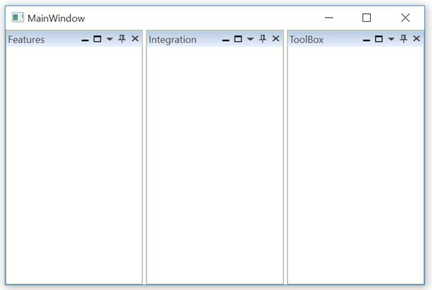
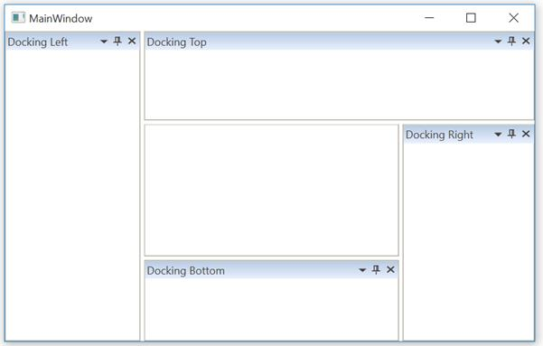
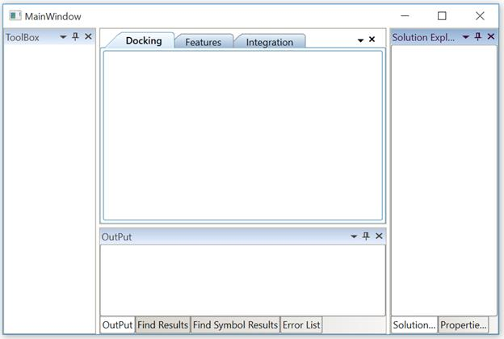

# Data Binding

Data Binding is the process of establishing a connection between the application UI and business logic. Data Binding can be unidirectional (Source -> Target or Target -> Source) or bidirectional (Source &lt;-&gt; target). 

## Adding Docking Window child through ItemsSource:

`DockingManager` `ItemsSource` property allows to bind the Observable Collection of `DockItem`. `DockItem` class which contains all attached properties of `DockingManager`.

The following code snippet explains how to use the `ItemsSource` property





<syncfusion:DockingManager  x:Name="docking"  ItemsSource="{Binding DockCollections }" />





DockingManager docking = new DockingManager();

docking.ItemsSource = DockCollections;





Adding `DockItem` to collection:





public partial class MainWindow : Window

{

public MainWindow()

{

InitializeComponent();

DockCollections = new ObservableCollection<DockItem>();

DockCollections.Add(new DockItem() { Header = "ToolBox"});

DockCollections.Add(new DockItem() { Header = "Integration"});

DockCollections.Add(new DockItem() { Header = "Features"});

this.DataContext = this;

}

private ObservableCollection<DockItem> _dockcollection;

public ObservableCollection<DockItem> DockCollections

{

get

{

return _dockcollection;

}

set

{

_dockcollection = value;

}

}

}





## Docking Window in Different side

We have docked the docking child window in five sides these are,

* Left
* Right 
* Top
* Bottom
* Tabbed

To dock the children of `DockingManager` in different side, use `SideInDockMode` mode property of `DockItem` class.





DockCollections.Add(new DockItem() { Header = "Docking Left", SideInDockedMode = DockSide.Left });

DockCollections.Add(new DockItem() { Header = "Docking Top", SideInDockedMode = DockSide.Top });

DockCollections.Add(new DockItem() { Header = "Docking Right",SideInDockedMode=DockSide.Right });

DockCollections.Add(new DockItem() { Header = "Docking Bottom", SideInDockedMode = DockSide.Bottom });





## Configure the Docking window through ItemsSource

Docking window can also be docked at any side of the Target Docking Window through an attached property named `TargetNameInDockedMode`

Also to set as Tabbed Window, the window should aware of a `DockItem` Name of corresponding target window. The following code helps to arrange children of `DockingManager` that targets a single Docking window docked along Left, Top, Right and Tabbed.

N> The following code snippet explains how to use all attached properties of `DockingManager` using `DockItem` class.





DockCollections = new ObservableCollection<DockItem>();

DockCollections.Add(new DockItem() { Header = "ToolBox", State = DockState.Dock, DesiredWidthInDockedMode = 300d });

DockCollections.Add(new DockItem() { Header = "Integration", State = DockState.Document});

DockCollections.Add(new DockItem() { Header = "Features",  State = DockState.Document });

DockCollections.Add(new DockItem() { Header = "Docking", State = DockState.Document});

DockCollections.Add(new DockItem() { Header = "Solution Explorer", Name = "solution", State = DockState.Dock, SideInDockedMode = DockSide.Right, DesiredWidthInDockedMode = 300d });

DockCollections.Add(new DockItem() { Header = "Properties Window", Name = "Properties", State = DockState.Dock, SideInDockedMode = DockSide.Tabbed, TargetNameInDockedMode = "solution" });

DockCollections.Add(new DockItem() { Header = "OutPut", Name = "Output", State = DockState.Dock, SideInDockedMode = DockSide.Bottom,DesiredHeightInDockedMode=200d});

DockCollections.Add(new DockItem() { Header = "Error List", State = DockState.Dock, SideInDockedMode = DockSide.Tabbed, TargetNameInDockedMode = "Output"});

DockCollections.Add(new DockItem() { Header = "Find Symbol Results", State = DockState.Dock, SideInDockedMode = DockSide.Tabbed, TargetNameInDockedMode = "Output"});

DockCollections.Add(new DockItem() { Header = "Find Results", State = DockState.Dock, SideInDockedMode = DockSide.Tabbed, TargetNameInDockedMode = "Output"});





