# Dealing with Windows

## Activating a window

A particular child window can be activated in DockingManager using its name or reference through the property `ActiveWindow` and `ActivateWindow` method that passes the element as argument to activate.





DockingManager1.ActiveWindow = Content1;

DockingManager1.ActivateWindow("Content1");





DockingManager1.ActiveWindow = Content1

DockingManager1.ActivateWindow("Content1") 





## Adding Window Programmatically

Any UI element can be added inside the DockingManager as its child windows. The windows is added as Dock windows, since the default value of the state is `Dock`.  The UI element is added in the DockingManager using the `Add` method of the Children property of the DockingManager.

For example, ContentControl is added as a window for DockingManager





DockingManager DockingManager1 = new DockingManager();

ContentControl content1 = new ContentControl();

DockingManager.SetHeader(content1,"Window1");

ContentControl content2 = new ContentControl();

DockingManager.SetHeader(content2,"Window2");

ContentControl content3 = new ContentControl();

DockingManager.SetHeader(content3, "Window3");

ContentControl content4 = new ContentControl();

DockingManager.SetHeader(content4,"Window4");

ContentControl content5 = new ContentControl();

DockingManager.SetHeader(content5,"window5");

DockingManager1.Children.Add(content1);

DockingManager1.Children.Add(content2);

DockingManager1.Children.Add(content3);

DockingManager1.Children.Add(content4);

DockingManager1.Children.Add(content5);





Dim DockingManager1 As New DockingManager()

Dim content1 As New ContentControl()

DockingManager.SetHeader(content1, "Window1")

Dim content2 As New ContentControl()

DockingManager.SetHeader(content2, "Window2")

Dim content3 As New ContentControl()

DockingManager.SetHeader(content3, "Window3")

Dim content4 As New ContentControl()

DockingManager.SetHeader(content4, "Window4")

Dim content5 As New ContentControl()

DockingManager.SetHeader(content5, "window5")

DockingManager1.Children.Add(content1)

DockingManager1.Children.Add(content2)

DockingManager1.Children.Add(content3)

DockingManager1.Children.Add(content4)

DockingManager1.Children.Add(content5) 





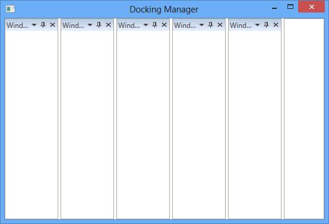

### Setting State for Window programmatically

The state for the particular child window can be set programmatically using the `SetState` method of DockingManager.





DockingManager.SetState(content1, DockState.Float);





DockingManager.SetState(content1, DockState.Float) 





* Setting state as Document – To create document window in the DockingManager, set UseDocumentContainer as True for DockingManager and set its state as Document.





DockingManager1.UseDocumentContainer = true;
DockingManager.SetState(content1, DockState.Document);





DockingManager1.UseDocumentContainer = True
DockingManager.SetState(content1, DockState.Document)





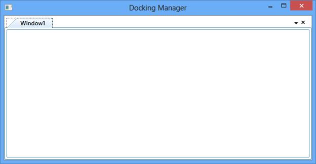

* Setting state as AutoHidden





DockingManager.SetState(content1, DockState.AutoHidden);





DockingManager.SetState(content1, DockState.AutoHidden)





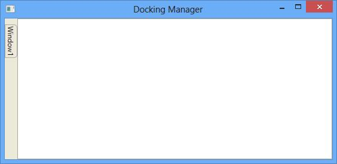

#### Making Window AutoHide programatically

To autohide the window programmatically call `ExecuteAutoHide` method of DockingManager.





DockingManager1.ExecuteAutoHide(Content1);





DockingManager1.ExecuteAutoHide(Content1)





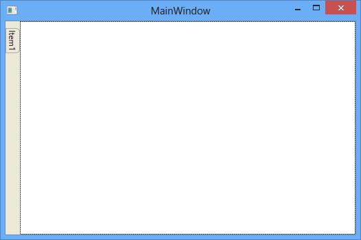

#### Making Window Float and Document programmatically

The docking window can be made to float and document using the SetState method with its DockState value as `Float` and `Document` respectively





//to make the content1 float 

DockingManager.SetState(Content1, DockState.Float);

//to make the content1 as Document window

DockingManager.SetState(Content1, DockState.Document);





'to make the content1 float 

DockingManager.SetState(Content1, DockState.Float)

'to make the content1 as Document window

DockingManager.SetState(Content1, DockState.Document)





## Hiding Window Programmatically

To hide the window, set `State` property of the DockingManager as `Hidden`.





DockingManager.SetState(Content1, DockState.Hidden);





DockingManager.SetState(Content1, DockState.Hidden)





To hide the window programatically, call the `ExecuteClose` method with argument which refer the window need to be close.





//Hide the element that passed as argument
DockingManager1.ExecuteClose(Content1); 
  




'Hide the element that passed as argument
DockingManager1.ExecuteClose(Content1)





## Restore Window Programmatically

To restore the closed window in the DockingManager, call `ExecuteRestore` method.





//Restore the passed element with the state value as its argument

DockingManager1.ExecuteRestore(Content1, DockState.Float); 





'Restore the passed element with the state value as its argument

DockingManager1.ExecuteRestore(Content1, DockState.Float) 





## Removing Window Programmatically

The windows for the Dockingmanager can be added using the Children collection. To remove the windows from the children collection, pass the window element that need to be remove using `Remove()` method of children property in DockingManager.





DockingManager dockingmanager  = new DockingManager();

ContentControl content1 = new ContentControl();

DockingManager.SetHeader(content1, "Dockwindow");

ContentControl content2 = new ContentControl();

DockingManager.SetHeader(content2,"Dockwindow2");

dockingmanager.Children.Add(content1);

dockingmanager.Children.Add(content2);

//The following code describes how to remove the child window programatically using the remove method.

dockingmanager.Children.Remove(content2);

Grid1.Children.Add(dockingmanager);





Dim dockingmanager As New DockingManager()

Dim content1 As New ContentControl()

DockingManager.SetHeader(content1, "Dockwindow")

Dim content2 As New ContentControl()

DockingManager.SetHeader(content2,"Dockwindow2")

dockingmanager.Children.Add(content1)

dockingmanager.Children.Add(content2)

'The following code describes how to remove the child window programatically using the remove method.

dockingmanager.Children.Remove(content2)

Grid1.Children.Add(dockingmanager) 





## Restricting Docking in Float Window

The float window allows to dock another float window inside it by default. This behavior can be restricted by set `CanDockOnFloat` as False for that particular window.



<syncfusion:DockingManager x:Name="DockingManager1">

<ContentControl syncfusion:DockingManager.Header="Item1"
                syncfusion:DockingManager.State="Float"
                syncfusion:DockingManager.CanDockonFloat="False"/>  

</syncfusion:DockingManager>



## Restricting Docking by Drag Providers

DockingManager allows to dock the children in different sides using the DragProviders. To restrict dockability of the dock children to any particular side, set the property `Dockability` with the required values.

* Setting Dockability as Horizontal – Restrict the children to dock only on Horizontal side by providing the Horizontal Drag providers.



<syncfusion:DockingManager>
	
<ContentControl syncfusion:DockingManager.Header="Document1" syncfusion:DockingManager.DockAbility="Horizontal">
	
</ContentControl>

</syncfusion:DockingManager>



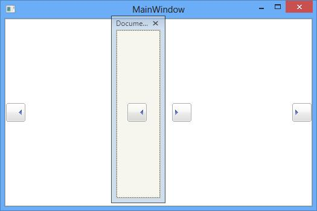

* Setting Dockability as Vertical  – Restrict the children to dock only on Vertical side by providing the Vertical Drag providers



<syncfusion:DockingManager >

<ContentControl syncfusion:DockingManager.Header="Document1" syncfusion:DockingManager.DockAbility="Vertical">

</ContentControl>

</syncfusion:DockingManager>



## Customizing a window

A Docking window can be customized using the property HeaderBackground, SelectedHeaderBackground, HeaderMouseHoverbackground with the desired brush values respectively.


<syncfusion:DockingManager SelectedHeaderBackground="Red" HeaderBackground="Brown" HeaderMouseOverBackground="DarkOrchid"  >

<ContentControl syncfusion:DockingManager.Header="Dock"/>

<ContentControl syncfusion:DockingManager.Header="Dock1"/>                

<ContentControl syncfusion:DockingManager.Header="Dock2"/>            

</syncfusion:DockingManager> 



## Customizing FloatWindow

The float window can be customized by setting FloatWindowHeaderBackground, FloatWindowHeaderForeground, FloatWindowSelectedHeaderBackground, FloatWindowSelectedBorderBrush and FloatWindowMouseOverHeaderBackground properties with the required brush values respectively.



<syncfusion:DockingManager FloatWindowHeaderBackground="Brown" FloatWindowHeaderForeground="Blue"
                           FloatWindowMouseOverBorderBrush="Orange" FloatWindowSelectedHeaderBackground="pink"
                           FloatWindowBorderBrush="Red" FloatWindowSelectedBorderBrush="BlueViolet" >

<ContentControl syncfusion:DockingManager.Header="Float" syncfusion:DockingManager.State="Float"/>

<ContentControl syncfusion:DockingManager.Header="Float1" syncfusion:DockingManager.State="Float"/>

<ContentControl syncfusion:DockingManager.Header="Float2" syncfusion:DockingManager.State="Float"/>

</syncfusion:DockingManager>



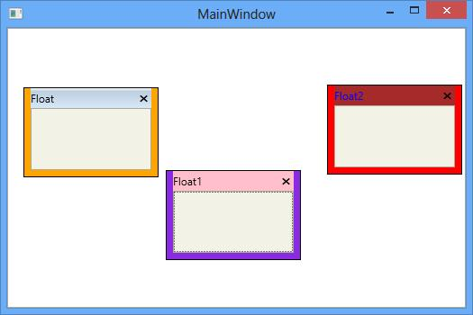

## Enable/Disable Dragging a Window

The attached property `CanDrag` that helps to enable or disable the dragging functionality of a window by setting its value as True or False respectively. By default its value is `True`, to disable this functionality turn its value to `False`.



<syncfusion:DockingManager x:Name="DockingManager1" >      

<ContentControl syncfusion:DockingManager.Header="Item1" syncfusion:DockingManager.CanDrag="False"/>                     

</syncfusion:DockingManager>



## Drag Shadow of a Window

To drag child window in Shadow mode, set the DraggingType property of DockingManager as `ShadowDragging`.


<syncfusion:DockingManager x:Name="DockingManager1" DraggingType="ShadowDragging"  >      

<ContentControl syncfusion:DockingManager.Header="Item1"/>

</syncfusion:DockingManager>



## Drag Border of a Window

To drag child window in Border mode, set the DraggingType property of DockingManager as `BorderDragging`.



<syncfusion:DockingManager x:Name="DockingManager1" DraggingType="BorderDragging">
	
<ContentControl syncfusion:DockingManager.Header="Item1"/>    

</syncfusion:DockingManager>


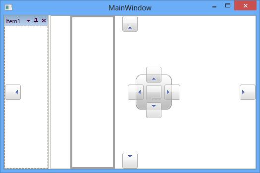

## Customizing a resizing behaviors

DockingManager allows to resize the dock and float windows by default. To restrict resizing the dock and float windows respectively, set the `CanResizeInDockedState` and `CanResizeInFloatState` properties with it value as False.



<syncfusion:DockingManager x:Name="DockingManager1">

<ContentControl syncfusion:DockingManager.Header="Dockwindow" x:Name="Content1"
	            syncfusion:DockingManager.State="Dock" syncfusion:DockingManager.CanResizeInDockedState="False"/>

<ContentControl syncfusion:DockingManager.Header="Floatwindow" x:Name="Content2"
                syncfusion:DockingManager.State="Float" syncfusion:DockingManager.CanResizeInFloatState="False"/>    

</syncfusion:DockingManager>



###  Width resizing restriction 

To restrict resizing width for the Dock windows set the property `CanResizeWidthInDockedMode` and `CanResizeWidthInFloatState` as False.



<ContentControl syncfusion:DockingManager.Header="Dockwindow" x:Name="Content1"
                syncfusion:DockingManager.State="Dock" syncfusion:DockingManager.CanResizeWidthInDockedState="False"/>

<ContentControl syncfusion:DockingManager.Header="Floatwindow" x:Name="Content2"
                syncfusion:DockingManager.State="Float" syncfusion:DockingManager.CanResizeWidthInFloatState="False"/>



### Height resizing restriction

To restrict resizing the height for the float and dock window respectively, set the property `CanResizeHeightInFloatstate` and `CanResizeHeightInDockedState` as False.


<ContentControl syncfusion:DockingManager.Header="Dockwindow" x:Name="Content1"
                syncfusion:DockingManager.State="Dock" syncfusion:DockingManager.CanResizeHeightInDockedState="False"/>

<ContentControl syncfusion:DockingManager.Header="Floatwindow" x:Name="Content2"
                syncfusion:DockingManager.State="Float" syncfusion:DockingManager.CanResizeHeightInFloatState="False"/>



### Setting MaxWidth and MaxHeight for Window

To set the desired maximum width for the float and dock windows respectively, set their properties `DesiredMaxWidthInDockedMode` and `DesiredMaxWidthInFloatingMode` with the desired values.



<ContentControl syncfusion:DockingManager.Header="Dockwindow"
                syncfusion:DockingManager.State="Dock" syncfusion:DockingManager.DesiredMaxWidthInDockedMode="1000"/>

<ContentControl syncfusion:DockingManager.Header="Floatwindow"
                syncfusion:DockingManager.State="Float" syncfusion:DockingManager.DesiredMaxWidthInFloatingMode="600"/>                     



To set the maximum height for the float and dock windows respectively, set their properties `DesiredMaxHeightInDockedMode` and `DesiredMaxHeightInFloatingMode` with the desired values.


<ContentControl syncfusion:DockingManager.Header="Dockwindow"
                syncfusion:DockingManager.State="Dock" syncfusion:DockingManager.DesiredMaxHeightInDockedMode="300"/>

<ContentControl syncfusion:DockingManager.Header="Floatwindow"
                syncfusion:DockingManager.State="Float" syncfusion:DockingManager.DesiredMaxHeightInFloatingMode="200"/>



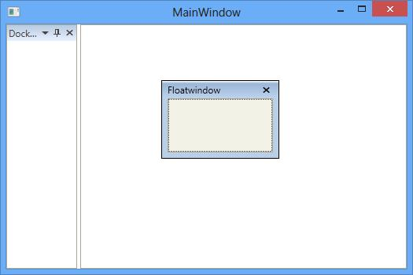

## Configuring window sizing

DockingManager allows to set the desired width and height for the dock windows. The window `Width` and `Height` value set to "90" based on the container by default.

### Desire height and width

The desired height and width can be set for the Dock windows through the property `DesiredwidthInDockedMode` and `DesiredHeightInDockedMode`  with the desired values.



<syncfusion:DockingManager x:Name="DockingManager1">  

<ContentControl syncfusion:DockingManager.Header="Item1"
                syncfusion:DockingManager.DesiredHeightInDockedMode="400"
                syncfusion:DockingManager.DesiredWidthInDockedMode="300"/>             

</syncfusion:DockingManager>



### Sizing Based on the Content

To size the float window based on the children window size, set the property `SizeToContentInFloat` property for the child window as True. By default, its value is False.



<ContentControl syncfusion:DockingManager.Header="Item1" x:Name="Content1"
                syncfusion:DockingManager.SizetoContentInFloat="True" Width="100" Height="24"/>             



To size the Dock window based on the children window size, set the property `SizeToContentInDock` property for the child window as True. By default, its value is False.


<syncfusion:DockingManager x:Name="DockingManager1" >

<ContentControl syncfusion:DockingManager.Header="Item1" x:Name="Content1"
                syncfusion:DockingManager.SizetoContentInDock="True" Width="100" Height="24"/>

</syncfusion:DockingManager>



### Absolute Sizing on Dock to fill

To load the child window initially with an absolute size, set the property DockFillMode as `Absolute`. By default, the child window loaded with the default size and it can be set through DockFillMode as `Default` also.



<ContentControl syncfusion:DockingManager.Header="Item1"  
                syncfusion:DockingManager.DockFillMode="Absolute"/>



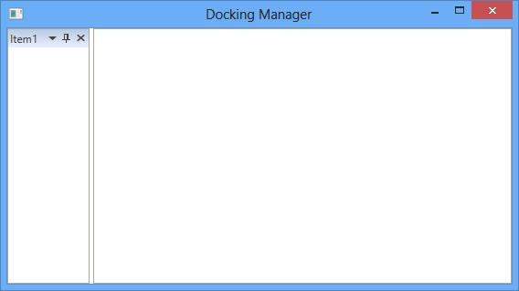

### Customizing the Splitter appearance

The Splitter of the dock window can be customized using the SplitterSize and SplitterBackground properties depends upon its values respectively. 



<syncfusion:DockingManager UseDocumentContainer=" True" SplitterBackground="Brown" SplitterSize="10" > 

<ContentControl syncfusion:DockingManager.Header="Item1"></ContentControl>

</syncfusion:DockingManager>



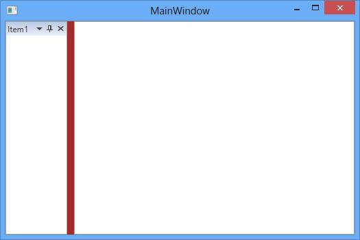

## Occupy whole window

To arrange the dock windows to a whole available space in the DockingManager, set `DockFill` property of DockingManager as True. 



<syncfusion:DockingManager DockFill="True">        

<ContentControl syncfusion:DockingManager.Header="Item1"/>             

</syncfusion:DockingManager>



And when DockFill functionality is enabled, DockingManager changes the Dockwindow to AutoHidden state, if any Document state window is present .



<syncfusion:DockingManager UseDocumentContainer="True" DockFill="True">        

<ContentControl syncfusion:DockingManager.Header="Item1"/>   

<ContentControl syncfusion:DockingManager.Header="Item1" syncfusion:DockingManager.State="Document"/> 

</syncfusion:DockingManager>



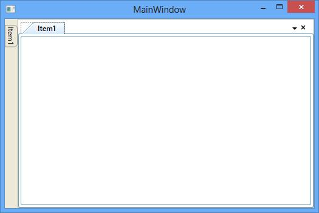

### Restrict DockWindow to AutoHide while DockFill

To restrict the behavior of changing the Dockwindow to AutoHide when DockFill is True, set the property `DockFillDocumentMode` as Normal.


<syncfusion:DockingManager x:Name="DockingManager1" UseDocumentContainer="True" DockFill="True" DockFillDocumentMode="Normal">        

<ContentControl x:Name="Content1" syncfusion:DockingManager.Header="Item1"/>   

<ContentControl x:Name="Content2" syncfusion:DockingManager.Header="Item2"
                                  syncfusion:DockingManager.State="Document"/> 

</syncfusion:DockingManager>



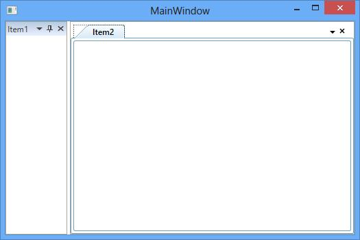

## Applying Context Menu

DockingManager allows to add  CustomContextMenuItems for Dock and Float windows through an attached property `CustomMenuItems`. 



<syncfusion:DockingManager x:Name="DockingManager1">  
	
<syncfusion:DockingManager.CustomMenuItems>
	
<syncfusion:CustomMenuItemCollection>
	
<syncfusion:CustomMenuItem Header="CustomItem1"/>
	
<syncfusion:CustomMenuItem Header="CustomItem2"/>
	
</syncfusion:CustomMenuItemCollection>

</syncfusion:DockingManager.CustomMenuItems>    

<ContentControl syncfusion:DockingManager.Header="Item1"/> 
	               
</syncfusion:DockingManager>



### Adding CustomContextMenuItems to Document window

The custom context menu items can be added in addition to default contextmenu items for the document window through an attached property `DocumentTabItemContextMenuItems` 



<syncfusion:DockingManager UseDocumentContainer="True" x:Name="DockingManager1">  

<syncfusion:DockingManager.DocumentTabItemContextMenuItems>

<syncfusion:DocumentTabItemMenuItemCollection>

<syncfusion:CustomMenuItem Header="CustomItem1"/>

<syncfusion:CustomMenuItem Header="CustomItem2"/>

</syncfusion:DocumentTabItemMenuItemCollection>

</syncfusion:DockingManager.DocumentTabItemContextMenuItems>    

<ContentControl x:Name="Content1" syncfusion:DockingManager.Header="Item1" syncfusion:DockingManager.State="Document"/>                

</syncfusion:DockingManager>



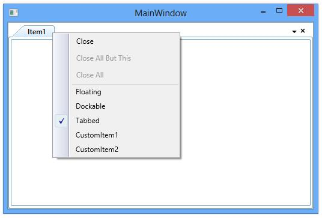

### Customizing ContextmenuItems Visibility

The default context menu is visible on right-clicking the different state child windows and its visibility can be customized.  

The default context menu items as shown in the following screenshot:

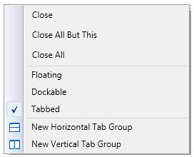

To collapse the default context menu, set the property `CollapseDefaultContextmenu` as True.



<syncfusion:DockingManager x:Name="DockingManager1" UseDocumentContainer="True" CollapseDefaultContextMenuItems="True"/>



To collapse the default context menu in Dock state window, set the property `CollapseDefaultContextMenuInDock` as True. By default, its value is False.



<syncfusion:DockingManager x:Name="DockingManager1" UseDocumentContainer="True" >

<ContentControl syncfusion:DockingManager.Header="DockWindow" x:Name="Content1"
                syncfusion:DockingManager.State="Dock" syncfusion:DockingManager.CollapseDefaultContextMenuItemsInDock="True"/>

</syncfusion:DockingManager>



To collapse the default context menu in Document state window, set the property `CollapseDefaultContextMenuInDocument` asTrue. By default, its value is False.



<syncfusion:DockingManager x:Name="DockingManager1" UseDocumentContainer="True">
	
<ContentControl syncfusion:DockingManager.Header="DockWindow" x:Name="Content1"
	           syncfusion:DockingManager.State="Document"
               syncfusion:DockingManager.CollapseDefaultContextMenuItemsInDocumentTab="True" /> 

</syncfusion:DockingManager>


To collapse the default context menu in Float state window, set the property `CollapseDefaultContextMenuInFloat` as True. By default, its value is False.


<ContentControl syncfusion:DockingManager.Header="DockWindow"
                syncfusion:DockingManager.State="Float"
                syncfusion:DockingManager.CollapseDefaultContextMenuItemsInFloat="True"/>



## Hosting a client control between windows

To add a client control in the DockingManager, set an attached property `ClientControl`.



<syncfusion:DockingManager x:Name="DockingManager1" UseDocumentContainer="False">

// A client control TextBox has been added.

<syncfusion:DockingManager.ClientControl>

<TextBox x:Name="Text1" Width="100" Height="23" Text=" ClientControl" Background="Black" Foreground="White"/>

</syncfusion:DockingManager.ClientControl>

<ContentControl syncfusion:DockingManager.Header="Top" syncfusion:DockingManager.SideInDockedMode="Top"/>

<ContentControl syncfusion:DockingManager.Header="Left" syncfusion:DockingManager.SideInDockedMode="Left"/>

<ContentControl syncfusion:DockingManager.Header="Bottom" syncfusion:DockingManager.SideInDockedMode="Bottom"/>

</syncfusion:DockingManager>



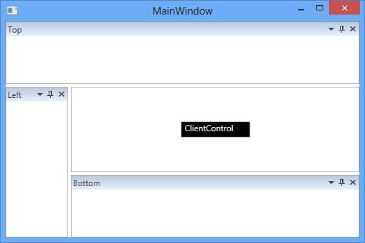

