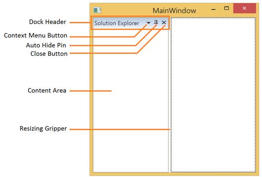
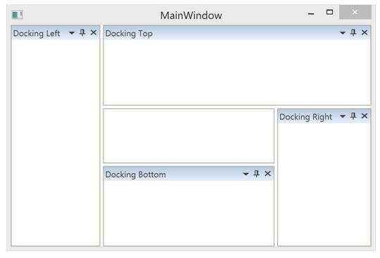
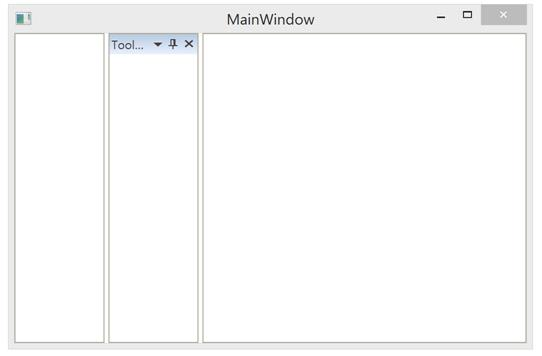

# Docking Window

Docking windows is one of the state of DockingManager. Since `Dock` is the default value, so initially all the children stay as Docking Window

## Configuring window in Different Sides

The five sides that can be docked are 

* Left
* Right
* Top
* Bottom
* Tabbed

To dock 4 children of a DockingManager in 4 different sides, then use `SideInDockedMode` property with the required values.



<ContentControl syncfusion:DockingManager.Header="Docking Left" syncfusion:DockingManager.SideInDockedMode= "Left" />

<ContentControl syncfusion:DockingManager.Header="Docking Top"  syncfusion:DockingManager.SideInDockedMode= "Top"/>

<ContentControl syncfusion:DockingManager.Header="Docking Right"  syncfusion:DockingManager.SideInDockedMode= "Right"/>

<ContentControl syncfusion:DockingManager.Header="Docking Bottom"  syncfusion:DockingManager.SideInDockedMode="Bottom" />





//Creating instance of DockingManager

DockingManager dock = new DockingManager();
			
//Create the instance of ContentControl

ContentControl content1 = new ContentControl();

ContentControl content2 = new ContentControl();

ContentControl content3 = new ContentControl();

ContentControl content4 = new ContentControl();
		
//Set header of each Content Control

DockingManager.SetHeader(content1, "Docking Left");

DockingManager.SetHeader(content2, "Docking Top");

DockingManager.SetHeader(content3, "Docking Right");

DockingManager.SetHeader(content4, "Docking Bottom");

//Set Dock left

DockingManager.SetSideInDockedMode(content1, DockSide.Left);

//Set Dock Top

DockingManager.SetSideInDockedMode(content2, DockSide.Top);

//Set Dock Right

DockingManager.SetSideInDockedMode(content3, DockSide.Right);

//Set Dock Bottom

DockingManager.SetSideInDockedMode(content4, DockSide.Bottom);
	
//Add content controls to child of DockingManager

dock.Children.Add(content1);

dock.Children.Add(content2);

dock.Children.Add(content3);

dock.Children.Add(content4);

//Adding control to the window

Content = dock;





## Docking window in various Targets 

Docking window can also be docked at any side of the Target Docking Window through an attached property named `TargetNameInDockedMode`.
 
Also to set as Tabbed Window, the window should aware of a Target window name. The following code helps to arrange children of DockingManager that targets a single Docking window docked along Left, Top, Right and Tabbed.



<ContentControl syncfusion:DockingManager.Header="Targeted Window" x:Name="DockingWindow1"/>

<!--Targeted to Docking Window1 on Top Side-->
<ContentControl syncfusion:DockingManager.Header="Top"
                syncfusion:DockingManager.SideInDockedMode="Top"
                syncfusion:DockingManager.TargetNameInDockedMode="DockingWindow1"/>

 <!--Targeted to DockingWindow1 on Right Side-->
<ContentControl syncfusion:DockingManager.Header="Right"
                syncfusion:DockingManager.SideInDockedMode="Right"
                syncfusion:DockingManager.TargetNameInDockedMode="DockingWindow1"/>

<!--Targeted to DockingWindow1 on Left Side-->
<ContentControl syncfusion:DockingManager.Header="Left"
                syncfusion:DockingManager.SideInDockedMode="Left"
                syncfusion:DockingManager.TargetNameInDockedMode="DockingWindow1"/>

<!--Targeted to DockingWindow to tab-->
<ContentControl syncfusion:DockingManager.Header="Tabbed"
                syncfusion:DockingManager.SideInDockedMode="Tabbed"
                syncfusion:DockingManager.TargetNameInDockedMode="DockingWindow1"/>      





//Creating instance of DockingManager

DockingManager dock = new DockingManager();
			
//Create the instance of ContentControl

ContentControl content1 = new ContentControl();

ContentControl content2 = new ContentControl();

ContentControl content3 = new ContentControl();
			
ContentControl content4 = new ContentControl();

ContentControl content5 = new ContentControl();

//Set header of each Content Control

DockingManager.SetHeader(content1, "Targeted Window");

DockingManager.SetHeader(content2, "Top");

DockingManager.SetHeader(content3, "Right");

DockingManager.SetHeader(content4, "Left");

DockingManager.SetHeader(content5, "Tabbed");

content1.Name = "DockingWindow1";

//Targeted to Docking Window1 on Top Side

DockingManager.SetSideInDockedMode(content2, DockSide.Top);

DockingManager.SetTargetNameInDockedMode(content2, "DockingWindow1");

//Targeted to DockingWindow1 on Right Side

DockingManager.SetSideInDockedMode(content3, DockSide.Right);

DockingManager.SetTargetNameInDockedMode(content3, "DockingWindow1");

//Targeted to DockingWindow1 on Left Side

DockingManager.SetSideInDockedMode(content4, DockSide.Left);

DockingManager.SetTargetNameInDockedMode(content4, "DockingWindow1");

//Targeted to DockingWindow to tab

DockingManager.SetSideInDockedMode(content5, DockSide.Tabbed);

DockingManager.SetTargetNameInDockedMode(content5, "DockingWindow1");

//Add content controls to child of DockingManager

dock.Children.Add(content1);

dock.Children.Add(content2);

dock.Children.Add(content3);

dock.Children.Add(content4);

dock.Children.Add(content5);

//Adding control to the window

Content = dock;





## Maximize/Minimize Support

This feature helps to Maximize/Minimize Docked Windows for better usage of each window. This support is enabled only when the parent container of a specific element contains more than one host.

* It helps a particular docked window to provide a maximized view
* It can minimize a docked window and can be restored when needed

### Enabling Maximization feature

To enable maximizing feature of Docking Window, set `MaximizeButtonEnabled` to `True`





<syncfusion:DockingManager MaximizeButtonEnabled="True">

<ContentControl syncfusion:DockingManager.Header="Solution Explorer"/>

<ContentControl syncfusion:DockingManager.Header="Toolbox"/>

</syncfusion:DockingManager>





//Creating instance of DockingManager

DockingManager dock = new DockingManager();

//enable the MaximizeButtonEnabled for enable maximizing feature of Docking Window

dock.MaximizeButtonEnabled = true;

//Create the instance of ContentControl

ContentControl content1 = new ContentControl();

ContentControl content2 = new ContentControl();
			
//Set header of each Content Control

DockingManager.SetHeader(content1, "Solution Explorer");

DockingManager.SetHeader(content2, "Toolbox");
			
//Add content controls to child of DockingManager

dock.Children.Add(content1);

dock.Children.Add(content2);
		
//Adding control to the window

Content = dock;





### Maximize Docking Window to full screen

`MaximizeMode` helps to change the maximization behavior of DockingWindow. Docking Windows occupies entire screen when MaximizeMode set as FullScreen and DockingWindow in the Maximized state.




<syncfusion:DockingManager MaximizeButtonEnabled="True" MaximizeMode="FullScreen"/>





//Creating instance of DockingManager

DockingManager dock = new DockingManager();

//set MaximizeButtonEnabled for enable maximizing feature of Docking Window

dock.MaximizeButtonEnabled = true;

//Helps to change the maximization behavior of DockingWindow

dock.MaximizeMode = MaximizeMode.FullScreen;

//Create the instance of ContentControl

ContentControl content1 = new ContentControl();
			
//Set header of each Content Control

DockingManager.SetHeader(content1, "Solution Explorer");

//Add content controls to child of DockingManager

dock.Children.Add(content1);
			
//Adding control to the window

Content = dock;





### Enabling Minimization feature

To enable minimizing feature of DockingWindow, set `MinimizeButtonEnabled` to `True`





<syncfusion:DockingManager x:Name="SyncDockingManager" MinimizeButtonEnabled="True">

<ContentControl x:Name="SolutionExplorer" syncfusion:DockingManager.Header="Solution Explorer"/>

<ContentControl x:Name="ToolBox" syncfusion:DockingManager.Header="Toolbox"/>

</syncfusion:DockingManager>





//Creating instance of DockingManager

DockingManager dock = new DockingManager();

//set MinimizeButtonEnabled for enable minimizing feature of Docking Window

dock.MinimizeButtonEnabled = true;

//Create the instance of ContentControl

ContentControl content1 = new ContentControl();

ContentControl content2 = new ContentControl();
			
//Set header of each Content Control

DockingManager.SetHeader(content1, "Solution Explorer");

DockingManager.SetHeader(content2, "Toolbox");
			
//Add content controls to child of DockingManager

dock.Children.Add(content1);

dock.Children.Add(content2);
		
//Adding control to the window

Content = dock;





### Restrict Maximization or Minimization for a specific children

DockingManager provides two attached property named `CanMaximize` and `CanMinimize` to enable or disable Maximizing and Minimizing buttons respectively to the specific window.





<syncfusion:DockingManager MaximizeButtonEnabled="True" MinimizeButtonEnabled="True">

<ContentControl syncfusion:DockingManager.Header="Solution Explorer" syncfusion:DockingManager.CanMinimize="False" />

<ContentControl syncfusion:DockingManager.Header="Toolbox" syncfusion:DockingManager.CanMaximize="False"/>

</syncfusion:DockingManager>





//Creating instance of DockingManager

DockingManager dock = new DockingManager();

//set MinimizeButtonEnabled for enable minimizing feature of Docking Window

dock.MinimizeButtonEnabled = true;

//set MaximizeButtonEnabled for enable maximizing feature of Docking Window

dock.MaximizeButtonEnabled = true;

//Create the instance of ContentControl

ContentControl content1 = new ContentControl();

ContentControl content2 = new ContentControl();
			
//Set header of each Content Control

DockingManager.SetHeader(content1, "Solution Explorer");

DockingManager.SetHeader(content2, "Toolbox");

//Restrict the Minimize option

DockingManager.SetCanMinimize(content1, false);

//Restrict the Maximize option

DockingManager.SetCanMaximize(content2, false);

//Add content controls to child of DockingManager

dock.Children.Add(content1);

dock.Children.Add(content2);
		
//Adding control to the window

Content = dock;





## Hot Drag the window

The DockWindow Header can be highlighted when the mouse is hovered on an active Docking window by `IsEnableHotTracking` property. Default value of IsEnableHotTracking is `False`, to enable this functionality turn its value to `True`.





<syncfusion:DockingManager x:Name="SyncDockingManager" IsEnableHotTracking="True"/>





## Enabling or Disabling the Dock functionality

The `CanDock` property can help to enable or disable the docking functionality by setting its value as `True` or `False`. By default its value is `True`, to disable this functionality turn its value to `False`.





<ContentControl syncfusion:DockingManager.CanDock="False" />





//Creating instance of DockingManager
			
DockingManager dock = new DockingManager();

//Create the instance of ContentControl

ContentControl content1 = new ContentControl();

ContentControl content2 = new ContentControl();

//Set header

DockingManager.SetHeader(content1, "SolutionExplorer");

DockingManager.SetHeader(content2, "Toolbox");

//To disable the docking functionality

DockingManager.SetCanDock(content1, true);

DockingManager.SetCanDock(content2, false);

//Add content controls to child of DockingManager

dock.Children.Add(content1);

dock.Children.Add(content2);

//Adding control to the window

Content = dock;





## Enabling or Disabling the Header Visibility

`NoHeader` is an attached property, that is used to hide the header of DockWindow. Default value of NoHeader is `False`, to hide the Header turn its value to `True`.





<ContentControl syncfusion:DockingManager.Header="Toolbox"/>

<!--NoHeader enabled to this child-->
<ContentControl syncfusion:DockingManager.Header="Solution Explorer" syncfusion:DockingManager.NoHeader="True" /> 





//Creating instance of DockingManager
			
DockingManager dock = new DockingManager();

//Create the instance of ContentControl

ContentControl content1 = new ContentControl();

ContentControl content2 = new ContentControl();

//Set No header

DockingManager.SetNoHeader(content1, true);

DockingManager.SetHeader(content2, "Toolbox");

//Add content controls to child of DockingManager

dock.Children.Add(content1);

dock.Children.Add(content2);

//Adding control to the window

Content = dock;





