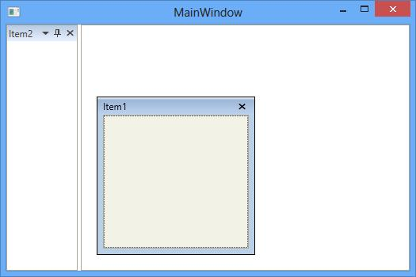

# Floating Window

Floating window is one of the state in the DockingManager. To make children of the DockingManager as Float, set its `State` values as `Float`.

Floating window is like a Popup and it has some limitation in resizing. To avoid this limitation, set the `UseNativeFloatWindow` property of the DockingManager as `True`.


<syncfusion:DockingManager UseNativeFloatWindow="True">

<ContentControl syncfusion:DockingManager.Header="Item1" syncfusion:DockingManager.State="Float"/>

</syncfusion:DockingManager>



## Rolling Up support

The float window is rolled up to top using the property `IsRollUpTopProperty`. To enable this functionality set its value as `True`, by default its value is `False`.        


<syncfusion:DockingManager IsRollupFloatWindow="True">

<ContentControl syncfusion:DockingManager.Header="Item1" syncfusion:DockingManager.State="Float"/>

</syncfusion:DockingManager>



## Multiple Monitor functionalities

The default behavior of the float window remains as Popup in the DockingManager. 

On using MultiMonitor scenario, the FloatWindow behavior as follows:

* FloatWindow can be resized both in primary and secondary monitor.
* On showing half of the float window between primary and secondary monitor, the float window remains in half between the monitor while plugged in and plugged out of the secondary monitor.
* When float window is moved to secondary monitor from primary monitor, the float window remains at the secondary monitor itself while plugged in.

To make float window behave like a WPF window in multiple monitor, set the property `UseNativeFloatWindow` as `True`. 

## Enabling or Disabling the float functionality

The `CanFloat` property helps to enable or disable the floating functionality by setting its value as `True` or `False` respectively. By default its value is `True`, to disable this functionality turn its value to `False`.


<syncfusion:DockingManager x:Name="DockingManager1" >

<ContentControl syncfusion:DockingManager.Header="Item1" syncfusion:DockingManager.CanFloat="True"/>

<ContentControl syncfusion:DockingManager.Header="Item2" syncfusion:DockingManager.CanFloat="False"/>

</syncfusion:DockingManager>



## Enabling and Disabling the float functionality Operation on Double Click

The float window changes its state to `Dock` when you double click its header by default. To disable this functionality for the specific child, set `NoDock` property as `True`.       



<syncfusion:DockingManager x:Name="DockingManager1">

<ContentControl syncfusion:DockingManager.Header="Item1" x:Name="Content1" 
                syncfusion:DockingManager.State="Float" syncfusion:DockingManager.NoDock="True"/>                      

</syncfusion:DockingManager>



## Maximize/Minimize Support

The float window provides Maximization support for better usability and it is only applicable for NativeFloatWindow. To enable the maximizing feature for the Float window, set `CanFloatMaximize` for the specific child as `True`. By default, its value is `False`.


<syncfusion:DockingManager UseNativeFloatWindow="True">

<ContentControl syncfusion:DockingManager.Header="Item1" x:Name="Content1" 
                syncfusion:DockingManager.State="Float" syncfusion:DockingManager.CanFloatMaximize="True"/>    

</syncfusion:DockingManager>



## Positioning on desire location

The FloatWindow can be placed at any desired location. To position the FloatWindow at the desired location with the required Rect Bounds, call `SetFloatingWindowRect` method of the DockingManager.





DockingManager.SetFloatingWindowRect(Content1,new Rect(200,200,200,200));





DockingManager.SetFloatingWindowRect(Content1, New Rect(200, 200, 200, 200)) 





