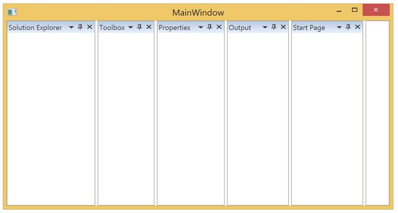
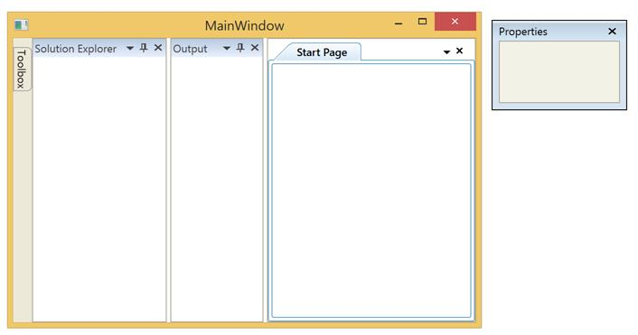

# Getting Started

This section explains how to implement a similar UI as Visual Studio by using the DockingManager. 

## Add Docking Manager

There are several ways to add Syncfusion control in to the Visual Studio WPF project. The following steps help to add a DockingManager control through XAML Code.

* Create a WPF project in Visual Studio and refer to the following assemblies.
1. Syncfusion.Tools.Wpf
2. Syncfusion.Shared.Wpf
* Include an xml namespace for the above assemblies to the Main window.





<Window

xmlns="http://schemas.microsoft.com/winfx/2006/xaml/presentation"

xmlns:x="http://schemas.microsoft.com/winfx/2006/xaml" 

xmlns:syncfusion="http://schemas.syncfusion.com/wpf" />





* Now add the DockingManager control with a required optimal name by using the included namespace.





<syncfusion:DockingManager x:Name="SyncDockingManager" />





## Add Children to the Docking Manager 

DockingManager can accept any control as its children. Here five content controls are added as the children that is displayed with different sides and states of the DockingManager.





<syncfusion:DockingManager x:Name="SyncDockingManager">

<ContentControl x:Name="SolutionExplorer"/>

<ContentControl x:Name="ToolBox"/>

<ContentControl x:Name="Properties"/>

<ContentControl x:Name="Output"/>

<ContentControl x:Name="StartPage"/>

</syncfusion:DockingManager>





## Set Header for each child window

DockingManger provides with an attached property `Header` that helps to set the header for a child window. Set the value as “Solution Explorer” for the first child and repeat the same procedure for the remaining children with values as "Toolbox", “Properties”, ”Output” and ”Start Page”.





<syncfusion:DockingManager x:Name="SyncDockingManager" >

<ContentControl x:Name="SolutionExplorer" syncfusion:DockingManager.Header="Solution Explorer" />

<ContentControl x:Name="ToolBox" syncfusion:DockingManager.Header="Toolbox" />

<ContentControl x:Name="Properties" syncfusion:DockingManager.Header="Properties" />

<ContentControl x:Name="Output" syncfusion:DockingManager.Header="Output"/>

<ContentControl x:Name="StartPage" syncfusion:DockingManager.Header="Start Page" />

</syncfusion:DockingManager>





## Set States for each child window

DockingManager provides an attached property `State` that helps to set the state of a child windows. Since `Dock` is the default value, initially all the children as Docking Window.

To Auto hide the “ToolBox” window, set its `State` property as `AutoHidden`. Repeat the same procedure with the `State` value as `Float` and `Document` for “Properties” and “Start Page” windows respectively to make them as Floating Window and Document Window.

Also enable the Document Container for the Document view by setting the `UseDocumentContainer` property to `True`.



<syncfusion:DockingManager x:Name="SyncDockingManager" UseDocumentContainer="True">

<ContentControl x:Name="SolutionExplorer" syncfusion:DockingManager.Header="Solution Explorer" />

<ContentControl x:Name="ToolBox" syncfusion:DockingManager.Header="Toolbox"  syncfusion:DockingManager.State="AutoHidden" />

<ContentControl x:Name="Properties" syncfusion:DockingManager.Header="Properties" syncfusion:DockingManager.State="Float" />

<ContentControl x:Name="Output" syncfusion:DockingManager.Header="Output"/>

<ContentControl x:Name="StartPage" syncfusion:DockingManager.Header="Start Page" syncfusion:DockingManager.State="Document" />

</syncfusion:DockingManager>





## Set Sides for children

DockingManager provides an attached property `SideInDockMode` that helps to dock a window at the required side. Since `Left` is the default value, initially all the windows are docked at left side. 

Set the `SideInDockMode` value as `Right` for “Solution Explorer” window to dock it on the right side.

The side property's `Tabbed` option is used to tab a window on another window. The tabbing windows need to be aware of the target window’s name. Set “Output” window’s `TargetNameInDockedMode` as “SolutionExplorer” to tab it on the “SolutionExplorer” window.




<syncfusion:DockingManager x:Name="SyncDockingManager" UseDocumentContainer="True">

<ContentControl syncfusion:DockingManager.Header="Solution Explorer"
                syncfusion:DockingManager.SideInDockedMode="Right"  x:Name="SolutionExplorer"/>

<ContentControl x:Name="ToolBox" syncfusion:DockingManager.Header="Toolbox" syncfusion:DockingManager.State="AutoHidden" />

<ContentControl x:Name="Properties" syncfusion:DockingManager.Header="Properties" syncfusion:DockingManager.State="Float" />

<ContentControl syncfusion:DockingManager.Header="Output"
                syncfusion:DockingManager.SideInDockedMode="Tabbed"
                syncfusion:DockingManager.TargetNameInDockedMode="SolutionExplorer"/>

<ContentControl x:Name="StartPage" syncfusion:DockingManager.Header="Start Page" syncfusion:DockingManager.State="Document"/>

</syncfusion:DockingManager>





## Save / Load

The `PersistState` feature of the DockingManager helps to save the current layout of the DockingManager automatically, while closing the window. To enable this feature, set `PersistState` property to `True`




<syncfusion:DockingManager x:Name="SyncDockingManager" UseDocumentContainer="True" PersistState="True">

<ContentControl syncfusion:DockingManager.Header="Solution Explorer" syncfusion:DockingManager.SideInDockedMode="Right"/>

<ContentControl syncfusion:DockingManager.Header="Toolbox" syncfusion:DockingManager.State="AutoHidden" />

<ContentControl syncfusion:DockingManager.Header="Properties" syncfusion:DockingManager.State="Float" />

<ContentControl syncfusion:DockingManager.Header="Output" syncfusion:DockingManager.SideInDockedMode="Right"/>

<ContentControl syncfusion:DockingManager.Header="Start Page" syncfusion:DockingManager.State="Document" />

</syncfusion:DockingManager>





The saved state can be reload by calling the `LoadDockState` method, whenever it is required to load the states.





this.SyncDockingManager.LoadDockState();





Me.SyncDockingManager.LoadDockState() 





## Set Visual Styles

DockingManager supports various visual styles by using the `SfSkinManager`. To apply Visual Studio style on the current layout, refer to the following steps.

* Refer the following assemblies with the project
1. Syncfusion.SfSkinManager.Wpf
2. Syncfusion.Thems.VisualStudio2013.Wpf

* Include an xml namespace for the `SfSkinManager` assembly to the MainWindow.




<Window

xmlns="http://schemas.microsoft.com/winfx/2006/xaml/presentation"

xmlns:x="http://schemas.microsoft.com/winfx/2006/xaml" 

xmlns:syncfusion="http://schemas.syncfusion.com/wpf"

xmlns:syncfusionskin="clr-namespace:Syncfusion.SfSkinManager;assembly=Syncfusion.SfSkinManager.WPF" 

x:Class="WpfApplication7.MainWindow"

Title="MainWindow" Height="350" Width="525" />





* Now apply the value as `VisualStudio2013` to the Visual Style property of the SfSkinManager for the DockingManager control.





<syncfusion:DockingManager UseDocumentContainer="True" PersistState="True" syncfusionskin:SfSkinManager.VisualStyle="VisualStudio2013">

<ContentControl syncfusion:DockingManager.Header="Solution Explorer"
                syncfusion:DockingManager.SideInDockedMode="Right"  x:Name="SolutionExplorer" />

<ContentControl syncfusion:DockingManager.Header="Toolbox" x:Name="ToolBox" syncfusion:DockingManager.State="AutoHidden" />

<ContentControl syncfusion:DockingManager.Header="Properties" x:Name="Properties" syncfusion:DockingManager.State="Float" />

<ContentControl syncfusion:DockingManager.Header="Output" x:Name="Output"
                syncfusion:DockingManager.SideInDockedMode="Tabbed"
                syncfusion:DockingManager.TargetNameInDockedMode="SolutionExplorer"/>

<ContentControl syncfusion:DockingManager.Header="Start Page"
                syncfusion:DockingManager.State="Document" x:Name="StartPage" />

</syncfusion:DockingManager>





