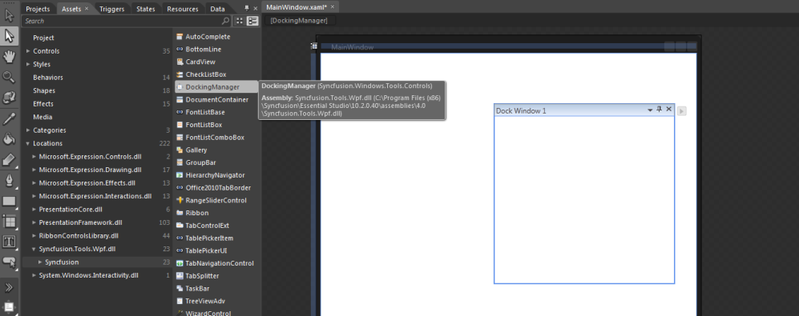
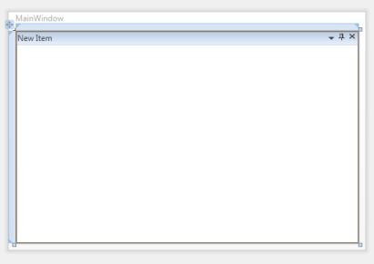
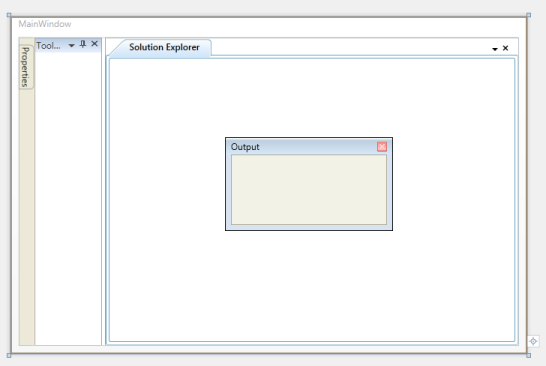
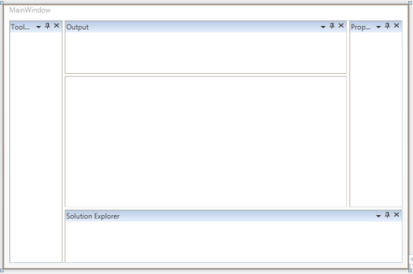
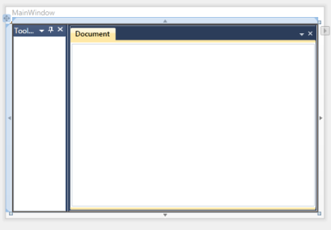

# Getting Started

## Creating DockingManager Control

There are three possible ways to create a simple Docking Manager control.

### Through Visual Studio

To create the DockingManager control through Visual Studio, drag DockingManager from Toolbox and drop it to the designer. It will generate the following the DockingManager control.

### Through Expression Blend

The DockingManager control can also be created and configured using Expression Blend. Follow these steps to do so.

1. Create a WPF project in Expression Blend and reference the following assemblies.
	* Syncfusion.Tools.Wpf
	* Syncfusion.Shared.Wpf
2. Search for DockingManager in the Toolbox.
3. Drag DockingManager to the designer. It will generate the Docking Manager control with one child element.

### Through XAML and C#

You can create the DockingManager control programmatically through XAML and C#. In the following code example, the DockingManager control is created with one child element.


<syncfusion:DockingManager DockFill="True" Height="300" HorizontalAlignment="Left"  Margin="146,122,0,0" Name="dockingManager1" VerticalAlignment="Top" Width="300"> 
        <Grid syncfusion:DockingManager.Header="Dock Window 1" />
</syncfusion:DockingManager>


DockingManager dockingManager1 = new DockingManager(){ DockFill=true, Height = 300, Width = 300, HorizontalAlignment = HorizontalAlignment.Left, VerticalAlignment = VerticalAlignment.Top }; 
           Grid grd = new Grid();
		   DockingManager.SetHeader(grd, "Dock Window 1");
		   dockingManager1.Children.Add(grd);


## Configuring the DockingManager Control

This section covers information on how to customize the DockingManager control.

### Customizing the Header

You can customize the header of the child window in the DockingManager control using the Header property of DockingManager. The following code example explains this.


<syncfusion:DockingManager DockFill="True" Name="dockingManager1" ">
            <Grid syncfusion:DockingManager.Header="New Item"/>
</syncfusion:DockingManager>


[C#] DockingManager.SetHeader(grd, "New Item");


Implementing this code will generate the following window.

### Customizing States for Child Elements

The child elements of the DockingManager control can be customized in five different states. They are:

* Dock
* Document
* Float
* Auto Hidden
* Hidden

The State property of DockingManager is used to set the states for the child elements of the DockingManager control. The following code example illustrates how to set the states for the child elements.


<syncfusion:DockingManager x:Name="dockingManager1" UseDocumentContainer="True">
	 <ContentControl syncfusion:DockingManager.Header="Tool Box" syncfusion:DockingManager.State="Dock"/>
	 <ContentControl syncfusion:DockingManager.Header="Solution Explorer" syncfusion:DockingManager.State="Document"/>
	 <ContentControl syncfusion:DockingManager.Header="Properties" syncfusion:DockingManager.State="AutoHidden" />
	 <ContentControl syncfusion:DockingManager.Header="Output" syncfusion:DockingManager.State="Float" />
	 <ContentControl syncfusion:DockingManager.Header="Error"  syncfusion:DockingManager.State="Hidden" /> 
</syncfusion:DockingManager>


	   DockingManager.SetState(ctrl, DockState.Dock); 
	   DockingManager.SetState(ctrl1, DockState.Document);
	   DockingManager.SetState(ctrl2, DockState.Float);
	   DockingManager.SetState(ctrl3, DockState.AutoHidden);
	   DockingManager.SetState(ctrl4, DockState.Hidden);


This will generate the following output.

### SideInDockedMode

The child elements of the DockingManager control can be located in the following positions:

1. Left
2. Right
3. Bottom
4. Top
5. Tabbed

The following code example illustrates how to locate the control in different positions.


<syncfusion:DockingManager x:Name="dockingManager1" >
           <ContentControl syncfusion:DockingManager.Header="Tool Box"  syncfusion:DockingManager.SideInDockedMode="Left"/>
           <ContentControl syncfusion:DockingManager.Header="Solution Explorer"  syncfusion:DockingManager.SideInDockedMode="Bottom"/> 
		   <ContentControl syncfusion:DockingManager.Header="Properties" syncfusion:DockingManager.SideInDockedMode="Right" />
           <ContentControl syncfusion:DockingManager.Header="Output" syncfusion:DockingManager.SideInDockedMode="Top" />
		   </syncfusion:DockingManager>


   DockingManager.SetSideInDockedMode(ctrl, DockSide.Left); 
   DockingManager.SetSideInDockedMode(ctrl1, DockSide.Right);
   DockingManager.SetSideInDockedMode(ctrl2, DockSide.Bottom);  
   DockingManager.SetSideInDockedMode(ctrl3, DockSide.Top);


Implementing this code will generate the following output.

## Styling the DockingManager Control

Styling can be applied to the DockingManager control. This control supports the following styles:

1. Office2007Blue
2. Office2007Black
3. Office2007Silver
4. Office2010Blue
5. Office2010Black
6. Office2010Silver
7. Blend
8. VS2010
9. Metro
10. Transparent

These styles can be applied to the Docking Manager through XAML and C#. The VisualStyle property of the SkinStorage class is used to set the visual styles for the child window of the control. The following code examples illustrate how to apply the VS2010 style to the DockingManager control.


<syncfusion:DockingManager UseDocumentContainer="True"  syncfusion:SkinStorage.VisualStyle="VS2010">
            <ContentControl syncfusion:DockingManager.Header="ToolBox" syncfusion:DockingManager.SideInDockedMode="Left"/> 
			<ContentControl syncfusion:DockingManager.Header="Document" syncfusion:DockingManager.State="Document" />
			</syncfusion:DockingManager>



    DockingManager dockingManager1 = new DockingManager();
	dockingManager1.UseDocumentContainer = true; 
	ContentControl ctrl1 = new ContentControl(); 
	DockingManager.SetHeader(ctrl1, "Tool box");
	DockingManager.SetSideInDockedMode(ctrl1, DockSide.Left); 
	dockingManager1.Children.Add(ctrl1);
	ContentControl ctrl3 = new ContentControl(); 
	DockingManager.SetHeader(ctrl3, "Document"); 
	DockingManager.SetState(ctrl3, DockState.Document); 
	dockingManager1.Children.Add(ctrl3);
	SkinStorage.SetVisualStyle(dockingManager1, "VS2010");
	


Implementing the above code will generate the following control.

