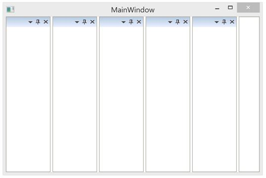
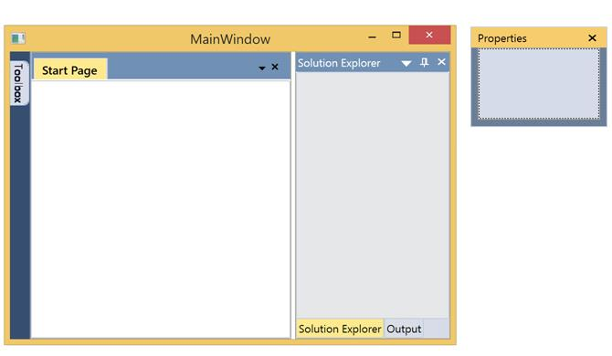

# Docking Manager

## Getting Started

This section explains how to implement a similar UI as Visual Studio by using the Docking Manager. 

### Add Docking Manager

There are [several ways](C:\Users\Selvaganapathy\Desktop\Need to redirect to Common section# "") to add Syncfusion control in to the Visual Studio WPF project. The following steps help to add a Docking Manager control through XAML Code.

* Create a WPF project in Visual Studio and refer to the following assemblies.
1. Syncfusion.Tools.Wpf
2. Syncfusion.Shared.Wpf
* Include an xml namespace for the above assemblies to the Main window.


<Window

xmlns="http://schemas.microsoft.com/winfx/2006/xaml/presentation"

xmlns:x="http://schemas.microsoft.com/winfx/2006/xaml" 

xmlns:syncfusion=[http://schemas.syncfusion.com/wpf](http://schemas.syncfusion.com/wpf# "") />



* Now, Add the Docking Manager control with a required optimal name by using the included namespace.


<syncfusion:DockingManager x:Name="SyncDockingManager" />



### Add Children to the Docking Manager 

Docking Manager can accept any control as its children. Here, five content control is added as the child that is displayed with different Sides and States of the Docking Manager.


<syncfusion:DockingManager x:Name="SyncDockingManager">

<ContentControl x:Name="SolutionExplorer"/>

<ContentControl x:Name="ToolBox"/>

<ContentControl x:Name="Properties"/>

<ContentControl x:Name="Output"/>

<ContentControl x:Name="StartPage"/>

</syncfusion:DockingManager>



### Set Header for each child Window

Docking Manger provides with an attached **Header** property that helps to set the header for a child window. Set the value as “Solution Explorer” for the first child and repeat the same procedure for the remaining children with values as "Toolbox", “Properties”, ”Output” and ”Start Page”.


<syncfusion:DockingManager x:Name="SyncDockingManager" >

<ContentControl x:Name="SolutionExplorer" syncfusion:DockingManager.Header="Solution Explorer" />

<ContentControl x:Name="ToolBox" syncfusion:DockingManager.Header="Toolbox" />

<ContentControl x:Name="Properties" syncfusion:DockingManager.Header="Properties" />

<ContentControl x:Name="Output" syncfusion:DockingManager.Header="Output"/>

<ContentControl x:Name="StartPage" syncfusion:DockingManager.Header="Start Page" />

</syncfusion:DockingManager>



### Set States for each Child Window

Docking Manager provides an attached **State** property that helps to set the state of a child windows. Since, **Dock** is the default value, initially all the children stay in the Docking Window.

To Auto hide the “ToolBox” window, set its **State** property as **AutoHidden**. Repeat the same procedure with the **State** value as **Float** and **Document** for “Properties” and “Start Page” windows respectively to make them as Floating Window and Document Window.

Also, enable the Document Container for the Document view by setting the **UseDocumentContainer** property to **True**.


<syncfusion:DockingManager x:Name="SyncDockingManager" UseDocumentContainer="True">

<ContentControl x:Name="SolutionExplorer" syncfusion:DockingManager.Header="Solution Explorer" />

<ContentControl x:Name="ToolBox" syncfusion:DockingManager.Header="Toolbox"  syncfusion:DockingManager.State="AutoHidden" />

<ContentControl x:Name="Properties" syncfusion:DockingManager.Header="Properties" syncfusion:DockingManager.State="Float" />

<ContentControl x:Name="Output" syncfusion:DockingManager.Header="Output"/>

<ContentControl x:Name="StartPage" syncfusion:DockingManager.Header="Start Page" syncfusion:DockingManager.State="Document" />

</syncfusion:DockingManager>



### Set Sides for the children

Docking Manager provides an attached **SideInDockMode** property that helps to dock a window at the required side. Since, **Left** is the default value, initially all the windows are docked in the left side. 

Set the **SideInDockMode** value as **Right** for “Solution Explorer” window to dock it on the right side.

The **side** property has a **Tabbed** option used to tab a window on another window. The tabbing windows should be aware of the target window’s name. So, set “Output” window’s **TargetNameInDockedMode** as “SolutionExplorer” to Tab it on the “SolutionExplorer” window.


<syncfusion:DockingManager x:Name="SyncDockingManager" UseDocumentContainer="True">

<ContentControl x:Name="SolutionExplorer" syncfusion:DockingManager.Header="Solution Explorer"  syncfusion:DockingManager.SideInDockedMode="Right"/>

<ContentControl x:Name="ToolBox" syncfusion:DockingManager.Header="Toolbox" syncfusion:DockingManager.State="AutoHidden" />

<ContentControl x:Name="Properties" syncfusion:DockingManager.Header="Properties" syncfusion:DockingManager.State="Float" />

<ContentControl x:Name="Output" syncfusion:DockingManager.Header="Output" syncfusion:DockingManager.SideInDockedMode="Tabbed" syncfusion:DockingManager.TargetNameInDockedMode="SolutionExplorer"/>

<ContentControl x:Name="StartPage" syncfusion:DockingManager.Header="Start Page" syncfusion:DockingManager.State="Document" />

</syncfusion:DockingManager>



### Save / Load

The Persist State feature of the Docking Manager helps to save the current layout of the Docking Manager automatically, while closing the window. To enable this feature, set **PersistState** property to **True**



<syncfusion:DockingManager x:Name="SyncDockingManager" UseDocumentContainer="True" PersistState="True">

<ContentControl x:Name="SolutionExplorer" syncfusion:DockingManager.Header="Solution Explorer"  syncfusion:DockingManager.SideInDockedMode="Right"/>

<ContentControl x:Name="ToolBox" syncfusion:DockingManager.Header="Toolbox" syncfusion:DockingManager.State="AutoHidden" />

<ContentControl x:Name="Properties" syncfusion:DockingManager.Header="Properties" syncfusion:DockingManager.State="Float" />

<ContentControl x:Name="Output" syncfusion:DockingManager.Header="Output" syncfusion:DockingManager.SideInDockedMode="Tabbed" syncfusion:DockingManager.TargetNameInDockedMode="SolutionExplorer"/>

<ContentControl x:Name="StartPage" syncfusion:DockingManager.Header="Start Page" syncfusion:DockingManager.State="Document" />

</syncfusion:DockingManager>



The saved state can be reload by calling the **LoadDockStated** method, whenever it is required to load the states.



this.SyncDockingManager.LoadDockState();



### Set Visual Styles

Docking Manager supports various visual styles by using the [SfSkinManager](C:\Users\Selvaganapathy\Desktop\Navigate to SfSkinManager Documentation# ""). To apply Visual Studio style on the current layout, refer to the following steps.

* Refer to the following assemblies with the project
1. Syncfusion.SfSkinManager.Wpf
2. Syncfusion.Thems.VisualStudio2013.Wpf

* Include an xml namespace for the **SfSkinManager** assembly to the Main window.



<Window

xmlns="http://schemas.microsoft.com/winfx/2006/xaml/presentation"

xmlns:x="http://schemas.microsoft.com/winfx/2006/xaml" 

xmlns:syncfusion="http://schemas.syncfusion.com/wpf"

xmlns:syncfusionskin="clr-namespace:Syncfusion.SfSkinManager;assembly=Syncfusion.SfSkinManager.WPF" 

x:Class="WpfApplication7.MainWindow"

Title="MainWindow" Height="350" Width="525" />



* Now, apply the value as **VisualStudio2013** to the Visual Style property of the SfSkinManager for the Docking Manager control.



<syncfusion:DockingManager x:Name="SyncDockingManager" UseDocumentContainer="True" PersistState="True" syncfusionskin:SfSkinManager.VisualStyle="VisualStudio2013">

<ContentControl x:Name="SolutionExplorer" syncfusion:DockingManager.Header="Solution Explorer"  syncfusion:DockingManager.SideInDockedMode="Right"/>

<ContentControl x:Name="ToolBox" syncfusion:DockingManager.Header="Toolbox" syncfusion:DockingManager.State="AutoHidden" />

<ContentControl x:Name="Properties" syncfusion:DockingManager.Header="Properties" syncfusion:DockingManager.State="Float" />

<ContentControl x:Name="Output" syncfusion:DockingManager.Header="Output" syncfusion:DockingManager.SideInDockedMode="Tabbed" syncfusion:DockingManager.TargetNameInDockedMode="SolutionExplorer"/>

<ContentControl x:Name="StartPage" syncfusion:DockingManager.Header="Start Page" syncfusion:DockingManager.State="Document" />

</syncfusion:DockingManager>



