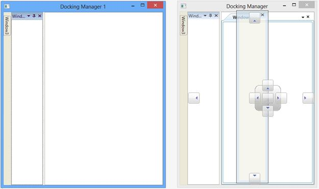

## Linked Manager 

The windows from one DockingManager to another, could not be dragged and dropped by default. Linked Manager allows to drag and drop the windows from one DockingManager to another by awaring the TargetDockingManager list.

### Getting Started



[MainWindow.XAML]

<syncfusion:DockingManager x:Name="DockingManager1" UseDocumentContainer="True">

<ContentControl syncfusion:DockingManager.State="Document"

syncfusion:DockingManager.Header="Window1"></ContentControl>

<ContentControl syncfusion:DockingManager.State="Dock"

syncfusion:DockingManager.Header="Window2"></ContentControl>

<ContentControl syncfusion:DockingManager.State="AutoHidden"

syncfusion:DockingManager.Header="Window3"></ContentControl>

</syncfusion:DockingManager>





[MainWindow1.XAML]

<syncfusion:DockingManager x:Name="DockingManager2" UseDocumentContainer="True">

<ContentControl syncfusion:DockingManager.State="Dock"

syncfusion:DockingManager.Header="Window1"></ContentControl>

<ContentControl syncfusion:DockingManager.State="Dock"

syncfusion:DockingManager.Header="Window2"></ContentControl>

<ContentControl syncfusion:DockingManager.State="AutoHidden"

syncfusion:DockingManager.Header="Window3"></ContentControl>

</syncfusion:DockingManager>                   





[MainWindow.cs]

public partial class MainWindow : Window

{

static int count = 0;

public MainWindow()

{

InitializeComponent();

count++;      

MainWindow1 MainWindow = new MainWindow1();

MainWindow.Title = "Docking Manager " + count;

MainWindow.Show();

this.DockingManager1.AddToTargetManagersList(MainWindow.DockingManager2);

MainWindow.DockingManager2.AddToTargetManagersList(this.DockingManager1);

}



#### Adding TargetManager list of DockingManager

To add TargetManager list in the DockingManager call **AddToTargetManagersList()** method of the DockingManager with the valid DockingManager instance as argument.

If only one DockingManager have TargetManagerList, the window drop to TargetManager cannot drag back to Owner DockingManger. 

For instance DockingManager1 and DockingManager2 are the DockingManager instance and the DockingManager2 is added to TargetManagerList of DockingManager1, but the DockingManager2 does not aware of its TargetManager.

Here, the windows from DockingManager1 only allowed to drag and drop the windows in DockingManager2, 



this.DockingManager1.AddToTargetManagersList(MainWindow.DockingManager2);



To drag and drop the window from DockingManager2 to DockingManager1, DockingManager1 should add to TargetManagerList of DockingManager2.



this.DockingManager1.AddToTargetManagersList(MainWindow.DockingManager2);

MainWindow.DockingManager2.AddToTargetManagersList(this.DockingManager1);



#### Removing Target Manager list

To remove DockingManager from the TargetManagerList call **RemoveFromTargetManagerList()** of DockingManager with the valid DockingManager instance argument. For instance to remove the DockingManager1 from the TargetManagersList of DockingManager2, following code explains:



MainWindow.DockingManager2.RemoveFromTargetManagersList(this.DockingManager1);



### Nested Docking

DockingManager provides the **NestedDockingManager** support, which allows to add DockingManager as a child window to another DockingManager. 

### Getting Started

In Nested DockingManager, whole DockingManager can be dragged and dropped inside the Parent DockingManager and DockWindows inside the DockingManager can’t be drag and dropon the owner DockingManager.

#### Adding DockingManager as Child in DockingManager



<syncfusion:DockingManager x:Name="DockingManager1" UseDocumentContainer="True" syncfusion:DockingManager.Header="Dock1"   >

<ContentControl x:Name="Content1" syncfusion:DockingManager.Header="Dock1"/>

<syncfusion:DockingManager x:Name="DockingManager2" UseDocumentContainer="True" SideInDockedMode="Left" syncfusion:DockingManager.Header="Dock2"  >

<ContentControl syncfusion:DockingManager.Header="Dock2"                               syncfusion:DockingManager.DesiredWidthInDockedMode="600"></ContentControl>

</syncfusion:DockingManager>

<syncfusion:DockingManager x:Name="DockingManager3" UseDocumentContainer="True" SideInDockedMode="Bottom"  syncfusion:DockingManager.Header="Dock3">

<ContentControl syncfusion:DockingManager.Header="Dock3" 

syncfusion:DockingManager.DesiredWidthInDockedMode="600"/>

</syncfusion:DockingManager>

</syncfusion:DockingManager>



