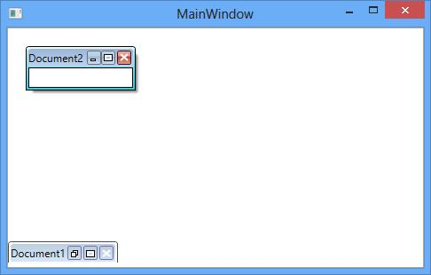
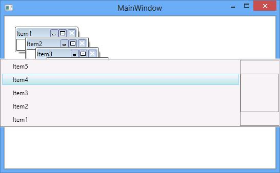
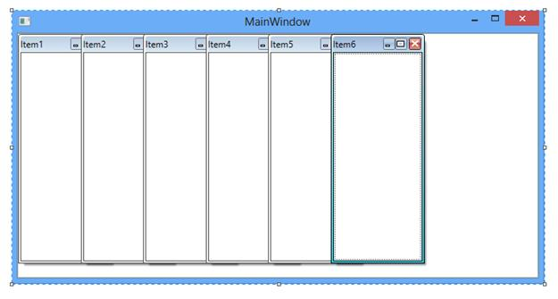
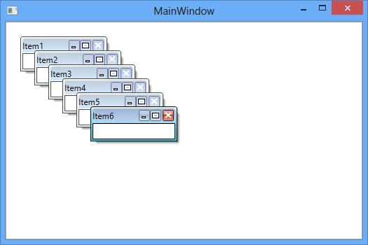
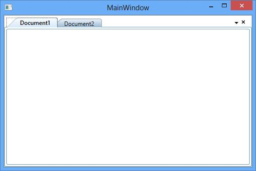
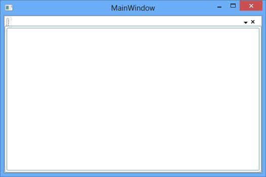

# MDI/ TDI functionalities

The MDI and TDI functionalities are applicable for the Document window in the DockingManager. So Document window can be displayed in both Multiple Document Interface and Tabbed Document Interface.

To change mode for the Document window, set the property `ContainerMode` with its respective values.

By default, the document state window is in TDI mode, that display child as tabbed document.



<syncfusion:DockingManager UseDocumentContainer="True" ContainerMode="TDI">        

<ContentControl x:Name="Content1" syncfusion:DockingManager.Header="Document1" />   

<ContentControl syncfusion:DockingManager.Header="Document2" syncfusion:DockingManager.State="Document" /> 

</syncfusion:DockingManager>



To make the document child window as MDI document, set the `ContainerMode` as `MDI`



<syncfusion:DockingManager x:Name="DockingManager1" UseDocumentContainer="True" ContainerMode="MDI">        

<ContentControl x:Name="Content1" syncfusion:DockingManager.Header="Document1" syncfusion:DockingManager.State="Document"/>   

<ContentControl x:Name="Content2" syncfusion:DockingManager.Header="Document2" syncfusion:DockingManager.State="Document"/> 

</syncfusion:DockingManager>



## Setting MDI Window state

The state of the MDI Window can be set using the `SetMDIWindowState()` method of DocumentContainer. 

### Setting MDI Windowstate as Minimized



DocumentContainer.SetMDIWindowState(Content1,MDIWindowState.Minimized);



### Setting MDI Windowstate as Maximized



DocumentContainer.SetMDIWindowState(Content1,MDIWindowState.Maximized);



## Getting state of the MDI window

The state of the MDI window can be detect using the `GetMDIWindowState()` method of DocumentContainer.



DocumentContainer.GetMDIWindowState(Content1);



## Detecting the maximized state of the MDI window

Maximized state of the MDI Container can get by `IsInMDIMaximizedState` property of DocumentContainer. The container can be fetched from the DockingManager using the `DocContainer` property.



(DockingManager1.DocContainer as DocumentContainer).IsInMDIMaximizedState = true;



## Resizing MDI

MDI document window can be able to resize using the navigation arrows. To restrict resizing the MDI document windows, disable the Property `IsAllowMDIResize` of the `Documentcontainer` that can be get using the `DocContainer` property of the DockingManager. By default, its values is `True`.



(DockingManager1.DocContainer as DocumentContainer).IsAllowMDIResize = false;



## Different Keyboard Navigation Modes

DockingManager allows to navigate between children (Both  TDI and MDI) windows easily using the keyboard keys with combination of `CTRL` `+` `TAB` in five different modes by `SwitchMode` property of the DockingManager.

There are five switch modes.

* Immediate
* List
* QuickTabs
* VS2005
* Vista Flip

### Immediate – Switch the MDI document windows immediately.



DockingManager1.SwitchMode =SwitchMode.Immediate;



### List – Switch the MDI document windows in list format.



DockingManager1.SwitchMode = SwitchMode.List;



### QuickTabs



DockingManager1.SwitchMode = SwitchMode.QuickTabs;



### VistaFlip



DockingManager1.SwitchMode = SwitchMode.VistaFlip;



### VS2005



DockingManager1.SwitchMode = SwitchMode.VS2005;



## Setting MDI Layout

DockingManager allows to set the different layout for the MDI windows with the different MDILayout values such as `Horizontal` , `Vertical` and `Cascade` layout through the `SetLayout()` method of DocumentContainer.

`Horizontal` - Arranges the MDI windows horizontally.



void DocumentContainer_Loaded(object sender, RoutedEventArgs e)
{
	(DockingManager1.DocContainer as DocumentContainer).SetLayout(MDILayout.Horizontal);
}



 `Vertical` – Arranges the MDI windows vertically.



void DocumentContainer_Loaded(object sender, RoutedEventArgs e)
{
	(DockingManager1.DocContainer as DocumentContainer).SetLayout(MDILayout.Vertical);
}



`Cascade` - Arranges the layout in a cascade manner.



void DocumentContainer_Loaded(object sender, RoutedEventArgs e)
{
	(DockingManager1.DocContainer as DocumentContainer).SetLayout(MDILayout.Vertical);
}



## Closing a MDI Windows

To enable or disable closing functionality of the MDI windows, set `CanClose` an attached property of DockingManager with its respective values. By default, its value is `True`



<syncfusion:DockingManager x:Name="DockingManager1" UseDocumentContainer="True" ContainerMode="MDI"> 

<ContentControl x:Name="Content1" syncfusion:DockingManager.Header="Item1"
                syncfusion:DockingManager.State="Document" syncfusion:DockingManager.CanClose="False"/>   

</syncfusion:DockingManager>



## Indexing an Item in TDI

A document window can be placed at different index position using the `SetTDIIndex()` method of the TDILayoutPanel. 



<syncfusion:DockingManager x:Name="DockingManager1" UseDocumentContainer="True">

<ContentControl x:Name="Content1" syncfusion:DockingManager.Header="Document1" syncfusion:DockingManager.State="Document"/>   

<ContentControl x:Name="Content2" syncfusion:DockingManager.Header="Document2" syncfusion:DockingManager.State="Document"/> 

</syncfusion:DockingManager>





TDILayoutPanel.SetTDIIndex(Content1,0);



## Drag / Drop support in TDI

The TDI document index can be changed by dragging and dropping it like Visual Studio. This functionality can be enabled or disabled through the property `IsTDIDragDropEnabled` of DockingManager.



<syncfusion:DockingManager UseDocumentContainer="True" IsTDIDragDropEnabled="True" >

<ContentControl syncfusion:DockingManager.Header="Document1" syncfusion:DockingManager.State="Document"/>

<ContentControl syncfusion:DockingManager.Header="Document2" syncfusion:DockingManager.State="Document"/>

<ContentControl syncfusion:DockingManager.Header="Document3" syncfusion:DockingManager.State="Document"/>

</syncfusion:DockingManager>



## Customizing Close Menu

Menu items like `Close`, `CloseAll` and `CloseAllButThis` are available for the document window when two or more documents used in the DockingManager. To collapse the visibility of these menu item, set the property `ShowClose`, `ShowCloseAll` and `ShowCloseAllButThis` as `False`.



<ContentControl syncfusion:DockingManager.Header="Item1"
                syncfusion:DockingManager.State="Document"
                syncfusion:DockingManager.ShowCloseMenuItem="False"
                syncfusion:DockingManager.ShowCloseAllMenuItem="False"
                syncfusion:DockingManager.ShowCloseAllButThisMenuItem="False"/>                                                 

<ContentControl syncfusion:DockingManager.Header="Item2"  
                syncfusion:DockingManager.State="Document"
                syncfusion:DockingManager.ShowCloseMenuItem="False"
                syncfusion:DockingManager.ShowCloseAllMenuItem="False"
                syncfusion:DockingManager.ShowCloseAllButThisMenuItem="False"/>             



## Grouping Document Tab Group

TDI document can be grouped like VisualStudio. It can be grouped by drag and Drop and also using the options in context menu items.

### Creating Vertical Tab Group 

To create a vertical tab group in the Tabbed document, select the "New Vertical Tab Group" context menu item and also it can be created programmatically by calling the method `CreateVerticallTabGroup(UIElement)` of the DocumentContainer.



(DockingManager1.DocContainer as DocumentContainer).CreateVerticalTabGroup(Content1);



### Creating Horizontal Tab Group 

To create a horizontal tab group in the Tabbed document, select the "New Horizontal Tab Group context menu item and also it can be created programmatically by calling the method `CreateHorizontalTabGroup(UIElement)` of the DocumentContainer.



(DockingManager1.DocContainer as DocumentContainer).CreateHorizontalTabGroup(Content1);



### Adding Tab in a Group 

In TDI document, new tab group can be created by dragging the TabItem into the Document area and click the "New Tab Group" menuitem from context menu item.

### Disable TabGroups

Vertical and Horizontal Tab Grouping feature can be enabled or disabled using the property `TabGroupEnabled` in DockingManager. 
 
To disabling Tab Groups, set TabGroupEnabled as `False`. So it does not display "New Horizontal Tab Group" and "New Vertical Tab Group" context menu items even when ShowHorizontalTabGroupMenuItem is true. Drag and drop support to create new tab group is also restricted.



<syncfusion:DockingManager TabGroupEnabled="False" />


 

## VS2010 Behavior of TDI

TDI document of DockingManager can be changed to Float while dragging its TDI header. This functionality can be enabled or disabled using the property `IsVs2010DraggingEnabled`. By default, its value is `False`. 



<syncfusion:DockingManager UseDocumentContainer="True" IsVS2010DraggingEnabled="True">

<ContentControl syncfusion:DockingManager.Header="Document1" syncfusion:DockingManager.State="Document" />

</syncfusion:DockingManager>



## TDI Header Renaming Support

To enable the functionality of editing the TDI document header when you double click on document header at runtime, set the property `EnableDocumentTabHeaderEdit` of the DockingManager as `True`. By default, its value is `False`.



<syncfusion:DockingManager UseDocumentContainer="True" EnableDocumentTabHeaderEdit="True">



## Hiding TDI Header

To hide the TDI document header when a single document child present in a DockingManager set the property `HideTDIHeaderOnSingleChild` as `True`. By default its value is `False`.



<syncfusion:DockingManager UseDocumentContainer="True" HideTDIHeaderOnSingleChild="True">

<ContentControl syncfusion:DockingManager.Header="Document1" syncfusion:DockingManager.State="Document" />

</syncfusion:DockingManager>



## Add New button in Header Panel

In DockingManager, the New button can be added in the Document state windows using the `IsNewButtonEnabled` property of the DocumentTabControl. To achieve this, DocumentTabControl must be fetched from the DockingManager.



DocumentTabControl tab = VisualUtils.FindDescendant(DockingManager1,typeof (DocumentTabControl)) as DocumentTabControl;

if (tab != null)
{
   tab.IsNewButtonEnabled = true;
   tab.NewButtonBackground = Brushes.Green;
}



