# Styling and Templates

The UI for Dock, Float and Document windows of DockingManager can be changed using different Styles and Templates.

## Visual Styles

SkinManager provides rich and professional look and feel UI for the Dock windows. Some of the available visual style are as follows:

* Blend
* Office2007Blue
* Office2007Black
* Office2007Silver
* Office2010Blue
* Office2010Black
* Office2010Silver
* VS2010
* Metro
* Transparent

The visual style can be applied for the DockingManager using the property `VisualStyle` property of the `SkinStorage`.

* Blend – Set the visual style as Blend for the DockingManager.





SkinStorage.SetVisualStyle(DockingManager1,"Blend");





SkinStorage.SetVisualStyle(DockingManager1,"Blend")
 




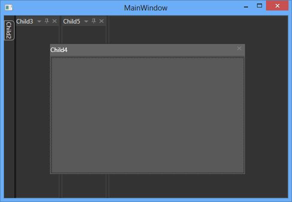

* Office2007Blue – Set visual style for DockingManager as Office2007Blue.





SkinStorage.SetVisualStyle(DockingManager1,"Office2007Blue");





SkinStorage.SetVisualStyle(DockingManager1,"Office2007Blue")
 




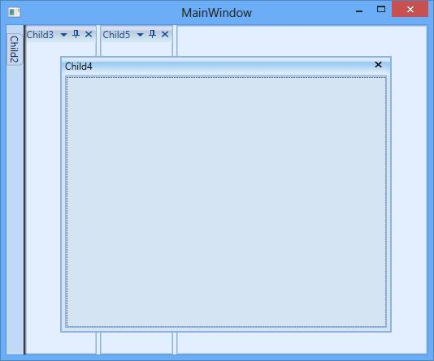

* Office2007Black – Setting visual style for DockingManager as Office2007Black.





SkinStorage.SetVisualStyle(DockingManager1,"Office2007Black");





SkinStorage.SetVisualStyle(DockingManager1,"Office2007Black")
 




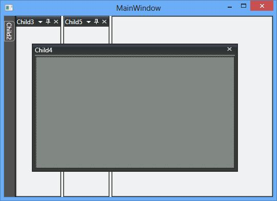

* Office2007Silver – Setting visual style for the DockingManager as Office2007Silver.





SkinStorage.SetVisualStyle(DockingManager1,"Office2007Silver");





SkinStorage.SetVisualStyle(DockingManager1,"Office2007Silver")
 




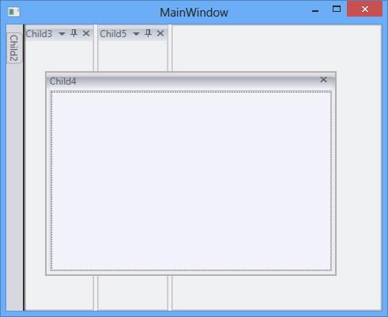

* Office2010Blue – Set the visual style for DockingManager as Office2010Blue.





SkinStorage.SetVisualStyle(DockingManager1,"Office2010Blue");





SkinStorage.SetVisualStyle(DockingManager1,"Office2010Blue")
 




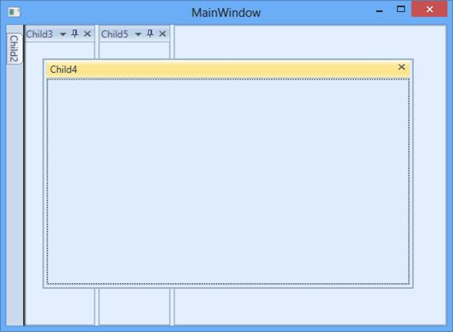

* Office2010Black – Set visual style for DockingManager as Office2010Black





SkinStorage.SetVisualStyle(DockingManager1,"Office2010Black");





SkinStorage.SetVisualStyle(DockingManager1,"Office2010Black")
 




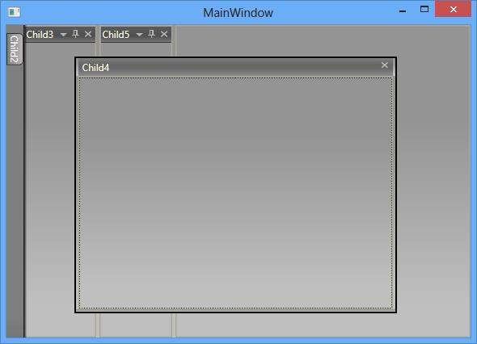

* Office2010SSilver – Set visual style as Office2010Silver.





SkinStorage.SetVisualStyle(DockingManager1,"Office2010Silver");





SkinStorage.SetVisualStyle(DockingManager1,"Office2010Silver")
 




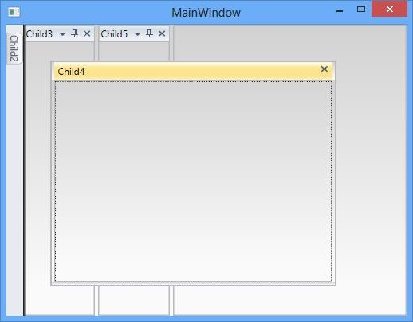

* VS2010- Setting visual style for the DockingManager as VS2010.





SkinStorage.SetVisualStyle(DockingManager1,"VS2010");





SkinStorage.SetVisualStyle(DockingManager1,"VS2010")
 




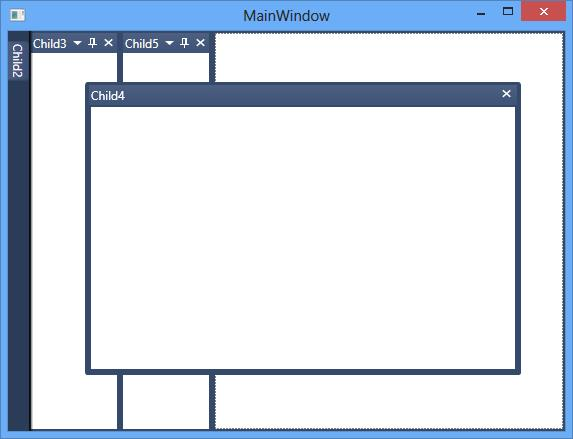

* Metro – Sett visual style for DockingManager as Metro.





SkinStorage.SetVisualStyle(DockingManager1,"Metro");





SkinStorage.SetVisualStyle(DockingManager1,"Metro")
 




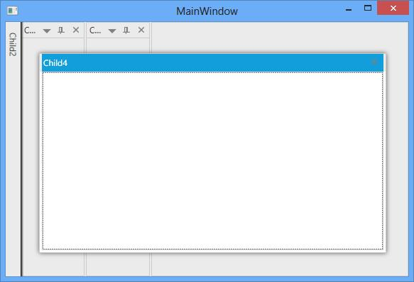

* Transparent – Setting visual style for DockingManager as Transparent.





SkinStorage.SetVisualStyle(DockingManager1,"Transparent");





SkinStorage.SetVisualStyle(DockingManager1,"Transparent")
 




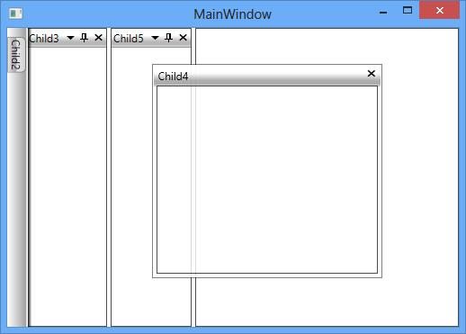

## Dock Window Style

DockingManager allows to set style for some of the Docking controls such as DockedHeaderPresenter, DockedElementTabbedHost. This is explained in detail under the DockHeaderStyle and DockedElementTabbedHostStyle section.

### AwlButtonTemplate

The style of the pin button of the Dock window can customized using the `AwlButtonTemplate` property of DockingManager with the TargetType as `ToggleButton` to have a customized look and feel for the Pin Button. 





<syncfusion:DockingManager  x:Name="DockingManager1">

<syncfusion:DockingManager.AwlButtonTemplate>

<ControlTemplate TargetType="{x:Type ToggleButton}">

<Border x:Name="Border1">

<TextBlock x:Name="Text1" Text="PinButton" Foreground="White"></TextBlock>

</Border>

<ControlTemplate.Triggers>

<Trigger Property="IsMouseOver" Value="True">

<Setter TargetName="Border1" Property="Background" Value="Black"></Setter>

<Setter TargetName="Text1" Property="Foreground" Value="Red"></Setter>

</Trigger>

</ControlTemplate.Triggers>

</ControlTemplate>

</syncfusion:DockingManager.AwlButtonTemplate>

<ContentControl syncfusion:DockingManager.Header="Child1"/>

<ContentControl syncfusion:DockingManager.Header="Child2"/>

</syncfusion:DockingManager>





### CloseButtonTemplate

The close button for the Docked window can be customized using the `CloseButtonTemplate` and can be used to get or set the control template for the close button for the windows of DockingManager with TargetType as ToggleButton.





<syncfusion:DockingManager  x:Name="DockingManager1">

<syncfusion:DockingManager.CloseButtonTemplate>

<ControlTemplate TargetType="{x:Type ToggleButton}">

<StackPanel

<Border x:Name="Border1">

<TextBlock x:Name="Block" Background="Red" Text="Close" Foreground="Black"></TextBlock>

</Border>

</StackPanel>

</ControlTemplate>

</syncfusion:DockingManager.CloseButtonTemplate>

<ContentControl

syncfusion:DockingManager.Header="Child1"/>

<ContentControl

syncfusion:DockingManager.Header="Child2"/>

</syncfusion:DockingManager>





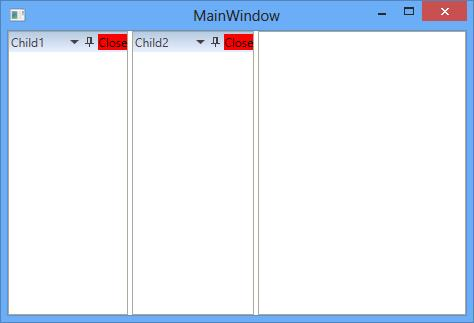

### MenuButtonTemplate

The context menu button appearance in the Dock window header can be customized using `MenuButtonTemplate` property by setting with the Target Type as ToggleButton.





<syncfusion:DockingManager  x:Name="DockingManager1">

<syncfusion:DockingManager.MenuButtonTemplate>

<ControlTemplate TargetType="{x:Type ToggleButton}">

<StackPanel>

<Border x:Name="Border1">

<TextBlock x:Name="TextBlock" Text="Menu" Foreground="Black"></TextBlock>

</Border>

</StackPanel>

<ControlTemplate.Triggers>

<Trigger Property="IsMouseOver" Value="True">

<Setter TargetName="Border1" Property="Background" Value="Black"></Setter>

<Setter TargetName="TextBlock" Property="Foreground" Value="Red"/>

</Trigger>

</ControlTemplate.Triggers>

</ControlTemplate>

</syncfusion:DockingManager.MenuButtonTemplate>

<ContentControl syncfusion:DockingManager.Header="Child1"/>

<ContentControl syncfusion:DockingManager.Header="Child2"/>

</syncfusion:DockingManager>





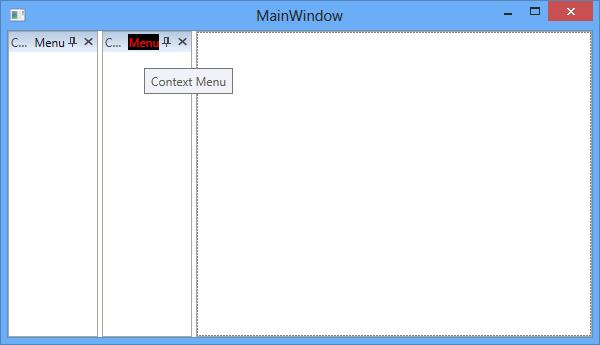

### MinimizeButton Template

The minimize button for the dock window can be customized using the `MinimizeButtonTemplate` by setting with the TargetType as ToggleButton.





<syncfusion:DockingManager  x:Name="DockingManager1" MinimizeButtonEnabled="True" >

<syncfusion:DockingManager.MinimizeButtonTemplate>

<ControlTemplate TargetType="{x:Type ToggleButton}">

<Border x:Name="Border1">

<TextBlock x:Name="Block" Background="Red" Text="mini" ></TextBlock>

</Border>

<ControlTemplate.Triggers>

<Trigger Property="IsMouseOver" Value="True">

<Setter TargetName="Border1" Property="Background" Value="Black"></Setter>

</Trigger>

</ControlTemplate.Triggers>

</ControlTemplate>

</syncfusion:DockingManager.MinimizeButtonTemplate>

<ContentControl syncfusion:DockingManager.Header="Child1"/>

<ContentControl syncfusion:DockingManager.Header="Child2"/>

</syncfusion:DockingManager>





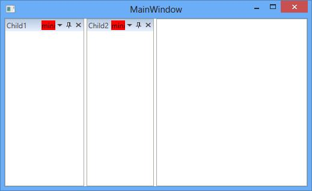

### MaximizeButtonTemplate

The maximize button for the dock window can be customized using the `MaximizeButtonTemplate` property with the TargetType as ToggleButton.





<syncfusion:DockingManager  x:Name="DockingManager1" MaximizeButtonEnabled="True" MinimizeButtonEnabled="True" >

<syncfusion:DockingManager.MaximizeButtonTemplate>

<ControlTemplate TargetType="{x:Type ToggleButton}">

<Border x:Name="Border1">

<TextBlock x:Name="Block" Background="Red" Text="Maxi"/>

</Border>

<ControlTemplate.Triggers>

<Trigger Property="IsMouseOver" Value="True">

<Setter TargetName="Border1" Property="Background" Value="Black"/>

</Trigger>

</ControlTemplate.Triggers>

</ControlTemplate>

</syncfusion:DockingManager.MaximizeButtonTemplate>

<ContentControl syncfusion:DockingManager.Header="Child1"/>

<ContentControl syncfusion:DockingManager.Header="Child2"/>

</syncfusion:DockingManager>





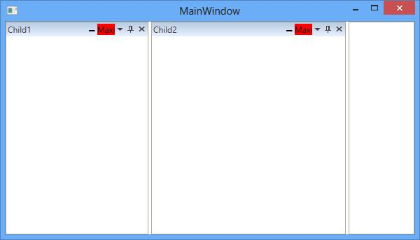

### RestoreButtonTemplate 

The Restore button for the dock window can be customized using the `RestoreButtonTemplate` property with the TargetType as ToggleButton.





<syncfusion:DockingManager  x:Name="DockingManager1" MaximizeButtonEnabled="True">

<syncfusion:DockingManager.RestoreButtonTemplate>

<ControlTemplate TargetType="{x:Type ToggleButton}">

<Border x:Name="Border1">

<TextBlock x:Name="text1" Background="Red" Text="Maxim"/>

</Border>

<ControlTemplate.Triggers>

<Trigger Property="IsMouseOver" Value="True">

<Setter TargetName="Border1" Property="Background" Value="Black"></Setter>

</Trigger>

</ControlTemplate.Triggers>

</ControlTemplate>

</syncfusion:DockingManager.RestoreButtonTemplate>

<ContentControl syncfusion:DockingManager.Header="Child1" syncfusion:DockingManager.State="Dock"/>

<ContentControl syncfusion:DockingManager.Header="Child2" syncfusion:DockingManager.State="Dock"/>
 
<ContentControl syncfusion:DockingManager.Header="Child3" syncfusion:DockingManager.State="Dock"/>

<ContentControl syncfusion:DockingManager.Header="Child4" syncfusion:DockingManager.State="Dock"/>

<ContentControl syncfusion:DockingManager.Header="Child5" syncfusion:DockingManager.State="Dock"/>

</syncfusion:DockingManager>





### TabItemTemplate

DockedElementTabbedHost have internal TabControl for Tabbed Windows in DockingManager and its tab item template can be customized using `TabItemTemplate` with the TargetType as TabItem.





<Window.Resources>

</Window.Resources>

<Grid x:Name="Grid1">

<Syncfusion:DockingManager x:Name="DockingManager1" UseDocumentContainer="True" TabItemStyle="{StaticResource TabItemStyle1}">

<ContentControl Syncfusion:DockingManager.Header="Window1" x:Name="Content1" Syncfusion:DockingManager.State="Dock"/>

<ContentControl Syncfusion:DockingManager.Header="Window2"
                Syncfusion:DockingManager.State="Dock" x:Name="Content2"
                Syncfusion:DockingManager.TargetNameInDockedMode="Content1" Syncfusion:DockingManager.SideInDockedMode="Tabbed"/>

</Syncfusion:DockingManager>

</Grid>

</Window>





### DockedElementTabbedHostStyle

The DockedElementTabbedHost can be customized using the `DockedElementTabbedHostStyle` with the TargetType as DockedElementTabbedHost





<Syncfusion:DockingManager.DockedElementTabbedHostStyle>

</Syncfusion:DockingManager.DockedElementTabbedHostStyle>





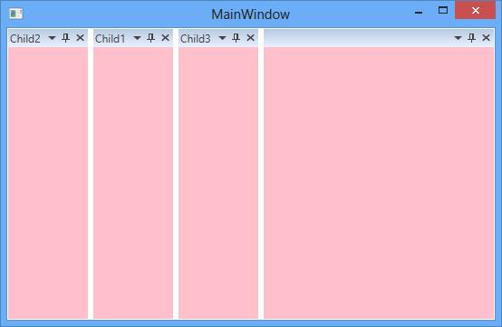

### DockHeaderStyle

A common header style for all dock window can be customized using the property `DockHeaderStyle` with the TargetType as DockHeaderPresenter.




<syncfusion:DockingManager x:Name="DockingManager1" UseDocumentContainer="True"   >

<syncfusion:DockingManager.DockHeaderStyle>

</syncfusion:DockingManager.DockHeaderStyle>

<ContentControl x:Name="Content1" syncfusion:DockingManager.State="Dock" syncfusion:DockingManager.Header="Child1" />

<ContentControl x:Name="Content2" syncfusion:DockingManager.Header="Child2" />

</syncfusion:DockingManager>





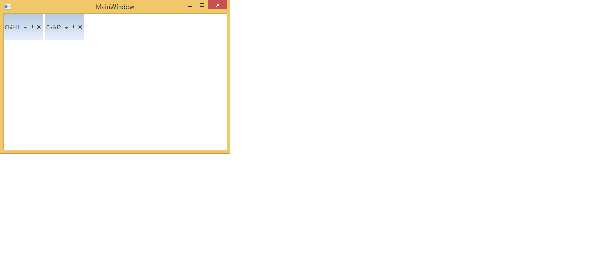

### HeaderStyle

Header of individual dock child can be customized through the [HeaderStyle](https://help.syncfusion.com/cr/wpf/Syncfusion.Tools.Wpf~Syncfusion.Windows.Tools.Controls.DockingManager~SetHeaderStyle.html) property of DockingManager. The customized style will apply to dock, auto hidden and tabbed windows. The following code illustrate the dock windows with customized header style,





<Window.Resources>
        
    </Window.Resources>
    <Syncfusion:DockingManager Grid.Row="1" x:Name="dockingManager" DockFill="True">
        <ContentControl Syncfusion:DockingManager.Header="Dock1" Syncfusion:DockingManager.HeaderStyle="{StaticResource headerStyle1}"/>

        <ContentControl Syncfusion:DockingManager.Header="Dock2" Syncfusion:DockingManager.HeaderStyle="{StaticResource headerStyle1}"/>

        <ContentControl Syncfusion:DockingManager.Header="Dock3"/>

        <ContentControl Syncfusion:DockingManager.Header="Dock4" Syncfusion:DockingManager.HeaderStyle="{StaticResource headerStyle1}"/>

        <ContentControl Syncfusion:DockingManager.Header="Dock5" Syncfusion:DockingManager.HeaderStyle="{StaticResource headerStyle1}"/>

        <ContentControl Syncfusion:DockingManager.Header="Dock6" Syncfusion:DockingManager.HeaderStyle="{StaticResource headerStyle1}"/>
    </Syncfusion:DockingManager>





Refer to this [`sample`](https://github.com/SyncfusionExamples/How-to-set-HeaderStyle-for-individual-dockchild) to know how the header of the dock windows are customized through style of the Header.

### DockWindowContextMenuItemStyle

The context menu of DockingManager can be customized using the `DockWindowContextMenuItemStyle` by setting its Target Type as CustomMenuItem.





<Syncfusion:DockingManager UseDocumentContainer="True" ContainerMode="TDI" UseNativeFloatWindow="True">

<Syncfusion:DockingManager.DockWindowContextMenuItemStyle>

</Syncfusion:DockingManager.DockWindowContextMenuItemStyle>

<Syncfusion:DockingManager.CustomMenuItems>

<Syncfusion:CustomMenuItemCollection>

<Syncfusion:CustomMenuItem Header="CustomItem1"/>

<Syncfusion:CustomMenuItem Header="CustomItem2"/>

</Syncfusion:CustomMenuItemCollection>

</Syncfusion:DockingManager.CustomMenuItems>

<ContentControl Syncfusion:DockingManager.Header="Child1" Syncfusion:DockingManager.State="Dock"/>

<ContentControl Syncfusion:DockingManager.Header="Child2" Syncfusion:DockingManager.State="Dock"/>

<ContentControl Syncfusion:DockingManager.Header="Child3" Syncfusion:DockingManager.State="Dock"/>

</Syncfusion:DockingManager>





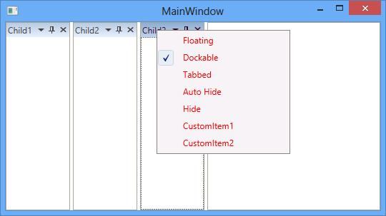

## Float Window Style

The float window can be customized using its template and style.

### FloatWindowTemplate 

Template of FloatWindow can be customized using the `FloatWindowTemplate` with the TargetType as ContentControl.





<Syncfusion:DockingManager UseDocumentContainer="True" ContainerMode="TDI" EnableDocumentTabHeaderEdit="True">

<Syncfusion:DockingManager.FloatWindowTemplate>

<ControlTemplate  TargetType="{x:Type ContentControl}">

<AdornerDecorator>

<DockPanel Focusable="False" LastChildFill="True" Opacity="{Binding Path=Opacity,
           RelativeSource={RelativeSource AncestorType={x:Type Syncfusion:IWindow}}}">

<Border Name="FloatWindowOutBorder" Focusable="False"
        BorderBrush="{TemplateBinding BorderBrush}" BorderThickness="{TemplateBinding BorderThickness}" Background="Red" >

<Grid Focusable="False">

<Grid.RowDefinitions>

<RowDefinition Name="TopRow"/>

<RowDefinition Height="*" />

<RowDefinition Name="BottomRow" Height="7" />

</Grid.RowDefinitions>

<Grid.ColumnDefinitions>

<ColumnDefinition Name="LeftCol" Width="7" />

<ColumnDefinition Width="*"/>

<ColumnDefinition Name="RightCol" Width="7" />

</Grid.ColumnDefinitions>

<Syncfusion:FloatWindowBorder BorderMode="LeftTop" Name="BorderLeftTop" Grid.Column="0" Grid.Row="0" />

<Syncfusion:FloatWindowBorder BorderMode="Header" Name="BorderHeader" Grid.Column="1" Grid.Row="0" />

<Syncfusion:FloatWindowBorder BorderMode="RightTop" Name="BorderRightTop" Grid.Column="2" Grid.Row="0" />

<Syncfusion:FloatWindowBorder BorderMode="Left" Name="BorderLeft" Grid.Column="0" Grid.Row="1" />

<ContentPresenter Name="ContentPresenter" Grid.Column="1" Grid.Row="1"
                  ContentTemplate="{TemplateBinding ContentControl.ContentTemplate}"
                  Content="{TemplateBinding ContentControl.Content}" />

<Syncfusion:FloatWindowBorder BorderMode="Right" Name="BorderRight" Grid.Column="2" Grid.Row="1" />

<Syncfusion:FloatWindowBorder BorderMode="LeftBottom" Name="BorderLeftBottom" Grid.Column="0" Grid.Row="2" />

<Syncfusion:FloatWindowBorder BorderMode="Bottom" Name="BorderBottom" Grid.Column="1" Grid.Row="2" />

<Syncfusion:FloatWindowBorder BorderMode="RightBottom" Name="BorderRightBottom" Grid.Column="2" Grid.Row="2" />

</Grid>

</Border>

</DockPanel>

</AdornerDecorator>

</ControlTemplate>

</Syncfusion:DockingManager.FloatWindowTemplate>

<ContentControl Syncfusion:DockingManager.Header="Child1" Syncfusion:DockingManager.State="Float"/>

<ContentControl Syncfusion:DockingManager.Header="Child2" Syncfusion:DockingManager.State="Document"/>

<ContentControl Syncfusion:DockingManager.Header="Child3" Syncfusion:DockingManager.State="Document"/>

</Syncfusion:DockingManager>





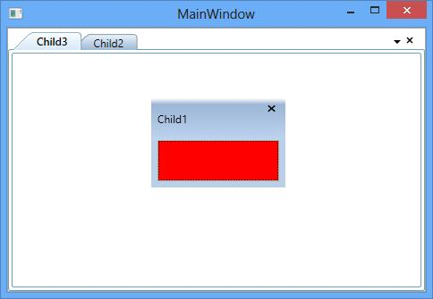

### FloatWindowStyle

The style for the float window can be applied using the `FloatWindowStyle` property of the DockingManager by setting its TargetType as AutoTemplatedContentControl. It gets or sets the style for the FloatWindow when it is rendered.





<syncfusion:DockingManager x:Name="DockingManager1">

<syncfusion:DockingManager.FloatWindowStyle>

</syncfusion:DockingManager.FloatWindowStyle>

<ContentControl syncfusion:DockingManager.Header="Child"
                syncfusion:DockingManager.State="Float" syncfusion:DockingManager.SideInDockedMode="Left"/>

<ContentControl syncfusion:DockingManager.Header="Child2"></ContentControl>
	
</syncfusion:DockingManager>





### NativeWindowStyle

The NativeFloatWindow of DockingManager can be customized using the `NativeWindowStyle` property of the DockingManager with the TargetType as NativeFloatWindow.





<Syncfusion:DockingManager UseDocumentContainer="True" ContainerMode="TDI" UseNativeFloatWindow="True">

<Syncfusion:DockingManager.NativeWindowStyle>

</Syncfusion:DockingManager.NativeWindowStyle>

<ContentControl Syncfusion:DockingManager.Header="Child1" Syncfusion:DockingManager.State="Float"/>

<ContentControl Syncfusion:DockingManager.Header="Child2" Syncfusion:DockingManager.State="Document"/>

<ContentControl Syncfusion:DockingManager.Header="Child3" Syncfusion:DockingManager.State="Document"/>

</Syncfusion:DockingManager>





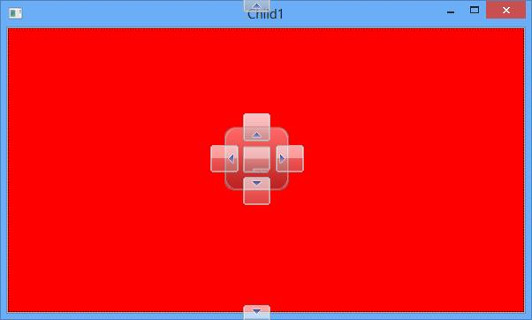

## Auto Hide Window Style

AutoHidden window is constructed by SidePanels and SideTabItems. To customize the AutoHidden window, the following  style and Templates are used as follows:

### SideTabItemTemplate

The template of the SideTabItem of the DockingManager can be customized using the `SideTabItemTemplate` with the TargetType as TabItem.





<ControlTemplate x:Key="SideTabItemTemplate" TargetType="{x:Type TabItem}">

<Border Name="Border" CornerRadius="5,5,0,0"
        BorderBrush="{StaticResource TabItemBorderBrush}" BorderThickness="1">

<Border.LayoutTransform>

<RotateTransform Angle="90" />

</Border.LayoutTransform>

<Grid>

<DockPanel LastChildFill="True" Background="Orange">

<Rectangle Fill="Transparent"  Height="Auto" Width="Auto" RadiusX="5" RadiusY="5" />

<Border Name="Icon" DockPanel.Dock="Left" Margin="1" Width="16"
        Background="{Binding Path=(TabItem.Content).
        (Syncfusion:DockingManager.Icon), RelativeSource={RelativeSource TemplatedParent}}" />

<ContentPresenter x:Name="ContentSite" VerticalAlignment="Center" HorizontalAlignment="Center"
                  ContentSource="Header" Margin="2,2,2,2" RecognizesAccessKey="True"
                  ContentTemplate="{Binding Path=(Border.DataContext).(Syncfusion:DockingManager.HeaderTemplate),
                  ElementName=Border}" ContentTemplateSelector="{StaticResource TabItemTrimmingTemplate}"
                  TextBlock.Foreground={StaticResource Default.TabForeground}"/>

</DockPanel>

</Grid>

</Border>

</ControlTemplate>





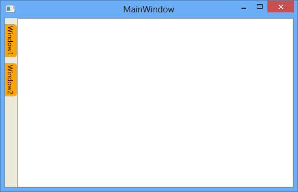

### SideItemStyle

The style for the sideTabItem can be changed using `SideItemStyle` by settings its TargetType as TabItem





<syncfusion:DockingManager  x:Name="DockingManager1" UseDocumentContainer="True" ContainerMode="TDI" >

<syncfusion:DockingManager.SideItemStyle>

</syncfusion:DockingManager.SideItemStyle>

<ContentControl syncfusion:DockingManager.Header="Child1" syncfusion:DockingManager.State="Dock"/>

<ContentControl syncfusion:DockingManager.Header="Child2" syncfusion:DockingManager.State="AutoHidden"/>

<ContentControl syncfusion:DockingManager.Header="Child3" syncfusion:DockingManager.State="Dock"/>

</syncfusion:DockingManager>





### SidePanelTemplate

SidePanel template in AutoHidden window can changed using `SidePanelTemplate` with the TargetType SidePanel.





<ControlTemplate x:Key="SidePanelTemplate" TargetType="{x:Type Syncfusion:SidePanel}" >
	
<Canvas KeyboardNavigation.TabNavigation="Local" ClipToBounds="False" >
	
<Border Name="PART_BorderName"  Height="{TemplateBinding ActualHeight}" Width="{TemplateBinding ActualWidth}"
        Margin="0" ClipToBounds="True" Background="Orange"Panel.ZIndex="1" KeyboardNavigation.TabIndex="1"
        BorderThickness="{Binding Path=SidePanelBorderThickness, RelativeSource={RelativeSource FindAncestor,
        AncestorType={x:Type Syncfusion:DockingManager}}}" BorderBrush="{StaticResource TabItemBorderBrush}">

<Border.ContextMenu>

<ContextMenu Style="{StaticResource SideContextMenuStyle}" ItemsSource="{TemplateBinding TabChildren}"/>

</Border.ContextMenu>

<Syncfusion:DirectTabPanel Name="PART_PanelName" KeyboardNavigation.TabNavigation="Local" IsItemsHost="True"/>

</Border>

<Syncfusion:OpacityDockPanel LastChildFill="True"
                             Opacity="{Binding Path=ContentOpacity,
                             RelativeSource={RelativeSource TemplatedParent}}"/>
							 
</ Canvas >

</ControlTemplate>





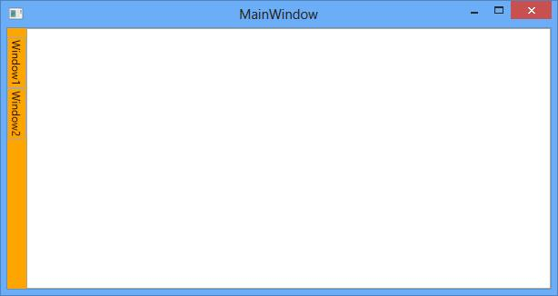

###  SidePanelStyle

The style for the SidePanel of the DockingManager can be customized using the `SidePanelStyle` property with the TargetType as SidePanel.





<syncfusion:DockingManager  x:Name="DockingManager1" UseDocumentContainer="True" ContainerMode="TDI">
	
<syncfusion:DockingManager.SidePanelStyle>
	

	  
</syncfusion:DockingManager.SidePanelStyle>

<ContentControl syncfusion:DockingManager.Header="Child1" syncfusion:DockingManager.State="AutoHidden"/>

<ContentControl syncfusion:DockingManager.Header="Child2"syncfusion:DockingManager.State="Document"/>

<ContentControl syncfusion:DockingManager.Header="Child3"syncfusion:DockingManager.State="Document"/> 
	
</syncfusion:DockingManager>





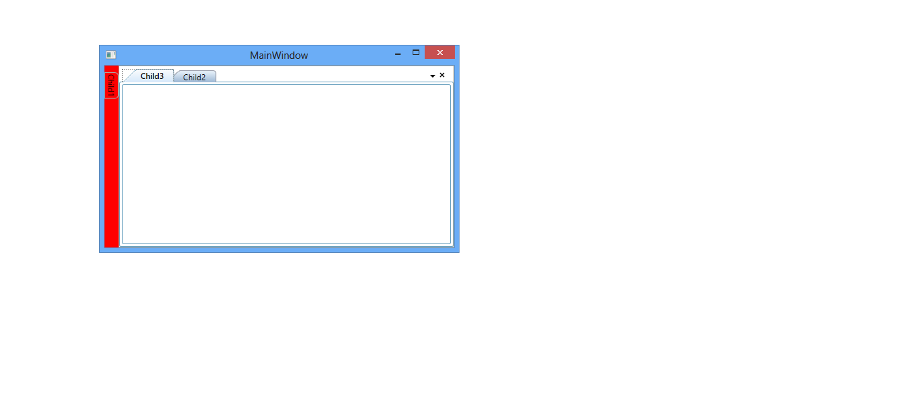

## Drag Provider Style

DragProviders are appear while dragging a window. DragProviders are displayed for providing options to dock the FloatWindow while dragging and this drag provider button templates can be changed by the following templates.

### BottomDragProvider

The BottomDragProvider is used to dock the children of the Docking in the bottom side and it’s template can be customized using the `BottomDragProviderTemplate` by setting its TargetType as ContentControl.





<syncfusion:DockingManager  x:Name="DockingManager1" UseDocumentContainer="True" EnableDocumentTabHeaderEdit="True" >

<syncfusion:DockingManager.BottomDragProvider>

<ControlTemplate TargetType="{x:Type ContentControl}">

<Image Name="Img" syncfusion:DockPreviewManagerVS2005.ProviderAction="GlobalLeft" Source="Images\synclogo.png" />

<ControlTemplate.Triggers>

<DataTrigger Binding="{Binding Path=IsSideButtonActive,
             RelativeSource={RelativeSource FindAncestor,
             AncestorType={x:Type syncfusion:DockPreviewMainButtonVS2005}}}" Value="true">

<Setter TargetName="Img" Property="Source" Value="Images\synclogo.png"/>

</DataTrigger>

</ControlTemplate.Triggers>

</ControlTemplate>

</syncfusion:DockingManager.BottomDragProvider>

<ContentControlsyncfusion:DockingManager.Header="Child1" syncfusion:DockingManager.State="Dock"/>

</syncfusion:DockingManager>





### LeftDragProvider

The LeftDragProvider is used to dock the dock window to the left side and it can be customized using the `LeftDragProvider` property that helps to customize the template for the Left DragProvider by setting its Target as ContentControl. The same has been explained below:




<syncfusion:DockingManager x:Name="DockingManager1" UseDocumentContainer="True" EnableDocumentTabHeaderEdit="True" >

<syncfusion:DockingManager.LeftDragProvider>

<ControlTemplate TargetType="{x:Type ContentControl}">

<Image Name="Img" syncfusion:DockPreviewManagerVS2005.ProviderAction="GlobalLeft" Source="Images\synclogo.png" />

<ControlTemplate.Triggers>

<DataTrigger Binding="{Binding Path=IsSideButtonActive,
            RelativeSource={RelativeSource FindAncestor,
            AncestorType={x:Type syncfusion:DockPreviewMainButtonVS2005}}}" Value="true">

<Setter TargetName="Img" Property="Source" Value="Images\synclogo.png"/>

</DataTrigger>

</ControlTemplate.Triggers>

</ControlTemplate>

</syncfusion:DockingManager.LeftDragProvider>

<ContentControl syncfusion:DockingManager.Header="Child1" syncfusion:DockingManager.State="Dock"/>

</syncfusion:DockingManager> 





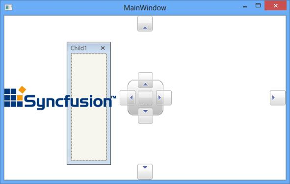

### RightDragProvider

To dock the DockWindow to the right side, RightDragProvider is used. It can be customized using the `RightDragProviderTemplate` with the TargetType as ContentControl.





<syncfusion:DockingManager  x:Name="DockingManager1" UseDocumentContainer="True" EnableDocumentTabHeaderEdit="True" >

<syncfusion:DockingManager.RightDragProvider>

<ControlTemplate TargetType="{x:Type ContentControl}">

<Image Name="Img" syncfusion:DockPreviewManagerVS2005.ProviderAction="GlobalLeft" Source="Images\synclogo.png" />

<ControlTemplate.Triggers>

<DataTrigger Binding="{Binding Path=IsSideButtonActive,
             RelativeSource={RelativeSource FindAncestor,
             AncestorType={x:Type syncfusion:DockPreviewMainButtonVS2005}}}" Value="true">

<Setter TargetName="Img" Property="Source" Value="Images\synclogo.png"/>

</DataTrigger>

</ControlTemplate.Triggers>

</ControlTemplate>

</syncfusion:DockingManager.RightDragProvider>

<ContentControl syncfusion:DockingManager.Header="Child1" syncfusion:DockingManager.State="Dock"/>

</syncfusion:DockingManager>





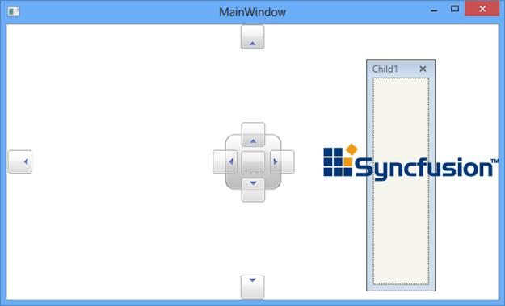

### TopDragProvider

To dock the DockWindow at top, the TopDragProvider is used. It can be customized using the `TopDragProviderTemplate` with the TargetType as ContentControl.





<syncfusion:DockingManager  x:Name="DockingManager1" UseDocumentContainer="True" EnableDocumentTabHeaderEdit="True" >

<syncfusion:DockingManager.LeftDragProvider>

<ControlTemplate TargetType="{x:Type ContentControl}">

<Image Name="Img" syncfusion:DockPreviewManagerVS2005.ProviderAction="GlobalLeft" Source="Images\synclogo.png" />

<ControlTemplate.Triggers>

<DataTrigger Binding="{Binding Path=IsSideButtonActive,
             RelativeSource={RelativeSource FindAncestor,
             AncestorType={x:Type syncfusion:DockPreviewMainButtonVS2005}}}" Value="true">

<Setter TargetName="Img" Property="Source" Value="Images\synclogo.png"/>

</DataTrigger>

</ControlTemplate.Triggers>

</ControlTemplate>

</syncfusion:DockingManager.LeftDragProvider>

<ContentControl syncfusion:DockingManager.Header="Child1" syncfusion:DockingManager.State="Dock"/>

</syncfusion:DockingManager>





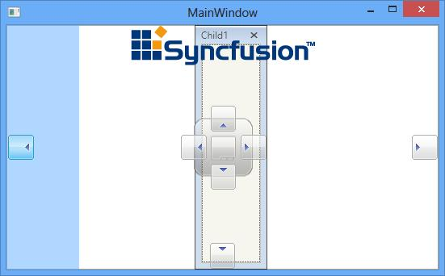

### CenterDragProvider

CenterDragProvider is used to dock the children of the DockingManager at the center Position and its template can be customized using the property `CenterDragProvider`.





<syncfusion:DockingManager  x:Name="DockingManager1" UseDocumentContainer="True">            
	
<syncfusion:DockingManager.CenterDragProvider>

<ControlTemplate TargetType="{x:Type ContentControl}">

<Image Name="Img" syncfusion:DockPreviewManagerVS2005.ProviderAction="GlobalLeft" Source="Images\synclogo.png" />

<ControlTemplate.Triggers>

<DataTrigger Binding="{Binding Path=IsSideButtonActive,
             RelativeSource={RelativeSource FindAncestor,
             AncestorType={x:Type syncfusion:DockPreviewMainButtonVS2005}}}" Value="true">

<Setter TargetName="Img" Property="Source" Value="Images\synclogo.png"/>

</DataTrigger>

</ControlTemplate.Triggers>

</ControlTemplate>

</syncfusion:DockingManager.CenterDragProvider>

<ContentControl syncfusion:DockingManager.Header="Child1" syncfusion:DockingManager.State="Dock"/>

</syncfusion:DockingManager>





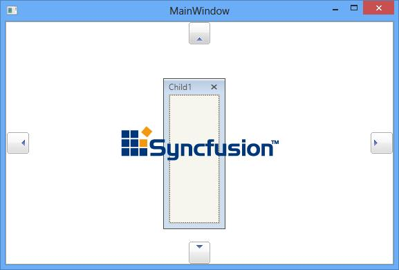

## DocumentTabControlStyle

Document state in DockingManager used the DocumentTabControl and its style can be customized using `DocumentTabControlStyle` with the TargetType as DocumentTabControl.





<syncfusion:DockingManager  x:Name="DockingManager1" UseDocumentContainer="True">

<syncfusion:DockingManager.DocumentTabControlStyle>

</syncfusion:DockingManager.DocumentTabControlStyle>

<ContentControl syncfusion:DockingManager.Header="Child1" syncfusion:DockingManager.State="Document"/>

<ContentControl syncfusion:DockingManager.Header="Child2" syncfusion:DockingManager.State="Document"/>

<ContentControl syncfusion:DockingManager.Header="Child3" syncfusion:DockingManager.State="Document"/>

</syncfusion:DockingManager>





## DocumentTabItemStyle

Each Document TabItem in DockingManager constructed by the TabItemExt and its style can be customized using `DocumentTabItemStyle` with the TargetType as TabItemExt.





<syncfusion:DockingManager  x:Name="DockingManager1" UseDocumentContainer="True"   >

<syncfusion:DockingManager.DocumentTabItemStyle>

</syncfusion:DockingManager.DocumentTabItemStyle>

<ContentControl syncfusion:DockingManager.Header="Child1" syncfusion:DockingManager.State="Document"/>

<ContentControl syncfusion:DockingManager.Header="Child2" syncfusion:DockingManager.State="Document"/>

<ContentControl syncfusion:DockingManager.Header="Child3" syncfusion:DockingManager.State="Document"/> 
	
</syncfusion:DockingManager>





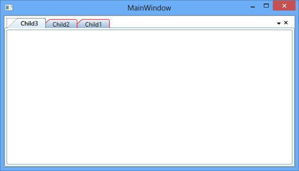

## DocumentMDIHeaderStyle

The header style for the MDI Document can be changed using the `DocumentMDIHeaderStyle` with the TargetType as DocumentHeader.





<syncfusion:DockingManager  x:Name="DockingManager1" UseDocumentContainer="True" ContainerMode="MDI">
	
<syncfusion:DockingManager.DocumentMDIHeaderStyle>
	

</syncfusion:DockingManager.DocumentMDIHeaderStyle>

<ContentControl syncfusion:DockingManager.Header="Child1" syncfusion:DockingManager.State="Document"/>

<ContentControl syncfusion:DockingManager.Header="Child2" syncfusion:DockingManager.State="Document"/>

<ContentControl syncfusion:DockingManager.Header="Child3" syncfusion:DockingManager.State="Document"/>
	
</syncfusion:DockingManager>





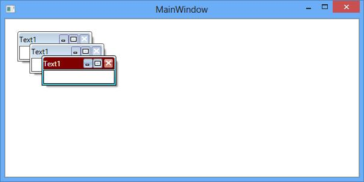

## TabControl style

TabControl inside the Tabbed DockWindow can be customized using `TabControlStyle` with the TargetType TabControl in the DockingManager





<Syncfusion:DockingManager  x:Name="DockingManager1" UseDocumentContainer="True"   >

<Syncfusion:DockingManager.TabControlStyle>

</Syncfusion:DockingManager.TabControlStyle>

<ContentControl Syncfusion:DockingManager.State="Dock" Syncfusion:DockingManager.Header="Child1" />

<ContentControl Syncfusion:DockingManager.SideInDockedMode="Tabbed"
                Syncfusion:DockingManager.Header="Child2" Syncfusion:DockingManager.TargetNameInDockedMode="Content1">
				
</ContentControl>

</Syncfusion:DockingManager>




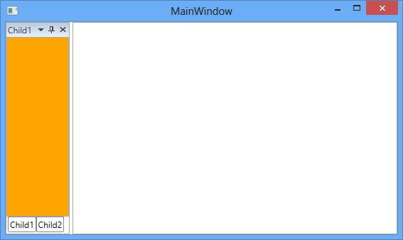

### TabItemStyle

The style for the Tabbed children of DockingManager can be customized using the `TabItemStyle` property with the Target Type as TabItem.





<Syncfusion:DockingManager  x:Name="DockingManager1" UseDocumentContainer="True">   
	
<Syncfusion:DockingManager.TabItemStyle>

</Syncfusion:DockingManager.TabItemStyle>

<ContentControl Syncfusion:DockingManager.State="Dock" x:Name="Content1" Syncfusion:DockingManager.Header="Child1"/>

<ContentControl Syncfusion:DockingManager.Header="Child2"
                Syncfusion:DockingManager.SideInDockedMode="Tabbed"
                Syncfusion:DockingManager.TargetNameInDockedMode="Content1"/>

</Syncfusion:DockingManager>





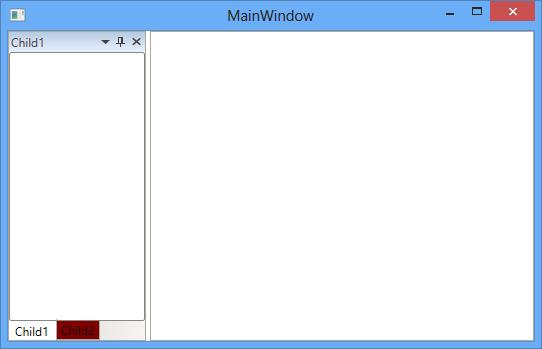

