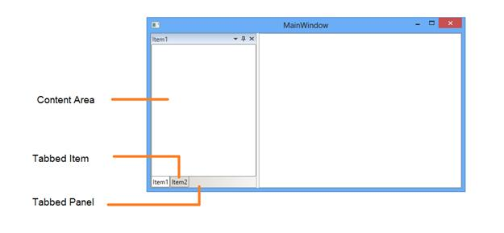

## Tabbed Window

To make the children as Tabbed windows, you can use the TargetName and set the side value as **“Tabbed”** using the property **SideInDockedMode**.

###  Tab alignments

The tabs of the Docked window are placed at the bottom, by default. To place the tabs of the docked window at different sides set the property **“DockTabAlignment”** with desired values such as **Top**, **Bottom**, **Left** and **Right**. 

* DockTabAlignment as **Bottom**

* Setting **DockTabAlignment** as Left.


<syncfusion:DockingManager x:Name="DockingManager1" DockTabAlignment="Left">

<ContentControl  x:Name="Content1" syncfusion:DockingManager.Header="Item1" /> <ContentControl x:Name="Content2" syncfusion:DockingManager.Header="Item2"/>                                      syncfusion:DockingManager.SideInDockedMode="Tabbed"

syncfusion:DockingManager.TargetNameInDockedMode="Content1"/> 

</syncfusion:DockingManager>



* Setting DockTabAlignment as Right


<syncfusion:DockingManager x:Name="DockingManager1" DockTabAlignment="Right">

<ContentControl  x:Name="Content1" syncfusion:DockingManager.Header="Item1"/>  

<ContentControl x:Name="Content2" syncfusion:DockingManager.Header="Item2"                                       syncfusion:DockingManager.SideInDockedMode="Tabbed"

syncfusion:DockingManager.TargetNameInDockedMode="Content1"/>                                                                                                   </syncfusion:DockingManager>



* Setting DockTabAlignment as Top


<syncfusion:DockingManager x:Name="DockingManager1" DockTabAlignment="Top">

<ContentControl  x:Name="Content1" syncfusion:DockingManager.Header="Item1"/> 

<ContentControl x:Name="Content2" syncfusion:DockingManager.Header="Item2"/>                                      syncfusion:DockingManager.SideInDockedMode="Tabbed"

syncfusion:DockingManager.TargetNameInDockedMode="Content1"/>  

</syncfusion:DockingManager>



### Closing a Tabbed window

Tabbed window provides two different closing behaviors. They are **CloseActive** and **CloseAll** modes of **CloseTabs** property.

* **CloseActive** **–** Used to close the active element of Tabbed window.


<syncfusion:DockingManager x:Name="DockingManager1" CloseTabs="CloseActive">

<ContentControl x:Name="Content1" syncfusion:DockingManager.Header="Item1"/>  

<ContentControl x:Name="Content2" syncfusion:DockingManager.Header="Item2"                                    syncfusion:DockingManager.SideInDockedMode="Tabbed"                                      syncfusion:DockingManager.TargetNameInDockedMode="Content1"/>  

<ContentControl x:Name="Content3" syncfusion:DockingManager.Header="Item3"                                       syncfusion:DockingManager.SideInDockedMode="Tabbed"                                       syncfusion:DockingManager.TargetNameInDockedMode="Content1"/>                         

</syncfusion:DockingManager>



 **CloseAll** **–** Used to close all the Tabbed window.


<syncfusion:DockingManager x:Name="DockingManager1" CloseTabs="CloseAll">

<ContentControl x:Name="Content1" syncfusion:DockingManager.Header="Item1"/>  

<ContentControl x:Name="Content2" syncfusion:DockingManager.Header="Item2"                                    syncfusion:DockingManager.SideInDockedMode="Tabbed"                                      syncfusion:DockingManager.TargetNameInDockedMode="Content1"/>  

<ContentControl x:Name="Content3" syncfusion:DockingManager.Header="Item3"                                       syncfusion:DockingManager.SideInDockedMode="Tabbed"                                       syncfusion:DockingManager.TargetNameInDockedMode="Content1"/>                         

</syncfusion:DockingManager>


