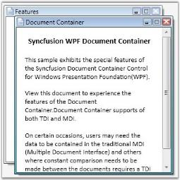

# Getting Started

This section guides you on getting started with DocumentContainer control. It covers the following topics:

{{ '' | markdownify }}
{:.image }

This help section will demonstrate all the important properties of the DocumentContainer that will help the end-user to know about all the available features.

## Why use DocumentContainer control?

Here are some highlights about our Document Container control.

* Provides options for both MDI and TDI container mode
* Various window switching styles. CTRL+TAB keyboard shortcut is used to easily navigate through the windows
* Support for various Skins 
* State persistence; the Document Container is used to load and save data in IS, BIN, and XML
* A large set of properties, methods, and events are available for easy customization
* Keyboard Support - Re-sizing and moving the Document Container using the keyboard
## Class Diagram

The class diagram for Document Container is illustrated below. 

{{ '' | markdownify }}
{:.image }

## Creating Document Container control

There are two possible ways of creating a simple DocumentContainer control. 

Through Designer

To create the Document Container control through designer, drag a Document Container control from the toolbox onto the design area.

{{ '' | markdownify }}
{:.image }

Programmatically

To create the Document Container programmatically, use the following XAML or C# code.

<table>
<tr>
<td>
[XAML]<!-- Adding Document Container --><syncfusion:DocumentContainer Name="DocContainer"/></td></tr>
<tr>
<td>
[C#]//Creating instance of document containerDocumentContainer DocContainer = new DocumentContainer();//Adding control to the windowthis.Content = DocContainer;</td></tr>
</table>

