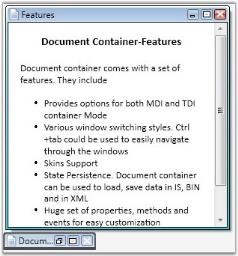

# Window States of MDIWindow

## Setting Window State

There are three possible window states of MDI windows for the Document Container control. They are as follows.

* Maximized
* Minimized
* Normal

To set the MDI window state to "minimized", use the below code snippet. FlowDocumentScrollViewer is considered as an element of the Document Container in the below mentioned example.



<!-- Adding Document Container -->

<syncfusion:DocumentContainer Name="DocContainer" Mode="MDI">

<FlowDocumentScrollViewer syncfusion:DocumentContainer.MDIWindowState="Minimized" >

</FlowDocumentScrollViewer>

…....

…....

</syncfusion:DocumentContainer>



## StateChaning Event of MDIWindow

`MDIWindowStateChanging` event occurs before the State of the MDIWindow gets changed. State changing of MDIWindow can be handled by setting e.Cancel as true.




<syncfusion:DocumentContainer Name="DocContainer" Mode="MDI" MDIWindowStateChanging="DocContainer_MDIWindowStateChanging">

<FlowDocumentScrollViewer syncfusion:DocumentContainer.Header="Window1" >

</FlowDocumentScrollViewer>
<FlowDocumentScrollViewer syncfusion:DocumentContainer.Header="Window2" >

</FlowDocumentScrollViewer>

</syncfusion:DocumentContainer>




 private void DocContainer_MDIWindowStateChanging(object sender, MDIWindowStateChangingEventArgs e)
        {
            if (e.NewState == MDIWindowState.Maximized)
                e.Cancel = true;
        }



