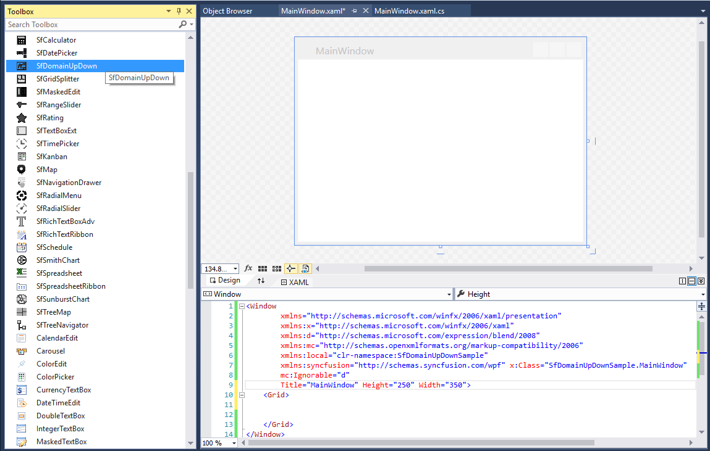

# Getting Started with WPF SfDomainUpDown 

This section provides you an overview for working with [SfDomainUpDown](https://help.syncfusion.com/cr/wpf/Syncfusion.Windows.Controls.Input.SfDomainUpDown.html) for WPF and also provides a walk through to configure `SfDomainUpDown` control in real time scenario.

## Assembly deployment

Refer to the [control dependencies](https://help.syncfusion.com/wpf/control-dependencies#sfdomainupdown) section to get the list of assemblies or NuGet package needs to be added as a reference to use the control in any application.

Further information on installing the NuGet package can be found in the following link in a WPF application. [How to install nuget packages](https://help.syncfusion.com/wpf/visual-studio-integration/nuget-packages). You can also use [Syncfusion Reference Manager](https://help.syncfusion.com/wpf/visual-studio-integration/visual-studio-extensions/add-references) to refer the SfDomainUpDown's dependent assemblies.

## Creating Application with SfDomainUpDown control

In this walk through, you will create WPF application that contains [SfDomainUpDown](https://help.syncfusion.com/cr/wpf/Syncfusion.Windows.Controls.Input.SfDomainUpDown.html) control.

1. [Creating project](#Creating-the-project)
2. [Adding control via designer](#Adding-control-via-designer)
3. [Adding control manually in XAML](#Adding-control-manually-in-XAML)
4. [Adding control manually in C#](#Adding-control-manually-in-C#)
5. [Populating by data binding](#Populating-by-DataBinding)

## Creating project

Create a new WPF project to show the `SfDomainUpDown` control in Visual Studio.

## Adding control via designer

The [SfDomainUpDown](https://help.syncfusion.com/cr/wpf/Syncfusion.Windows.Controls.Input.SfDomainUpDown.html) control can be added to the application by dragging it from Toolbox and dropping it in designer. The required [assemblies](https://help.syncfusion.com/wpf/control-dependencies#sfdomainupdown) will be added automatically.

## Adding control manually in XAML

To add the control manually in XAML page, follow the given steps:

1.Add the below required assembly references to the project,

* Syncfusion.SfInput.WPF
* Syncfusion.SfShared.WPF

2.Import Syncfusion WPF schema **http://schemas.syncfusion.com/wpf** in XAML page or Syncfusion.Windows.Tools.Controls namespace.

3.Declare [SfDomainUpDown](https://help.syncfusion.com/cr/wpf/Syncfusion.Windows.Controls.Input.SfDomainUpDown.html) in XAML page.





<Window
        xmlns="http://schemas.microsoft.com/winfx/2006/xaml/presentation"
        xmlns:x="http://schemas.microsoft.com/winfx/2006/xaml"
        xmlns:d="http://schemas.microsoft.com/expression/blend/2008"
        xmlns:mc="http://schemas.openxmlformats.org/markup-compatibility/2006"
        xmlns:local="clr-namespace:GettingStartedComboBox"
        xmlns:syncfusion="http://schemas.syncfusion.com/wpf" x:Class="GettingStartedComboBox.MainWindow"
        mc:Ignorable="d"
        Title="MainWindow" Height="450" Width="800">
    <Grid>
        <syncfusion:SfDomainUpDown Height="30" Width="150" Value="40" />
    </Grid>
</Window>





## Adding control manually in C#

To add the control manually in C#, follow the given steps:

1.Add the below required assembly references to the project,

* Syncfusion.SfInput.WPF
* Syncfusion.SfShared.WPF

2.Import `SfDomainUpDown` namespace **Syncfusion.Windows.Controls.Input**.

3.Create `SfDomainUpDown` control instance and add it to the page.





using System.Windows;
using Syncfusion.Windows.Controls.Input;
namespace ComboBox
{
    /// 

    /// Interaction logic for MainWindow.xaml
    /// 

    public partial class MainWindow : Window
    {
        public MainWindow()
        {
            InitializeComponent();
            SfDomainUpDown sfDomainUpDown1 = new SfDomainUpDown();
            this.Content = sfDomainUpDown1;
            sfDomainUpDown1.Height = 30;
            sfDomainUpDown1.Width = 150;
            sfDomainUpDown1.Value = 40;
        }
    }
}




## Populating by DataBinding

You can populate the [SfDomainUpDown](https://help.syncfusion.com/cr/wpf/Syncfusion.Windows.Controls.Input.SfDomainUpDown.html) control using the [ItemsSource](https://docs.microsoft.com/en-us/dotnet/api/system.windows.controls.itemscontrol.itemssourceproperty?view=netframework-4.7.2) property.

1.You can create data object class named **Employee** as Model and declare properties as shown below,




public class Employee
{
    private string name;
    private string email;

    public string Email
    {
        get { return email; }
        set { email = value; }
    }

    public string Name
    {
        get { return name; }
        set { name = value; }
    }
}




2.You can create a **ViewModel** class with several data objects in constructor.




public class ViewModel
{
	private List<Employee> employees;
	public List<Employee> Employees
	{
		get { return employees; }
		set { employees = value; }
	}
	public ViewModel()
	{
		Employees = new List<Employee>();
		populateItem();
	}
	private void populateItem()
	{
		Employees.Add(new Employee { Name = "Lucas", Email = "lucas@syncfusion.com" });
		Employees.Add(new Employee { Name = "James", Email = "james@syncfusion.com" });
		Employees.Add(new Employee { Name = "Jacob", Email = "jacob@syncfusion.com" });
	}
}




3.You can bind the Employees property from ViewModel class to ItemSource property of `SfDomainUpDown` control.




<syncfusion:SfDomainUpDown x:Name="domainUpDown" HorizontalAlignment="Center" VerticalAlignment="Center" Width="200" ItemsSource="{Binding Employees}"/>




## Spin button alignment

You can customize the position of spin button’s position in the [SfDomainUpDown](https://help.syncfusion.com/cr/wpf/Syncfusion.Windows.Controls.Input.SfDomainUpDown.html) control  using the [SpinButtonsAlignment](https://help.syncfusion.com/cr/wpf/Syncfusion.Windows.Controls.Input.SfDomainUpDown.html#Syncfusion_Windows_Controls_Input_SfDomainUpDown_SpinButtonsAlignment) property.




<syncfusion:SfDomainUpDown x:Name="domainUpDown" Height="35" Width="150" SpinButtonsAlignment="Right" Value="James" />




SfDomainUpDown domainUpDown1 = new SfDomainUpDown();
domainUpDown1.Height = 30;
domainUpDown1.Width = 150;
domainUpDown1.SpinButtonsAlignment = Syncfusion.Windows.Controls.SpinButtonsAlignment.Right;




1.Right

2.Left

3.Both

