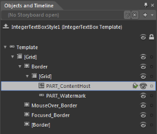
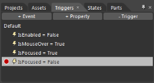

# Appearance           

## Setting VisualStyle for DoubleTextBox

The appearance of the DoubleTextBox control can be customized by using the VisualStyle property. The following are the various built-in visual styles for DoubleTextBox control.

* Blend
* Office2003
* Office2007Blue
* Office2007Black
* Office2007Silver
* ShinyBlue
* ShinyRed
* SyncOrange
* VS2010
* Metro
* Transparent

## Blendability

You can edit the DoubleTextBox Template to give a nice look and feel by using Expression Blend.

The steps to edit the DoubleTextBox Template by using Expression Blend are as follows:

1. Create a simple WPF application in Expression Blend.
2. Drag and drop the DoubleTextBox into the application from the Assets tab.

   

3. After creating the DoubleTextBox, select the DoubleTextBox and navigate to Object -> Edit Style -> Edit a Copy, to edit the Template of the DoubleTextBox.

   

   Another way to edit the Template is as follows:

4. In Object and Timeline, right-click the DoubleTextBox control and select the Edit Template option, as displayed below.

   

   This will open a dialog (below) where you can give your style a name and define exactly where you’d like to store it.

   

   

The result of these steps is an XAML, which is placed within your application. This XAML represents the default style for the DoubleTextBox.



<syncfusion:DoubleTextBox Height="25" Width="150" 

Style="{StaticResource DoubleTextBoxStyle1}"/>   



All template items can now be found in the Objects and Timeline window.

Now you can replace the existing Template setter and Triggers with your own creation. In the Triggers tab you can select the Trigger and customize it as you want.

Here is a simple example to customize the UnFocused state of the DoubleTextBox: 



<Trigger Property="IsFocused" Value="False">

<Setter Property="Background" TargetName="Border" Value="LightGray"/>

</Trigger>



When a control lost the Focus, the Background color of the DoubleTextBox will change to LightGray. Similarly you can customize every state and property in Expression Blend.

