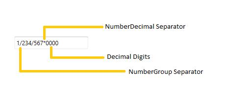

# Culture and Number Formats

## Culture

DoubleTextBox provides globalization support through the [Culture](https://docs.microsoft.com/en-us/dotnet/api/system.globalization.cultureinfo.currentculture?view=netframework-4.7.2) property. The [Culture](https://docs.microsoft.com/en-us/dotnet/api/system.globalization.cultureinfo.currentculture?view=netframework-4.7.2) property used to format the values based on the respective culture.





<syncfusion:DoubleTextBox x:Name="doubleTextBox" Height="25"
                         Width="150" Culture="en-US" Value="1234567"/>





DoubleTextBox doubleTextBox = new DoubleTextBox();
doubleTextBox.Width = 150;
doubleTextBox.Height = 25;
doubleTextBox.Value = 1234567;
doubleTextBox.Culture = new CultureInfo("en-US");





Dim doubleTextBox As Syncfusion.Windows.Shared.DoubleTextBox =  New Syncfusion.Windows.Shared.DoubleTextBox() 
doubleTextBox.Width = 150
doubleTextBox.Height = 25
doubleTextBox.Value = 1234567
doubleTextBox.Culture = New CultureInfo("en-US")





## Number format

The Number Format can be customize either by using the [NumberFormat](https://help.syncfusion.com/cr/cref_files/wpf/Syncfusion.Shared.Wpf~Syncfusion.Windows.Shared.EditorBase~NumberFormat.html) property or the [NumberGroupSeparator](https://help.syncfusion.com/cr/cref_files/wpf/Syncfusion.Shared.Wpf~Syncfusion.Windows.Shared.DoubleTextBox~NumberGroupSeparator.html), [NumberGroupSizes](https://help.syncfusion.com/cr/cref_files/wpf/Syncfusion.Shared.Wpf~Syncfusion.Windows.Shared.DoubleTextBox~NumberGroupSizes.html), [NumberDecimalDigits](https://help.syncfusion.com/cr/cref_files/wpf/Syncfusion.Shared.Wpf~Syncfusion.Windows.Shared.DoubleTextBox~NumberDecimalDigits.html), and [NumberDecimalSeparator](https://help.syncfusion.com/cr/cref_files/wpf/Syncfusion.Shared.Wpf~Syncfusion.Windows.Shared.DoubleTextBox~NumberDecimalSeparator.html) properties of DoubleTextBox.

The following code illustrate how to customize the number format using NumberFormat property.

The Namespace used for NumberFormatInfo as follows:





<Window x:Class="Application_New.MainWindow"
xmlns="http://schemas.microsoft.com/winfx/2006/xaml/presentation"
xmlns:x="http://schemas.microsoft.com/winfx/2006/xaml"
xmlns:numberformat="clr-namespace:System.Globalization;assembly=mscorlib"
xmlns:syncfusion="http://schemas.syncfusion.com/wpf"
Title="MainWindow" Height="350" Width="525">









using System.Globalization;









<syncfusion:DoubleTextBox x:Name="doubleTextBox" Height="25"
                          Width="200" Value="123456789012345">

<syncfusion:DoubleTextBox.NumberFormat>

<numberformat:NumberFormatInfo NumberGroupSeparator="/"
              NumberDecimalDigits="4" NumberDecimalSeparator="*"/>
</syncfusion:DoubleTextBox.NumberFormat>
</syncfusion:DoubleTextBox>





DoubleTextBox doubleTextBox = new DoubleTextBox();
doubleTextBox.Width = 150;
doubleTextBox.Height = 25;
doubleTextBox.Value = 1234567;
doubleTextBox.NumberFormat = new NumberFormatInfo()
{
    NumberGroupSeparator = "/",
    NumberDecimalDigits = 4,
    NumberDecimalSeparator = "*"
};





Dim doubleTextBox As DoubleTextBox =  New DoubleTextBox() 
doubleTextBox.Width = 150
doubleTextBox.Height = 25
doubleTextBox.Value = 1234567
doubleTextBox.NumberFormat = Function NumberFormatInfo() As Shadows

NumberGroupSeparator = "/",
NumberDecimalDigits = 4,
NumberDecimalSeparator = "*"





The following code illustrate how to set [NumberGroupSeparator](https://help.syncfusion.com/cr/cref_files/wpf/Syncfusion.Shared.Wpf~Syncfusion.Windows.Shared.DoubleTextBox~NumberGroupSeparator.html), [NumberDecimalDigits](https://help.syncfusion.com/cr/cref_files/wpf/Syncfusion.Shared.Wpf~Syncfusion.Windows.Shared.DoubleTextBox~NumberDecimalDigits.html) and [NumberDecimalSeparator](https://help.syncfusion.com/cr/cref_files/wpf/Syncfusion.Shared.Wpf~Syncfusion.Windows.Shared.DoubleTextBox~NumberDecimalSeparator.html).





<syncfusion:DoubleTextBox x:Name="doubleTextBox" Height="25"
                          Width="200" Value="123456789012345"
                          NumberGroupSeparator="/" NumberDecimalDigits="4"
                          NumberDecimalSeparator="*"/>





DoubleTextBox doubleTextBox = new DoubleTextBox();
doubleTextBox.Width = 170;
doubleTextBox.Height = 25;
doubleTextBox.Value = 123456789012345;
doubleTextBox.NumberGroupSeparator = "/";
doubleTextBox.NumberDecimalSeparator = "*";
doubleTextBox.NumberDecimalDigits = 4;





Dim doubleTextBox As DoubleTextBox =  New DoubleTextBox() 
doubleTextBox.Width = 170
doubleTextBox.Height = 25
doubleTextBox.Value = 123456789012345
doubleTextBox.NumberGroupSeparator = "/"
doubleTextBox.NumberDecimalSeparator = "*"
doubleTextBox.NumberDecimalDigits = 4





