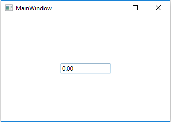
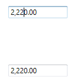
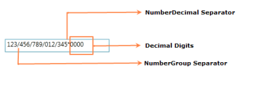

# Getting Started with DoubleTextBox

## Assembly deployment

Refer to the [control dependencies](https://help.syncfusion.com/wpf/control-dependencies#doubletextbox) section to get the list of assemblies or NuGet package that needs to be added as a reference to use the control in any application.

You can find more details about installing the NuGet package in a WPF application in the following link: 

[How to install nuget packages](https://help.syncfusion.com/wpf/nuget-packages)

## Add WPF DoubleTextBox through designer

The DoubleTextBox control can be added to an application by dragging it from the toolbox to a designer view. The Syncfusion.Shared.WPF assembly reference will be added automatically.

## Add WPF DoubleTextBox manually Via XAML

To add the control manually in XAML, follow the given steps:

1.	Add the **Syncfusion.Shared.WPF** assembly reference to the project.
2.	Import Syncfusion WPF schema **http://schemas.syncfusion.com/wpf** in the XAML page.
3.	Declare the DoubleTextBox control in the XAML page.



<Window xmlns="http://schemas.microsoft.com/winfx/2006/xaml/presentation"
        xmlns:x="http://schemas.microsoft.com/winfx/2006/xaml"
        xmlns:syncfusion="http://schemas.syncfusion.com/wpf" 
        x:Class="DoubleTextBoxSample.MainWindow"
        Title="DoubleTextBox Sample" Height="350" Width="525">
    <Grid>
        <!--Adding DoubleTextBox control -->
        <syncfusion:DoubleTextBox x:Name="doubleTextBox" Width="100" Height="100" VerticalAlignment="Center" HorizontalAlignment="Center"/>
    </Grid>
</Window>



## Add WPF DoubleTextBox manually in C\#

To add the control manually in C#, follow the given steps:

1.	Add the **Syncfusion.Shared.WPF** assembly reference to the project. 
2.	Import DoubleTextBox namespace **using Syncfusion.Windows.Shared;**.
3.	Create a DoubleTextBox instance, and add it to the window.



using Syncfusion.Windows.Shared;
namespace DoubleTextBoxSample
{
    /// 

    /// Interaction logic for MainWindow.xaml
    /// 

    public partial class MainWindow : Window
    {
        public MainWindow()
        {
            InitializeComponent();
            //Creating an instance of DoubleTextBox control
            DoubleTextBox doubleTextBox = new DoubleTextBox();
            //Adding DoubleTextBox as window content
            this.Content = doubleTextBox;
        }
    }
}



## Set value

### Value

The [Value](https://help.syncfusion.com/cr/wpf/Syncfusion.Shared.Wpf~Syncfusion.Windows.Shared.DoubleTextBox~Value.html) property is used to set the value for the DoubleTextBox.

N> Do not use the [Text](https://docs.microsoft.com/en-us/dotnet/api/system.windows.controls.textbox.text?redirectedfrom=MSDN&view=netframework-4.7.2#System_Windows_Controls_TextBox_Text) property to set the value for the DoubleTextBox. Use only the [Value](https://help.syncfusion.com/cr/wpf/Syncfusion.Shared.Wpf~Syncfusion.Windows.Shared.DoubleTextBox~Value.html) property





<syncfusion:DoubleTextBox x:Name="doubleTextBox" Width="100" Height="23" Value="100"/>





DoubleTextBox doubleTextBox = new DoubleTextBox();
doubleTextBox.Width = 100;
doubleTextBox.Height = 23;
doubleTextBox.Value = 100;





Dim doubleTextBox As DoubleTextBox =  New DoubleTextBox() 
doubleTextBox.Width = 100
doubleTextBox.Height = 23
doubleTextBox.Value = 100





### Binding Value

Data binding is the process of establishing a connection between the application UI and business logic. Data binding can be unidirectional (source -> target or target <- source) or bidirectional (source <-> target). You can bind data to the DoubleTextBox using the [Value](https://help.syncfusion.com/cr/wpf/Syncfusion.Shared.Wpf~Syncfusion.Windows.Shared.DoubleTextBox~Value.html) property. Refer to the [Data binding](https://help.syncfusion.com/wpf/doubletextbox/dealing-with-doubletextbox#binding-value) section for more details.



<StackPanel>
<syncfusion:DoubleTextBox x:Name="doubleTextBox1" Grid.Row="1" Height="25" Width="100"/>
<syncfusion:DoubleTextBox x:Name="doubleTextBox2" Grid.Row="3" Width="100" Height="25" Value="{Binding ElementName=doubleTextBox1,Path=Value,Mode=TwoWay}" />
</StackPanel>



## Value Changed Notification

[ValueChanged](https://help.syncfusion.com/cr/wpf/Syncfusion.Shared.Wpf~Syncfusion.Windows.Shared.DoubleTextBox~ValueChanged_EV.html) – The event occurs when the [Value](https://help.syncfusion.com/cr/wpf/Syncfusion.Shared.Wpf~Syncfusion.Windows.Shared.DoubleTextBox~Value.html) property of the DoubleTextBox is changed.


 <syncfusion:DoubleTextBox ValueChanged="DoubleTextBox_ValueChanged"/>

 DoubleTextBox doubleTextBox = new DoubleTextBox();
doubleTextBox.ValueChanged += new PropertyChangedCallback(DoubleTextBox_ValueChanged);



You can handle the event as follows:




private void DoubleTextBox_ValueChanged(DependencyObject d, DependencyPropertyChangedEventArgs e)
{
//Insert code to do some operations when value of DoubleTextBox changes.
}




## Step Interval

The [ScrollInterval](https://help.syncfusion.com/cr/wpf/Syncfusion.Shared.Wpf~Syncfusion.Windows.Shared.DoubleTextBox~ScrollInterval.html) property is used to set the Step Interval value of DoubleTextBox. Based on the `ScrollInterval` value, DoubleTextBox change it's value up or down via Mouse Scrolling and Up or Down key press by enabling the [IsScrollingOnCircle](https://help.syncfusion.com/cr/cref_files/wpf/Syncfusion.Shared.Wpf~Syncfusion.Windows.Shared.EditorBase~IsScrollingOnCircle.html) property to true.




<syncfusion:DoubleTextBox x:Name="doubleTextBox" Width="150" Height="25" Value="8"
                           IsScrollingOnCircle="True" ScrollInterval="2"/>




DoubleTextBox doubleTextBox = new DoubleTextBox();
doubleTextBox.Width = 150;
doubleTextBox.Height = 25;
doubleTextBox.Value = 8;
doubleTextBox.IsScrollingOnCircle = true;
doubleTextBox.ScrollInterval = 2;



Step-Interval.png

## Min Max Value Restriction

You can define the minimum and maximum values by setting the [MinVal](https://help.syncfusion.com/cr/wpf/Syncfusion.Shared.Wpf~Syncfusion.Windows.Shared.DoubleTextBox~MinValue.html) and [MaxVal](https://help.syncfusion.com/cr/wpf/Syncfusion.Shared.Wpf~Syncfusion.Windows.Shared.DoubleTextBox~MaxValue.html) properties of the DoubleTextBox.



<syncfusion:DoubleTextBox x:Name="doubleTextBox" Width="100" Height="25" Value="100" MaxValue="999.99" MinValue="-999.99"/>


DoubleTextBox doubleTextBox = new DoubleTextBox();
doubleTextBox.Width = 100;
doubleTextBox.Height = 25;
//Setting minimum value
doubleTextBox.MinValue = -999.99;
//Setting maximum value
doubleTextBox.MaxValue = 999.99;
this.Content = doubleTextBox;



## Formatting

You can customize the number format by either setting the [NumberFormat](https://help.syncfusion.com/cr/wpf/Syncfusion.Shared.Wpf~Syncfusion.Windows.Shared.EditorBase~NumberFormat.html) property or the [NumberGroupSeparator](https://help.syncfusion.com/cr/wpf/Syncfusion.Shared.Wpf~Syncfusion.Windows.Shared.DoubleTextBox~NumberGroupSeparator.html), [NumberGroupSizes](https://help.syncfusion.com/cr/wpf/Syncfusion.Shared.Wpf~Syncfusion.Windows.Shared.DoubleTextBox~NumberGroupSizes.html), [NumberDecimalDigits](https://help.syncfusion.com/cr/wpf/Syncfusion.Shared.Wpf~Syncfusion.Windows.Shared.DoubleTextBox~NumberDecimalDigits.html), and [NumberDecimalSeparator](https://help.syncfusion.com/cr/wpf/Syncfusion.Shared.Wpf~Syncfusion.Windows.Shared.DoubleTextBox~NumberDecimalSeparator.html) properties of DoubleTextBox.



<syncfusion:DoubleTextBox x:Name="doubleTextBox" Height="25" Width="200" Value="123456789012345">
    <syncfusion:DoubleTextBox.NumberFormat>
        <numberformat:NumberFormatInfo NumberGroupSeparator="/" NumberDecimalDigits="4" NumberDecimalSeparator="*"/>
    </syncfusion:DoubleTextBox.NumberFormat>
</syncfusion:DoubleTextBox>


DoubleTextBox doubleTextBox = new DoubleTextBox();
doubleTextBox.Width = 150;
doubleTextBox.Height = 25;
doubleTextBox.Value = 1234567;
doubleTextBox.NumberFormat = new NumberFormatInfo()
{
    NumberGroupSeparator = "/",
    NumberDecimalDigits = 4,
    NumberDecimalSeparator = "*"
};



## Culture

IntegerTextBox provides globalization support through the [Culture](https://help.syncfusion.com/cr/cref_files/wpf/Syncfusion.Shared.Wpf~Syncfusion.Windows.Shared.EditorBase~Culture.html) property. 


 
<syncfusion:DoubleTextBox x:Name="doubleTextBox" Height="25" Width="150" Culture="en-US" Value="1234567"/>


 
DoubleTextBox doubleTextBox = new DoubleTextBox();
doubleTextBox.Width = 150;
doubleTextBox.Height = 25;
doubleTextBox.Value = 1234567;
doubleTextBox.Culture = new System.Globalization.CultureInfo("en-US");



