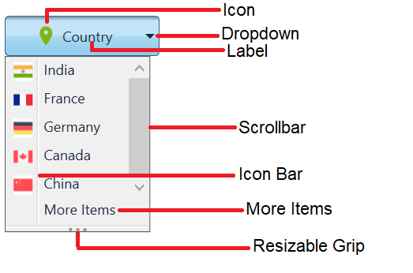
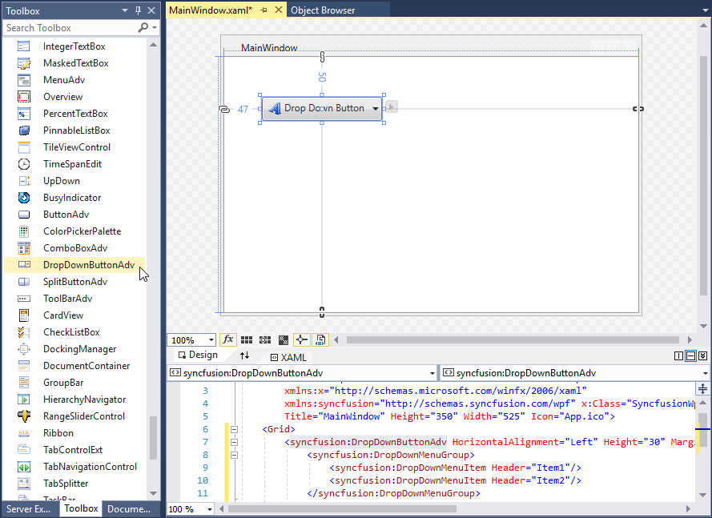

# Getting Started

This section guides you on getting started with the DropDownButtonAdv control. It describes you about the control structure, basic settings, implementation and members of the DropDownButtonAdv control.

## Adding DropDownButtonAdv to an application

The DropDownButtonAdv control is available in the following assembly:

*  Syncfusion.Shared.WPF

### Setting label

The following code explains how to add a DropDownButtonAdv control using XAML:




<sync:DropDownButtonAdv Label="Hello World"/>




The DropDownButtonAdv control can be created using C# as follows:




DropDownButtonAdv button = new DropDownButtonAdv()
button.Label = "Hello World";




### Setting size mode

The size mode of the DropDownButtonAdv can be easily modified using the property SizeMode. The SizeMode property contains the following values:

* Small
* Normal
* Large

### Small mode

When the SizeMode is set to Small, the icon of the DropDownButtonAdv control is displayed without the label.

Use the following code snippet to set the SizeMode to Small:


 
<sync:DropDownButtonAdv SizeMode="Small" Label="Hello World"/> 
 

 
DropDownButtonAdv button = new DropDownButtonAdv()button.Label = "Hello World";button.SizeMode = SizeMode.Small; 



### Normal mode

The DropDownButtonAdv control retains the default appearance, when the SizeMode is set to Normal, 

Use the following code snippet to set the SizeMode to Normal:


 
<sync:DropDownButtonAdv SizeMode="Normal" Label="Hello World"/> 


 
DropDownButtonAdv button = new DropDownButtonAdv()button.Label = "Hello World";button.SizeMode = SizeMode.Normal; 



### Large mode

When the SizeMode is set to Large, the DropDownButtonAdv control is displayed with large icon and provides multiline support.

Use the following code snippet to set the SizeMode to Large:


 
<sync:DropDownButtonAdv SizeMode="Large" Label="Hello World"/> 
 


 DropDownButtonAdv button = new DropDownButtonAdv()button.Label = "Hello World";
 button.SizeMode = SizeMode.Large;
  


### Setting image

The Image displayed in the control can be set using two properties:

* SmallIcon – To set the image when SizeMode is Normal or Small.
* LargeIcon – To set the image when SizeMode is Large.

The SmallIcon property can be set as follows:


 
<sync:DropDownButtonAdv SizeMode="Small" Label="Hello World" SmallIcon="employee.png"/> 
 

  
DropDownButtonAdv button = new DropDownButtonAdv()button.Label = "Hello World";button.SizeMode = SizeMode.Small;
button.SmallIcon = new BitmapImage(new Uri("employee.png"));  


The SmallIcon property can be set even when the SizeMode is Normal:


 
<sync:DropDownButtonAdv SizeMode="Normal" SmallIcon="employee.png" Label="Hello World"/>
  

 
 DropDownButtonAdv button = new DropDownButtonAdv()button.Label = "Hello World";
 button.SizeMode = SizeMode.Normal;button.SmallIcon = new BitmapImage(new Uri("employee.png")); 
  


The LargeIcon property can be set as follows:


 
<sync:DropDownButtonAdv SizeMode="Large" LargeIcon="employee.png" Label="Hello World"/> 
 

 
DropDownButtonAdv button = new DropDownButtonAdv();
button.Label = "Hello World";
button.SizeMode = SizeMode.Large;
button.LargeIcon = new BitmapImage(new Uri("employee.png")); 



### Adding items to DropDownButtonAdv

The DropDownMenuGroup acts as a container for the DropDownButtonAdv control, which provides customization such as Resizing, Header and Scrollbar support.

Adding DropDownMenuItems to DropDownButtonAdv:


 
<shared:DropDownButtonAdv Label="Hello World" x:Name="button" SizeMode="Normal" SmallIcon="employee.png">
<shared:DropDownMenuGroup>      
<shared:DropDownMenuItem Header="Menu Item 1"/>      
<shared:DropDownMenuItem Header="Menu Item 2"/>    
<shared:DropDownMenuItem Header="Menu Item 3"/> 
</shared:DropDownMenuGroup></shared:DropDownButtonAdv>
    

 
DropDownButtonAdv button = new DropDownButtonAdv();
DropDownMenuGroup menu = new DropDownMenuGroup();
DropDownMenuItem menuItem1 = new DropDownMenuItem();
DropDownMenuItem menuItem2 = new DropDownMenuItem();
DropDownMenuItem menuItem3 = new DropDownMenuItem();
menu.Items.Add(menuItem1);
menu.Items.Add(menuItem2);
menu.Items.Add(menuItem3);
button.Content = menu; 



## DropDownButtonAdv members

### Properties

<table>
<tr>
<th>
Name</th><th>
Type</th><th>
Value it accepts</th><th>
Description</th><th>
Default Value</th><th>
Reference Link</th></tr>
<tr>
<td>
Label</td><td>
String</td><td>
String</td><td>
The Label Property of this element can be set to any string value</td><td>
Null</td><td>
Label</td></tr>
<tr>
<td>
SizeMode</td><td>
SizeMode</td><td>
Normal,Small,        Large</td><td>
Represents the Size of the element, which may be Normal, Small or Large</td><td>
Normal</td><td>
SizeMode</td></tr>
<tr>
<td>
SmallIcon</td><td>
ImageSource</td><td>
Image URL</td><td>
Represents the Image displayed in the element, when size form is Small or Normal</td><td>
-</td><td>
SmallIcon</td></tr>
<tr>
<td>
LargeIcon</td><td>
ImageSource</td><td>
Image URL</td><td>
Represents the Image displayed in the element, when size form is Large</td><td>
-</td><td>
LargeIcon</td></tr>
<tr>
<td>
IsMultiline</td><td>
Boolean</td><td>
True or False</td><td>
Value which represents whether the Label displayed in two line or not.</td><td>
True</td><td>
Multiline Support</td></tr>
</table>

### Events

<table>
<tr>
<th>
Name</th><th>
Event Type</th><th>
Event Args Parameter</th><th>
Description</th><th>
Reference Link</th></tr>
<tr>
<td>
DropDownOpened</td><td>
RoutedEventHandler</td><td>
RoutedEvent Args</td><td>
Occurs after DropDown is opened.</td><td>
DropDownOpened</td></tr>
<tr>
<td>
DropDownOpening</td><td>
CancelEventHandler</td><td>
CancelEventArgs</td><td>
Occurs before DropDown is opened.</td><td>
DropDownOpening</td></tr>
<tr>
<td>
DropDownClosed</td><td>
RoutedEventHandler</td><td>
RoutedEvent Args</td><td>
Occurs after DropDown is closed.</td><td>
DropDownClosed</td></tr>
<tr>
<td>
DropDownClosing</td><td>
CancelEventHandler</td><td>
CancelEventArgs</td><td>
Occurs before DropDown is closed.</td><td>
DropDownClosing</td></tr>
</table>

