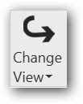

## DataBinding

 The below content explains about Data binding support in DropDownButtonAdv

In the below code, a DropDownButtonAdv named Change View has been created whose menu items are binded through a view model that hold the properties of the menu items. Menu item name and icon are displayed in the UI through Data binding. 

* 1.Create a class that holds the properties of the menu items (View model).



class ChangeView_model

{

 private string changeview_name;

 public string ChangeView_name

 {

  get

  {

    return changeview_name;

  }

  set

  {

   changeview_name = value;

  }

 }

 private string changeview_image;

 public string ChangeView_image

 { 

   get

   {

    return changeview_image;

   }

   set

   {

    changeview_image = value;

   }

 }

}



* 2.Create a list that holds the objects of the class



class ChangeView_list

{

 private List<ChangeView_model> dropdown_items;

 public List<ChangeView_model> Dropdown_items

 {

   get

   {  

    return dropdown_items;

   }

   set

   {

    dropdown_items = value;

   }

 }

 public ChangeView_list()

 {

  Dropdown_items = new List<ChangeView_model>();

  Dropdown_items.Add(new ChangeView_model() { ChangeView_name = "Compact",ChangeView_image ="Single.png"});

  Dropdown_items.Add(new ChangeView_model() { ChangeView_name = "Single",ChangeView_image="Compact.png"});

  Dropdown_items.Add(new ChangeView_model() { ChangeView_name = "Preview",ChangeView_image="Preview.png" });

 }

}



* 3.Bind the properties of the menu items, to display the item names and their respective icon image.



<syncfusion:DropDownButtonAdv Label="Change View" x:Name="DropDownButton_ChangeView" SizeMode="Large" LargeIcon="images.png" >

<syncfusion:DropDownMenuGroup ItemsSource="{Binding Dropdown_items}">

<syncfusion:DropDownMenuGroup.ItemTemplate>

<DataTemplate>

<syncfusion:DropDownMenuItem Header="{Binding ChangeView_name}">

<syncfusion:DropDownMenuItem.Icon>

<Image Source="{Binding ChangeView_image}"></Image>

</syncfusion:DropDownMenuItem.Icon>

</syncfusion:DropDownMenuItem>

</DataTemplate>

</syncfusion:DropDownMenuGroup.ItemTemplate>

</syncfusion:DropDownMenuGroup>

</syncfusion:DropDownButtonAdv>





public partial class MainWindow: Window

{

  public MainWindow()

  {

    InitializeComponent();

    this.DataContext = new ChangeView_list();

  }

}



## ChangeView DropDownButtonAdv

## ChangeView DropDownButtonAdv with menu items

