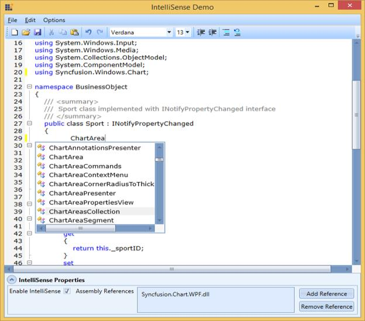
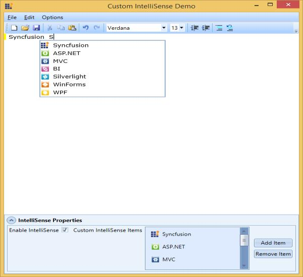
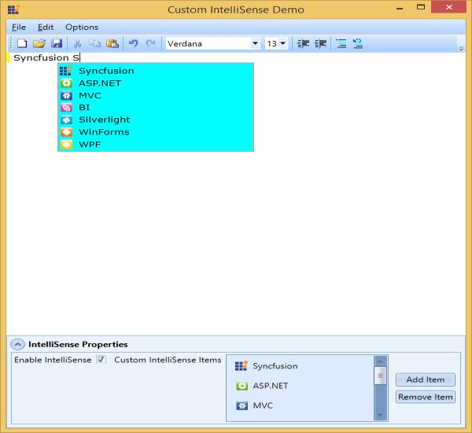
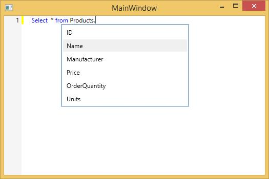

## IntelliSense Support

**Essential** **Edit** for WPF provides Visual Studio like **IntelliSense** support. With **IntelliSense** support users can quickly choose the possible words while typing text in the control.

**IntelliSense** support in Edit WPF facilitates you to select possible words while typing text in the **EditControl**

When you type the text in the **EditControl**, it displays a list of possible words in a popup. You can navigate, using **Up** and **Down** arrow keys or mouse and Scrollbar, to appropriate items. Select an item from the list to append to the text in the **EditControl**.

**Important** **Features**

* **IntelliSense** in Edit WPF works in two modes namely **Auto** or **Custom**. 
  * **Auto** **mode**—This automatically generates the list of items to be displayed from the pre-built assemblies specified in **AssemblyReferences** property. This mode of operation is currently supported for **C#** and **Visual** **Basic** language respectively.
  * **Custom** **mode**—This enables the users to provide the list of items to be displayed in the **IntelliSense**.
* **Exclusive** **properties** in **EditControl** enable the users to customize the look and feel of the **IntelliSense** popup and its items.

This provides the facility to modify the characters on the selected item to be appended, to the text similar to that of **Visual** **Studio** **IntelliSense** settings. It also provides options to enable or disable appending text when space bar is pressed.

**Customization** **of** **IntelliSense** **Modes**

**IntelliSense** in Edit WPF works in two modes: **Auto** and **Custom**.  **IntelliSense** modes can be switched by using **IntelliSenseMode** property in **EditControl** class. It is an enum of the type of **IntelliSenseMode**. By default, **IntelliSenseMode** property is set to **Auto**.

**Auto** **Mode**

In **Auto** **mode**, **EditControl** generates the **IntelliSense** list box items similar to **Visual** **Studio** based on the current language configurations **(Lexem).** **IntelliSense** also displays **Types**, **Properties**, **Events** and **Methods** from pre-built assemblies specified using **AssemblyReferences** property of **EditControl** class. 

N> Auto IntelliSense mode is currently supported for C# and Visual Basic languages and will be extended to other markup languages supported by EditControl in forthcoming releases.

**Adding** **EditControl** **to** **the** **application**

Add **EditControl** to the application and set its **IntelliSenseMode** to **Auto**, by using the following code.


<!--Adding EditControl to application and setting its IntelliSenseMode to Auto-->

<syncfusion:EditControl Background="White" DocumentLanguage="CSharp" Name="EditControl1" IntellisenseMode="Auto"/>





public partial class MainWindow : Window

{

ObservableCollection<Uri> uriList;

public MainWindow()

{

InitializeComponent();

uriList = new ObservableCollection<Uri>();

EditControl1.DocumentSource = "../../Source.cs";

EditControl1.AssemblyReferences = uriList;

}

private void Button_Click(object sender, RoutedEventArgs e)

{

OpenFileDialog fileDialog = new OpenFileDialog();

fileDialog.Filter = "Assembly Files (*.dll) | *.dll";

fileDialog.ShowDialog();

if (fileDialog.FileName.Trim() != string.Empty)

{

uriList.Add(new Uri(fileDialog.FileName));

}

}

}



N> Having an INotifyCollectionChanged implemented collection as AssemblyReferences will update the IntelliSense items automatically when an assembly reference is added at runtime.

The following image displays the Intellisense Demo Window

**Custom** **Mode**

**IntelliSense** support in Edit WPF enables you to bind collections of your business object as an **ItemsSource** of **IntelliSenseListBox**. It also provides the flexibility to change the **ItemTemplate** of the **IntelliSenseListBox** to suite your business object or requirements. 

This ensures that your business object is implemented from **IIntelliSenseItem** interface to your business object compatible with the **IntelliSenseListBox**. **EditControl** have exclusive properties implemented to enable the users bind custom collections and apply custom **ItemTemplates**. 

* **IntelliSenseMode**—Set **IntelliSenseMode** property to **Custom** to apply a custom **ItemsSource** to **IntelliSense**.
* **IntelliSenseCustomItemsSource**—**IEnumerable** type of property to bind custom **ItemsSource** to **IntelliSense** **ListBox**.
* **IntelliSenseItemTemplate**—**DataTemplate** type of property to apply custom **ItemTemplate** to **IntelliSense** **ListBox**.

**Creating** **DataTemplate** **in** **the** **ResourceDictionary**

Create **DataTemplate** in the **ResourceDictionary** to apply it as **IntellisenseItemTemplate** property of **EditControl** by using the following code.


<DataTemplate x:Key="CustomIntelliSenseItemTemplate">

<Grid>

<Grid.ColumnDefinitions>

<ColumnDefinition Width="Auto"/>

<ColumnDefinition Width="*"/>

</Grid.ColumnDefinitions>

<Image Source="{Binding Icon}" MaxHeight="16" MaxWidth="16" Margin="3"/>

<TextBlock Text="{Binding Text}" Grid.Column="1" Margin="3"/>

</Grid>

</DataTemplate>



Apply **IntellisenseMode** and **IntellisenseItemTemplate** properties by using the following code.


<!--Adding EditControl to application and setting its IntelliSenseMode to Custom-->

<syncfusion:EditControl Background="White" Name="EditControl1"  IntellisenseMode="Custom"

IntellisenseItemTemplate="{StaticResource 

CustomIntelliSenseItemTemplate}"/>



**Creating** **a** **Custom** **Business** **Object**

Create a **Custom** **Business** **Object** **implemented** using **IIntellisenseItem** interface by using the following code**.**


/// 

/// Business object implemented from IIntelliSenseItem interface in 

/// Syncfusion.Windows.Edit namespace

/// 

public class CustomIntelliSenseItem : IIntellisenseItem

{

/// 

/// Gets or sets a value indicating Icon to be displayed in the IntelliSenseListBox

/// 

public ImageSource Icon

{

get;

set;

}

/// 

/// Gets or sets a value indicating Text to be displayed in the IntelliSenseListBox

/// 

public string Text

{

get;

set;

}

/// 

/// Gets or sets a collection of sub-items to be displayed

/// 

public IEnumerable<IIntellisenseItem> NestedItems

{

get;

set;

}

}



**Create** **a** **Custom** **Collection** **of** **the** **Business** **Object**

Now, create a Custom Collection of the Business Object and set as Custom ItemsSource using IntellisenseCustomItemsSource property, by using the following code. 



// Initializing custom business object collection 

ObservableCollection<CustomIntelliSenseItem> customItems = new

ObservableCollection<CustomIntelliSenseItem>();

customItems.Add(new CustomIntelliSenseItem()

{

Text = "Syncfusion",

Icon = new BitmapImage(new Uri("/CustomIntelliSenseDemo;component/Resources/syncfusion.png", UriKind.Relative))

});

customItems.Add(new CustomIntelliSenseItem()

{

Text = "Silverlight",

Icon = new BitmapImage(new Uri("/CustomIntelliSenseDemo;component/Resources/silverlight.png", UriKind.Relative))

});

customItems.Add(new CustomIntelliSenseItem()

{

Text = "WPF",

Icon = new BitmapImage(new Uri("/CustomIntelliSenseDemo;component/Resources/wpf.png", UriKind.Relative))

});

// Applying custom business object collection as IntelliSenseCustomItemsSource

EditControl1.IntellisenseCustomItemsSource = customItems;



When the code runs, the following output displays.

The following image displays the Custom Intellisense Demo Window

**Customizing** **IntelliSense** **List** **Box** **Style**

**EditControl** enables the users to customize the look and feel of the **IntelliSense** **listbox** by applying custom style to the **IntelliSense** **listbox**. **IntelliSenseBoxStyle** property of **EditControl** class can be used to apply custom style for **IntelliSense** **listbox**.

Customize the IntelliSense List Box Style, by using the following code.



<syncfusion:EditControl Name="EditControl1"  IntellisenseBoxStyle="{StaticResource ListBoxStyle}"/>



The following figure displays displays the window that appears after applying IntelliSenseBox Style

**Applying** **Multi**-**level** **IntelliSense** **Items** **in** **Custom** **Mode**

As mentioned in earlier topics, **EditControl** supports applying custom collection of business objects as **IntelliSense**,** when the business objects are implemented using **IIntelliSenseItem** **interface**.** This **IIntelliSenseItem** **interface** has a **NestedItems** property which can be used to display sub items in **IntelliSense**. **EditControl** has a property under **CurrentLanguage**, a **DrillDownChar** property of the type **char** to specify on which character press, the sub-items are to be displayed in **IntelliSense**.  The default value of **DrillDownChar** is **“.”** (Periods)  and when **“.”(**Periods) key is pressed, **EditControl** will automatically get the collection from **NestedItems** property and displays it in the **EditControl**.

Create a **Custom** **IntelliSense** for tables and fields for **SQL** language, by using the following code.


<!--Resources-->

<DataTemplate x:Key="CustomIntelliSenseItemTemplate">

<TextBlock Text="{Binding Text}" Margin="3"/>

</DataTemplate>

<!--Adding EditControl to application and setting its IntelliSenseMode to Auto-->

<syncfusion:EditControl Background="White" Name="EditControl1" DocumentLanguage="SQL"  IntellisenseMode="Custom" 

IntellisenseItemTemplate="{StaticResource CustomIntelliSenseItemTemplate}"/>




/// 

/// Business object implemented from IIntelliSenseItem interface in 

/// Syncfusion.Windows.Edit namespace

/// 

public class CustomIntelliSenseItem : IIntellisenseItem

{

/// 

/// Gets or sets a value indicating Icon to be displayed in the IntelliSenseListBox

/// 

public ImageSource Icon

{

get;

set;

}

/// 

/// Gets or sets a value indicating Text to be displayed in the IntelliSenseListBox

/// 

public string Text

{

get;

set;

}

/// 

/// Gets or sets a collection of sub-items to be displayed

/// 

public IEnumerable<IIntellisenseItem> NestedItems

{

get;

set;

}

}





ObservableCollection<CustomIntelliSenseItem> customItems = new

ObservableCollection<CustomIntelliSenseItem>();

//Intializing sub-items for products

ObservableCollection<CustomIntelliSenseItem> productsSubItem = new

ObservableCollection<CustomIntelliSenseItem>();

productsSubItem.Add(new CustomIntelliSenseItem() { Text = "ID" });

productsSubItem.Add(new CustomIntelliSenseItem() { Text = "Name" });

productsSubItem.Add(new CustomIntelliSenseItem() { Text = "Manufacturer" });

productsSubItem.Add(new CustomIntelliSenseItem() { Text = "Price" });

productsSubItem.Add(new CustomIntelliSenseItem() { Text = "OrderQuantity" });

productsSubItem.Add(new CustomIntelliSenseItem() { Text = "Units" });

//Intializing sub-items for employee

ObservableCollection<CustomIntelliSenseItem> employeeSubItem = new

ObservableCollection<CustomIntelliSenseItem>();

employeeSubItem.Add(new CustomIntelliSenseItem() { Text = "ID" });

employeeSubItem.Add(new CustomIntelliSenseItem() { Text = "Name" });

employeeSubItem.Add(new CustomIntelliSenseItem() { Text = "DOB" });

employeeSubItem.Add(new CustomIntelliSenseItem() { Text = "City" });

employeeSubItem.Add(new CustomIntelliSenseItem() { Text = "ContactNumber" });

//Intializing sub-items for customer

ObservableCollection<CustomIntelliSenseItem> customerSubItem = new

ObservableCollection<CustomIntelliSenseItem>();

customerSubItem.Add(new CustomIntelliSenseItem() { Text = "ID" });

customerSubItem.Add(new CustomIntelliSenseItem() { Text = "Name" });

customerSubItem.Add(new CustomIntelliSenseItem() { Text = "City" });

customerSubItem.Add(new CustomIntelliSenseItem() { Text = "State" });

customerSubItem.Add(new CustomIntelliSenseItem() { Text = "Country" });

customerSubItem.Add(new CustomIntelliSenseItem() { Text = "ContactNumber" });

//adding items to main collection

customItems.Add(new CustomIntelliSenseItem()

{

Text = "Products",

NestedItems =

productsSubItem

});

customItems.Add(new CustomIntelliSenseItem()

{

Text = "Employee",

NestedItems =

employeeSubItem

});

customItems.Add(new CustomIntelliSenseItem()

{

Text = "Customer",

NestedItems =

customerSubItem

});

// Applying custom business object collection as IntelliSenseCustomItemsSource

EditControl1.IntellisenseCustomItemsSource = customItems;



The following screenshot illustrates IntelliSense displaying first-level of items from custom collection

The following screenshot illustrates IntelliSense displaying sub-items from selected item

Following classes in **EditControl** will be helpful to perform various operations related to **IntelliSense**.

<table>
<tr>
<td>
Name of Property  </td><td>
Description  </td><td>
Type of Property  </td><td>
Value It Accepts  </td></tr>
<tr>
<td>
EnableIntelliSense  </td><td>
Gets or sets a value indicating if IntelliSense Support has to be enabled or disabled.  </td><td>
Boolean  </td><td>
True / false  </td></tr>
<tr>
<td>
IntelliSenseMode  </td><td>
Gets or sets a value representing IntelliSense mode of operations.  </td><td>
IntelliSenseMode  </td><td>
IntellisenseMode.Auto / IntellisenseMode.Custom  </td></tr>
<tr>
<td>
IntelliSenseCustomItemsSource  </td><td>
To specify the custom collection of business objects to be displayed in custom IntelliSense.  </td><td>
IEnumerable  </td><td>
Any collection of  items implemented using   IIntellisenseItem        </td></tr>
<tr>
<td>
IntelliSenseBoxStyle  </td><td>
IntelliSense.  </td><td>
Style  </td><td>
Style object  </td></tr>
<tr>
<td>
IntelliSenseItemTemplate  </td><td>
IntelliSense.  </td><td>
DataTemplate  </td><td>
DataTemplate object  </td></tr>
</table>

Following classes in **LanguageBase** will be helpful to perform various operations related to **IntelliSense** specific support and custom languages. These properties can be modified in custom language classes inherited from **LanguageBase** or **ProceduralLanguageBase** or **MarkupLanguageBase** class. It can also be modified using **CurrentLanguage** property of **EditControl** class.

<table>
<tr>
<td>
Name of the Property  </td><td>
Description  </td><td>
Type of the Property  </td></tr>
<tr>
<td>
DrillDownChar  </td><td>
The character specified is used to drill down to nested items. When the user presses the corresponding key, IntelliSense drills down and displays the sub-items in the IntelliSense.          </td><td>
Char  </td></tr>
<tr>
<td>
IntelliSenseCommitCharacters  </td><td>
Specifies the characters when used. The IntelliSense should append the selected IntelliSense item to EditControl’s text.  </td><td>
String  </td></tr>
<tr>
<td>
CommitsIntelliSenseItemOnSpaceBar  </td><td>
Specifies if the selected IntelliSense item to be appended to the EditControl’s text when a space bar is pressed.  </td><td>
Boolean  </td></tr>
<tr>
<td>
SupportsIntelliSense  </td><td>
To allow or restrict IntelliSense auto mode in custom languages.  </td><td>
Boolean  </td></tr>
</table>

**Events**

<table>
<tr>
<td>
Event  </td><td>
Usage  </td><td>
Handler Type  </td><td>
Handler  </td></tr>
<tr>
<td>
IntelliSenseBoxOpening  </td><td>
This event gets triggered before the IntelliSense popup is displayed.   </td><td>
IntelliSenseBoxEventHandler  </td><td>
Set IsCancel property in the EventArgs to cancel displaying of IntelliSense popup.  </td></tr>
<tr>
<td>
IntelliSenseDrillDown  </td><td>
This event gets triggered when a DrillDownChar specified is encountered.  </td><td>
IntelliSenseBoxEventHandler  </td><td>
Set IsCancel property in the EventArgs to cancel displaying of IntelliSense popup.  </td></tr>
</table>

IntelliSenseBoxEventArgs contains following arguments.

<table>
<tr>
<td>
Argument  </td><td>
Usage  </td></tr>
<tr>
<td>
Assemblies  </td><td>
Contains the list of assemblies included as AssemblyReferences.  </td></tr>
<tr>
<td>
Cancel  </td><td>
A boolean argument can be used to cancel the event.  </td></tr>
<tr>
<td>
CursorIndex  </td><td>
Contains current Cursor Index where the event is triggered.  </td></tr>
<tr>
<td>
ItemsSource  </td><td>
Contains the ItemsSource to be applied to the IntelliSense, it can also be changed if there are any Custom Filtrations to be done in the event.  </td></tr>
<tr>
<td>
LineIndex  </td><td>
Contains current Line Index where the event is triggered  (0 based values).  </td></tr>
</table>
