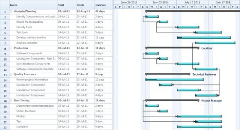

# Data Binding

## TaskDetails Binding

Essential Gantt for WPF includes an inbuilt class called TaskDetails, which is inherited from the IGanttTask interface. A collection of the TaskDetails can be bounded as an ItemsSource for the GanttControl.

### Use Case Scenarios

You can easily create the task details collection using the TaskDetails class or by creating a new class by inheriting the IGantt interface.

Binding TaskDetials collection to Gantt Control

The following code illustrates how to bind the Task Detials to the Gantt Control:



 <Sync:GanttControl ItemsSource="{Binding GanttItemSource}" x:Name="Gantt" >




 //Initializing Gantt
 GanttControl Gantt = new GanttControl();

 ViewModel model=  new ViewModel();
 Gantt.ItemsSource = model.GanttItemSource;




GanttItemSource = new ObservableCollection<TaskDetails>();

GanttItemSource = GetDataSourceStartToStart();

ObservableCollection<TaskDetails> GetDataSourceStartToStart()
{
ObservableCollection<TaskDetails> task = ObservableCollection<TaskDetails>();
task.Add(new TaskDetails { TaskId = 1, 

                           TaskName = "Scope", 

                           StartDate = new DateTime(2011, 1, 3), 

                           FinishDate = new DateTime(2011, 1, 14),  

                           Progress = 40d });
task[0].Child.Add(new TaskDetails { TaskId = 2, 

                    TaskName = "Determine project office scope", 

                    StartDate = new DateTime(2011, 1, 3), 

                    FinishDate = new DateTime(2011, 1, 5), 

                    Progress = 20d });
task[0].Child.Add(new TaskDetails { TaskId = 3, 

                   TaskName = "Justify Project Offfice via business model", 

                    StartDate = new DateTime(2011, 1, 6), 

                    FinishDate = new DateTime(2011, 1, 7), 

                    Progress = 20d });
task[0].Child.Add(new TaskDetails { TaskId = 4, 

                    TaskName = "Secure executive sponsorship", 

                    StartDate = new DateTime(2011, 1, 10), 

                    FinishDate = new DateTime(2011, 1, 14), 

                    Progress = 20d });

task[0].Child.Add(new TaskDetails { TaskId = 5, 

                    TaskName = "Secure complete", 

                    StartDate = new DateTime(2011, 1, 14), 

                    FinishDate = new DateTime(2011, 1, 14), 

                    Progress = 20d });

return task;

}



The following image shows the BindingTask Details:

### Samples Link

To view samples: 

1. Select Start -> Programs -> Syncfusion -> Essential Studio x.x.xx -> Dashboard.
2. Click Run Samples for WPF under User Interface Edition panel.
3. Select Gantt.
4. Expand the DataBinding Features item in the Sample Browser.
5. Choose the Binding Task Details samples to launch.
## External Property Binding

Essential Gantt for WPF allow you to bind any type of IEnumerable source to Gantt.You can bind any collection to Gantt using the TaskAttributeMapping class. This will get the mapping name of the requied fields from the underlying source. With this mapping the Gantt will get the required information to render the Chart nodes.

The following code illustrate how to map the properties using the TaskAttributeMapping class:



 <gantt:TaskAttributeMapping TaskIdMapping="Id"                     TaskNameMapping="Name"                     StartDateMapping="StartDate"                      ChildMapping="ChildTask"                     FinishDateMapping="EndDate"                     DurationMapping="Duration"                     ResourceInfoMapping="Resource"                     ProgressMapping="Complete"                     PredecessorMapping="Predecessor">
 </gantt:TaskAttributeMapping>




  TaskAttributeMapping attributes = new TaskAttributeMapping();
  attributes.TaskIdMapping = "Id";
  attributes.TaskNameMapping = "Name";
  attributes.StartDateMapping = "StartDate";
  attributes.FinishDateMapping = "EndDate";
  attributes.DurationMapping = "Duration";
  attributes.ChildMapping = "ChildTask";
  attributes.ResourceInfoMapping = "Resource";
  attributes.ProgressMapping = "Predecessor";



The following code illustrates how to bind the external source to Gantt control:



<Sync:GanttControl x:Name="Gantt" ItemsSource="{Binding GanttItemSource}">
      <Sync:GanttControl.TaskMapping>
           <Sync:TaskCollectionMapping TaskIdMapping="Id"                                       TaskNameMapping="Name"                                       StartDateMapping="SDate"                                       FinishDateMapping="EDate"                                       ResourceNameMapping="ResName"                                       ChildMapping="ChildTask"                                       PredecessorMapping="Predecessor"                                       ProgressMapping="Complete" />
            </Sync:GanttControl.TaskMapping>
</Sync:GanttControl>




 //Initializing Gantt
 GanttControl Gantt = new GanttControl();

 ViewModel model=  new ViewModel();

 TaskAttributeMapping attributes = new TaskAttributeMapping();
 attributes.TaskIdMapping = "Id";
 attributes.TaskNameMapping = "Name";
 attributes.StartDateMapping = "StartDate";
 attributes.FinishDateMapping = "EndDate";
 attributes.DurationMapping = "Duration";
 attributes.ChildMapping = "ChildTask";
 attributes.ResourceInfoMapping = "Resource";
 attributes.ProgressMapping = "Predecessor";

 Gantt.TaskAttributeMapping = attributes;

 Gantt.ItemsSource = model.GanttItemSource;




GanttItemSource = new ObservableCollection<Task>();

GanttItemSource = GetDataSourceStartToStart();

ObservableCollection<Task> GetDataSourceStartToStart()
{
ObservableCollection<Task> task = ObservableCollection<Task>();

task.Add(new Task { Id = 1, 

                    Name = "Scope", 

                    StartDate = new DateTime(2011, 1, 3), 

                    EndDate = new DateTime(2011, 1, 14),

                    Progress = 40d });
task[0].ChildTask.Add(new Task { Id = 2, 

                    Name = "Determine project office scope", 

                    StartDate = new DateTime(2011, 1, 3), 

                    EndDate = new DateTime(2011, 1, 5), 

                    Progress = 20d });
task[0].ChildTask.Add(new Task { Id = 3, 

                    Name = "Justify Project Offfice via business model", 

                    StartDate = new DateTime(2011, 1, 6), 

                    EndDate = new DateTime(2011, 1, 7), 

                    Progress = 20d });
task[0].ChildTask.Add(new Task { Id = 4, 

                    Name = "Secure executive sponsorship", 

                    StartDate = new DateTime(2011, 1, 10), 

                    EndDate = new DateTime(2011, 1, 14), 

                    Progress = 20d });

task[0].ChildTask.Add(new Task { Id = 5, 

                    Name = "Secure complete", 

                    StartDate = new DateTime(2011, 1, 14), 

                    EndDate = new DateTime(2011, 1, 14), 

                    Progress = 20d });

return task;

}



The following image shows the External Property Binding:

### Samples Link

To view samples: 

1. Select Start -> Programs -> Syncfusion -> Essential Studio x.x.xx -> Dashboard.
2. Click Run Samples for WPF under User Interface Edition panel.
3. Select Gantt.
4. Expand the DataBinding Features item in the Sample Browser.
5. Choose the External Property Binding samples to launch.

