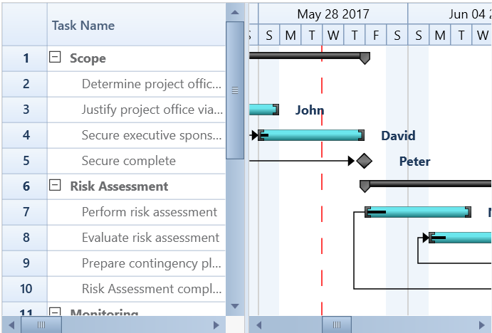

# DateTime Indicator Customization

Essential Gantt provides support for indicating the current date or time in the Gantt chart region. You can choose the following positions in the Gantt chart region for the DateTime indicator:

* Today
* Loaded Time
* Dynamic Time 
* Absolute

These are all included in the CurrentDateLinePositions enum.

Essential Gantt allows you to customize the appearance of the DateTime indicator by using the CurrentDateLine property.

* Today: DateTime indicator will be positioned at the current date.
* LoadedTime: DateTime indicator will be positioned at the Gantt control loaded time.
* DynamicTime: DateTime indicator will be positioned at the Gantt control loaded time. The position of the DateTime indicator will change based on the system time change.
* Absolute: The DateTime indicator will be positioned at a user-defined position.

## Use Case Scenarios

1. The DateTime indicator enables you to find the current date or time in a scheduled timeline.
2. You can customize the DateTime indicator to give a similar look and feel to your product.
3. You can change the style of DateTime indicator to differentiate the DateTime indicator from other vertical lines.
## Properties

_Properties_

<table>
<tr>
<th>
Property</th><th>
Description</th><th>
Type</th><th>
Data Type</th></tr>
<tr>
<td>
CurrentDateLine </td><td>
Get the user-defined line for the DateTimeindicator.</td><td>
Dependency Property</td><td>
Line</td></tr>
<tr>
<td>
StickCurrentDateLineTo</td><td>
Get/sets the StickCurrentDateLineTo property of the Gantt control.By default this is set to Today.</td><td>
Dependency Property</td><td>
EnumNoneTodayDynamic TimeLoaded TimeAbsolute</td></tr>
</table>

## Adding the DateTime Indicator to an Application

Adding the DateTime indicator customization will change the appearance and position of the DateTime indicator. By default, the DateTime indicator will appear in the current date. The following steps explain how to add a customized DateTime indicator:

1. Set the StickCurrentDateLineTo value for positioning the DateTime indicator. By default this is set as Today.
2. Customize the appearance of the DateTime indicator using the CurrentDateLine API in the Gantt control.

The following code samples illustrate how to customize the DateTime indicator.



[XAML]

<gantt:GanttControl x:Name="Gantt"

                    Grid.Row="1"

                    StickCurrentDateLineTo="Today"

                    ItemsSource="{Binding TaskDetails}">

        <gantt:GanttControl.CurrentDateLine>   

                <Line Stroke="Green" 

                      StrokeDashArray="5 1 5" 

                      StrokeThickness="2" />

        </gantt:GanttControl.CurrentDateLine>

        <gantt:GanttControl.TaskAttributeMapping>

                <gantt:TaskAttributeMapping TaskIdMapping="Id"

                                            TaskNameMapping="Name"

                                            StartDateMapping="StDate" 

                                            ChildMapping="ChildTask"

                                            FinishDateMapping="EndDate"

                                            DurationMapping="Duration/>

        </gantt:GanttControl.TaskAttributeMapping>

</gantt:GanttControl>



[C#]

//StrokeDashArray will change the style of Line

DoubleCollection strokeArray = new DoubleCollection();

strokeArray.Add(5);

strokeArray.Add(1);

strokeArray.Add(5);

this.Gantt.CurrentDateLine.Stroke = Brushes.Green;

this.Gantt.vCurrentDateLine.StrokeDashArray = strokeArray;

this.Gantt.CurrentDateLine.StrokeThickness = 1;



Output

The following image shows the resultant output:

_Customized DateTime Indicator_

## Sample Link

To view samples:

1. Select Start>Programs>Syncfusion>Essential Studio x.x.xx>Dashboard.
2. Click Run Samples forWPF under the User Interface Edition panel.
3. Select Gantt.
4. Expand the Styles category in the Sample Browser.
5. Choose the Gantt Style Properties sample.
6. The sample contains different styles of the DateTime indicator.

