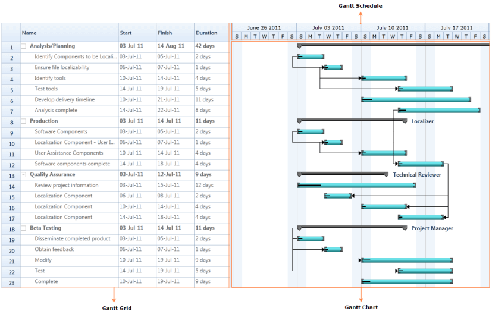
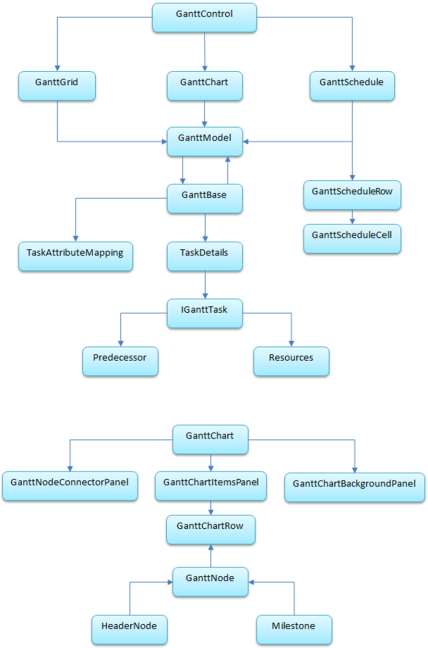
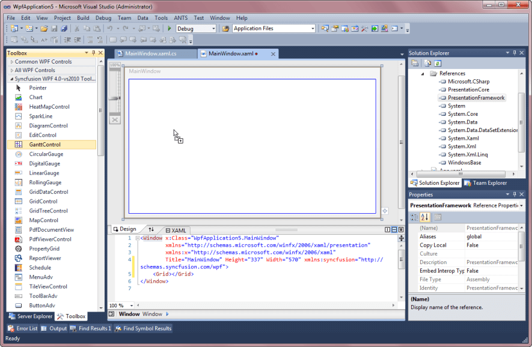

# Getting Started

## Appearance and Structure of Gantt

Gantt control is composed of three controls. They are:

* GanttGrid
* ScheduleHeader  
* GanttChartVisualControl

### Gantt Grid

Gantt Grid is a table view control which displays the scheduled tasks/activities of the project with its hierarchy. You can edit the fields of the bounded tasks using this grid.

* Header— Header represents the table header which contains the field name of the task.
* Parent Task—Parent task represents the summary of the child tasks. This is an activity which will be further splitted into various child tasks.
* Child Task—Child task reprents an individual task. This contains only the information about the specific task. The Child task is a part of parent task.
* Expand/Collapse Button—Expand/Collapse button allows you to expand or collapse the particular hierarchy.

### Gantt Chart

Gantt Chart is an items control which provides a graphically representation of the task/activitiy that are currently scheduled. Gantt Chart have different componenets to represent the type of Task, Progress of the Task and Relationship between Tasks.

* Node— Node represents an individual or child task.
* Header Node—HeaderNode represents the parent or summary task of the projects.
* Milestone—Milestone represents the target to be completed in a day.
* Progress Indicator—Progress indicator represents the persentage of work completed for the task.
* Connector—Connector represents the dependency relationship between the tasks.

### Gantt Schedule 

Gantt Schedule is a medium to measure the progress in the Gantt control. Using this you can track or measrue the progress of the task or activity.

## Class Diagram

## Feature Summary

The following features are available in the Essential Gantt for WPF:

* Data Binding
* TaskDetails Binding
* External Property Binding
* Dependency relationship
* CustomToolTip
* Calendar customization
* Custom Node style
* VisualStyle
* XML Import/Export

## Adding GanttControl to an Application

You can create a project management application using Essential Gantt WPF. 

You can create Gantt control in two methods. They are:

* Programatically
* Through Designer 

### Programmatically Creating Gantt Control 

The following are the steps to create GanttControl programmatically: 

Adding GanttControl

You can add Gantt control to the application using the following code:



 <Sync:GanttControl x:Name="Gantt" />





 //Initializing Gantt
 GanttControl Gantt = new GanttControl();



When the code runs, an empty gantt with in-built TaskDetails collection will be displayed.

Binding Data to GanttControl

Create a collection of tasks and bind it to the newly created GanttControl as given in the following code:



 <Sync:GanttControl ItemsSource="{Binding GanttItemSource}" x:Name="Gantt" >





 //Initializing Gantt
 GanttControl Gantt = new GanttControl();

 ViewModel model=  new ViewModel();
 Gantt.ItemsSource = model.GanttItemSource;





GanttItemSource = new ObservableCollection<TaskDetails>();

GanttItemSource = GetDataSourceStartToStart();

ObservableCollection<TaskDetails> GetDataSourceStartToStart()
{
ObservableCollection<TaskDetails> task = ObservableCollection<TaskDetails>();

task.Add(new TaskDetails { TaskId = 1, TaskName = "Scope", 

                    StartDate = new DateTime(2011, 1, 3), 

                    FinishDate = new DateTime(2011, 1, 14),  Progress = 40d });
task[0].Child.Add(new TaskDetails { TaskId = 2, 

                    TaskName = "Determine project office scope", 

                    StartDate = new DateTime(2011, 1, 3), 

                    FinishDate = new DateTime(2011, 1, 5), 

                    Progress = 20d });
task[0].Child.Add(new TaskDetails { TaskId = 3, 

                    TaskName = "Justify Project Offfice via business model", 

                    StartDate = new DateTime(2011, 1, 6), 

                    FinishDate = new DateTime(2011, 1, 7), 

                    Duration = new TimeSpan(1, 0, 0, 0), 

                    Progress = 20d });
task[0].Child.Add(new TaskDetails { TaskId = 4, 

                    TaskName = "Secure executive sponsorship", 

                    StartDate = new DateTime(2011, 1, 10), 

                    FinishDate = new DateTime(2011, 1, 14), 

                    Duration = new TimeSpan(1, 0, 0, 0), 

                    Progress = 20d });

task[0].Child.Add(new TaskDetails { TaskId = 5, 

                    TaskName = "Secure complete", 

                    StartDate = new DateTime(2011, 1, 14), 

                    FinishDate = new DateTime(2011, 1, 14), 

                    Duration = new TimeSpan(1, 0, 0, 0), 

                    Progress = 20d });

return task;

}


### Adding GanttControl through Designer

The following are the steps to create Gantt control through designer.

1. Open the XAML page of the application.

   

2. Select GanttControl from ToolBox.

   

3. Drag-and-drop the GanttControl to Designer View.

   

4. Gantt control is added to the window. Assembly reference will also be added to Project file.

   

5. Now you can customize the properties of Gantt control in the Properties Window.
   