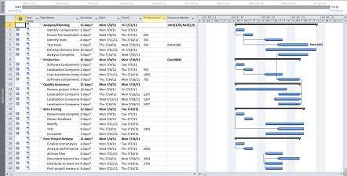

# Import and Export Support

Essential Gantt allows you to export and import the task details. You can export the task details as XML files and import them again when needed. You can open the exported XML files in MS Project too. The XML file, exported from MS Project can also be opened in Gantt control. You can import and export the details using the provided APIs.

### Properties

<table>
<tr>
<th>
Property </th><th>
Description </th><th>
Type </th><th>
Data Type </th></tr>
<tr>
<td>
ImportFromXMLCommand</td><td>
Command binding used to import the XML file generated from MS Project to populate data’s in Gantt control.</td><td>
Command</td><td>
DelegateCommand</td></tr>
<tr>
<td>
ExportToXMLCommand</td><td>
Command binding used to export the XML file generated from Gantt control to populate data’s in MS Project.</td><td>
Command</td><td>
DelegateCommand</td></tr>
</table>

### Methods

<table>
<tr>
<th>
Method </th><th>
Description </th><th>
Parameters </th><th>
Type </th><th>
Return Type </th></tr>
<tr>
<td>
ExportToXML()</td><td>
Responsible for exporting the GanttControl to MSProject XML File.</td><td>
-</td><td>
-</td><td>
bool</td></tr>
<tr>
<td>
ImportFromXML()</td><td>
Responsible for importing the data from MS Project XML file to GanttControl.</td><td>
-</td><td>
-</td><td>
bool</td></tr>
</table>

## Import/Export Task Details from/to XML

The following code illustrates how to Import and Export Task Details from or to XML.




<Sync:GanttControl x:Name="Gantt" />

<StackPanel Orientation="Horizontal" HorizontalAlignment="Center">
<Button Height="25" HorizontalAlignment="Center" VerticalAlignment="Center" 

Margin="0,10,0,0" Width="200"                    
Command="{Binding ExportToXMLCommand, ElementName=gantt}"                    Content="Export To XML" />
<Button Height="25" HorizontalAlignment="Center" VerticalAlignment="Center" 

Margin="0,10,0,0" Width="200"
Command="{Binding ImportFromXMLCommand, ElementName=gantt}"
Content="Import From XML" />
</StackPanel>





private void SaveButton_Click(object sender, System.Windows.RoutedEventArgs e)
{
if (this.Gantt.ExportToXML())
{
MessageBox.Show("Tasks exported successfully.", 
"XML Import/Export", 
MessageBoxButton.OK, 
MessageBoxImage.Information);
}
}

private void Open_Click(object sender, System.Windows.RoutedEventArgs e)
{
if (this.Gantt.ImportFromXML())
{
MessageBox.Show("Tasks imported successfully.", 
"XML Import/Export", 
MessageBoxButton.OK, 
MessageBoxImage.Information);
}
}




The following image shows XML Export Import:

XML Export Import
{:.caption}

The following image shows Importing the exported document in MS Project: 

Exported document opened in MS Project
{:caption}

### Samples Link

To view samples: 

1. Go to the Syncfusion Essential Studio installed location. 
    Location: Installed Location\Syncfusion\Essential Studio\{{ site.releaseversion }}\Infrastructure\Launcher\Syncfusion Control Panel 
2. Open the Syncfusion Control Panel in the above location (or) Double click on the Syncfusion Control Panel desktop shortcut menu .
3. Click Run Samples for WPF under User Interface Edition panel .
4. Select Gantt.
5. Expand the Import Export Features item in the Sample Browser.
6. Choose the Import Export Demo samples to launch.

