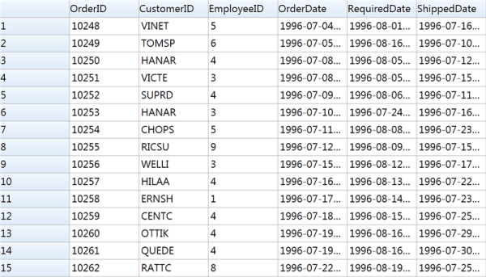

# Zoom In and Zoom Out

This feature enables the user to change the zoom level of the Grid control that brings either more or fewer cells into the view. By zooming in you can get a magnified view of the grid cells, and by zooming out you can bring more cells in to the view. This does not change the underlying size of Grid control, and the printout of the Grid control remains constant, regardless of the selected zoom scale.

## Use Case Scenarios

When a larger number of cells are updated in the Grid, the user can view the grid cells clearly by increasing the zoom scale. By decreasing the zoom scale, the user can display more cells in the view.

## Properties

_Property Table_

<table>
<tr>
<th>
Property </th><th>
Description </th><th>
Type </th><th>
Data Type </th></tr>
<tr>
<td>
ZoomScale</td><td>
Used to change the zoom level of the Grid control</td><td>
Dependency Property </td><td>
Double</td></tr>
</table>

## Sample Link

You can find a demonstration in the following location:

_...\MyDocuments\Syncfusion\EssentialStudio\<VersionNumber>\WPF\Grid.WPF\Samples\3.5\WindowsSamples\Zooming\_

## Change Zoom Scale of the Grid Control

You can change the zoom level of the Grid control by using the ZoomScale property defined in the Grid control.

The following code illustrates how to change the ZoomScale__of the Grid control:



gridControl.ZoomScale = 1.5;



_Increased Zoom Scale_

_Decreased Zoom Scale_

