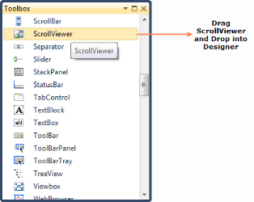
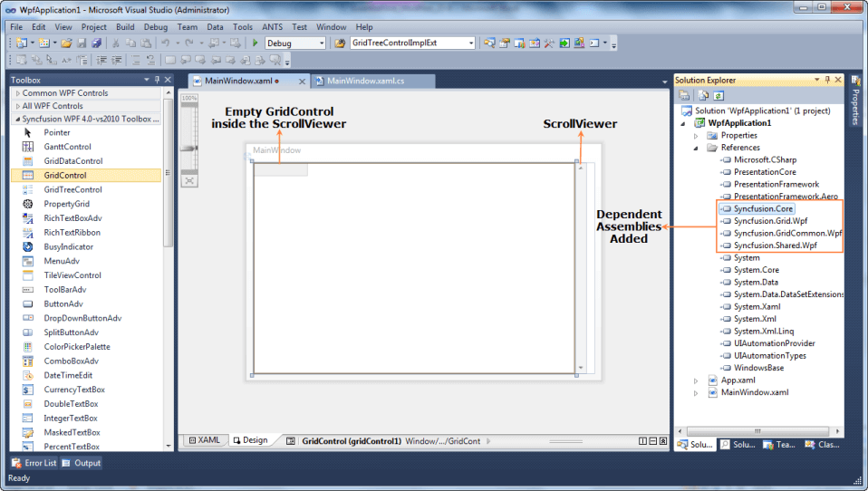
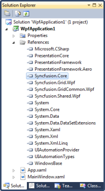

# Getting Started	

This section is designed to help you understand and quickly get started using Essential Grid in your WPF application. Control appearance and structure are defined and the Essential Grid’s relevant classes are depicted.

The following sections comprise the Getting Started section:

## Appearance and Structure of the Grid

EssentialGrid for WPF is a package of powerful grid controls that provides cell-oriented features and acts as an efficient display engine for tabular data that can be customized down to the cell level. It also offers excellent performance characteristics, such as a virtual mode and high-frequency updates, which makes the grid suitable for real-time applications.

The EssentialGrid package is comprised of following three types of grid controls:

* Grid Control
* GridData Control
* GridTree Control

Now, take closer look at the characteristics of each of these controls. 

### Grid Control

This is a general-purpose grid that can be used in any form, either holding its own data or virtually bound to an external data source. It acts as a base grid for the other two types of grids (the GridData and GridTree controls). Most features are shared among the three grid types. 

In the Grid control, each cell acts as a single entity, which is suitable for applications such as Excel simulator, where the data in the grid cells are not interrelated and need to be maintained in the specific cells themselves. You can also operate this control in virtual mode, where data is not stored in the grid’s internal data structure but comes from an external source like a data table, for example. In virtual mode, data will be dynamically loaded into the grid on demand or when users need to view the data.

### GridData Control

The GridData control is designed to be bound with a data source. In the GridData control, each column behaves as a single entity. This grid is more column-centric and can be used to display interrelated tabular data. Unlike the base grid, this grid does not store data values in its data structures; instead, it is connected to an external data source.

For more detailed information about data source connections, refer to the Data Binding section. 

### GridTree Control

The GridTree control serves as a multicolumn tree control that is optimized to display thousands of items. This control uses a load-on-demand architecture to quickly generate a tree view. You can toggle the view of the underlying nodes by clicking the plus-minus glyphs of a root node. This control provides complete customization options such as custom level styles, glyphs, node images, and more.

## Class Diagram 

The following illustration depicts the Class Diagram for Essential Grid for WPF.

### Control Hierarchy

### Model Hierarchy

## Adding Essential Grid to an Application

This section serves as a guide on how to deploy EssentialGrid in an application.

### Adding the Grid Control to a WPF Application

In this section, we will see how to add the Grid control to a WPF application and load random data. The Grid control can be added to an application through one of the following methods: through a designer or programmatically.

#### Adding the Grid Control through a Designer

Please follow the steps below to add the Grid control through a designer.

1. Create new WPF application.
2. Open the Designer window.
3. Drag ScrollViewer from the Toolbox and drop it in the Designer window (Since the Grid control doesn’t have a built-in ScrollViewer, to make the grid flow based on data, the grid should be placed inside the ScrollViewer control.

   

4. Drag GridControl from the Toolbox and drop it inside the ScrollViewer.

   

5. Once you drag GridControl and drop it in ScrollViewer, the grid control will be added to the designer and its dependent assemblies will be added to the project.

   

   _Designer after Dropping GridControl_

#### Programmatically Adding the Grid Control

Instead of adding it through a designer such a Visual Studio, you can add the Grid control programmatically.

1. Create a new WPF application.
2. Add the following Syncfusion assemblies to the project.
	1. Syncfusion.Core.dll
	2. Syncfusion.Grid.Wpf.dll
	3. Syncfusion.GridCommon.Wpf.dll
	4. Syncfusion.Shared.Wpf.dll

	

3. Name the root Grid as layoutRoot in the application’s XAML page.

   ~~~ xml
	[XAML]

	 <Grid Name="layoutRoot"/>        

   ~~~
   {:.prettyprint}

4. Create ScrollViewer and GridControl in code. 
5. To add the grid to the view, add GridControl as content of ScrollViewer and then add the ScrollViewer as a child of layoutRoot (Grid).

   ~~~ cs

	[C#]

	//ScrollViewer defined here

	ScrollViewer ScrollViewer = new ScrollViewer();

	//GridControl defined here

	GridControl gridControl = new GridControl();

	//GridControl set as the content of the ScrollViewer

	ScrollViewer.Content = gridControl;     

	//To bring the Grid control to the view, ScrollViewer should be set as a child of LayoutRoot      

	this.layoutRoot.Children.Add(ScrollViewer);           

   ~~~
   {:.prettyprint}

#### Populating the Grid control

The Grid control is a cell-based control, so to populate it, RowCount and ColumnCount are mandatory. Once ColumnCount and RowCount are specified, data can be populated by using one of the following methods. 

1. You can populate data by looping through the cells in the Grid control. The following code explains this scenario.

   ~~~ cs

		[C#]

		//Specifying row and column count

		gridControl.Model.RowCount = 100;

		gridControl.Model.ColumnCount = 20;

		//Looping through the cells and assigning the values based on row and column index

		for (int i = 0; i < 100; i++)

		{

		    for (int j = 0; j < 20; j++)

		    {

		        gridControl.Model[i, j].CellValue = string.Format("{0}/{1}", i, j);

		    }

		}

   ~~~
   {:.prettyprint}

2. You can populate data by handling the QueryCellInfo event of gridControl. This will load the data in and on-demand basis, ensuring optimized performance.

   ~~~ cs
		[C#]

		//Specifying row and column count

		gridControl.Model.RowCount = 100;

		gridControl.Model.ColumnCount = 20;

		this.gridControl.QueryCellInfo += new Syncfusion.Windows.Controls.Grid.GridQueryCellInfoEventHandler(gridControl_QueryCellInfo);

		//Assigning values by handling the QueryCellInfo event

		 void gridControl_QueryCellInfo(object sender, Syncfusion.Windows.Controls.Grid.GridQueryCellInfoEventArgs e)

		        {

		            e.Style.CellValue=string.Format("{0}/{1}", e.Cell.RowIndex, e.Cell.ColumnIndex);

		        }   

   ~~~
   {:.prettyprint}

3. Now, run the application. The grid will appear as follows. 

