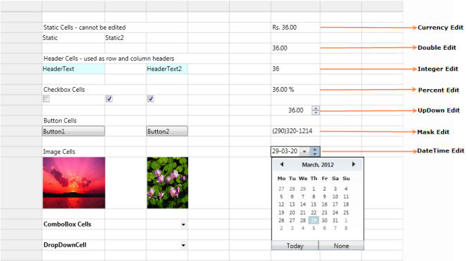
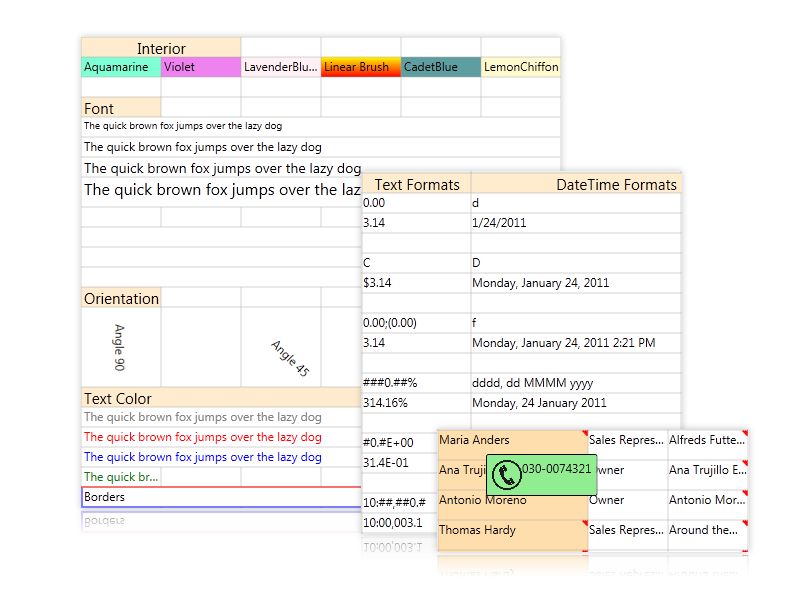
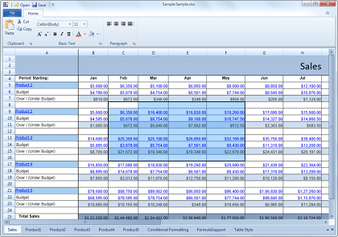

# Grid (Cell Grid)

The grid at its core functions as a very efficient display engine for tabular data that can be customized down to the cell level. It does not make any assumptions on the structure of the data (many grid controls implemented as straight data-bound controls make such explicit assumptions). This leads to a very flexible design that can be easily adapted to a variety of tasks including the display of completely unstructured data and the display of structured data from a database. 

The display system also hosts a powerful and complete styles architecture. Settings can be specified at the cell level or higher levels using parent styles that are referred to as base styles. Base styles can affect groups of cells. Cell level settings override any higher-level settings and enable easy customization right down to the cell level.

With this version, our core focus has been on the underlying architecture for displaying cells with virtualized cell editors in a manner that enables good performance characteristics. The core display system also supports several building-block features such as nested grids, virtual modes, and support for a virtually unlimited number of rows and columns.

## Key Features

The Excel like WPF grid control (virtual grid) is a cell-oriented control for displaying tabular data. It does not make any assumptions regarding the structure of the data. 

Below are key features of WPF Grid Control:

* Easy APIs to add, delete, or move rows and columns – You can easily add, delete, or move rows and columns throughout the Grid control using its well-defined APIs.
* Clipboard Support – Essential Grid provides excellent clipboard support that allows users to copy and paste grid cell content to text or any format.
* Frozen Rows and Columns – Essential Grid allows users to freeze grid columns to the left or right or freeze rows to the top or bottom of the grid.
* Resize Rows and Columns – Essential Grid provides options for resizing rows and columns. 
* Hide Rows and Columns – Essential Grid provides support for hiding or displaying a range of rows and columns.
* Keyboard Interface – Essential Grid provides extensive support for keyboard handling. The following list contains some supported keys and actions:
* Arrow keys – To move cell focus.
* PageUp/PageDown – To scroll a grid by page.
* F2  – To activate/deactivate a current cell.
* F4+ALT – To open/close the pop-up of a drop-down cell.
* CTRL + Arrow – To move to the first or last row or column.
* SHIFT + Arrow keys – To select cells.
* DELETE – To delete an entire row in the GridData control.
* CTRL+X, CTRL+V, CTRL+C – For common clipboard operations.
* All keyboard operations can be customized. 
* Selection Modes - Essential Grid offers different kinds of selection modes such as row only, column only, and cell only for selecting a particular row, column, or cell, respectively.
* Drag-Drop Support - Essential Grid lets you drag any column and drop it at any position in the grid. This allows columns to be repositioned as required.
* Virtual Mode - Essential Grid for WPF supports a virtual mode, which lets you dynamically provide data to the grid from an external data source through an event. This means the grid does not store any data in its internal data structure.

## Feature Summary

This section provides basic information, such as definitions and usage, regarding important features of Essential Grid.

### Grid Control Features

The Grid control is a cell-based, data-representation control. It can load millions of rows very quickly and is very easy to customize. The following features are just a sampling of what you can expect from Essential Grid.

#### Data Population and Virtual Mode

Because the Grid control is cell based, it doesn’t have any internal data structures, so it cannot store data internally. Data can be populated by either looping through the cells or by a virtual mode, which dynamically provides data to the grid by handling an event. In virtual mode, the Grid control can display millions of rows easily. 

Virtual Grid
{:.caption}

#### Data Presentation and Formatting

The Grid control supports many cell types to present data. In addition to built-in cell types, any WPF control or any custom control can be placed inside a cell by using a data-template cell.

#### Appearance

The Grid control’s appearance can be customized very easily. Common style properties include options to change background or text color, font, alignment, orientation, border, and wrap text. Various cell formats include date-time, currency, numeric, and text formats, and Excel-like comments are supported.

#### Customization Possibilities of the Grid Control

* Excel-Like Behaviors: The Grid control supports most Excel behaviors, including the following:
* Various Cell Support: Cells in the Grid control are very similar to Excel cells. Unique cells such as covered cells and floating cells are supported.
* Formula Support: The Grid control supports Excel-like formulas in each cell. The control comes with an extensive formula function library that supports more than 150 built-in formulas. 
* Printing: The Grid control provides built-in support for printing grid content.
* Excel-Like Interactions: The Grid control supports Excel-like user interaction features such as cell range drag-and-drop, auto-fill selections, and visual indicators to show hidden rows and columns.
* Excel-Like Rows and Columns: The Grid control provides various row and column options such as interactive column rearranging with drag-and-drop operations; hiding or displaying a range of rows and columns; resizing row heights and column widths to fit cell content; and options to fix rows and columns to the left, right, top, or bottom of the grid, similar to freezing panes in Excel.
* Excel-Like key navigation:
* Arrow keys – To move current cell focus.
* PageUp/PageDown – To scroll a grid by page.
* F2  – To activate/deactivate a current cell.
* F4+ALT – To open/close the pop-up of a drop-down cell.
* CTRL + Arrow keys – To move to the first or last row or column.
* SHIFT + Arrow keys – To select cells.
* CTRL+X, CTRL+V, CTRL+C, INSERT & DELETE – For common clipboard operations.
* Cell Selection – The Grid control also supports Excel-like cell selection.

#### Excel Compatibility

* Import Options: The import feature allows an Excel workbook to be imported into a grid while preserving the workbook’s look and feel. The following items can be imported: entire spreadsheets, formulas, styles, conditional formats, frozen panes, backgrounds, foregrounds, and comments.
* Export Options: The Grid control provides inherent support for exporting content to Excel files (.xls and .xlsx format) and to .csv files. 
