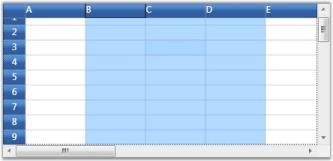
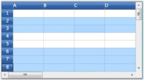
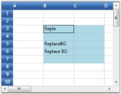

# Selection in WPF GridControl

WPF GridControl supports for range and record selection modes. Selection will highlight the specified range. 

## Selection modes

There are two modes of selection available in the GridControl. They are,

* Range selection
* Record selection 

### Range selection

1. In Range selection, you will be able to select cell ranges; but the selections will have no knowledge of nested tables, grouping or sorting and hence the functionality is limited like a data bound grid (GridData control). 
2. To use the model selection capability, set AllowSelections to any flag except none.
3. Selection can be made through keyboard and mouse.

### Record selection 

1. It is designed specifically for the data bound grids.
2. In Record selection, the complete grid records (rows) will be selected and these selections function properly with nested tables, sorting, and so on. 
3. To use the record selections, you must set AllowSelections to none and then set ListBoxSelectionMode to any flag except none.
4. Selection can be made through keyboard and mouse with some restriction. For more details, see Record-based Selection in this topic.

## Range selection

Range selection is a cell-based selection mode that allows you to do a selection across the cell by using the [AllowSelection](https://help.syncfusion.com/cr/wpf/Syncfusion.Grid.Wpf~Syncfusion.Windows.Controls.Grid.GridModelOptions~AllowSelection.html) property. It accepts value from [GridSelectionFlags](https://help.syncfusion.com/cr/wpf/Syncfusion.Grid.Wpf~Syncfusion.Windows.Controls.Grid.GridSelectionFlags.html) enumeration. Default value for `AllowSelection` is `Any` and the specified range of Cell/Row/Column or Table can be highlighted using the range section.

The possible values for this type of selection are defined by the enum GridSelectionFlags. To control the selection behavior of the grid, set any of the following flags to the AllowSelection property. 

### Selection flags

<table>
<tr>
<th>
Flag</th><th>
Description</th></tr>
<tr>
<td>
None</td><td>
Disables selecting of cells.</td></tr>
<tr>
<td>
Row</td><td>
Allows selection of rows.</td></tr>
<tr>
<td>
Column</td><td>
Allows selection of columns.</td></tr>
<tr>
<td>
Table</td><td>
Allows selection of the whole table.</td></tr>
<tr>
<td>
Cell</td><td>
Allows selection of an individual cell.</td></tr>
<tr>
<td>
Multiple</td><td>
Allows selection of multiple ranges of cells. The user has to press CTRL Key to select multiple ranges.</td></tr>
<tr>
<td>
Shift</td><td>
Allows extending existing selection when user holds SHIFT Key and clicks on a cell.</td></tr>
<tr>
<td>
Keyboard</td><td>
Allows extending existing selection when user holds SHIFT Key and presses arrow keys.</td></tr>
<tr>
<td>
MixRangeType</td><td>
Allows both rows and columns to be selected at the same time when Multiple is specified. By default, the grid does not allow row and column ranges to be selected at the same time.</td></tr>
<tr>
<td>
Any</td><td>
Allows selection of rows, columns, table, cell and multiple ranges of cells; also extends SHIFT Key support and alpha blending.</td></tr>
</table>

N> You can combine more than one flag to customize the current selection behavior.



grid.Model.Options.AllowSelection = GridSelectionFlags.Multiple | GridSelectionFlags.Column;



## Record selection

This type of selection mechanism allows selection in terms of record (entire row). It is not cell-based. This selection mode is specifically designed for a data-bound grid, in which the grid data can be organized as a collection of record rows. 

Grid offers the following three types of record selections which are together called as ListBoxSelectionMode. 

* SelectionMode–One
* SelectionMode–MultiSimple
* SelectionMode-MultiExtended

To enable record selection, set the [ListBoxSelectionMode](https://help.syncfusion.com/cr/wpf/Syncfusion.Grid.Wpf~Syncfusion.Windows.Controls.Grid.GridModelOptions~ListBoxSelectionMode.html) property to any of the above specified List Box Selection Mode values. To enable list box selection, turn off the range selection by setting the `AllowSelection` property to `Row`. Below is a detailed description of list box selection modes.

### SelectionMode-One

It allows you to select only one item (record). For example, you have selected a record. Now if you select some other record, the previous record selection will be cleared. Hence it is a `One` record selection mode.



grid.AllowSelection = GridSelectionFlags.Row;
grid.Model.Options.ListBoxSelectionMode = GridSelectionMode.One;



N> Record can be selected using a single mouse click or using UP or DOWN Arrow Keys

### SelectionMode - MultiSimple

In this selection mode, you will be able to select multiple items individually. For instance, you have selected a record using mouse and you want to select one more record. Click another record and you will notice that the previous selection is not cleared. Hence You can select multiple records without the need of SHIFT or CTRL keys.



grid.AllowSelection = GridSelectionFlags.Row;
grid.Model.Options.ListBoxSelectionMode = GridSelectionMode.MultiSimple;



N> It does not support the use of SHIFT, CTRL and arrow keys to extend the selection.

### SelectionMode - MultiExtended

This selection type allows multiple items selection through SHIFT, CTRL and arrow keys. 

You can do any of the following when this selection mode is enabled:

* Select a record, hold down the SHIFT key and select fourth record, for example. You will notice all the records in between 1st and the 4th records are also selected. 
* You can make random selection by holding down the CTRL key. 
* Hold down the Shift key and select the records using the UP or DOWN ARROW keys.



grid.AllowSelection = GridSelectionFlags.Row;
grid.Model.Options.ListBoxSelectionMode = GridSelectionMode.MultiExtended;



## Selecting rows and columns programmatically

The entire grid selections are managed by the [GridModel.Selections](https://help.syncfusion.com/cr/wpf/Syncfusion.Grid.Wpf~Syncfusion.Windows.Controls.Grid.GridModelSelections.html) collection. It exposes several APIs that let you to add, remove and operate on different grid selections. Below is the description of some important properties and APIs:

<table>
<tr>
<th>
Property/Method</th><th>
Description</th></tr>
<tr>
<td>
{{'[Add](https://help.syncfusion.com/cr/wpf/Syncfusion.Grid.Wpf~Syncfusion.Windows.Controls.Grid.GridModelSelections~Add.html)'| markdownify }}, {{'[Remove](https://help.syncfusion.com/cr/wpf/Syncfusion.Grid.Wpf~Syncfusion.Windows.Controls.Grid.GridModelSelections~Remove.html)'| markdownify }}</td><td>
Adds or removes the specified range to/from the collection.</td></tr>
<tr>
<td>
{{'[InsertRows](https://help.syncfusion.com/cr/wpf/Syncfusion.Grid.Wpf~Syncfusion.Windows.Controls.Grid.GridModelSelections~InsertRows.html)'| markdownify }}, {{'[InsertColumns](https://help.syncfusion.com/cr/wpf/Syncfusion.Grid.Wpf~Syncfusion.Windows.Controls.Grid.GridModelSelections~InsertColumns.html)'| markdownify }}</td><td>
Inserts new rows or columns into the collection.</td></tr>
<tr>
<td>
{{'[RemoveRows](https://help.syncfusion.com/cr/wpf/Syncfusion.Grid.Wpf~Syncfusion.Windows.Controls.Grid.GridModelSelections~RemoveRows.html)'| markdownify }}, {{'[RemoveColumns](https://help.syncfusion.com/cr/wpf/Syncfusion.Grid.Wpf~Syncfusion.Windows.Controls.Grid.GridModelSelections~RemoveColumns.html)'| markdownify }}</td><td>
Removes the specified rows or columns from the collection.</td></tr>
<tr>
<td>
{{'[Ranges](https://help.syncfusion.com/cr/wpf/Syncfusion.Grid.Wpf~Syncfusion.Windows.Controls.Grid.GridModelSelections~Ranges.html)'| markdownify }}</td><td>
A GridRangeInfoList collection that stores all the selected ranges for the grid.</td></tr>
<tr>
<td>
{{'[SelectRange](https://help.syncfusion.com/cr/wpf/Syncfusion.Grid.Wpf~Syncfusion.Windows.Controls.Grid.GridModelSelections~SelectRange.html)'| markdownify }}</td><td>
Adds or removes a range to/from the collection.</td></tr>
<tr>
<td>
{{'[GetSelectedRanges](https://help.syncfusion.com/cr/wpf/Syncfusion.Grid.Wpf~Syncfusion.Windows.Controls.Grid.GridModelSelections~GetSelectedRanges.html)'| markdownify }}</td><td>
Retrieves a list of selected ranges and if there are no selected ranges, returns the current cell.</td></tr>
<tr>
<td>
{{'[GetSelectedRows](https://help.syncfusion.com/cr/wpf/Syncfusion.Grid.Wpf~Syncfusion.Windows.Controls.Grid.GridModelSelections~GetSelectedRows.html)'| markdownify }}</td><td>
Returns the number of selected rows.</td></tr>
<tr>
<td>
{{'[GetSelectedCols](https://help.syncfusion.com/cr/wpf/Syncfusion.Grid.Wpf~Syncfusion.Windows.Controls.Grid.GridModelSelections~GetSelectedCols.html)'| markdownify }}</td><td>
Returns the number of selected columns.</td></tr>
</table>

## Selection appearance customization

It is possible to modify the appearance of the selection through property settings. The following properties work in combinations to produce some special effects.

<table>
<tr>
<th>
Property</th><th>
Description</th></tr>
<tr>
<td>
{{'[DrawSelectionOptions](https://help.syncfusion.com/cr/wpf/Syncfusion.Grid.Wpf~Syncfusion.Windows.Controls.Grid.GridModelOptions~DrawSelectionOptions.html)'| markdownify }}</td><td>
Defines the selection behavior for the grid. Important options are:AlphaBlendReplaceBackgroundReplaceTextColor</td></tr>
<tr>
<td>
{{'[HighlightSelectionAlphaBlend](https://help.syncfusion.com/cr/wpf/Syncfusion.Grid.Wpf~Syncfusion.Windows.Controls.Grid.GridModelOptions~HighlightSelectionAlphaBlend.html)'| markdownify }}</td><td>
Specifies the alpha blend color used for selection.</td></tr>
<tr>
<td>
{{'[HighlightSelectionBackground](https://help.syncfusion.com/cr/wpf/Syncfusion.Grid.Wpf~Syncfusion.Windows.Controls.Grid.GridModelOptions~HighlightSelectionBackground.html)'| markdownify }}</td><td>
Specifies the background color for selection.</td></tr>
<tr>
<td>
{{'[HighlightSelectionForeground](https://help.syncfusion.com/cr/wpf/Syncfusion.Grid.Wpf~Syncfusion.Windows.Controls.Grid.GridModelOptions~HighlightSelectionForeground.html)'| markdownify }}</td><td>
Specifies the foreground color for selection.</td></tr>
</table>

Customizing `AlphaBlendSelection` background.



LinearGradientBrush brush = new LinearGradientBrush(new GradientStopCollection()
{  
   new GradientStop(GridUtil.GetXamlConvertedValue<Color>("#A0E01020"), 0d),
   new GradientStop(GridUtil.GetXamlConvertedValue<Color>("#A0E01020"), 0.318681d),
   new GradientStop(GridUtil.GetXamlConvertedValue<Color>("#A0E08000"), 0.604396d),
   new GradientStop(GridUtil.GetXamlConvertedValue<Color>("#A0E08000"), 1d)
});
brush.StartPoint = new Point(0.5, -0.0430693);
brush.EndPoint = new Point(0.5, 0.928826);
grid.Model.Options.HighlightSelectionAlphaBlend = brush;
grid.Model.Options.DrawSelectionOptions = GridDrawSelectionOptions.AlphaBlend;



Customizing the background of selected ranges.



grid.Model.Options.DrawSelectionOptions = GridDrawSelectionOptions.ReplaceBackground;
grid.Model.Options.HighlightSelectionBackground = Brushes.LightBlue;



Customizing foreground color of selected ranges.



grid.Model.Options.DrawSelectionOptions = GridDrawSelectionOptions.ReplaceTextColor;
grid.Model.Options.HighlightSelectionForeground = Brushes.Red;



## Excel-like selection frame

The active selection can be outlined with a selection frame by setting the [GridModelOptions.ExcelLikeSelectionFrame](https://help.syncfusion.com/cr/wpf/Syncfusion.Grid.Wpf~Syncfusion.Windows.Controls.Grid.GridModelOptions~ExcelLikeSelectionFrame.html) property to `true`.



grid.Model.Options.ExcelLikeSelectionFrame = true;



N> If multiple ranges are selected, the selection frame is applicable only for `ActiveRange`.

## CurrentCell

When a cell is activated current cell is outlined with a border. You can show or hide current cell outline by setting [ShowCurrentCell](https://help.syncfusion.com/cr/wpf/Syncfusion.Grid.Wpf~Syncfusion.Windows.Controls.Grid.GridModelOptions~ShowCurrentCell.html) property.



//To disable the current cell.
this.gridControl.Model.Options.ShowCurrentCell = true; 



## Excel-like CurrentCell

You can select a current cell in the Grid, similar to the current cell behavior in Microsoft Excel(borders with thickness). This feature can be enabled by setting [GridModelOptions.ExcelLikeCurrentCell](https://help.syncfusion.com/cr/wpf/Syncfusion.Grid.Wpf~Syncfusion.Windows.Controls.Grid.GridModelOptions~ExcelLikeCurrentCell.html) property to `true`.  



grid.Model.Options.ExcelLikeCurrentCell = true;



N> If you have selected a current cell within a specified range, the range will be cleared, when you move the current cell selection out of this range.

## Highlighting row and column header based on selection

In Excel, whenever a selection is made, the headers of those rows and columns which are involved in the selection will be highlighted. You can get a similar behavior in the Grid by overriding the [OnPrepareRenderCell](https://help.syncfusion.com/cr/wpf/Syncfusion.Grid.Wpf~Syncfusion.Windows.Controls.Grid.GridControlBase~OnPrepareRenderCell.html) method.

`OnPrepareRenderCell` method will be invoked for every cell in the grid, when they are about to be rendered. Hence, using this method, the cells which are going to be rendered are identified and their headers are highlighted.



class ExcelGrid : GridControl
{
    protected override void OnPrepareRenderCell(GridPrepareRenderCellEventArgs e)
    {
        base.OnPrepareRenderCell(e);
        if (e.Cell.RowIndex == 0 && Model.SelectedRanges.AnyRangeIntersects(GridRangeInfo.Col(e.Cell.ColumnIndex)))
        {
            e.Style.Background = this.excelOrange;
        }
        else if (e.Cell.ColumnIndex == 0 && Model.SelectedRanges.AnyRangeIntersects(GridRangeInfo.Row(e.Cell.RowIndex)))
        {
            e.Style.Background = this.excelOrange;
        }
    }
    private Brush excelOrange = new SolidColorBrush(Color.FromRgb(244, 198, 111));
}



N> Download demo application from [GitHub](https://github.com/SyncfusionExamples/Row-and-column-header-highlighting-based-on-selection-in-WPF-Grid-Control)

## See also

[How to get first and last selected row index](https://www.syncfusion.com/kb/11183)

[How to set extended selection mode to select a row when user-click-a-cell](https://www.syncfusion.com/kb/11185)

[How to avoid selection header cell](https://www.syncfusion.com/kb/11186)

[How to programmatically invert selection](https://www.syncfusion.com/kb/11195)

[How to exclude header while copying](https://www.syncfusion.com/kb/11194)

[How to invoke CommitCellInfo event](https://www.syncfusion.com/kb/11193)

[How to change the selected cell border color](https://www.syncfusion.com/kb/11223)

[How to highlighted selected cells with border color for each cell](https://www.syncfusion.com/kb/11222)

[How to select a row or column when click a cell](https://www.syncfusion.com/kb/11239)

[How to select a row or column programmatically in code](https://www.syncfusion.com/kb/11245)

