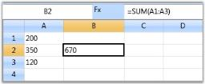
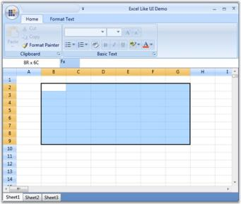

#Selection

There are two modes of selection available in the Grid. They are,

* Model-Based Selection
* Record-Based Selection 

## Model-Based Selection

1. In Model-based selection, you will be able to select cell ranges; but the selections will have no knowledge of nested tables, grouping or sorting and hence the functionality is limited like a data bound grid (GridData control). 
2. To use the model selection capability, set AllowSelections to any flag except none.
3. Selection can be made through keyboard and mouse.

## Record-Based Selection 

1. It is designed specifically for the data bound grids.
2. In Record-based selection, the complete grid records (rows) will be selected and these selections function properly with nested tables, sorting, and so on. 
3. To use the record selections, you must set AllowSelections to none and then set ListBoxSelectionMode to any flag except none.
4. Selection can be made through keyboard and mouse with some restriction. For more details, see Record-based Selection in this topic.

Let us know more about these selection Modes.

## Model-Based Selection

Model-based selection is cell-based selection mode that allows you to do a selection across the cell, which is not possible with record-based selection. It can be set by initializing AllowSelection property to a Flag value, say, Row. 

N> Setting the Flag to None will disable selecting of cells.

The possible values for this type of selection are defined by the enum GridSelectionFlags. To control the selection behavior of the grid, set any of the following flags to the AllowSelection property. 

### Selection Flags

<table>
<tr>
<th>
Flag</th><th>
Description</th></tr>
<tr>
<td>
None</td><td>
Disables selecting of cells.</td></tr>
<tr>
<td>
Row</td><td>
Allows selection of rows.</td></tr>
<tr>
<td>
Column</td><td>
Allows selection of columns.</td></tr>
<tr>
<td>
Table</td><td>
Allows selection of the whole table.</td></tr>
<tr>
<td>
Cell</td><td>
Allows selection of an individual cell.</td></tr>
<tr>
<td>
Multiple</td><td>
Allows selection of multiple ranges of cells. The user has to press CTRL Key to select multiple ranges.</td></tr>
<tr>
<td>
Shift</td><td>
Allows extending existing selection when user holds SHIFT Key and clicks on a cell.</td></tr>
<tr>
<td>
Keyboard</td><td>
Allows extending existing selection when user holds SHIFT Key and presses arrow keys.</td></tr>
<tr>
<td>
MixRangeType</td><td>
Allows both rows and columns to be selected at the same time when Multiple is specified. By default, the grid does not allow row and column ranges to be selected at the same time.</td></tr>
<tr>
<td>
Any</td><td>
Allows selection of rows, columns, table, cell and multiple ranges of cells; also extends SHIFT Key support and alpha blending.</td></tr>
</table>

You can combine more than one flag to customize the current selection behavior.

### Example

Here is an example code snippet that sets the selection mode for selecting multiple columns.



grid.Model.Options.AllowSelection = GridSelectionFlags.Multiple | GridSelectionFlags.Column;



Selecting multiple Columns
{:.caption}

### Format Selections

It is possible to modify the appearance of the selection through property settings. The following properties work in combinations to produce some special effects.

<table>
<tr>
<th>
Property</th><th>
Description</th></tr>
<tr>
<td>
DrawSelectionOptions</td><td>
Defines the selection behavior for the grid. Important options are:AlphaBlendReplaceBackgroundReplaceTextColor</td></tr>
<tr>
<td>
HighlightSelectionAlphaBlend</td><td>
Specifies the alpha blend color used for selection.</td></tr>
<tr>
<td>
HighlightSelectionBackground</td><td>
Specifies the background color for selection.</td></tr>
<tr>
<td>
HighlightSelectionForeground</td><td>
Specifies the foreground color for selection.</td></tr>
</table>

Below code provides alpha blended selection:



LinearGradientBrush brush = new LinearGradientBrush(new GradientStopCollection()
{  
   new GradientStop(GridUtil.GetXamlConvertedValue<Color>("#A0E01020"), 0d),
   new GradientStop(GridUtil.GetXamlConvertedValue<Color>("#A0E01020"), 0.318681d),
   new GradientStop(GridUtil.GetXamlConvertedValue<Color>("#A0E08000"), 0.604396d),
   new GradientStop(GridUtil.GetXamlConvertedValue<Color>("#A0E08000"), 1d)
});
brush.StartPoint = new Point(0.5, -0.0430693);
brush.EndPoint = new Point(0.5, 0.928826);
grid.Model.Options.HighlightSelectionAlphaBlend = brush;
grid.Model.Options.DrawSelectionOptions = GridDrawSelectionOptions.AlphaBlend;



Alpha-blended selection
{:.caption}

Below code lets you set the background of the selection:



grid.Model.Options.DrawSelectionOptions = GridDrawSelectionOptions.ReplaceBackground;
grid.Model.Options.HighlightSelectionBackground = Brushes.LightBlue;



Selection Background set to blue
{:.caption}

Below code lets you set the foreground of the selection:



grid.Model.Options.DrawSelectionOptions = GridDrawSelectionOptions.ReplaceTextColor;
grid.Model.Options.HighlightSelectionForeground = Brushes.Red;



Foreground of the selection set to pink
{:.caption}

## Record-Based Selection

This type of selection mechanism allows selection in terms of record (entire row). It is not cell-based. This selection mode is specifically designed for a data-bound grid in which the grid data can be organized as a collection of record rows. 

Grid offers the following three types of record-based selections which are together called as List Box Selection Modes. 

* SelectionMode–One
* SelectionMode–MultiSimple
* SelectionMode-MultiExtended

To enable record-based selection, set the ListBoxSelectionMode property to any of the above specified List Box Selection Mode values. To enable list box selection, turn off the model-based selection by setting the AllowSelection property to Row. Below is a detailed description of List Box Selection Modes.

### SelectionMode-One

It allows you to select only one item (record). Say, you have selected a record. Now if you select some other record, the previous record selection will be cleared. Hence it is a one record selection mode. The following code is used to set this mode:



grid.AllowSelection = GridSelectionFlags.Row;
grid.Model.Options.ListBoxSelectionMode = GridSelectionMode.One;



SelectionMode-one
{:.caption}

N> Record can be selected using a single mouse click or using UP or DOWN Arrow Keys

### SelectionMode - MultiSimple

In this selection mode, you will be able to select multiple items individually. Say, you have selected a record using mouse and you want to select one more record. Click another record and you will notice that the previous selection is not cleared. You can hence select multiple records without the need of SHIFT or CTRL keys.

The following code is used to set this mode:



grid.AllowSelection = GridSelectionFlags.Row;
grid.Model.Options.ListBoxSelectionMode = GridSelectionMode.MultiSimple;



SelectionMode – MultiSimple
{:.caption}

N> It does not support the use of SHIFT, CTRL and arrow keys to extend the selection.

### SelectionMode - MultiExtended

This selection type allows multiple items selection through SHIFT, CTRL and arrow keys. 

You can do any of the following when this selection mode is enabled:

* Select a record, hold down the SHIFT key and select fourth record, for example. You will notice all the records in between 1st and the 4th record are also selected. 
* You can make random selection by holding down the CTRL key. 
* Hold down the Shift key and select the records using the UP or DOWN ARROW keys.

The following code is used to set this mode:



grid.AllowSelection = GridSelectionFlags.Row;
grid.Model.Options.ListBoxSelectionMode = GridSelectionMode.MultiExtended;



SelectionMode - MultiExtended
{:.caption}

### The Model.Selections Collection

The entire grid selections are managed by the GridModel.Selections collection. It exposes several APIs that let you add, remove and operate on different grid selections. Below is the description of some important properties and APIs:

<table>
<tr>
<th>
Property/Method</th><th>
Description</th></tr>
<tr>
<td>
Add(), Remove()</td><td>
Adds or removes the specified range to/from the collection.</td></tr>
<tr>
<td>
InsertRows(), InsertColumns()</td><td>
Inserts new rows or columns into the collection.</td></tr>
<tr>
<td>
RemoveRows(), RemoveColumns()</td><td>
Removes the specified rows or columns from the collection.</td></tr>
<tr>
<td>
Ranges</td><td>
A GridRangeInfoList collection that stores all the selected ranges for the grid.</td></tr>
<tr>
<td>
SelectRange()</td><td>
Adds or removes a range to/from the collection.</td></tr>
<tr>
<td>
GetSelectedRanges()</td><td>
Retrieves a list of selected ranges and if there are no selected ranges, returns the current cell.</td></tr>
<tr>
<td>
GetSelectedRows()</td><td>
Returns the number of selected rows.</td></tr>
<tr>
<td>
GetSelectedCols()</td><td>
Returns the number of selected columns.</td></tr>
</table>

### Enable/Disable CurrentCell

By default the CurrentCell cell border will be enabled. The ShowCurrentCell property is used to enable or disable the border for CurrentCell.



//To disable the current cell.
this.gridControl.Model.Options.ShowCurrentCell = false; 



## Excel-like UI Applications

Another important application is Excel like UI that simulates Microsoft Excel 2007 and gives an appearance that resembles excel. This application exhibits the following excel characteristics:

   * Excel like Current Cell
   * Formula Cells
   * Excel like Selection Frame
   * Markup Headers
   * Workbook of sheets

### Excel-like Current Cell

You can select a current cell in the Grid, similar to the current cell behavior in Microsoft Excel. This feature can be enabled, by setting GridModelOptions.ExcelLikeCurrentCell property to _true_, as follows:  



grid.Model.Options.ExcelLikeCurrentCell = true;



Grid Showing Excel like Current Cell Selection
{:.caption}

N>  If you have selected a current cell within a specified range, and when you move the current cell selection out of this range, the range will be cleared.

### Excel-like Selection Frame

The active selection can be outlined with a selection frame by setting the GridModelOptions.ExcelLikeSelectionFrame property to true, as follows:



grid.Model.Options.ExcelLikeSelectionFrame = true;



Grid Displaying Excel like Selection Frame
{:.caption}

### Formula Cells

As we discussed in the previous chapter, Grid control provides complete support to formula cells. It can be enabled for the grid by setting the format string, FormulaCell to the TableStyle.CellType property, as follows: 



grid.Model.TableStyle.CellType = "FormulaCell";



Grid with Excel like Formula Cell
{:.caption}

### Markup Headers

In Excel, whenever a selection is made, the headers of those rows and columns which are involved in the selection will be highlighted. You can get a similar behavior in the Grid using the OnPrepareRenderCell event.  

OnPrepareRenderCell event-This event will be triggered for every cell when they are about to be rendered. Hence, using this event, the cells that are going to be rendered are identified and their headers are highlighted.

The following code illustrates how to handle this event:



protected override void OnPrepareRenderCell(GridPrepareRenderCellEventArgs e)
{
    base.OnPrepareRenderCell(e);

    if (e.Cell.RowIndex == 0 && Model.SelectedRanges.AnyRangeIntersects(GridRangeInfo.Col(e.Cell.ColumnIndex)))
    {
        e.Style.Background = this.excelOrange;
    }

    else if (e.Cell.ColumnIndex == 0 && Model.SelectedRanges.AnyRangeIntersects(GridRangeInfo.Row(e.Cell.RowIndex)))
    {
        e.Style.Background = this.excelOrange;
    }
}



Grid with markup headers
{:.caption}

### Workbook of Sheets

You can create a workbook with multiple sheets similar to excel, using a Tab control, where individual tab represents a worksheet embedded within a Grid control.

Grid with workbook of sheets
{:.caption}

Sample Output

Complete Sample Output
{:.caption}

N> For the complete code for this example, refer the following browser sample:  
...\My Documents\Syncfusion\EssentialStudio\<Version Number>\WPF\Grid.WPF\Samples\3.5\WindowsSamples\Product Showcase\Excel Like UI Demo