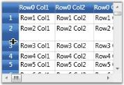
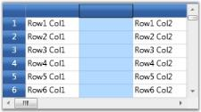
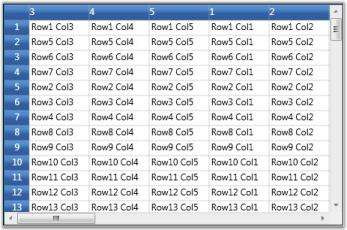

# Working with GridControl

This section deals with essential features of Grid control, which are listed below:

* Controlling Rows and Columns-Discusses on row and column settings
* Selection Modes-Discusses on different selection modes in a grid

## Controlling Rows and Columns

Each Grid instance is tied to a model, which contains the data represented by the Grid control. The grid model exposes properties that allow the user to manipulate grid rows and columns.

Setting Rows and Columns count

The grid model has RowCount and ColumnCount properties. These can be set to change the number of rows and columns in the grid control, as shown below:



// Set Row count
grid.Model.RowCount = 10;

// Set Column count
grid.Model.ColumnCount = 20;



### Setting Row Heights and Column Widths

The grid model also stores information on row heights and column widths. Its ColumnWidths and RowHeights properties can be changed using indexers as shown below:



// Setting column widths
grid.Model.ColumnWidths[0] = 30;
grid.Model.ColumnWidths[1] = 80;
grid.Model.ColumnWidths[2] = 100;
grid.Model.ColumnWidths[3] = 50;
grid.Model.ColumnWidths[4] = 250;

// Setting row heights
grid.Model.RowHeights[5] = 40;
grid.Model.RowHeights[3] = 40;



You can also specify the DefaultLineSize setting on ColumnWidths and RowHeights in order to set the default width or height.



grid.Model.RowHeights.DefaultLineSize = 20;
grid.Model.ColumnWidths.DefaultLineSize = 100;



### Hiding Rows and Columns

Essential Grid supports efficient hiding of rows and columns. You can hide and unhide ranges of rows and columns using SetHidden method on ColumnWidths and RowHeights.

N> SetHidden method accepts the following three parameters: 

* The first parameter is an integer, which specifies the starting row/column to hide/unhide_
* The second parameter is an integer, which specifies the ending row/column to hide/unhide_
* Third is a boolean parameter that determines whether to hide or unhide the specified number of rows or columns. The 
  rows/columns will be hidden when this parameter is set to true._

The following code illustrates the usage of SetHidden method:



// Hide rows
grid.Model.RowHeights.SetHidden(2, 100, true);
grid.Model.RowHeights.SetHidden(110, 1000, true);

// Unhide rows
grid.Model.RowHeights.SetHidden(1010, 10000, false);

//Hide columns
grid.Model.ColumnWidths.SetHidden(2, 100, true);
grid.Model.ColumnWidths.SetHidden(110, 150, true);

// Unhide columns
grid.Model.ColumnWidths.SetHidden(1010, 10000, false);



### Freeze Rows and Columns

It is possible to fix any number of rows and columns so that they are still visible when a grid is scrolled. This feature is called as freezing. It can be achieved in the Grid by setting the FrozenRows and FrozenColumns properties of grid model, as shown below:



// Freeze rows and columns
grid.Model.FrozenRows = 4;
grid.Model.FrozenColumns = 3;



You can also fix rows to the right of the grid and columns to the bottom. Such fixed rows and columns are referred to as Footer rows and Footer columns. The properties FooterRows and FooterColumns determine the number of footer rows and footer columns. The footer row or column can be customized by using the FooterStyle property.

The following code illustrates the usage of FooterRows, FooterColumns and FooterStyle properties:



// Footer rows and columns
grid.Model.FooterRows = 3;
grid.Model.FooterColumns = 1;
grid.Model.FooterStyle.Background = Brushes.LightCoral;



### Header Rows and Columns

Grid allows the user to have any number of header rows and columns. It is done by using the HeaderRows and HeaderColumns properties of the grid model. The HeaderStyle property of the grid model controls the appearance of these header rows and header columns.

The following code illustrates the usage of HeaderRows, HeaderColumns and HeaderStyle properties:



// Header rows and columns
grid.Model.HeaderRows = 3;
grid.Model.HeaderColumns = 2;
grid.Model.HeaderStyle.Font.FontStyle = FontStyles.Italic;



### Resize Rows and Columns

Grid allows the user to resize the rows and columns at run time. When this feature is enabled and if you move the mouse over the row or column divider, it will show a resize cursor using which you can resize the row or column to the required level. The following images illustrate the resizing of a column and a row:

This feature is turned on by default. To disable column or row resizing, you need to detach the corresponding mouse controllers from grid, as shown below:



IMouseController controller = grid.MouseControllerDispatcher.Find ("ResizeRowsMouseController");
grid.MouseControllerDispatcher.Remove(controller);
controller = grid.MouseControllerDispatcher.Find  ("ResizeColumnsMouseController");
grid.MouseControllerDispatcher.Remove(controller);



N> To prevent resizing of specific row or column, it is required to handle ResizingRows and ResizingColumns events.

### Inserting Rows and Columns

New columns and rows can be inserted at run time by using the following APIs:

* InsertColumns()
* InsertRows()

Both these methods accept the following two parameters: 

1. Position index 
2. Number of rows or columns to insert

The following code illustrates the usage of InsertColumns and InsertRows methods:



//Insert a column at position 2.
grid.Model.InsertColumns(2, 1);

//Insert 2 rows at position 5.
grid.Model.InsertRows(5, 2);



N> You can track the moment the rows or columns are inserted by handling the RowsInserted and ColumnsInserted events.

### Moving Rows and Columns

The rows and columns can be rearranged dynamically by moving them from one position to another using the following APIs: 

* MoveRows()
* MoveColumns()

These methods accept the following three parameters: 

* Position from which the rows or columns should be removed
* Number of rows or columns
* The new position at which these rows or columns should be inserted

You can also achieve this by a simple drag-and-drop action on the desired rows and columns.

The following code illustrates the usage of MoveColumns and MoveRows methods:



//Move 3 rows from index 2 to index 5.
grid.Model.MoveRows(2, 3, 5);

//Move 2 columns from index 1 to index 4.
grid.Model.MoveColumns(1, 2, 4);



N> You can track the moment the rows or columns are moved by handling the RowsMoved and  ColumnsMoved event.

### Removing Rows and Columns

It is possible to remove a range of rows and columns from the grid. The APIs RemoveRows() and RemoveColumns() are used to achieve this. They accept two parameters:

1. An index, from which the rows or columns should be removed 
2. Total number of rows or columns to be removed

The following code illustrates the usage of RemoveColumns and RemoveRows methods:



//Remove 4 rows from position 3.
grid.Model.RemoveRows(3, 4);

//Remove 3 columns from position 2.
grid.Model.RemoveColumns(2, 3);



You can track the moment the rows or columns are inserted by handling the RowsRemoved and ColumnsRemoved events.

### AutoFit content

The rows heights and column widths can be made to adjust themselves automatically to fit the content by using the methods ResizeRowsToFit() and ResizeColumnsToFit(), which accept the following two parameters:

1. A range of rows or columns whose size should be adjusted 
2. A GridResizeToFitOptions enumeration value. 

The GridResizeToFitOptions enum value specifies how the resizing action should be performed; whether to include covered cells, hidden cells, headers, and whether or not to shrink size, and the like.

The following code illustrates the usage of ResizeRowsToFit and ResizeColumnsToFit methods:



//Auto fit column 3
grid.Model.ResizeColumnsToFit(GridRangeInfo.Col(3), GridResizeToFitOptions.NoShrinkSize);

//Auto fit row 2
grid.Model.ResizeRowsToFit(GridRangeInfo.Row(2), GridResizeToFitOptions.NoShrinkSize);



## Selection Modes

There are two modes of selection available in the Grid. They are,

* Model-Based Selection
* Record-Based Selection 

### Model-Based Selection

1. In Model-based selection, you will be able to select cell ranges; but the selections will have no knowledge of nested tables, grouping or sorting and hence the functionality is limited like a data bound grid (GridData control). 
2. To use the model selection capability, set AllowSelections to any flag except none.
3. Selection can be made through keyboard and mouse.

### Record-Based Selection 

1. It is designed specifically for the data bound grids.
2. In Record-based selection, the complete grid records (rows) will be selected and these selections function properly with nested tables, sorting, and so on. 
3. To use the record selections, you must set AllowSelections to none and then set ListBoxSelectionMode to any flag except none.
4. Selection can be made through keyboard and mouse with some restriction. For more details, see Record-based Selection in this topic.

Let us know more about these selection Modes.

### Model-Based Selection

Model-based selection is cell-based selection mode that allows you to do a selection across the cell, which is not possible with record-based selection. It can be set by initializing AllowSelection property to a Flag value, say, Row. 

N> Setting the Flag to None will disable selecting of cells.

The possible values for this type of selection are defined by the enum GridSelectionFlags. To control the selection behavior of the grid, set any of the following flags to the AllowSelection property. 

### Selection Flags

<table>
<tr>
<th>
Flag</th><th>
Description</th></tr>
<tr>
<td>
None</td><td>
Disables selecting of cells.</td></tr>
<tr>
<td>
Row</td><td>
Allows selection of rows.</td></tr>
<tr>
<td>
Column</td><td>
Allows selection of columns.</td></tr>
<tr>
<td>
Table</td><td>
Allows selection of the whole table.</td></tr>
<tr>
<td>
Cell</td><td>
Allows selection of an individual cell.</td></tr>
<tr>
<td>
Multiple</td><td>
Allows selection of multiple ranges of cells. The user has to press CTRL Key to select multiple ranges.</td></tr>
<tr>
<td>
Shift</td><td>
Allows extending existing selection when user holds SHIFT Key and clicks on a cell.</td></tr>
<tr>
<td>
Keyboard</td><td>
Allows extending existing selection when user holds SHIFT Key and presses arrow keys.</td></tr>
<tr>
<td>
MixRangeType</td><td>
Allows both rows and columns to be selected at the same time when Multiple is specified. By default, the grid does not allow row and column ranges to be selected at the same time.</td></tr>
<tr>
<td>
Any</td><td>
Allows selection of rows, columns, table, cell and multiple ranges of cells; also extends SHIFT Key support and alpha blending.</td></tr>
</table>

You can combine more than one flag to customize the current selection behavior.

### Example

Here is an example code snippet that sets the selection mode for selecting multiple columns.



grid.Model.Options.AllowSelection = GridSelectionFlags.Multiple | GridSelectionFlags.Column;



### Format Selections

It is possible to modify the appearance of the selection through property settings. The following properties work in combinations to produce some special effects.

<table>
<tr>
<th>
Property</th><th>
Description</th></tr>
<tr>
<td>
DrawSelectionOptions</td><td>
Defines the selection behavior for the grid. Important options are:AlphaBlendReplaceBackgroundReplaceTextColor</td></tr>
<tr>
<td>
HighlightSelectionAlphaBlend</td><td>
Specifies the alpha blend color used for selection.</td></tr>
<tr>
<td>
HighlightSelectionBackground</td><td>
Specifies the background color for selection.</td></tr>
<tr>
<td>
HighlightSelectionForeground</td><td>
Specifies the foreground color for selection.</td></tr>
</table>

Below code provides alpha blended selection:



LinearGradientBrush brush = new LinearGradientBrush(new GradientStopCollection()
{  
   new GradientStop(GridUtil.GetXamlConvertedValue<Color>("#A0E01020"), 0d),
   new GradientStop(GridUtil.GetXamlConvertedValue<Color>("#A0E01020"), 0.318681d),
   new GradientStop(GridUtil.GetXamlConvertedValue<Color>("#A0E08000"), 0.604396d),
   new GradientStop(GridUtil.GetXamlConvertedValue<Color>("#A0E08000"), 1d)
});
brush.StartPoint = new Point(0.5, -0.0430693);
brush.EndPoint = new Point(0.5, 0.928826);
grid.Model.Options.HighlightSelectionAlphaBlend = brush;
grid.Model.Options.DrawSelectionOptions = GridDrawSelectionOptions.AlphaBlend;



Below code lets you set the background of the selection:



grid.Model.Options.DrawSelectionOptions = GridDrawSelectionOptions.ReplaceBackground;
grid.Model.Options.HighlightSelectionBackground = Brushes.LightBlue;



Below code lets you set the foreground of the selection:



grid.Model.Options.DrawSelectionOptions = GridDrawSelectionOptions.ReplaceTextColor;
grid.Model.Options.HighlightSelectionForeground = Brushes.Red;



### Record-Based Selection

This type of selection mechanism allows selection in terms of record (entire row). It is not cell-based. This selection mode is specifically designed for a data-bound grid in which the grid data can be organized as a collection of record rows. 

Grid offers the following three types of record-based selections which are together called as List Box Selection Modes. 

* SelectionMode–One
* SelectionMode–MultiSimple
* SelectionMode-MultiExtended

To enable record-based selection, set the ListBoxSelectionMode property to any of the above specified List Box Selection Mode values. To enable list box selection, turn off the model-based selection by setting the AllowSelection property to Row. Below is a detailed description of List Box Selection Modes.

#### SelectionMode-One

It allows you to select only one item (record). Say, you have selected a record. Now if you select some other record, the previous record selection will be cleared. Hence it is a one record selection mode. The following code is used to set this mode:



grid.AllowSelection = GridSelectionFlags.Row;
grid.Model.Options.ListBoxSelectionMode = GridSelectionMode.One;



N> Record can be selected using a single mouse click or using UP or DOWN Arrow Keys

#### SelectionMode - MultiSimple

In this selection mode, you will be able to select multiple items individually. Say, you have selected a record using mouse and you want to select one more record. Click another record and you will notice that the previous selection is not cleared. You can hence select multiple records without the need of SHIFT or CTRL keys.

The following code is used to set this mode:



grid.AllowSelection = GridSelectionFlags.Row;
grid.Model.Options.ListBoxSelectionMode = GridSelectionMode.MultiSimple;



N> It does not support the use of SHIFT, CTRL and arrow keys to extend the selection.

#### SelectionMode - MultiExtended

This selection type allows multiple items selection through SHIFT, CTRL and arrow keys. 

You can do any of the following when this selection mode is enabled:

* Select a record, hold down the SHIFT key and select fourth record, for example. You will notice all the records in between 1st and the 4th record are also selected. 
* You can make random selection by holding down the CTRL key. 
* Hold down the Shift key and select the records using the UP or DOWN ARROW keys.

The following code is used to set this mode:



grid.AllowSelection = GridSelectionFlags.Row;
grid.Model.Options.ListBoxSelectionMode = GridSelectionMode.MultiExtended;



### The Model.Selections Collection

The entire grid selections are managed by the GridModel.Selections collection. It exposes several APIs that let you add, remove and operate on different grid selections. Below is the description of some important properties and APIs:

<table>
<tr>
<th>
Property/Method</th><th>
Description</th></tr>
<tr>
<td>
Add(), Remove()</td><td>
Adds or removes the specified range to/from the collection.</td></tr>
<tr>
<td>
InsertRows(), InsertColumns()</td><td>
Inserts new rows or columns into the collection.</td></tr>
<tr>
<td>
RemoveRows(), RemoveColumns()</td><td>
Removes the specified rows or columns from the collection.</td></tr>
<tr>
<td>
Ranges</td><td>
A GridRangeInfoList collection that stores all the selected ranges for the grid.</td></tr>
<tr>
<td>
SelectRange()</td><td>
Adds or removes a range to/from the collection.</td></tr>
<tr>
<td>
GetSelectedRanges()</td><td>
Retrieves a list of selected ranges and if there are no selected ranges, returns the current cell.</td></tr>
<tr>
<td>
GetSelectedRows()</td><td>
Returns the number of selected rows.</td></tr>
<tr>
<td>
GetSelectedCols()</td><td>
Returns the number of selected columns.</td></tr>
</table>

## ColumnBasedSizing

ColumnBasedSizing enables you to set width of visible columns based on available width. This feature is useful when column sizing is required for columns based on available width, cell content. Feature can be used when GridDataControl VisibleColumns are set individually with specific widths.

### Applying Width Value  

Columns are sized based on values users set. 

Allowed width values are:

* SizeToCells
* SizeToHeader
* Auto

N> You can also provide numeric values for *, where * can be preceded by any double value.

The following code illustrates how to set the Width property of GridDataVisibleColumn.



Width Value set to Star:
<syncfusion:GridDataVisibleColumn MappingName="OrderID" Binding="{Binding OrderID}" Width="1.2*"/>

Width value set to “Double”
<syncfusion:GridDataVisibleColumn MappingName="CustomerID" Width="40" >
</syncfusion:GridDataVisibleColumn>

Width value set to “SizeToCells”                   
<syncfusion:GridDataVisibleColumn MappingName="EmployeeID" Width="SizeToCells" Binding="{Binding EmployeeID}"/>

Width value set to "SizeToHeader”
<syncfusion:GridDataVisibleColumn MappingName="ShipName" Width="SizeToHeader" Binding="{Binding ShipName}"/>
</syncfusion:GridDataControl.VisibleColumns>



Define the Width, by using the following code.



Width = new GridDataControlLength(value, GridControlLengthUnitType.Star); 

//(or)
Width = new GridDataControlLength(value); 



### Property Details

The following table consists of the property details.

<table>
<tr>
<th>
Name of the Property</th><th>
Description</th><th>
Type of Property</th><th>
Value It Accepts</th><th>
Property Syntax</th></tr>
<tr>
<td>
ActualWidth</td><td>
GridDataVisibleColumn’s actual width in double value. Users can only get the value.</td><td>
Normal</td><td>
Double</td><td>
VisibleColumn.ActualWidth  </td></tr>
<tr>
<td>
Width</td><td>
Holds the width value for GridDataVisibleColumn  in units of GridDataControlLength  </td><td>
Dependency property</td><td>
GridDataControlLength</td><td>
visibleColumn.Width=new GridDataControlLength(value, GridControlLengthUnitType);</td></tr>
<tr>
<td>
MaxLength</td><td>
Holds the value for maximum records to be considered while calculating cell content size. Default value is 1000. Set as -1 to consider all values.</td><td>
Normal</td><td>
int</td><td>
MaxLength</td></tr>
</table>

