# Data Binding

Data binding is the master feature of the GridData control. Grid must be bound to an external data source to display the data. GDC supports the following data sources such as, Data Tables, Data Sets or Custom collections of type List, Binding List, Observable Collection or Collection View Source. These data source can have multiple nested tables that is displayed hierarchically by the grouping grid. 

## Data Binding mechanisms

Following are the data binding mechanisms:

* Using Data Providers-Object Data Provider,  XML Data Provider and usage of Data Context
* Using ADO.NET Data-Data Table,  Data Set  and Data Row
* Using Business Objects-List, Binding List, Observable Collection, Collection View Source
* XAML Binding-Elaborates on data binding using XAML code
* Notify Property Changes-Elaborates on notifying the underlying data source changes to the grid
* Data Error Validation-Discusses on the support to validate the grid data and display error information
* Synchronize Current Selection-Discusses about synchronization of changes in the current with another control
* Unbound Columns-Discusses on the addition of unbound columns to the grid

## Important Data Binding Properties

The following table contains some data binding properties and their corresponding descriptions:

_Property_

<table>
<tr>
<th>
Property</th><th>
Description</th></tr>
<tr>
<td>
DataContext</td><td>
Gets or sets the data context for binding. It simplifies the data binding. </td></tr>
<tr>
<td>
ItemsSource</td><td>
Binds the grid to a collection object.</td></tr>
<tr>
<td>
AutoPopulateColumns</td><td>
When set to true, it extracts the column from the data set and populates the Grid automatically.</td></tr>
<tr>
<td>
AutoPopulateRelations</td><td>
When set to true, it extracts the relation from the data set and populates the Grid automatically.</td></tr>
<tr>
<td>
AutoGenerateColumnsInfo</td><td>
When set to true, this property assigns the cell editor to the column depending on the content. For example, some types and its corresponding cell types are listed below:String – Text BoxBool – CheckboxUri – HyperlinkDouble – DoubleEditDatetime – DateTimeEditEnums – ComboBoxTimespan – TimeSpanEdit</td></tr>
</table>

## Data Providers

An ObjectDataProvider is a class which creates an object that you can use as a binding source. The GridData control supports this class (offered by WPF platform) that creates an object in the XAML code and can be used for data binding. The ObjectDataProvider allows you to specify binding expressions against an object and its methods. You can also write custom data providers, if required.

### Example 

Here is an example that illustrates how to use Object Data Provider with GDC. 

Say, your data source is defined in C# class named Order, and it queries the records from Northwind Orders table. Then the respective Object Data Provider definition is given by the code below: 

> Note: The ObjectType attribute of ObjectDataProvider should point to the data source you defined.



<Window.Resources>        

<ObjectDataProvider x:Key="order" ObjectType="{x:Type local:Order}" </Window.Resources>

<syncfusion:GridDataControl x:Name="dataGrid" AutoPopulateColumns="True"    AutoPopulateRelations="False" ItemsSource="{StaticResource order}" >



> Note: The following line in the above code references the Object (Order), which returns the data for binding.



<ObjectDataProvider x:Key="order" ObjectType="{x:Type local:Order}"



### Defining the Order Class

The Order class returns the data to be bound to the Grid as shown in the following code:


public class Order : ObservableCollection<Orders>

{        

  Northwind northWind;

  public Order()        

  {            

    string connectionString = string.Format(@"Data Source = {0}", "Northwind.sdf"));            

    northWind = new Northwind(connectionString);            

    var order = northWind.Orders;            

    foreach (var o in order)            

    {                

      this.Add(o);            

    }        

  }    

}



The following screenshot shows a GDC which bound with an Object data using the Object Data Provider.

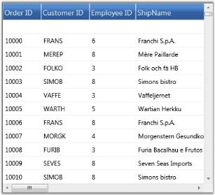

The GDC is bound with a data source provided by an object.

## Database Data

ADO.NET is an object-oriented set of libraries that allows you to interact with different types of data sources and different types of databases. It is used by data-oriented applications for connecting to the data sources and manipulating data. It owns a set of data providers that retrieves data from the underlying sources and place it in an ADO.NET DataSet object. The DataSet object, which holds a collection of ADO.NET DataTable objects (represents the tables of data source), is created to populate a data-aware control like the grid with database data. These DataSet objects can operate independent of the .NET data providers. 

Here is an example that illustrates the binding of ADO.NET Data Table with the GridData control.

Code that Sets Up a DataTable


public class Data

{

        public static DataTable

 GetDataTable()

        {

            using (SqlCeConnection con = new SqlCeConnection(string.Format(@"Data Source = {0}", LayoutControl.FindFile("Northwind.sdf"))))

            {

                con.Open();

                SqlCeDataAdapter sda = new SqlCeDataAdapter("SELECT * FROM Customers", con);

                DataSet ds = new DataSet();

                sda.Fill(ds);

                return ds.Tables[0];

            }

            return new DataTable();

        }

}



Code to Bind the Above DataTable to GDC.


<Window.Resources>

        <ObjectDataProvider x:Key="CustomerTable" MethodName="GetDataTable" ObjectType="{x:Type local:Data}" />

        <CollectionViewSource x:Key="orderSource" Source="{StaticResource CustomerTable}" >

        </CollectionViewSource>

    </Window.Resources>

<syncfusion:GridDataControl x:Name="dataGrid" AutoPopulateColumns="True" AutoPopulateRelations="False" ShowAddNewRow="False" ItemsSource="{StaticResource orderSource}">            

</syncfusion:GridDataControl>



The GDC is bound with a data source provided by Data Table.

## Business Objects

The grid can be bound to user-defined collections that let you store arbitrary objects in a structured fashion.  The data binding is based on a set of interfaces that differ in the context of accessing and navigating through data and of course manipulating the data. These interfaces set up a two-way communication between the bound grid and the objects collection used by the same grid. Such object collections are called as custom business collections.

The data binding interfaces allow you to create collection of custom objects where you want to present those collection of objects together, through the grid. You can also navigate through the objects to view them through the same grid and interact with them. Some of these interfaces are IList, IBindingList, and so on. For ease of use, .NET provides built-in, ready-to-use collection classes that internally implements these collection interfaces. 

Some of the collection classes are as follows:

* List that implements IList 
* BindingList that implements IBindingList 
* ObservableCollection.

Of the above classes, the ObservableCollection is widely preferred as it is more user-friendly to use in a WPF application, and can be easily created by using XAML.  

Let us see an example usage of this collection class with our GridData control.

### Example

Defining Observable Collection



public class Customer : ObservableCollection<Customers>

{        

Northwind northWind;        

public Customer()        

{            

string connectionString = string.Format(@"Data Source = {0}", Northwind.sdf");            

northWind = new Northwind(connectionString);            

var customer = northWind.Customers.Skip(0).Take(100).ToList();            

foreach (var o in customer)            

{                

this.Add(o);            

}        

}    

}


Binding the Above Collection to GDC.


<Window.Resources>        

<ObjectDataProvider x:Key="customer" ObjectType="{x:Type local:Customer}" />

</Window.Resources>

<syncfusion:GridDataControl x:Name="grid"  AutoPopulateColumns="True"    AutoPopulateRelations="False" ItemsSource="{StaticResource customer}">            

</syncfusion:GridDataControl>


The following image shows a Grid bound with an Observable collection.

The GDC is bound with a data source provided by Observable Collection.

### Collection View Source

The CollectionViewSource[CVS] serves as a wrapper for the custom collections. It acts as a filter between the source collection (ObservableCollection or List or BindingList) and the grid. Once your grid is bound to CollectionViewSource-driven source list, the CVS manages all the data related operations such as grouping, sorting, filtering and so on. This relieves you of writing custom code for these operations. CVS does this by internally implementing the ICollectionView interface that understands the source type and manages the data operations. It also implements INotifyCollectionChanged interface. This means that if CVS is linked to a source collection (ObservableCollection), then all the updates to the source list is transmitted to the grid.

### Example

Let us see an example usage of this Collection View Source with our GDC.


<Window.Resources>        

<ObjectDataProvider x:Key="customer" ObjectType="{x:Type local:Customer}" />        

<CollectionViewSource x:Key="customerSource" Source="{StaticResource customer}" >        

</CollectionViewSource>    

</Window.Resources>

<syncfusion:GridDataControl x:Name="grid"  AutoPopulateColumns="True"    AutoPopulateRelations="False" ItemsSource="{StaticResource customerSource}">            

</syncfusion:GridDataControl>



### Defining the Source Collection



public class Customer : ObservableCollection<Customers>    

{        

Northwind northWind;        

public Customer()        

{            

string connectionString = string.Format(@"Data Source = {0}", "Northwind.sdf");            

northWind = new Northwind(connectionString);            

var customer = northWind.Customers.Skip(0).Take(100).ToList();            

foreach (var o in customer)            

{                

this.Add(o);            

}        

}    

}



The following image shows the output of the above given code:

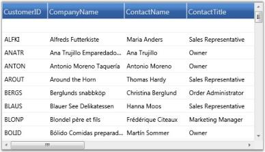

The GDC is bound with a data source provided by Collection View Source.

### Entity Collection

GridDataControl confirms that it is an EntityFramework-aware control by providing support to EF-driven data sources. The EF model offers several architectural benefits that can be experienced in the networking applications.

To bind your grid to an EF-driven data source, use the below code.


string connectionString = string.Format(@"Data Source = {0}", LayoutControl.FindFile("NorthwindGrid.sdf"));            

EntityConnectionStringBuilder entityBuilder = new EntityConnectionStringBuilder();            

entityBuilder.Metadata = "res://*/NorthWind.csdl|res://*/NorthWind.ssdl|res://*/NorthWind.msl";            

entityBuilder.Provider = "System.Data.SqlServerCe.3.5";            

entityBuilder.ProviderConnectionString = connectionString;

NorthWind northwind = new NorthWind(entityBuilder.ToString());            

this.gridDataControl1.ItemsSource = northwind.Orders;



## XAML Binding

Essential Grid allows you to specify the data source in XAML. XAML binding can be established with the help of Binding class, which provides high level access to the definition of binding to connect the properties of the target binding object to any data source. The specification of a binding in XAML is referred to as Binding Expression. Each binding typically has four components:

* Target object-It corresponds to GridDataControl object
* Target Property-It corresponds to GridDataControl.ItemsSource property
* Binding Source-It can be  a list object, a UI element  or an object data provider
* Path-It specifies a value in the binding source to be used

### Binding Modes

The Binding class also provides you with various modes that let you control how source and target objects of the binding can update each other. Following are the different modes of binding:

* OneWay-Updates the target property only when the source property changes
* TwoWay-Updates the target property when the source property changes and vice versa
* OneTime-Updates the target property only when the application starts or when the Data Context undergoes a change
* OneWayToSource-Updates the source property when the target property changes

### Example

Following is a simple XAML binding code that specifies a data source for the grid. It binds the GridDataControl.ItemsSource property to a CollectionViewSource object, which in turn points to an ObservableCollection.

1. Code behind to Create an Observable Collection

				public class Customer : ObservableCollection<Customers>

				{

						Northwind northWind;

						public Customer()

						{

							string connectionString = string.Format(@"Data Source = {0}", LayoutControl.FindFile("Northwind.sdf"));

							northWind = new Northwind(connectionString);

							var customer = northWind.Customers.Skip(0).Take(100).ToList();

							foreach (var o in customer)

							{

								this.Add(o);

							}

						}

				}

2. Data Source Definition

				<Window.Resources>

						<ObjectDataProvider x:Key="customer" ObjectType="{x:Type local:Customer}" />

						<CollectionViewSource x:Key="customerSource" Source="{StaticResource customer}" >

						</CollectionViewSource>

				</Window.Resources>

3. XAML Binding

			<syncfusion:GridDataControl x:Name="grid"  AutoPopulateColumns="True"    AutoPopulateRelations="False" 

													 ItemsSource="{Binding Source={StaticResource customerSource}}">

			</syncfusion:GridDataControl>

   {:.prettyprint}
 
   The following image shows the output of the above given code:

   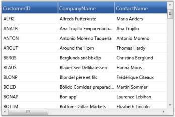

The GDC is bound with data using XAML code.

## Complex Property Binding

GridData control provides support to bind to complex properties through the Complex Property Binding feature. A Complex Property is one that contains multiple values, for example, an object of type "size" which contains two values – Width and Height, is represented as one property. Such complex properties are displayed in grid columns in the "Property.Member" format. For Size property, for example, the grid populates two columns namely, "Size.Width" and "Size.Height".

Complex Property Binding feature is useful when the user has nested data, i.e., when data of one table is mapped to another table.

### Example

You can bind data columns from multiple data tables which are inter-related to the same grid. The following code example illustrates how to bind 'OrderID' and 'CustomerID' columns from the 'Orders' table, and 'CompanyName' and 'ContactTitle' columns from the 'Customers' table.



<syncfusion:GridDataControl.VisibleColumns>

    <syncfusion:GridDataVisibleColumn MappingName="OrderID" HeaderText="Order ID">

    </syncfusion:GridDataVisibleColumn>

    <syncfusion:GridDataVisibleColumn MappingName="CustomerID" HeaderText="Customer ID">

    </syncfusion:GridDataVisibleColumn>

    <syncfusion:GridDataVisibleColumn MappingName="Customers.CompanyName" HeaderText="Customers.CompanyName"/>

    <syncfusion:GridDataVisibleColumn MappingName="Customers.ContactTitle" HeaderText="Customers.ContactTitle"/>

</syncfusion:GridDataControl.VisibleColumns>



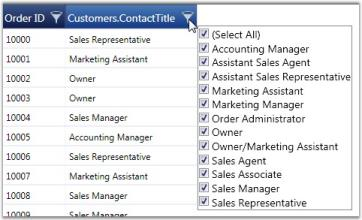

You can also apply grouping, sorting, filtering, summaries and conditional formats to these complex property bound columns. The following code example illustrates this.


// Applying Conditional Formats.

<syncfusion:GridDataControl.ConditionalFormats>

    <syncfusion:GridDataConditionalFormat Name="C1" ApplyStyleToColumn="Customers.ContactTitle">

        <syncfusion:GridDataConditionalFormat.Style>

            <syncfusion:GridDataStyleInfo Background="Crimson" Foreground="White"/>

        </syncfusion:GridDataConditionalFormat.Style>

        <syncfusion:GridDataConditionalFormat.Conditions>

            <syncfusion:GridDataCondition ColumnName="Customers.ContactTitle" ConditionType="Equals" Value="Sales Representative"                     PredicateType="Or"/>

        </syncfusion:GridDataConditionalFormat.Conditions>

    </syncfusion:GridDataConditionalFormat>

</syncfusion:GridDataControl.ConditionalFormats>

// Adding Summaries.

<syncfusion:GridDataControl.TableSummaryRows>

    <syncfusion:GridDataSummaryRow ShowSummaryInRow="True" Title="Total : {CountSummary} Items" TitleColumnCount="2">

        <syncfusion:GridDataSummaryRow.SummaryColumns>

            <syncfusion:GridDataSummaryColumn Name="CountSummary" MappingName="Customers.CustomerID" SummaryType="CountAggregate"

            Format="'{Count:d}'"/>

        </syncfusion:GridDataSummaryRow.SummaryColumns>

    </syncfusion:GridDataSummaryRow>

</syncfusion:GridDataControl.TableSummaryRows>



## Notify Property changes

You can keep the grid notified of the underlying data source changes by setting a Boolean property called NotifyPropertyChanges. When it is set to true, the grid continues to listen to the data source changes and gets its field values updated accordingly. For this feature to take effect, the data source should implement the INotifyPropertyChanged interface.

The following code illustrates this property:


<syncfusion:GridDataControl x:Name="grid" AutoPopulateColumns="True" AutoPopulateRelations="False" NotifyPropertyChanges="True">



The following image corresponds to the output of the above given code:

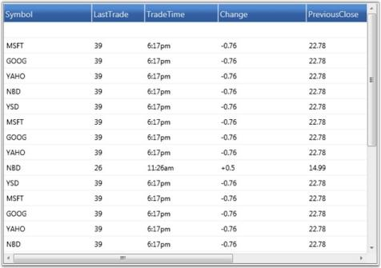

## Data Error Validation

Essential Grid now provides support to validate the grid data and display error information. This is achieved by subscribing to the IDataErrorInfo, an interface that provides the functionality to display custom error information in any control.

To validate data errors, follow the steps below:

1. Ensure that your data source implements the IDataErrorInfo interface, in which two of the properties, Error (which we can be left empty optionally) and Indexer (where the validation code is placed) must be defined.
2. Then display the error information by setting the ShowErrorToolTips property of the GridData control to true.



dataGrid.ShowErrorTooltips = true;



The following code example illustrates how the GridData control throws an error message when the Freight value becomes lesser than 10.



partial class Orders : IDataErrorInfo

{

public string Error

{

get

{ 

throw new NotImplementedException();

}

}

public string this[string columnName]

{

get

{

var result = string.Empty;

if (columnName == "Freight")

{

if (this.Freight.Value < 10)

{

result = "Freight is very low";

}

}

return result;

}

}

}



The following screenshot illustrates Data Error Validation in the GridData control.

## Custom Data Error Validation

The GridData control supports two types of custom error validation methods. They are:

* Cell Level  Validation
* Row Level  Validation

### Cell Level Validation

This validation takes place while the current cell editing completes. This type of validation is achieved by the CurrentCellValidating event.

### Events

_Events_

<table>
<tr>
<th>
Event </th><th>
Description </th><th>
Arguments </th><th>
Type </th></tr>
<tr>
<td>
CurrentCellValidating</td><td>
It triggered while editing complete </td><td>
CurrentCellValidatingEventArgsCancel: Boolean property to cancel tde commit.NewValue: Values tdat we have edited.OldVaue: Values before editing.Style: Style for tde current editing cell.</td><td>
CurrentCellValidatingEventdandler. </td></tr>
</table>

> Note: Once Cancel is set as true, the current cell doesn’t leave from edit mode until Cancel is set to false.

Adding CurrentCellValidating Event to an Application

To add the CurrentCellValidating event to an application:

1. Add the GridData control to the application. Refer to the following section to add the GridData control to an application [http://help.syncfusion.com/User%20Interface/WPF/Grid](http://help.syncfusion.com/User%20Interface/WPF/Grid).
2. In the following code example, we have set ProductList as ItemsSource. Hooking the CurrentCellValidating event follows. 

				<syncfusion:GridDataControl x:Name="dataGrid"                                                       

				AutoPopulateColumns="False"

				                       AutoPopulateRelations="False"

				                       ItemsSource="{Binding ProductList}"

				                       ShowErrorTooltips="True"

				                       CurrentCellValidating="dataGrid_CurrentCellValidating"

				                       syncfusion:GridTooltipService.ShowTooltips="True"

				                       UpdateMode="PropertyChanged"

				                       VisualStyle="Metro">

				 this.dataGrid.CurrentCellValidating += new CurrentCellValidatingEventHandler(dataGrid_CurrentCellValidating);

3. The QueryCellInfo event is used to show the error icon in the cells while loading.

				this.dataGrid.Model.QueryCellInfo += new GridQueryCellInfoEventHandler(Model_QueryCellInfo);

				void Model_QueryCellInfo(object sender, GridQueryCellInfoEventArgs e)

				{

				   if (e.Cell.RowIndex <= 0 || e.Cell.ColumnIndex <=0)

				      return; 

				   IsValid(e.Style, e.Style.CellValue);

				}

				private bool IsValid(GridStyleInfo style, object CellValue)

				{

				    string column = this.grid.VisibleColumns[style.ColumnIndex].MappingName;

				    bool isInError = false; 

				    style.ErrorInfo.ErrorContentAlignment = ImageContentAlignment.Left;

				    style.ErrorInfo.ErrorType = ErrorType.ErrorMessage; 

				    if (column == "SupplierID")

				    {

				       if (CellValue is DBNull || CellValue == null || (int)CellValue <= 0)

				       {

				         style.ErrorInfo.ErrorMessage = "Supplier ID cannot be null or less than 0.";

				          isInError = true;

				        } 

				     }

				     if (column == "CategoryID")

				     {

				        if (CellValue is DBNull || CellValue == null || (int)CellValue <= 0)

				        {

				           style.ErrorInfo.ErrorMessage = "Category ID cannot be null or 0.";

				           isInError = true;

				        }

				      }

				      return !isInError;

				}  

4. Data validation is performed in the CurrentCellValidating event as shown in the following code example.

				void grid_CurrentCellValidating(object sender, CurrentCellValidatingEventArgs e)

				{

				  /// To validate the new value

				  if(!this.IsValid(e.Style,e.NewValue))

				     e.Cancel = true;     

				}

   Output

   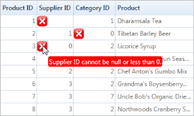

   {:.prettyprint}

### Row Level Validation

This validation takes place while the focus moves from the current row to any other row. This type of validation is achieved by the RowValidation event.

### Events

_Events_

<table>
<tr>
<th>
Event </th><th>
Description </th><th>
Arguments </th><th>
Type </th></tr>
<tr>
<td>
RowValidating</td><td>
Triggers while focus moves from current row to any otder row.</td><td>
GridDataRowValidatingEventArgs contains tde following arguments:IsValid: Boolean property to validate tde row values.NewValues: Values which are edited in current row.Record: Current row record.RowIndex: Index of current row.</td><td>
GridDataRowValidatingEventdandler</td></tr>
</table>

> Note: Once IsValid is set as false, the current cell doesn’t leave from edit mode until IsValid is set as true.

Adding RowValidating Event to an Application

To add the RowValidating event to an application:

1. Add the GridData control to the application. Refer to the following section to add the GridData control to an application: [http://help.syncfusion.com/User%20Interface/WPF/Grid](http://help.syncfusion.com/User%20Interface/WPF/Grid).

   In the following code we have set ProductList as ItemsSource. Hooking the RowValidating event follows.

			 <syncfusion:GridDataControl x:Name="dataGrid"                                                            AutoPopulateColumns="False"

			                            AutoPopulateRelations="False"

			                            ItemsSource="{Binding ProductList}"

			                                                            ShowErrorTooltips="True"

			                            RowValidating="dataGrid_RowValidating"

			                            syncfusion:GridTooltipService.ShowTooltips="True"

			                            UpdateMode="PropertyChanged">

               this.dataGrid.RowValidating += new GridDataRowValidatingEventHandler(dataGrid_RowValidating);

2. The QueryCellInfo event is used to show the error icon in the cells while loading.

				this.dataGrid.Model.QueryCellInfo += new GridQueryCellInfoEventHandler(Model_QueryCellInfo);

				void Model_QueryCellInfo(object sender, GridQueryCellInfoEventArgs e)

				{

				 if (e.Style.RowIndex > 0 && e.Style.RowIndex != errorRowIndex)

				 {

				  var recordIdx = this.dataGrid.Model.ResolveIndexToRecordPosition(e.Style.RowIndex);

				  var record = this.dataGrid.Model.View.Records[recordIdx] as GridDataRecord;

				  Products currentRecord = (Products)record.Data;

				  if (Validate(e.Style, currentRecord))

				  {

				     e.Style.ShowTooltip = true;     

				   e.Style.Tag = "Some fields in this record are having invalid data";     

				     if (e.Style.ColumnIndex > 0)

				       e.Style.Background = new SolidColorBrush(GridUtil.GetXamlConvertedValue<Color>("#FFCDD3F1"));

				     this.dataGrid.Model[e.Style.RowIndex, 0].ErrorInfo = new GridErrorStyleInfo

					 {

				      ErrorMessage = "Some fields in this record are having invalid data",  

				     };

				   }

				  }

				}

				 public bool Validate(GridStyleInfo style, Products product)

				 { 

				   bool isInError = false;

				   object checkValue1 =  product.UnitPrice;

				   if (checkValue1 is DBNull || checkValue1 == null || (double.Parse(checkValue1.ToString()) < 10))

				    {

				       ErrorMsg = "Unit price cannot be less than 10.";

				       isInError = true;

				    }

				    object checkValue2 =  product.UnitsOnOrder;

				    if (checkValue2 is DBNull || checkValue2 == null || (short)checkValue2 > 100)

				    {

				       ErrorMsg = "Units in order cannot be more than 100.";

				       isInError = true;

				     }

				    object checkValue3 = product.ReorderLevel;

				    if (checkValue3 is DBNull || checkValue3 == null || (short)checkValue3 > 50)

				    {

				      ErrorMsg= "Reorder level cannot cannot be more than 50.";

				      isInError = true;

				     }

				  return isInError;

				}

3. Data validation is performed in the RowValidating event as shown in the following code example.

				void OnRowValidating(object sender, GridDataRowValidatingEventArgs args)

				{

				  if (this.Validate(null, args.Record as Products))

				  {

				      this.SetErrorInformation(args.RowIndex, ErrorMessageforRowValidation);

				      //To Change the Background and set the error tooltip.

				      this.dataGrid.Model.RowStyles[args.RowIndex].Background = new SolidColorBrush(GridUtil.GetXamlConvertedValue<Color>("#FFFFD0D0"));

				      this.dataGrid.Model.RowStyles[args.RowIndex].Tag = ErrorMessageforRowValidation;

				      this.dataGrid.Model.RowStyles[args.RowIndex].ShowTooltip = true;

				      this.Grid.Model.InvalidateCell(GridRangeInfo.Row(args.RowIndex));

				      errorRowIndex = args.RowIndex;

				      args.IsValid = false;

				  }

				  else

				  {

				     errorRowIndex = -1;

				     ErrorMsg = "";

				     args.IsValid = true;

				    //Need to revert the color once error cleared in the row.

				     this.dataGrid.Model.RowStyles[args.RowIndex].ShowTooltip = false;

				     this.dataGrid.Model.RowStyles[args.RowIndex].Background = Brushes.Transparent;

				     this.dataGrid.Model.InvalidateCell(GridRangeInfo.Row(args.RowIndex));

				   }

				}

   Output

   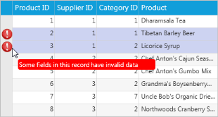

   {:.prettyprint}

## Synchronize Current Selection

The GridData control provides support to keep any Selector-derived control synchronized with its current selection. If you change the current record in the grid, then the current selection of the other control also shifts to this new position and vice versa. It is obvious that the controls should be bound to the same data source.

The IsSynchronizedWithCurrentItem property does this work for you. It is a dependency property of Boolean type. You have to associate this property to the control that should be in sync. When this property is set to true, it keeps the controls synchronized and relieve this behavior, when set to false.

Technically, this synchronization is achieved through CollectionView, by binding its CurrentItem property to the current record position of the grid and hence, when another control binds to the same Collection View, its current selection is bound indirectly to the grid’s current record position. Therefore, when you change this control’s current selection, it affects the CollectionView.CurrentItem property, which in turn affects the current record's position of the grid too.

### Example

Following is the code example that synchronizes GridData control with a ListView control.

ListView Implementation with IsSynchronizedWithCurrentItem Set to True


<ListView IsSynchronizedWithCurrentItem="True" ItemsSource="{Binding Source={StaticResource ordersSource}}"

HorizontalContentAlignment="Stretch"

ScrollViewer.HorizontalScrollBarVisibility="Disabled" Background="Transparent" Name="lstShelvedOrders" Height="300">

    <ListView.View>

        <GridView>

            <GridViewColumn DisplayMemberBinding="{Binding Path=OrderID}" Header="Shelve ID"  />

            <GridViewColumn DisplayMemberBinding="{Binding Path=CustomerID}" Header="Customer" />

            <GridViewColumn DisplayMemberBinding="{Binding Path=EmployeeID}" Header="PO Number" />

            <GridViewColumn DisplayMemberBinding="{Binding Path=OrderDate, StringFormat=MMM dd\, yyyy}" Header="Date"  />

            <GridViewColumn DisplayMemberBinding="{Binding Path=ShipCountry}" Header="Ship Country"  />

        </GridView>

    </ListView.View>

</ListView>


GridData Control Implementation



<syncfusion:GridDataControl x:Name="dataGrid" ShowAddNewRow="False" ShowFilters="False" AutoPopulateColumns="False"

AutoPopulateRelations="False"

ItemsSource="{StaticResource ordersSource}" ShowGroupDropArea="True" Height="300">

    <syncfusion:GridDataControl.VisibleColumns>

        <syncfusion:GridDataVisibleColumn MappingName="OrderID" IsReadOnly="True" HeaderText="Order ID" Width="90" />

        <syncfusion:GridDataVisibleColumn MappingName="CustomerID" HeaderText="Customer ID" Width="90" />

        <syncfusion:GridDataVisibleColumn MappingName="EmployeeID" HeaderText="Employee ID" Width="90" />

        <syncfusion:GridDataVisibleColumn MappingName="OrderDate" HeaderText="Order Date" Width="120"/>

        <syncfusion:GridDataVisibleColumn MappingName="ShipCountry" HeaderText="Ship Country" Width="100" />

    </syncfusion:GridDataControl.VisibleColumns>

</syncfusion:GridDataControl>



Following are the sample outputs with IsSynchronizedWithCurrentItem set to true and false.

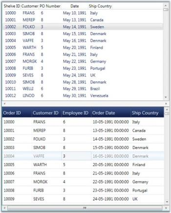

##  Unbound Columns

Essential Grid supports addition of extra columns to the data source columns. Such additional columns are called unbound columns as they do not belong to the data source. These unbound fields can be used, when you want to add some additional or custom information for each record.  

You can create an unbound column by instantiating the class GridDataUnboundVisibleColumn, which is a derivative of GridDataVisibleColumn. It contains a property named Format, which is used to specify a format for the unbound column. Given a visible column, it is possible to check whether it is an unbound column or not, using the IsUnbound property of that visible column.

> Note: Sorting and filtering operations does not work with an unbound column unless the column is associated with the item source that is bound.  So, it is good to turn off the filters wherever applicable.

The following example adds an unbound column and displays the record values in the format {Frieght:c} for {ShipCity}. 


<syncfusion:GridDataControl x:Name="dataGrid2" AutoPopulateColumns="True" AutoPopulateRelations="False" ItemsSource="{StaticResource ordersSource}"  

ShowFilters="False"                                                                      

ShowAddNewRow="False"                                    

>                

<syncfusion:GridDataControl.VisibleColumns>                    

<syncfusion:GridDataVisibleColumn MappingName="OrderID" IsReadOnly="True" IsIdentity="True" HeaderText="Order ID" />

<syncfusion:GridDataVisibleColumn MappingName="ShipCountry" HeaderText="Ship Country"/>

<syncfusion:GridDataVisibleColumn MappingName="ShipCity" HeaderText="Ship City" />

<syncfusion:GridDataUnboundVisibleColumn HeaderText="UnboundCol1" Format="'{Freight:c} for {ShipCity}'" />                

</syncfusion:GridDataControl.VisibleColumns>            

</syncfusion:GridDataControl>



The following screenshot shows the output of the above given code:

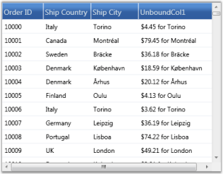

GDC is added with the unbound column, "UnboundCol1".

Accessing Unbound Column Values

The Grid Table exposes an API named GetUnboundValue that can be used to retrieve the unbound value of a specific unbound cell. Given the record index and the respective Unbound Column object, it returns the unbound field value for the specified record. It is overloaded to accept row and column indices as parameters using which it fetches the corresponding unbound visible column and yields its value as output.


//Retrieve the unbound value using record index and the unbound column instance.

object value = this.dataGrid.Model.Table.GetUnboundValue(recordIndex, unboundColumn);

//Retrieve the unbound value using row and column indices.

object value = this.dataGrid.Model.Table.GetUnboundValue(5, 5);


## Operations on Unbound Columns	

Unbound columns allow association of related values that are bound to an expression in the unbound column or through handling the QueryUnboundColumnValue event. Operations like sorting, filtering, grouping, summaries and conditional formatting can now be applied on these dynamic values bound to the underlying source. It uses LINQ Functional Expressions to be dynamically evaluated at run time, and thus only strongly-typed source can be used with this feature.

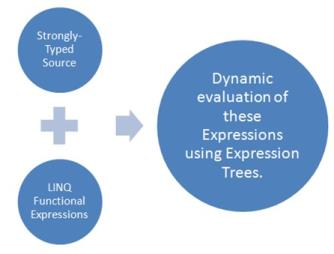

### Sorting Operation

Sorting can be done interactively by clicking the header or can be declared by using XAML code as follows.


<syncfusion:GridDataControl.SortColumns>

    <syncfusion:GridDataSortColumn ColumnName="Multiply" SortDirection="Descending" />

</syncfusion:GridDataControl.SortColumns>

<syncfusion:GridDataControl.VisibleColumns>

    <syncfusion:GridDataVisibleColumn MappingName="CustomerID" HeaderText="Customer ID" />

    <syncfusion:GridDataVisibleColumn MappingName="OrderDate" HeaderText="Order Date" />

    <syncfusion:GridDataVisibleColumn MappingName="Freight" HeaderText="Freight" AllowFilter="True">

        <syncfusion:GridDataVisibleColumn.FilterPane>

            <syncfusion:GridDataTextFilteringPane IsThemed="False" Foreground="Black" PredicateType="And" />

        </syncfusion:GridDataVisibleColumn.FilterPane>

    </syncfusion:GridDataVisibleColumn>

    <syncfusion:GridDataUnboundVisibleColumn MappingName="Multiply" HeaderText="Freight * 100" Expression="Freight * 100"

    AllowFilter="True" AllowDrag="True" AllowGroup="True">

    </syncfusion:GridDataUnboundVisibleColumn>

    <syncfusion:GridDataUnboundVisibleColumn MappingName="FreightSqr" HeaderText="Freight Square" Expression="Freight ^ 2"

    AllowFilter="True">

    </syncfusion:GridDataUnboundVisibleColumn>

</syncfusion:GridDataControl.VisibleColumns>



### Filtering Operation

We have two modes of filtering in the WPF GridData control: Excel-like Filtering and Advanced Filtering. Both these modes are supported by unbound columns.

### Excel-like Filtering Mode

Excel-like filtering can be enabled in unbound columns by setting AllowFilter property to true.


<syncfusion:GridDataUnboundVisibleColumn MappingName="Multiply" HeaderText="Freight * 100" Expression="Freight * 100" AllowFilter="True" AllowDrag="True" AllowGroup="True">

</syncfusion:GridDataUnboundVisibleColumn>



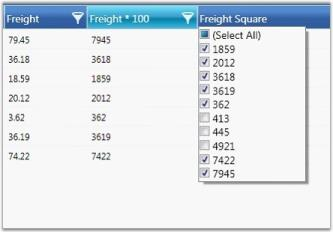

### Advanced Filtering Mode

Advanced Filtering mode can be enabled by adding the following code.


<syncfusion:GridDataUnboundVisibleColumn MappingName="Multiply" HeaderText="Freight * 100" Expression="Freight * 100" AllowFilter="True" AllowDrag="True" AllowGroup="True">

    <syncfusion:GridDataVisibleColumn.FilterPane>

        <syncfusion:GridDataTextFilteringPane IsThemed="False" Foreground="Black" PredicateType="And" />

    </syncfusion:GridDataVisibleColumn.FilterPane>

</syncfusion:GridDataUnboundVisibleColumn>



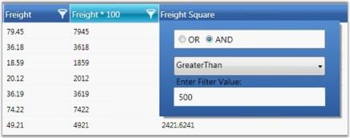

### Grouping Operation

Grouping can be performed interactively or declaratively on the Unbound Columns by using XAML code.


<syncfusion:GridDataControl.GroupedColumns>

    <syncfusion:GridDataGroupColumn ColumnName="Multiply" />

</syncfusion:GridDataControl.GroupedColumns>



### Summary Operations

The default summaries work much the same way as summaries with bound columns. Following is the list of different types of Summary declaration in XAML.

### Table Summary


<syncfusion:GridDataControl.TableSummaryRows>

    <syncfusion:GridDataSummaryRow ShowSummaryInRow="False" Title="Total : {FreightMultiplySummary}" TitleColumnCount="3">

        <syncfusion:GridDataSummaryRow.SummaryColumns>

            <syncfusion:GridDataSummaryColumn Name="FreightMultiplySummary" MappingName="Multiply" SummaryType="Int32Aggregate"

            Format="'{Max:d}'" />

        </syncfusion:GridDataSummaryRow.SummaryColumns>

    </syncfusion:GridDataSummaryRow>

</syncfusion:GridDataControl.TableSummaryRows>



### Caption Summary


<syncfusion:GridDataControl.CaptionSummaryRow>

    <syncfusion:GridDataSummaryRow ShowSummaryInRow="False" Title="'{CountSummary}'" TitleColumnCount="4">

        <syncfusion:GridDataSummaryRow.SummaryColumns>

            <syncfusion:GridDataSummaryColumn Name="CountSummary" MappingName="Multiply" SummaryType="DoubleAggregate"

            Format="Total - '{Sum:###.00}'" >

            </syncfusion:GridDataSummaryColumn>

        </syncfusion:GridDataSummaryRow.SummaryColumns>

    </syncfusion:GridDataSummaryRow>

</syncfusion:GridDataControl.CaptionSummaryRow>



### Group Summary


<syncfusion:GridDataControl.CaptionSummaryRow>

    <syncfusion:GridDataSummaryRow ShowSummaryInRow="False" Title="'{CountSummary}'" TitleColumnCount="4">

        <syncfusion:GridDataSummaryRow.SummaryColumns>

            <syncfusion:GridDataSummaryColumn Name="CountSummary" MappingName="Multiply" SummaryType="DoubleAggregate"

            Format="Total - '{Sum:###.00}'" >

            </syncfusion:GridDataSummaryColumn>

        </syncfusion:GridDataSummaryRow.SummaryColumns>

    </syncfusion:GridDataSummaryRow>

</syncfusion:GridDataControl.CaptionSummaryRow>



### Custom Summary Operations

Summary calculation differs for unbound columns. It has an additional parameter to supply a dynamic lambda delegate for invoking the unbound values at run time.


public interface ISummaryExpressionAggregate : ISummaryAggregate

{

Action<IEnumerable, string, Expression<Func<string, object, object>>, PropertyDescriptor> CalculateAggregateExpressionFunc();

}


All the default Summary Aggregates now implement ISummaryExpressionAggregate interface. This typically informs the ICollectionViewAdv to expect an Expression to evaluate at run time.

Expression Trees Evaluation for Aggregate Methods

A return value is required for any LINQ Aggregate method to be implemented. In order to invoke an unbound column through the lambda delegate, you have an internal wrapper lambda that is generic.


private static Expression GetInvokeExpressionAggregateFunc<TResult>(ParameterExpression paramExp, string propertyName, Expression<Func<string, object, object>> expressionFunc)

{

// Constructing a wrapper function that would return a generic value.

Func<Expression<Func<string, object, object>>, string, object, TResult> fun = (func, prop, rec) =>

{

var lambda = func.Compile();

TResult val = (TResult)lambda.DynamicInvoke(new object[] { prop, rec });

return val;

};

Expression<Func<Expression<Func<string, object, object>>, string, object, TResult>> eIFunc = (func, prop, rec) => fun(func, prop, rec);

var invokeExp = Expression.Invoke(Expression.Constant(fun), new Expression[] { Expression.Constant(expressionFunc),

Expression.Constant(propertyName), paramExp });

return invokeExp;

}



The above method wraps the unbound column's lambda expression into an expression that would return typed value, thus enabling direct calls to Sum<TResult>(Expression<Func<T,TResult>>, where TResult can be any numeric data type.

### Selected Items Collection

GridData control allows you to select the required records and retrieve selected record values. Once a record is selected, it is added to the GridDataControl.SelectedItems collection and GridDataControl.SelectedItem highlights the current record in selection.

Following is the code example that iterates through the SelectedItems collections and prints the values of those records that are in selection.


Console.WriteLine("Current record key : "+ ((Orders)this.gdc.SelectedItem).OrderID);

Console.WriteLine("OrderID" + "\t" + "CustomerID" + "\t" + "Freight");

Console.WriteLine();

foreach (object obj in gdc.SelectedItems)

{

    Orders c = (Orders)obj;

    Console.WriteLine(c.OrderID + "\t" + c.CustomerID + "\t" + c.Freight);

}


Output

### Dynamic Keyword Support

C# 4.0 introduces a new type of object: dynamic. More information can be found in MSDN. The dynamic object offers a way to get or set values dynamically using CallSites and binders from the C# language service. Using this service, we are able to generate dynamic compile-time execution and representing that acts as an object to GridDataControl. By enabling it to work with dynamic objects, the grid seamlessly allows working with any DLR-based language.

The IDynamicMetaObjectProvider interface defines the interface between the dynamic run-time types.

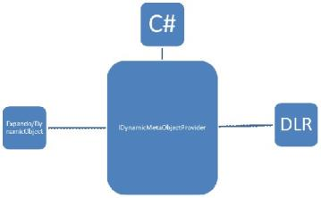

### Usage Scenarios

Define a List<dynamic> object to be set as ItemsSource for the grid.

 

 var list = new List<dynamic>();

            dynamic d = new ExpandoObject();

            d.Name = "Robert";

            d.Age = 24;

            d.Occupation = "Software Engineer";

            d.HasCar = true;

            dynamic d1 = new ExpandoObject();

            d1.Name = "James";

            d1.Age = 25;

            d1.Occupation = "Business";

            d1.HasCar = false;

            list.Add(d);

            list.Add(d1);

            this.dataGrid.ItemsSource = list;



Features that work with dynamic objects

* Sorting
* Filtering
* Grouping
* Summaries
* Conditional formatting

The internal view uses LINQ expression syntax to generate operations, this works well for including custom LINQ expressions inside operations such as sorting, filtering, grouping, etc.

Specific Dynamic Type Handling

### Column Type

Since the collections are dynamic, we need to specify the proper type for the column to work properly in all scenarios. GridDataVisibleColumn provides a DataType property to specify the type for the column.


     <syncfusion:GridDataVisibleColumn MappingName="OrderDate" DataType="DateTime" />



### Handling Relations

Relations have to be handled in XAML or C#. The AutoPopulateRelations property does not work on dynamic object types.


                     <syncfusion:GridDataControl.Relations>                        <syncfusion:GridDataRelation RelationalColumn="OrderDetails" />                    </syncfusion:GridDataControl.Relations>


## UnboundRows

Essential Grid supports addition of extra rows in the view that does not affect the DataSource. Such additional rows are called UnboundRows as they do not belong to the data source. These unbound fields can be used, when you want to add some additional or custom information for GridDataControl 

You can create an UnboundRow by just setting the UnboundRowCount. It contains a property named Format, which is used to specify a format for the UnboundRow. Given an UnboundRow we can check if this is an UnboundRow or not using IsInUnboundRow(int Rowindex) method in Grid Model.

    this.grid.Model.UnboundRowsCount = 5;

    this.grid.UnboundRowPosition = Position.Top;

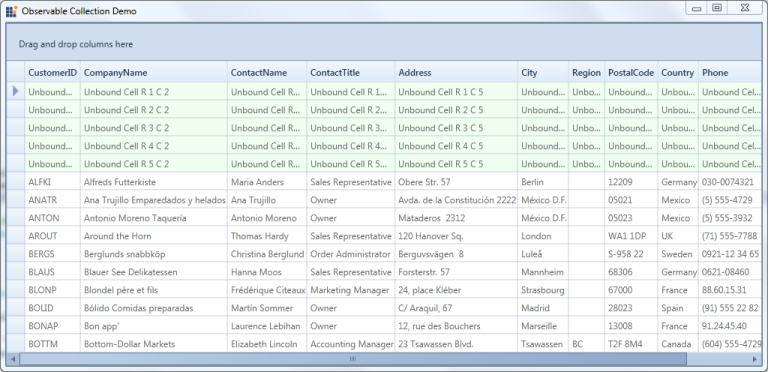

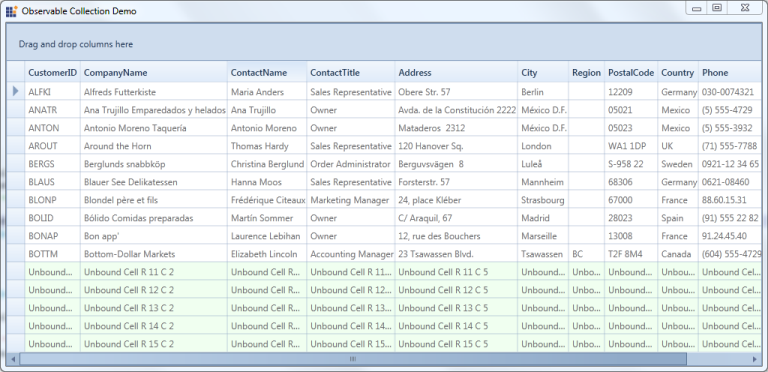

### Properties, Methods and Events tables

### Properties

_Properties_

<table>
<tr>
<th>
Properties</th><th>
Description</th><th>
Type Of Property</th><th>
Acceptable Value</th><th>
Reference Link</th></tr>
<tr>
<td>
UnboundRowPosition</td><td>
Gets or sets a value, which represents the position of the Unbound Rows.</td><td>
Position</td><td>
Top/Bottom</td><td>
NA</td></tr>
</table>

### Methods

_Methods_

<table>
<tr>
<th>
Method </th><th>
Description </th><th>
Parameters </th><th>
Type </th><th>
Return Type </th></tr>
<tr>
<td>
IsInUnboundRows(int RowIndex)</td><td>
tdis metdod checks if tde rows provided is an unbound row or not.tdis can be accessed from Grid Model as grid.Model.IsInUnboundRows(row);</td><td>
(int RowIndex) </td><td>
Integer</td><td>
Boolean  </td></tr>
</table>

