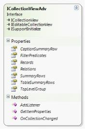

# Data Model

This section has the following topics:

## ICollectionViewAdv

The ICollectionViewAdv interface is an extended ICollectionView interface that includes support for the following:

* Grouping structure—Binary tree data structure to maintain the groups.
* Group summaries—Collection to specify group summaries.
* Caption summary—Specifies caption summary row.
* Records structure—Flat data structure to maintain the list of internal records.
* Table summaries—Collection to specify table summaries.
* Filter definitions—Collection to specify filter descriptors.

ICollectionViewAdv interface implements the following:

ICollectionViewAdv is implemented as two parts in Syncfusion.Linq.Base library, as shown below:

The CollectionViewAdv is an abstract class implementing ICollectionViewAdv. By sub-classing the CollectionViewAdv, the specific actions for the following can be defined:

* Sorting
* Filtering
* Grouping
* Summaries

QueryableCollectionView - Implements an IQueryable way to provide Sorting, Filtering, Grouping and Summaries.

DataTableCollectionView – Uses the DataView to provide Sorting/Filtering and uses custom logics to implement grouping and calculating summaries.

## Grouping in ICollectionViewAdv

To specify groups, add GroupDescriptions to ICollectionViewAdv.GroupDescriptions. The following code example shows adding groups to Northwind database.


var northwind = new Northwind("Data Source = Northwind.sdf");

var orders = northwind.Orders;

var queryableCollectionView = new QueryableCollectionView(orders);

queryableCollectionView.GroupDescriptions.Add(new PropertyGroupDescription("ShipCountry"));

queryableCollectionView.GroupDescriptions.Add(new PropertyGroupDescription("ShipCity"));



The grouping values are stored in a binary tree structure in the ICollectionViewAdv.TopLevelGroup. The visual graph of the TopLevelGroup is as follows:

The class diagram for the structure above is as follows:

* NodeEntry – It is the base class for all the nodes in the binary tree.
* GroupEntry – Contains a list of groups. 
* GroupRecordEntry – Contains a list of records.
* Group – Extended Group entry that has implementation for populating and structuring the groups and its sub- groups. It can store both a list of Groups or Records. If the Group is a BottomLevelGroup then the Group.Details would contain the GroupRecordEntry.

Iterating through the whole structure

The TopLevelGroup is an extended Group class. Iteration through the whole structure can be performed by looping through the structure using a foreach loop, since the Group already has an Enumerator implemented.


var northwind = new Northwind("Data Source = Northwind.sdf");

var orders = northwind.Orders;

var queryableCollectionView = new QueryableCollectionView(orders);

queryableCollectionView.GroupDescriptions.Add(new PropertyGroupDescription("ShipCountry"));

foreach (var nodeEntry in queryableCollectionView.TopLevelGroup)

{

    Console.WriteLine(nodeEntry);

}


## Summaries in Grouping

The ICollectionViewAdv interface exposes an ObservableCollection<ISummaryRow> and CaptionSummary.

Any class implementing this interface should be able to interact with the TopLevelGroup for specifying summaries. 

> Note: The ICollectionViewAdv interface was made as an interface since the WPF properties had to be DependencyProperties to enable binding in XAML. With ICollectionViewAdv, we can specify two kinds of summaries:

* Group summaries.
* Caption summary.

### Group Summaries

Specifies summaries added for each bottom level group. Access each summary node from GridRecordEntry.Summaries.

### Caption Summary

Specifies a caption summary row required by an UI control to display the group caption. Access the caption summary as Group.SummaryRecordEntry.

## Sorting in ICollectionViewAdv

Adding SortDescriptions to the ICollectionView would sort the internal data.


var orders = northwind.Orders;

var queryableCollectionView = new QueryableCollectionView(orders);

queryableCollectionView.SortDescriptions.Add(new System.ComponentModel.SortDescription("CustomerID", System.ComponentModel.ListSortDirection.Descending));

foreach (var record in queryableCollectionView.Records)

{

    var order = (Orders)record.Data;

    Console.WriteLine("OrderID - {0} / CustomerID - {1}", order.OrderID, order.CustomerID);

}



### Sorting with Grouping

The TopLevelGroup works in conjunction with the sort descriptions present in the ICollectionView. It would automatically sort the groups and its bottom level group (records).


var orders = northwind.Orders;

var queryableCollectionView = new QueryableCollectionView(orders);

queryableCollectionView.SortDescriptions.Add(new System.ComponentModel.SortDescription("CustomerID", System.ComponentModel.ListSortDirection.Descending));

queryableCollectionView.GroupDescriptions.Add(new PropertyGroupDescription("ShipCountry"));

queryableCollectionView.GroupDescriptions.Add(new PropertyGroupDescription("ShipCity"));

foreach (var nodeEntry in queryableCollectionView.TopLevelGroup)

{

    Console.WriteLine(nodeEntry);

}

foreach (var record in queryableCollectionView.Records)

{

    var order = (Orders)record.Data;

    Console.WriteLine("OrderID - {0} / CustomerID - {1}", order.OrderID, order.CustomerID);

}



> Note: When applying sorting with grouping, both the ICollectionViewAdv.TopLevelGroup and the ICollectionViewAdv.Records is in sync.

