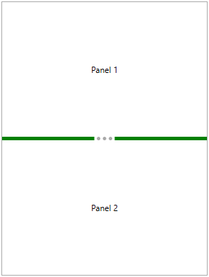

# Appearance in WPF SfGridSplitter

This section explains different UI customization and styling support available in [SfGridSplitter](https://help.syncfusion.com/cr/wpf/Syncfusion.SfInput.Wpf~Syncfusion.Windows.Controls.Input.SfGridSplitter.html) control.

## Setting the Background

We can change the background color of `SfGridSplitter` by setting the `Background` property. The default color value of `Background` property is `Light Gray`.




<Border
    Margin="10"
    BorderBrush="DarkGray"
    BorderThickness="1">
    <Grid>
        <Grid.RowDefinitions>
            <RowDefinition />
            <RowDefinition Height="auto" />
            <RowDefinition />
        </Grid.RowDefinitions>
        <TextBlock Grid.Row="0" 
                   HorizontalAlignment="Center"
                   VerticalAlignment="Center"
                   TextAlignment="Center"
                   Text="Panel 1">
        </TextBlock>
        <TextBlock Grid.Row="2"
                   HorizontalAlignment="Center" 
                   VerticalAlignment="Center" 
                   TextAlignment="Center"
                   Text="Panel 2">
        </TextBlock>
        
        <!--Grid Splitter-->
        <syncfusion:SfGridSplitter Background="Green"
                                   HorizontalAlignment="Stretch"
                                   Width="auto"
                                   Grid.Row="1">
        </syncfusion:SfGridSplitter>
    </Grid>
</Border>




## Collapse buttons template

We change the `ControlTemplate` of the `UpButton` and `DownButton` by using the `UpButtonTemplate` and `DownButtonTemplate` properties. We can see the effect of collapse button templates only on when `EnableCollapseButton` property value is `true`.




<Border
    Margin="10"
    BorderBrush="DarkGray"
    BorderThickness="1">
    <Grid>
        <Grid.RowDefinitions>
            <RowDefinition />
            <RowDefinition Height="auto" />
            <RowDefinition />
        </Grid.RowDefinitions>
        <TextBlock Grid.Row="0" 
                   HorizontalAlignment="Center"
                   VerticalAlignment="Center"
                   TextAlignment="Center"
                   Text="Panel 1">
        </TextBlock>
        <TextBlock Grid.Row="2"
                   HorizontalAlignment="Center" 
                   VerticalAlignment="Center" 
                   TextAlignment="Center"
                   Text="Panel 2">
        </TextBlock>

        <!--Grid Splitter-->
        <syncfusion:SfGridSplitter EnableCollapseButton="True"
                                   HorizontalAlignment="Stretch"
                                   Width="auto"
                                   Grid.Row="1">
            <!--Up button template-->
            <syncfusion:SfGridSplitter.UpButtonTemplate>
                <ControlTemplate>
                    <Ellipse Width="20" Height="20" Fill="Yellow"/>
                </ControlTemplate>
            </syncfusion:SfGridSplitter.UpButtonTemplate>

            <!--Down button template-->
            <syncfusion:SfGridSplitter.DownButtonTemplate>
                <ControlTemplate>
                    <Ellipse Width="20" Height="20" Fill="Orange"/>
                </ControlTemplate>
            </syncfusion:SfGridSplitter.DownButtonTemplate>
        </syncfusion:SfGridSplitter>
    </Grid>
</Border>




### Setting style for Preview GridSplitter

We can change the UI and style of the preview grid splitter by using the [SfGridSplitter.PreviewStyle](https://help.syncfusion.com/cr/wpf/Syncfusion.SfInput.Wpf~Syncfusion.Windows.Controls.Input.SfGridSplitter~PreviewStyle.html) property. We can see the effect of `PreviewStyle` only on when `ShowsPreview` property value is `true`.




<Border
    Margin="10"
    BorderBrush="DarkGray"
    BorderThickness="1">
    <Grid>
        <Grid.RowDefinitions>
            <RowDefinition />
            <RowDefinition Height="auto" />
            <RowDefinition />
        </Grid.RowDefinitions>
        <TextBlock Grid.Row="0" 
                   HorizontalAlignment="Center"
                   VerticalAlignment="Center"
                   TextAlignment="Center"
                   Text="Panel 1">
        </TextBlock>
        <TextBlock Grid.Row="2"
                   HorizontalAlignment="Center" 
                   VerticalAlignment="Center" 
                   TextAlignment="Center"
                   Text="Panel 2">
        </TextBlock>
        
        <!--Grid Splitter-->
        <syncfusion:SfGridSplitter ShowsPreview="True"
                           HorizontalAlignment="Stretch"
                           Width="auto"
                           Grid.Row="1" >
            <syncfusion:SfGridSplitter.PreviewStyle>
                
            </syncfusion:SfGridSplitter.PreviewStyle>
        </syncfusion:SfGridSplitter>
    </Grid>
</Border>




Click [here](https://github.com/SyncfusionExamples/syncfusion-gridsplitter-control-examples/tree/master/Samples/Appearance) to download the sample that showcase the `SfGridSplitter` appearance and styling supports.