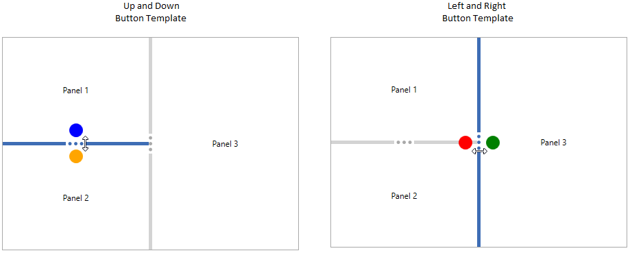
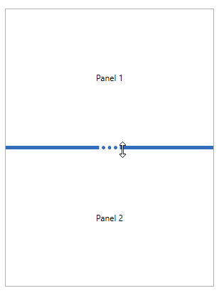

# Appearance in WPF SfGridSplitter

This section explains different UI customization and styling support available in [SfGridSplitter](https://help.syncfusion.com/cr/wpf/Syncfusion.SfInput.Wpf~Syncfusion.Windows.Controls.Input.SfGridSplitter.html) control.

## Setting the Background

We can change the background color of `SfGridSplitter` by setting the `Background` property. The default color value of `Background` property is `Light Gray`.




<Grid>
    <Grid.RowDefinitions>
        <RowDefinition />
        <RowDefinition Height="auto" />
        <RowDefinition />
    </Grid.RowDefinitions>
    <Border BorderThickness="1"
            BorderBrush="Black"  
            Grid.Row="0">
        <TextBlock Text="Capturing and extracting information is one of the most important tasks a developer can perform, and making this task more engaging without relying entirely on specialized tools is an efficient way to improve productivity. In Data Capture and Extraction with C# Succinctly, author Ed Freitas guides readers toward getting more out of C# in minimal time. Email has become a pillar of our modern and connected society, and it now serves as a primary means of communication. Because each email is filled with valuable information, data extraction has emerged as a worthwhile skill set for developers in today's business world."
                   TextWrapping="Wrap" />
    </Border>
    <syncfusion:SfGridSplitter Background="Green"
                               HorizontalAlignment="Stretch"
                               Width="auto"
                               Grid.Row="1">
    </syncfusion:SfGridSplitter>
    <syncfusion:SfCalculator Grid.Row="2">           
    </syncfusion:SfCalculator>
</Grid>




## Collapse button templates

We change the `ControlTemplate` of the UpButton and DownButton templates by using the `UpButtonTemplate` and `DownButtonTemplate` properties. We can see the effect of collapse button templates only on when `EnableCollapseButton` property value is `true`.




<Grid>
    <Grid.RowDefinitions>
        <RowDefinition />
        <RowDefinition Height="auto" />
        <RowDefinition />
    </Grid.RowDefinitions>
    <Border BorderThickness="1" BorderBrush="Black"  Grid.Row="0">
        <TextBlock Text="Capturing and extracting information is one of the most important tasks a developer can perform, and making this task more engaging without relying entirely on specialized tools is an efficient way to improve productivity. In Data Capture and Extraction with C# Succinctly, author Ed Freitas guides readers toward getting more out of C# in minimal time. Email has become a pillar of our modern and connected society, and it now serves as a primary means of communication. Because each email is filled with valuable information, data extraction has emerged as a worthwhile skill set for developers in today's business world."
                   TextWrapping="Wrap" />
    </Border>
    <syncfusion:SfGridSplitter EnableCollapseButton="True"
                               HorizontalAlignment="Stretch"
                               Width="auto" 
                               Grid.Row="1">
        <!--Up button template-->
        <syncfusion:SfGridSplitter.UpButtonTemplate>
            <ControlTemplate>
                <TextBlock Background="Yellow">Up CollapseButton</TextBlock>
            </ControlTemplate>
        </syncfusion:SfGridSplitter.UpButtonTemplate>
        
        <!--Down button template-->
        <syncfusion:SfGridSplitter.DownButtonTemplate>
            <ControlTemplate>
                <TextBlock Background="Yellow">Down CollapseButton</TextBlock>
            </ControlTemplate>
        </syncfusion:SfGridSplitter.DownButtonTemplate>
    </syncfusion:SfGridSplitter>
    <syncfusion:SfCalculator Grid.Row="2">           
    </syncfusion:SfCalculator>
</Grid>




### Setting style for Preview GridSplitter

We can change the UI and style of the preview grid splitter by using the [SfGridSplitter.PreviewStyle](https://help.syncfusion.com/cr/wpf/Syncfusion.SfInput.Wpf~Syncfusion.Windows.Controls.Input.SfGridSplitter~PreviewStyle.html) property. We can see the effect of `PreviewStyle` only on when `ShowsPreview` property value is `true`.




<Grid>
    <Grid.RowDefinitions>
        <RowDefinition />
        <RowDefinition Height="auto" />
        <RowDefinition />
    </Grid.RowDefinitions>
    <Border BorderThickness="1" BorderBrush="Black"  Grid.Row="0">
        <TextBlock Text="Capturing and extracting information is one of the most important tasks a developer can perform, and making this task more engaging without relying entirely on specialized tools is an efficient way to improve productivity. In Data Capture and Extraction with C# Succinctly, author Ed Freitas guides readers toward getting more out of C# in minimal time. Email has become a pillar of our modern and connected society, and it now serves as a primary means of communication. Because each email is filled with valuable information, data extraction has emerged as a worthwhile skill set for developers in today's business world."
                   TextWrapping="Wrap" />
    </Border>
    <syncfusion:SfGridSplitter ShowsPreview="True"
                               HorizontalAlignment="Stretch"
                               Width="auto"
                               Grid.Row="1" >
        <syncfusion:SfGridSplitter.PreviewStyle>
                            
        </syncfusion:SfGridSplitter.PreviewStyle>     
    </syncfusion:SfGridSplitter>
    <syncfusion:SfCalculator Grid.Row="2">            
    </syncfusion:SfCalculator>
</Grid>




Click [here](https://github.com/SyncfusionExamples/syncfusion-gridsplitter-control-examples/tree/master/Samples/Appearance) to download the sample that showcase the `SfGridSplitter` apperance and styling supports.